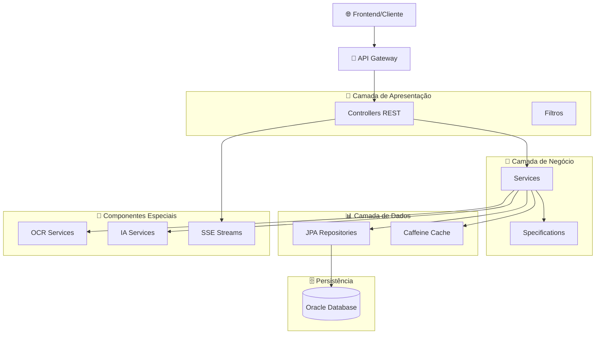
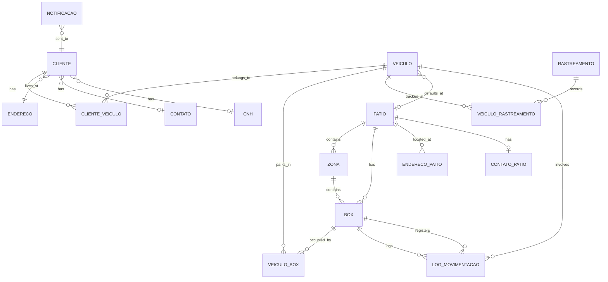
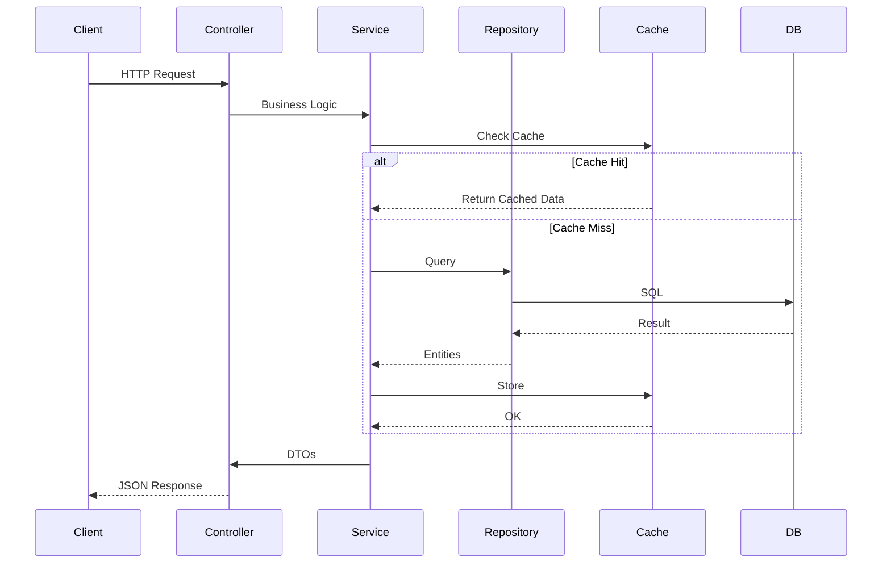

# 🚗 MOTTU - Sistema de Gestão e Rastreamento de Estacionamento Inteligente

<div align="center">


**Sistema completo de rastreamento, OCR e gestão de estacionamento com IA**

[Características](#-características-principais) • [Tecnologias](#-tecnologias) • [Instalação](#-instalação) • [Documentação](#-documentação) • [API](#-api)


</div>

---

## 📋 Sumário

- [📖 Sobre o Projeto](#-sobre-o-projeto)
- [🎯 Características Principais](#-características-principais)
- [🏗️ Arquitetura](#️-arquitetura)
- [🛠️ Tecnologias](#️-tecnologias)
- [🚀 Instalação](#-instalação)
- [⚙️ Configuração](#️-configuração)
- [📚 Documentação da API](#-documentação-da-api)
- [🧪 Testes](#-testes)
- [📦 Deploy](#-deploy)
- [🤝 Contribuição](#-contribuição)
- [📄 Licença](#-licença)

---

## 📖 Sobre o Projeto

O **MOTTU** é uma solução completa de gestão de estacionamento desenvolvida para o **Challenge 2025 FIAP** pelo time **TeamMU Metamind Solutions**. O sistema oferece rastreamento em tempo real de veículos, reconhecimento automático de placas via OCR, análise preditiva com IA, dashboards interativos e muito mais.

### 🎯 Objetivos

- ✅ Gestão completa de pátios, zonas, boxes e vagas
- ✅ Rastreamento GPS/IPS em tempo real
- ✅ Reconhecimento de placas Mercosul via OCR
- ✅ Dashboards e relatórios avançados
- ✅ Análise preditiva com IA
- ✅ Sistema de notificações inteligente
- ✅ API RESTful completa documentada

---

## 🎯 Características Principais

### 🔍 **Reconhecimento de Placas (OCR)**

Sistema híbrido de OCR com três tecnologias integradas:

- **OpenALPR**: Reconhecimento principal de placas Mercosul
- **OpenCV**: Pré-processamento de imagens
- **Tesseract**: Fallback secundário

```java
// Exemplo de uso
@PostMapping("/api/radar/upload-imagem/{sessionId}")
public ResponseEntity<PlateResult> uploadImagem(
    @PathVariable String sessionId,
    @RequestParam MultipartFile image
);
```

### 📊 **Dashboards e Relatórios**

- **Dashboard em Tempo Real**: SSE para atualizações ao vivo
- **Relatórios de Ocupação**: Análise de utilização de vagas
- **Relatórios de Movimentação**: Entrada/saída de veículos
- **Analytics Avançado**: Insights e métricas
- **Performance System**: Monitoramento de recursos
- **IA Dashboard**: Previsões e tendências

### 🌐 **Streaming em Tempo Real**

Server-Sent Events (SSE) para dashboards dinâmicos:

```java
@GetMapping(path = "/stream", produces = MediaType.TEXT_EVENT_STREAM_VALUE)
public Flux<Map<String, Object>> streamMovimentacaoDiaria();
```

### 📍 **Rastreamento GPS/IPS**

Sistema completo de localização:

- Coordenadas GPS (latitude, longitude, altitude)
- Indoor Positioning System (IPS)
- Histórico de movimentação
- Mapa global interativo

### 🎨 **Arquitetura Limpa**

- **Controllers**: 33 endpoints REST
- **Services**: 34 camadas de negócio
- **Repositories**: 20 interfaces JPA
- **DTOs**: 53 objetos de transferência
- **Mappers**: 10 conversores MapStruct
- **Models**: 28 entidades JPA

---

## 🏗️ Arquitetura

### 📐 Visão Geral



### 📁 Estrutura de Diretórios

```
mottu-gradle/
├── 📁 src/
│   ├── 📁 main/
│   │   ├── 📁 java/br/com/fiap/mottu/
│   │   │   ├── 📁 config/           # Configurações (CORS, Cache, OCR, etc.)
│   │   │   ├── 📁 controller/       # REST Controllers (33 arquivos)
│   │   │   │   ├── 📁 dashboard/    # Dashboard controllers
│   │   │   │   ├── 📁 relatorio/    # Relatório controllers
│   │   │   │   └── 📁 relatorios/   # Relatórios streams
│   │   │   ├── 📁 dto/              # Data Transfer Objects (53 arquivos)
│   │   │   │   ├── 📁 box/
│   │   │   │   ├── 📁 cliente/
│   │   │   │   ├── 📁 cnh/
│   │   │   │   ├── 📁 contato/
│   │   │   │   ├── 📁 dashboard/
│   │   │   │   ├── 📁 endereco/
│   │   │   │   ├── 📁 patio/
│   │   │   │   ├── 📁 relatorio/
│   │   │   │   ├── 📁 rastreamento/
│   │   │   │   ├── 📁 veiculo/
│   │   │   │   └── 📁 zona/
│   │   │   ├── 📁 exception/        # Exceções customizadas
│   │   │   │   └── 📁 handler/      # GlobalExceptionHandler
│   │   │   ├── 📁 external/         # Integrações externas
│   │   │   │   └── 📁 viacep/       # ViaCEP integration
│   │   │   ├── 📁 filter/           # Filter Records (14 arquivos)
│   │   │   │   ├── 📁 relatorios/
│   │   │   │   └── ...
│   │   │   ├── 📁 mapper/           # MapStruct Mappers (10 arquivos)
│   │   │   ├── 📁 model/            # JPA Entities (28 arquivos)
│   │   │   │   └── 📁 relacionamento/ # Relacionamentos JPA
│   │   │   ├── 📁 repository/       # JPA Repositories (20 arquivos)
│   │   │   │   └── 📁 relacionamento/
│   │   │   ├── 📁 service/          # Business Logic (34 arquivos)
│   │   │   │   ├── 📁 ocr/          # OCR Services
│   │   │   │   ├── 📁 core/
│   │   │   │   ├── 📁 dashboard/
│   │   │   │   ├── 📁 datatable/
│   │   │   │   └── 📁 relatorios/
│   │   │   ├── 📁 specification/    # JPA Specifications (11 arquivos)
│   │   │   ├── 📁 util/             # Utilities
│   │   │   ├── 📁 validation/       # Validation Groups
│   │   │   └── ☕ MottuApplication.java
│   │   └── 📁 resources/
│   │       ├── 📜 application*.properties
│   │       ├── 📁 db/migration/     # SQL Migrations
│   │       ├── 📁 tessdata/         # Tesseract data
│   │       └── 📁 classifiers/      # OpenCV Haar Cascades
│   └── 📁 test/                     # Testes unitários
├── 📁 gradle/
├── 📁 documentacao/                 # Documentação técnica
├── 📜 build.gradle
├── 📜 settings.gradle
├── 📜 gradlew                       # Gradle Wrapper
├── 📜 gradlew.bat
└── 📖 README.md
```

### 🗄️ Modelo de Dados (Core Entities)



### 🔄 Fluxo de Dados



---

## 🛠️ Tecnologias

### 🔷 **Backend Core**

| Tecnologia | Versão | Propósito |
|-----------|--------|-----------|
| Java | 21 | Linguagem base |
| Spring Boot | 3.5.4 | Framework principal |
| Spring Data JPA | 6.x | Persistência |
| Hibernate | 6.x | ORM |
| Gradle | 8.0 | Build tool |

### 🗄️ **Banco de Dados**

| Tecnologia | Versão | Propósito |
|-----------|--------|-----------|
| Oracle Database | 21c | SGBD principal |
| Oracle JDBC | 11 | Driver |

### 🤖 **OCR e Visão Computacional**

| Tecnologia | Versão | Propósito |
|-----------|--------|-----------|
| OpenALPR | Latest | Reconhecimento principal |
| OpenCV | 4.9.0 | Pré-processamento |
| Tesseract | 5.11.0 | Fallback |

### 📚 **Dependências Principais**

```gradle
// Spring Ecosystem
implementation 'org.springframework.boot:spring-boot-starter-data-jpa'
implementation 'org.springframework.boot:spring-boot-starter-web'
implementation 'org.springframework.boot:spring-boot-starter-webflux'
implementation 'org.springframework.boot:spring-boot-starter-validation'
implementation 'org.springframework.boot:spring-boot-starter-cache'

// Database
runtimeOnly 'com.oracle.database.jdbc:ojdbc11'

// OCR
implementation 'org.openpnp:opencv:4.9.0-0'
implementation 'net.sourceforge.tess4j:tess4j:5.11.0'

// Mapping & Utilities
implementation 'org.mapstruct:mapstruct:1.5.5.Final'
compileOnly 'org.projectlombok:lombok:1.18.38'

// Cache
implementation 'com.github.ben-manes.caffeine:caffeine'

// API Documentation
implementation 'org.springdoc:springdoc-openapi-starter-webmvc-ui:2.8.8'

// Image Processing
implementation 'com.twelvemonkeys.imageio:imageio-jpeg:3.12.0'
implementation 'com.twelvemonkeys.imageio:imageio-tiff:3.12.0'
implementation 'com.twelvemonkeys.imageio:imageio-webp:3.12.0'
implementation 'com.twelvemonkeys.imageio:imageio-bmp:3.12.0'
implementation 'com.twelvemonkeys.imageio:imageio-pnm:3.12.0'
implementation 'com.github.jai-imageio:jai-imageio-core:1.4.0'
```

---

## 🚀 Instalação

### 📋 **Pré-requisitos**

- **Java 21+** ([Download](https://www.oracle.com/java/technologies/downloads/#java21))
- **Oracle Database 21c** ou superior
- **Gradle 8.0+** (incluído via Gradle Wrapper)
- **OpenALPR** (para OCR)
- **Maven Central** (para dependências)

### 🔧 **Instalação Passo a Passo**

#### 1️⃣ **Clone o Repositório**

```bash
git clone https://github.com/metamind-solutions/mottu-api-restful.git
cd mottu-api-restful/mottu-gradle
```

#### 2️⃣ **Configure o Banco de Dados**

```bash
# Crie o schema no Oracle
sqlplus sys/password@localhost:1521/XEPDB1 as sysdba

SQL> CREATE USER relacaoDireta IDENTIFIED BY paulo1;
SQL> GRANT CONNECT, RESOURCE, DBA TO relacaoDireta;
SQL> GRANT UNLIMITED TABLESPACE TO relacaoDireta;
SQL> ALTER USER relacaoDireta QUOTA UNLIMITED ON USERS;
SQL> EXIT;
```

#### 3️⃣ **Configure o OpenALPR (Windows)**

```bash
# Download OpenALPR
# Instale em C:\openalpr_64

# Verifique instalação
C:\openalpr_64\alpr.exe -j -c br image.jpg
```

#### 4️⃣ **Configure Variáveis de Ambiente**

```bash
# Windows (PowerShell)
$env:DB_PASSWORD="paulo1"
$env:PORT="8080"

# Linux/Mac
export DB_PASSWORD=paulo1
export PORT=8080
```

#### 5️⃣ **Build do Projeto**

```bash
# Windows
.\gradlew.bat clean build

# Linux/Mac
./gradlew clean build
```

#### 6️⃣ **Execute a Aplicação**

```bash
# Windows
.\gradlew.bat bootRun --args="--spring.profiles.active=dev"

# Linux/Mac
./gradlew bootRun --args="--spring.profiles.active=dev"
```

#### 7️⃣ **Verifique se Está Rodando**

```bash
# Acesse o Swagger UI
http://localhost:8080/swagger-ui/index.html

# Ou teste o health check
curl http://localhost:8080/api/health
```

---

## ⚙️ Configuração

### 🎛️ **Perfis Spring Boot**

O projeto utiliza 3 perfis simplificados:

#### 🟢 **DEV (Desenvolvimento)**

```properties
# application-dev.properties
spring.profiles.active=dev

# Database
spring.datasource.url=jdbc:oracle:thin:@//localhost:1521/XEPDB1
spring.datasource.username=relacaoDireta
spring.datasource.password=${DB_PASSWORD:paulo1}
spring.jpa.hibernate.ddl-auto=update

# Logging
logging.level.br.com.fiap.mottu=DEBUG
spring.jpa.show-sql=true

# OCR
mottu.ocr.alpr.command=C:\\openalpr_64\\alpr.exe
mottu.ocr.alpr.region=br
mottu.ocr.alpr.minConfidence=70
```

#### 🟡 **TEST (Testes)**

```properties
# application-test.properties
spring.profiles.active=test

spring.jpa.hibernate.ddl-auto=validate
spring.jpa.show-sql=false
```

#### 🔴 **PROD (Produção)**

```properties
# application-prod.properties
spring.profiles.active=prod

spring.jpa.hibernate.ddl-auto=validate
logging.file.name=/var/log/mottu/mottu-app.log
logging.level.br.com.fiap.mottu=INFO

mottu.ocr.alpr.command=/usr/bin/alpr
mottu.ocr.alpr.debugOutputDir=/var/log/mottu/alpr
```

### 🔐 **Configuração de Cache**

```java
@Configuration
@EnableCaching
public class CacheConfig {
    
    // Cache principal
    @Bean
    public CacheManager cacheManager() {
        CaffeineCacheManager cacheManager = new CaffeineCacheManager();
        cacheManager.setCaffeine(Caffeine.newBuilder()
            .maximumSize(1000)
            .expireAfterWrite(Duration.ofMinutes(10))
            .recordStats());
        return cacheManager;
    }
    
    // Cache específico para ocupação
    @Bean("ocupacaoCacheManager")
    public CacheManager ocupacaoCacheManager() { ... }
    
    // Cache específico para movimentação
    @Bean("movimentacaoCacheManager")
    public CacheManager movimentacaoCacheManager() { ... }
}
```

### 🌐 **Configuração CORS**

```java
@Configuration
public class CorsConfig implements WebMvcConfigurer {
    
    // DESENVOLVIMENTO
    - http://localhost:*
    - http://127.0.0.1:*
    - http://192.168.*.*:*
    - http://10.*.*.*:*
    
    // PRODUÇÃO
    - cors.allowed-origins=https://app.mottu.com
```

### 🔌 **Gerenciamento de Portas**

```java
@Component
public class PortManager {
    // Portas de fallback automático
    private static final int[] FALLBACK_PORTS = {8080, 8081, 8082, 8083, 8084, 8085};
    
    // Verifica disponibilidade antes de iniciar
}
```

---

## 📚 Documentação da API

### 📖 **Swagger/OpenAPI**

Acesse a documentação interativa completa:

```
http://localhost:8080/swagger-ui/index.html
```

### 📋 **Principais Endpoints**

#### 🏢 **Pátios (`/api/patios`)**

| Método | Endpoint | Descrição |
|--------|----------|-----------|
| GET | `/api/patios` | Lista todos os pátios (paginado) |
| GET | `/api/patios/{id}` | Busca pátio por ID |
| GET | `/api/patios/search` | Busca com filtros |
| POST | `/api/patios` | Cria novo pátio |
| PUT | `/api/patios/{id}` | Atualiza pátio |
| DELETE | `/api/patios/{id}` | Deleta pátio |
| GET | `/api/patios/{id}/zonas` | Lista zonas do pátio |
| GET | `/api/patios/{id}/boxes` | Lista boxes do pátio |

#### 👥 **Clientes (`/api/clientes`)**

| Método | Endpoint | Descrição |
|--------|----------|-----------|
| GET | `/api/clientes` | Lista todos os clientes |
| GET | `/api/clientes/{id}` | Busca cliente por ID |
| POST | `/api/clientes` | Cria novo cliente |
| PUT | `/api/clientes/{id}` | Atualiza cliente |
| DELETE | `/api/clientes/{id}` | Deleta cliente |
| GET | `/api/clientes/{id}/veiculos` | Lista veículos do cliente |

#### 🚗 **Veículos (`/api/veiculos`)**

| Método | Endpoint | Descrição |
|--------|----------|-----------|
| GET | `/api/veiculos` | Lista todos os veículos |
| GET | `/api/veiculos/{id}` | Busca veículo por ID |
| GET | `/api/veiculos/{id}/localizacao` | Localização atual |
| GET | `/api/veiculos/estacionados` | Veículos estacionados |
| POST | `/api/veiculos` | Cria novo veículo |
| PUT | `/api/veiculos/{id}` | Atualiza veículo |
| DELETE | `/api/veiculos/{id}` | Deleta veículo |

#### 📦 **Boxes (`/api/boxes`)**

| Método | Endpoint | Descrição |
|--------|----------|-----------|
| GET | `/api/boxes` | Lista todos os boxes |
| GET | `/api/boxes/{id}` | Busca box por ID |
| POST | `/api/boxes` | Cria novo box |
| POST | `/api/boxes/gerar-lote` | Gera boxes em lote |
| PUT | `/api/boxes/{id}` | Atualiza box |
| DELETE | `/api/boxes/{id}` | Deleta box |

#### 🔍 **OCR Radar (`/api/radar`)**

| Método | Endpoint | Descrição |
|--------|----------|-----------|
| POST | `/api/radar/iniciar-sessao` | Inicia sessão OCR |
| GET | `/api/radar/status-sessao/{sessionId}` | Status da sessão |
| POST | `/api/radar/upload-imagem/{sessionId}` | Upload de imagem |

#### 📊 **Dashboard (`/api/dashboard`)**

| Método | Endpoint | Descrição |
|--------|----------|-----------|
| GET | `/api/dashboard/resumo` | Resumo de ocupação |
| GET | `/api/dashboard/ocupacao-por-dia` | Ocupação por período |
| GET | `/api/dashboard/total-veiculos` | Total de veículos |
| GET | `/api/dashboard/total-clientes` | Total de clientes |

#### 📈 **Relatórios (`/api/relatorios/`)**

##### Movimentação
- `GET /api/relatorios/movimentacao/diaria`
- `GET /api/relatorios/movimentacao/stream` (SSE)

##### Ocupação
- `GET /api/relatorios/ocupacao/atual`
- `GET /api/relatorios/ocupacao/stream` (SSE)

##### IA
- `GET /api/relatorios/ia/dashboard`
- `GET /api/relatorios/ia/dashboard/stream` (SSE)

##### Performance
- `GET /api/relatorios/performance`
- `GET /api/relatorios/avancados`

---

## 🧪 Testes

### 🎯 **Executar Testes**

```bash
# Todos os testes
./gradlew test

# Apenas unitários
./gradlew test --tests "*Test"

# Com coverage
./gradlew test jacocoTestReport
```

### 📝 **Exemplo de Teste**

```java
@SpringBootTest
@AutoConfigureMockMvc
class VeiculoControllerTest {
    
    @Autowired
    private MockMvc mockMvc;
    
    @Test
    void testCriarVeiculo() throws Exception {
        mockMvc.perform(post("/api/veiculos")
            .contentType(MediaType.APPLICATION_JSON)
            .content("""{
                "placa": "ABC1D23",
                "modelo": "Corolla",
                "fabricante": "Toyota"
            }"""))
            .andExpect(status().isCreated());
    }
}
```

---

## 📦 Deploy

### 🐳 **Docker (Recomendado)**

```dockerfile
FROM openjdk:21-slim

WORKDIR /app

COPY build/libs/mottu-gradle-*.jar app.jar

EXPOSE 8080

ENTRYPOINT ["java", "-jar", "app.jar"]
```

```bash
# Build
docker build -t mottu-api .

# Run
docker run -p 8080:8080 \
  -e DB_PASSWORD=paulo1 \
  -e SPRING_PROFILES_ACTIVE=prod \
  mottu-api
```

### ☁️ **VPS/Cloud**

```bash
# Copie o JAR
scp build/libs/mottu-gradle-0.0.1-SNAPSHOT.jar user@vps:/opt/mottu/

# Execute
java -jar /opt/mottu/mottu-gradle-0.0.1-SNAPSHOT.jar \
  --spring.profiles.active=prod
```

### 🔧 **systemd Service**

```ini
[Unit]
Description=MOTTU API
After=network.target

[Service]
Type=simple
User=mottu
WorkingDirectory=/opt/mottu
ExecStart=/usr/bin/java -jar mottu-gradle.jar --spring.profiles.active=prod
Restart=always

[Install]
WantedBy=multi-user.target
```

---

## 🤝 Contribuição

Este é um projeto acadêmico desenvolvido para o **Challenge 2025 FIAP**.

### 👥 **Equipe (TeamMU Metamind Solutions)**

- **Paulo Henrique** - Backend Lead
- **Metamind Solutions** - Full-stack

### 📧 **Contato**

- **Email**: RM557568@fiap.com.br
- **Repositório**: https://github.com/metamind-solutions/mottu-api-restful

---

## 📄 Licença

Este projeto é proprietário e desenvolvido exclusivamente para fins acadêmicos no contexto do Challenge 2025 FIAP.

---

<div align="center">

**Desenvolvido com ❤️ pela TeamMU Metamind Solutions**

**Challenge 2025 FIAP | TEM MU METAMIND SOLUTIONS**


</div>
