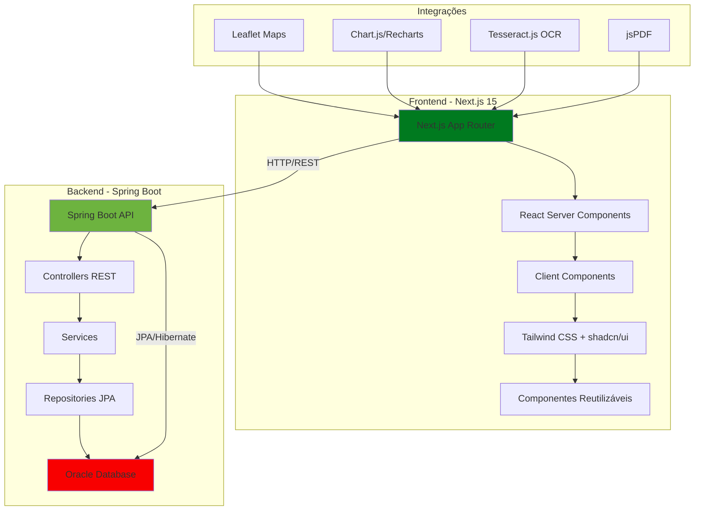
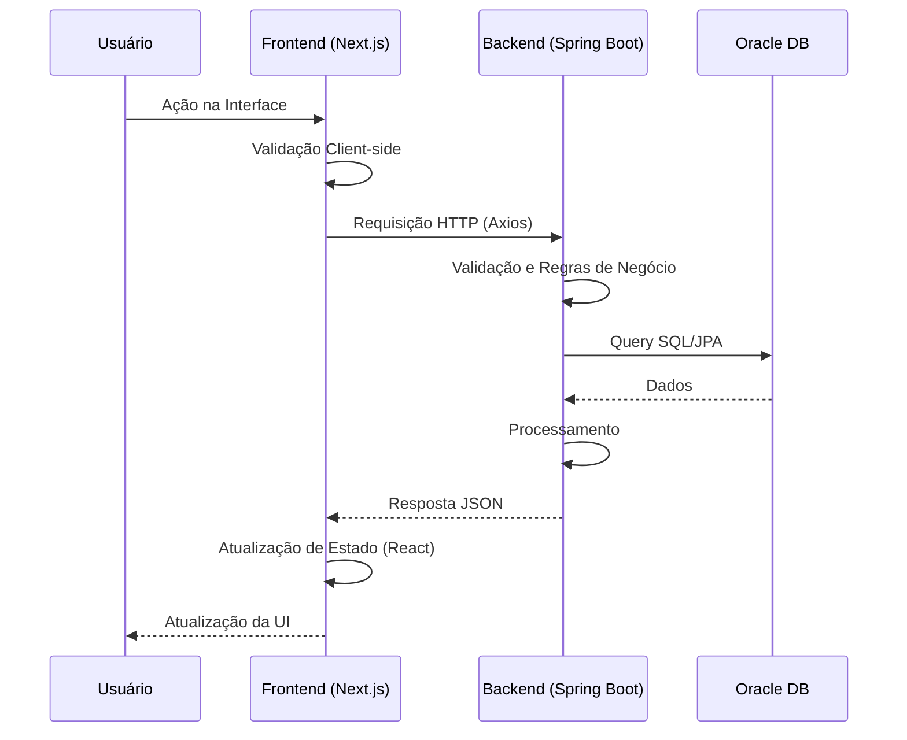
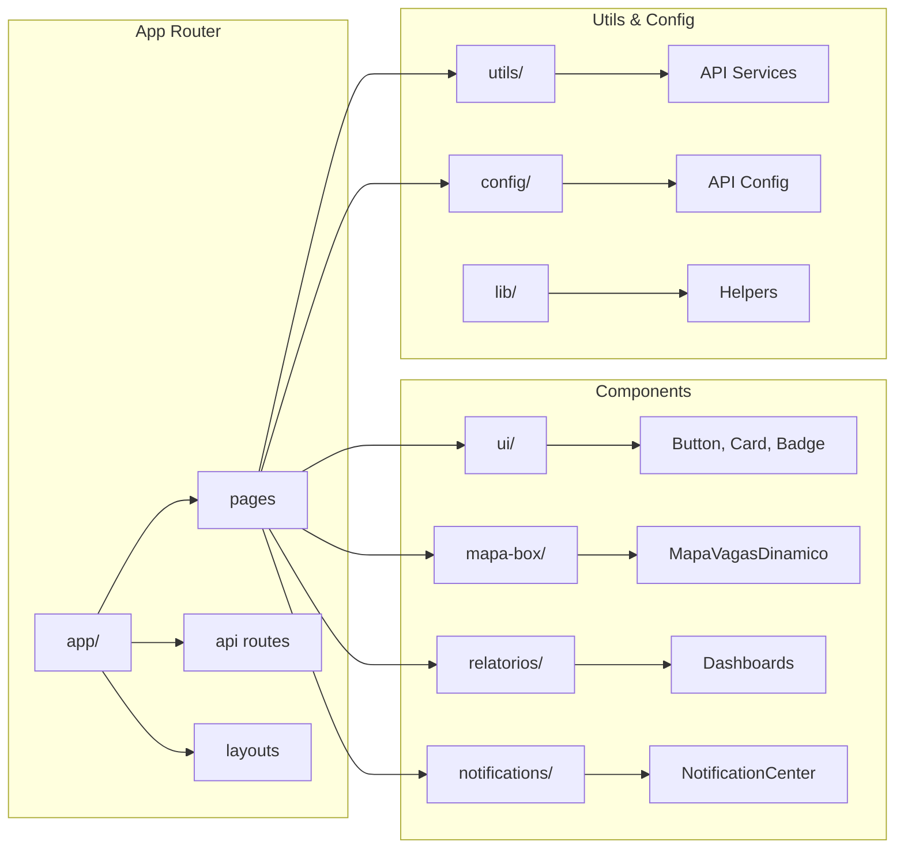

# 🚀 MOTTU Oficina - Sistema de Gestão de Veículos e Pátios

<div align="center">


[](LICENSE)
[](package.json)
[](https://nodejs.org/)
[]()

**Sistema completo de gestão para oficinas de veículos com controle de pátios, boxes, vagas, clientes e relatórios avançados**

**Desenvolvido para:** CHALLENGE-MOTTU-FIAP/2025 - GRUPO METAMIND SOLUTIONS - FINALISTA FIAP NEXT/2025

</div>

---

## 📑 Índice de Navegação

- [📋 Visão Geral](#-visão-geral)
- [✨ Características Principais](#-características-principais)
- [🏗️ Arquitetura do Sistema](#️-arquitetura-do-sistema)
- [🛠️ Stack Tecnológica](#️-stack-tecnológica)
- [📁 Estrutura do Projeto](#-estrutura-do-projeto)
- [🚀 Instalação e Configuração](#-instalação-e-configuração)
- [💻 Desenvolvimento](#-desenvolvimento)
- [🌐 Deploy e Produção](#-deploy-e-produção)
- [📊 Funcionalidades Detalhadas](#-funcionalidades-detalhadas)
- [🗺️ Sistema de Mapas](#️-sistema-de-mapas)
- [📡 API e Integrações](#-api-e-integrações)
- [🎨 Design System](#-design-system)
- [🔧 Configurações Avançadas](#-configurações-avançadas)
- [📸 Assets e Recursos](#-assets-e-recursos)
- [🤝 Contribuição](#-contribuição)
- [📝 Licença](#-licença)

---

## 📋 Visão Geral

O **MOTTU Oficina** é uma plataforma web completa e moderna desenvolvida para gerenciar operações de oficinas de veículos, oferecendo controle total sobre:

- 🏭 **Pátios**: Gestão completa de múltiplos pátios com layouts customizáveis
- 📦 **Boxes/Vagas**: Sistema inteligente de controle de vagas com status em tempo real
- 🚗 **Veículos**: Cadastro e rastreamento completo de veículos
- 👥 **Clientes**: Gestão de clientes com histórico e relacionamento
- 🗺️ **Mapas Interativos**: Visualização 2D e 3D de pátios com Leaflet
- 📊 **Relatórios Avançados**: Analytics, heatmaps, predições e análise comportamental
- 📱 **Sistema Radar**: OCR para reconhecimento de placas via webcam/mobile
- 🔔 **Notificações**: Sistema centralizado de alertas e notificações

### 🎯 Objetivos do Projeto

- ✅ Automatizar processos de gestão de oficinas
- ✅ Otimizar ocupação de vagas e pátios
- ✅ Fornecer insights através de relatórios avançados
- ✅ Melhorar experiência do usuário com interface moderna
- ✅ Escalar facilmente para múltiplos pátios

---

## ✨ Características Principais

### 🔥 Destaques

- ⚡ **Performance**: Next.js 15 com React 19 e Server Components
- 🎨 **UI Moderna**: Interface com Tailwind CSS 4.1 e componentes shadcn/ui
- 📱 **Responsivo**: Totalmente adaptável para mobile, tablet e desktop
- 🌐 **Multi-ambiente**: Suporte para desenvolvimento local e VPS
- 🔐 **Seguro**: Integração com backend Spring Boot autenticado
- 📊 **Analytics**: Dashboard com Chart.js e Recharts
- 🗺️ **Mapas**: Integração Leaflet para visualização geográfica
- 🤖 **IA**: Predições e análises comportamentais

### 🎨 Interface

- 🎭 **Design System**: Paleta verde Mottu (#007A1F → #00C23A)
- ✨ **Animações**: GSAP para animações fluidas
- 🎴 **Cards 3D**: Efeitos tilt e parallax
- 🌟 **Partículas**: Background animado com partículas
- 📄 **PDF Export**: Geração de relatórios em PDF com jsPDF

---

## 🏗️ Arquitetura do Sistema

### 📐 Diagrama de Arquitetura Geral



### 🔄 Fluxo de Dados



### 🗂️ Arquitetura de Componentes



---

## 🛠️ Stack Tecnológica

### 📦 Dependências Principais

#### **Frontend Core**

| Tecnologia | Versão | Uso |
|------------|--------|-----|
| [Next.js](https://nextjs.org/) | `^15.4.0-canary.17` | Framework React com SSR/SSG |
| [React](https://react.dev/) | `^19.1.1` | Biblioteca UI |
| [React DOM](https://react.dev/) | `^19.1.1` | Renderização DOM |
| [TypeScript](https://www.typescriptlang.org/) | `5.9.3` | Tipagem estática |

#### **Estilização**

| Tecnologia | Versão | Uso |
|------------|--------|-----|
| [Tailwind CSS](https://tailwindcss.com/) | `^4.1.13` | Framework CSS utility-first |
| [PostCSS](https://postcss.org/) | - | Processamento CSS |
| [Autoprefixer](https://github.com/postcss/autoprefixer) | `^10.4.21` | Prefixos CSS automáticos |

#### **UI Components**

| Tecnologia | Versão | Uso |
|------------|--------|-----|
| [shadcn/ui](https://ui.shadcn.com/) | - | Componentes acessíveis |
| [Lucide React](https://lucide.dev/) | `^0.503.0` | Ícones modernos |
| [React Icons](https://react-icons.github.io/react-icons/) | `^5.5.0` | Biblioteca de ícones |
| [Headless UI](https://headlessui.com/) | `^2.2.2` | Componentes sem estilo |

#### **Formulários e Validação**

| Tecnologia | Versão | Uso |
|------------|--------|-----|
| [React IMask](https://imask.js.org/) | `^7.6.1` | Máscaras de input |

#### **Visualização de Dados**

| Tecnologia | Versão | Uso |
|------------|--------|-----|
| [Chart.js](https://www.chartjs.org/) | `^4.4.9` | Gráficos e visualizações |
| [React Chart.js 2](https://react-chartjs-2.js.org/) | `^5.3.0` | Wrapper React para Chart.js |
| [Recharts](https://recharts.org/) | `^3.1.2` | Gráficos React |

#### **Mapas e Geografia**

| Tecnologia | Versão | Uso |
|------------|--------|-----|
| [Leaflet](https://leafletjs.com/) | `^1.9.4` | Mapas interativos |
| [React Leaflet](https://react-leaflet.js.org/) | `^5.0.0` | Componentes React para Leaflet |
| [@types/leaflet](https://www.npmjs.com/package/@types/leaflet) | `^1.9.20` | Tipos TypeScript |

#### **HTTP e API**

| Tecnologia | Versão | Uso |
|------------|--------|-----|
| [Axios](https://axios-http.com/) | `^1.11.0` | Cliente HTTP |

#### **Animações**

| Tecnologia | Versão | Uso |
|------------|--------|-----|
| [GSAP](https://gsap.com/) | `^3.13.0` | Biblioteca de animações |

#### **Geração de Documentos**

| Tecnologia | Versão | Uso |
|------------|--------|-----|
| [jsPDF](https://github.com/parallax/jsPDF) | `^3.0.3` | Geração de PDFs |
| [@types/jspdf](https://www.npmjs.com/package/@types/jspdf) | `^1.3.3` | Tipos TypeScript |
| [html2canvas](https://html2canvas.hertzen.com/) | `^1.4.1` | Captura de tela para PDF |

#### **OCR e Processamento de Imagem**

| Tecnologia | Versão | Uso |
|------------|--------|-----|
| [Tesseract.js](https://tesseract.projectnaptha.com/) | `^6.0.1` | OCR no navegador |
| [React Webcam](https://github.com/mozmorris/react-webcam) | `^7.2.0` | Acesso à webcam |

#### **QR Code**

| Tecnologia | Versão | Uso |
|------------|--------|-----|
| [qrcode.react](https://github.com/zpao/qrcode.react) | `^4.2.0` | Geração de QR Codes |

#### **Utilitários**

| Tecnologia | Versão | Uso |
|------------|--------|-----|
| [clsx](https://github.com/lukeed/clsx) | `^2.1.1` | Construção de classes CSS |
| [tailwind-merge](https://github.com/dcastil/tailwind-merge) | `^3.3.1` | Merge de classes Tailwind |
| [class-variance-authority](https://github.com/joe-bell/cva) | `^0.7.1` | Variantes de componentes |

### 🔧 DevDependencies

| Tecnologia | Versão | Uso |
|------------|--------|-----|
| [ESLint](https://eslint.org/) | `^9` | Linter JavaScript/TypeScript |
| [ESLint Config Next](https://github.com/vercel/next.js/tree/canary/packages/eslint-config-next) | `15.2.4` | Configuração ESLint para Next.js |
| [ESLint Plugin Unused Imports](https://github.com/sweepline/eslint-plugin-unused-imports) | `^4.3.0` | Detectar imports não usados |
| [@types/node](https://www.npmjs.com/package/@types/node) | `^20` | Tipos Node.js |
| [@types/react](https://www.npmjs.com/package/@types/react) | `^19` | Tipos React |
| [@types/react-dom](https://www.npmjs.com/package/@types/react-dom) | `^19` | Tipos React DOM |
| [cross-env](https://github.com/kentcdodds/cross-env) | `^7.0.3` | Variáveis de ambiente cross-platform |
| [tw-animate-css](https://www.npmjs.com/package/tw-animate-css) | `^1.4.0` | Animações CSS para Tailwind |

### 🔗 Backend e Infraestrutura

- **API Backend**: Spring Boot 3.x (separado)
- **Banco de Dados**: Oracle Database
- **Proxy Reverso**: Caddy Server
- **Gerenciador de Processos**: PM2 (produção)
- **VPS**: 72.61.219.15 (produção)

---

## 📁 Estrutura do Projeto

### 📂 Árvore de Diretórios Completa

```
mottu-web/
├── 📄 package.json                  # Dependências e scripts
├── 📄 package-lock.json              # Lock file de dependências
├── 📄 tsconfig.json                  # Configuração TypeScript
├── 📄 next.config.ts                 # Configuração Next.js
├── 📄 tailwind.config.ts             # Configuração Tailwind CSS
├── 📄 postcss.config.mjs            # Configuração PostCSS
├── 📄 components.json               # Configuração shadcn/ui
├── 📄 eslint.config.mjs             # Configuração ESLint
├── 📄 Caddyfile                     # Configuração Caddy Server
├── 📄 README.md                     # Este arquivo
│
├── 📁 public/                       # Arquivos estáticos
│   └── 📁 fotos-equipe/             # Fotos da equipe
│       ├── 🖼️ arthur.jpg
│       ├── 🖼️ fundo_pcar.png
│       ├── 🖼️ joao.jpg
│       ├── 🖼️ paulo.jpg
│       └── 🖼️ qrcod-app.png
│
├── 📁 src/                          # Código fonte principal
│   ├── 📁 app/                      # Next.js App Router
│   │   ├── 📄 layout.tsx            # Layout raiz
│   │   ├── 📄 page.tsx               # Página inicial
│   │   ├── 📄 globals.css            # Estilos globais
│   │   │
│   │   ├── 📁 api/                  # API Routes (Next.js)
│   │   │   ├── 📁 geocode/          # Geocodificação
│   │   │   ├── 📁 mapa-global/      # Mapas globais
│   │   │   ├── 📁 patios/           # Endpoints de pátios
│   │   │   └── 📁 vagas/            # Endpoints de vagas
│   │   │
│   │   ├── 📁 box/                  # Módulo de Boxes/Vagas
│   │   │   ├── 📄 layout.tsx
│   │   │   ├── 📁 buscar/
│   │   │   ├── 📁 cadastrar/
│   │   │   ├── 📁 deletar/
│   │   │   ├── 📁 detalhes/
│   │   │   ├── 📁 gerar/
│   │   │   └── 📁 listar/
│   │   │
│   │   ├── 📁 clientes/             # Módulo de Clientes
│   │   │   ├── 📁 alterar/
│   │   │   ├── 📁 buscar/
│   │   │   ├── 📁 cadastrar/
│   │   │   ├── 📁 deletar/
│   │   │   ├── 📁 detalhes/
│   │   │   └── 📁 listar/
│   │   │
│   │   ├── 📁 contato/              # Página de Contato
│   │   │   ├── 📄 layout.tsx
│   │   │   └── 📄 page.tsx
│   │   │
│   │   ├── 📁 dashboard/            # Dashboard Principal
│   │   │   └── 📄 page.tsx
│   │   │
│   │   ├── 📁 gerenciamento-patio/  # Gerenciamento de Pátios
│   │   │   ├── 📄 page.tsx
│   │   │   ├── 📁 box/
│   │   │   ├── 📁 patio/
│   │   │   └── 📁 zona/
│   │   │
│   │   ├── 📁 ajuda/                # Módulo de Ajuda
│   │   │   └── 📁 feedback/
│   │   │
│   │   ├── 📁 inicio/               # Página Inicial
│   │   │   └── 📄 page.tsx
│   │   │
│   │   ├── 📁 mapa-2d/              # Mapas 2D (legado)
│   │   │   └── 📄 page.tsx
│   │   │
│   │   ├── 📁 mapa-box/             # Sistema de Mapas de Vagas
│   │   │   ├── 📄 layout.tsx
│   │   │   ├── 📄 page.tsx
│   │   │   └── 📁 types/
│   │   │
│   │   ├── 📁 mapa-do-site/          # Mapa do Site
│   │   │   └── 📄 page.tsx
│   │   │
│   │   ├── 📁 mapas/                # Sistema de Mapas
│   │   │   ├── 📄 page.tsx
│   │   │   ├── 📄 README.md
│   │   │   └── 📁 patio/
│   │   │
│   │   ├── 📁 patio/                # Módulo de Pátios
│   │   │   ├── 📄 layout.tsx
│   │   │   ├── 📁 alterar/
│   │   │   ├── 📁 buscar/
│   │   │   ├── 📁 cadastrar/
│   │   │   ├── 📁 deletar/
│   │   │   ├── 📁 detalhes/
│   │   │   ├── 📁 listar/
│   │   │   └── 📁 novo-assistente/
│   │   │
│   │   ├── 📁 radar/                # Sistema Radar (OCR)
│   │   │   ├── 📄 page.tsx
│   │   │   ├── 📁 app-download/
│   │   │   ├── 📁 armazenar/
│   │   │   ├── 📁 buscar/
│   │   │   ├── 📁 localizar/
│   │   │   └── 📁 mobile-upload/
│   │   │
│   │   ├── 📁 relatorios/           # Módulo de Relatórios
│   │   │   ├── 📄 page.tsx
│   │   │   ├── 📁 analytics/
│   │   │   ├── 📁 comportamental/
│   │   │   ├── 📁 dashboard-ia/
│   │   │   ├── 📁 heatmap/
│   │   │   ├── 📁 manutencao/
│   │   │   ├── 📁 movimentacao/
│   │   │   ├── 📁 notificacoes/
│   │   │   ├── 📁 ocupacao-diaria/
│   │   │   └── 📁 performance-sistema/
│   │   │
│   │   ├── 📁 teste-api-mapa/       # Testes de API de Mapas
│   │   │   └── 📄 page.tsx
│   │   │
│   │   ├── 📁 unidades/              # Módulo de Unidades
│   │   │   ├── 📁 administracao/
│   │   │   └── 📁 designer/
│   │   │
│   │   ├── 📁 vagas/                # Módulo de Vagas
│   │   │   ├── 📁 buscar/
│   │   │   └── 📁 mapa/
│   │   │
│   │   ├── 📁 veiculo/              # Módulo de Veículos
│   │   │   ├── 📄 layout.tsx
│   │   │   ├── 📁 alterar/
│   │   │   ├── 📁 buscar/
│   │   │   ├── 📁 cadastrar/
│   │   │   ├── 📁 deletar/
│   │   │   ├── 📁 detalhes/
│   │   │   └── 📁 listar/
│   │   │
│   │   └── 📁 zona/                 # Módulo de Zonas
│   │       ├── 📁 alterar/
│   │       ├── 📁 buscar/
│   │       ├── 📁 detalhes/
│   │       └── 📁 listar/
│   │
│   ├── 📁 components/               # Componentes React
│   │   ├── 📁 analytics/            # Componentes de Analytics
│   │   │   └── 📄 BehavioralAnalysis.tsx
│   │   │
│   │   ├── 📁 dashboard/            # Componentes do Dashboard
│   │   │   └── 📄 PredictiveDashboard.tsx
│   │   │
│   │   ├── 📁 efeitoCard/           # Cards com efeitos 3D
│   │   │   └── 📄 PcarTiltCard.tsx
│   │   │
│   │   ├── 📁 exportapdf/            # Exportação de PDF
│   │   │   ├── 📄 index.ts
│   │   │   ├── 📄 PDFExportButton.tsx
│   │   │   ├── 📄 PDFService.ts
│   │   │   ├── 📄 PDFServiceSimple.ts
│   │   │   └── 📄 RelatorioPDFExporter.tsx
│   │   │
│   │   ├── 📁 forms/                # Formulários
│   │   │   └── 📄 TabbedForm.tsx
│   │   │
│   │   ├── 📁 heatmap/               # Visualizações Heatmap
│   │   │   └── 📄 HeatmapVisual.tsx
│   │   │
│   │   ├── 📁 mapa-box/             # Componentes de Mapas de Vagas
│   │   │   ├── 📄 ApiTest.tsx
│   │   │   ├── 📄 DebugNavigation.tsx
│   │   │   ├── 📄 EstatisticasVagas.tsx
│   │   │   ├── 📄 MapaGlobal.tsx
│   │   │   ├── 📄 MapaVagasDinamico.tsx
│   │   │   ├── 📄 TabNavigation.tsx
│   │   │   ├── 📄 VistaAbas.tsx
│   │   │   ├── 📄 VistaCardPatio.tsx
│   │   │   ├── 📄 VistaGrade.tsx
│   │   │   ├── 📄 VistaMapa.tsx
│   │   │   └── 📄 VistaPatio.tsx
│   │   │
│   │   ├── 📁 mapas-mottu/           # Mapas específicos Mottu
│   │   │   ├── 📄 PatioMottuGenerico.tsx
│   │   │   ├── 📄 PatioMottuGuarulhos.tsx
│   │   │   └── 📄 PatioMottuLimao.tsx
│   │   │
│   │   ├── 📁 maps/                  # Componentes de Mapas
│   │   │   └── 📄 OcupacaoHeatmap.tsx
│   │   │
│   │   ├── 📁 notifications/         # Sistema de Notificações
│   │   │   ├── 📄 NotificationCards.tsx
│   │   │   ├── 📄 NotificationCenter.tsx
│   │   │   ├── 📄 NotificationDetailModal.tsx
│   │   │   ├── 📄 NotificationList.tsx
│   │   │   ├── 📄 NotificationModal.tsx
│   │   │   ├── 📄 NotificationPagination.tsx
│   │   │   ├── 📄 NotificationService.ts
│   │   │   └── 📄 SmartNotifications.tsx
│   │   │
│   │   ├── 📁 ParallaxBox/           # Efeitos Parallax
│   │   │   └── 📄 ParallaxBox.tsx
│   │   │
│   │   ├── 📁 particula/             # Background de Partículas
│   │   │   └── 📄 ParticleBackground.tsx
│   │   │
│   │   ├── 📁 pesquisar/             # Componente de Busca
│   │   │   └── 📄 Pesquisar.tsx
│   │   │
│   │   ├── 📁 relatorios/            # Componentes de Relatórios
│   │   │   ├── 📄 DataTableOcupacao.tsx
│   │   │   └── 📄 FiltroOcupacao.tsx
│   │   │
│   │   ├── 📁 relogios/              # Componentes de Estatísticas
│   │   │   └── 📄 StatCard.tsx
│   │   │
│   │   ├── 📁 ui/                    # Componentes UI base (shadcn)
│   │   │   ├── 📄 badge.tsx
│   │   │   ├── 📄 button.tsx
│   │   │   ├── 📄 card.tsx
│   │   │   └── 📄 pagination.tsx
│   │   │
│   │   ├── 📁 wizard-steps/          # Wizard de Cadastro
│   │   │   ├── 📄 EtapaBoxes.tsx
│   │   │   ├── 📄 EtapaContatos.tsx
│   │   │   ├── 📄 EtapaEnderecoContato.tsx
│   │   │   ├── 📄 EtapaLocalizacao.tsx
│   │   │   ├── 📄 EtapaPatio.tsx
│   │   │   ├── 📄 EtapaResumo.tsx
│   │   │   └── 📄 EtapaZonas.tsx
│   │   │
│   │   ├── 📄 ApiTestComponent.tsx   # Componente de Teste de API
│   │   ├── 📄 ContactMapSection.tsx # Seção de Mapa de Contato
│   │   ├── 📄 CrudScaffold.tsx       # Scaffold para CRUD
│   │   ├── 📄 HierarchicalNavigation.tsx # Navegação Hierárquica
│   │   ├── 📄 LeafletMap.tsx         # Componente Leaflet
│   │   ├── 📄 MapFIAP.tsx            # Mapa FIAP
│   │   ├── 📄 ModernPagination.tsx   # Paginação Moderna
│   │   ├── 📄 nav-bar.tsx            # Barra de Navegação
│   │   ├── 📄 OcrScanner.tsx         # Scanner OCR
│   │   └── 📄 PatioMapSection.tsx    # Seção de Mapa de Pátio
│   │
│   ├── 📁 config/                    # Configurações
│   │   ├── 📄 api.ts                  # Configuração de API
│   │   ├── 📄 mapasDisponiveis.ts    # Configuração de Mapas
│   │   └── 📄 patioLayouts.ts        # Layouts de Pátios
│   │
│   ├── 📁 lib/                       # Bibliotecas e Utilitários
│   │   ├── 📄 motoData.ts            # Dados de Motos
│   │   ├── 📄 patioConfig.ts         # Configuração de Pátios
│   │   └── 📄 utils.ts               # Utilitários Gerais
│   │
│   ├── 📁 types/                     # Definições de Tipos TypeScript
│   │   ├── 📁 styles/                # Estilos
│   │   │   ├── 📄 neumorphic.css
│   │   │   └── 📄 *.css
│   │   ├── 📄 box.d.ts               # Tipos de Box
│   │   ├── 📄 cliente.d.ts           # Tipos de Cliente
│   │   ├── 📄 common.d.ts             # Tipos Comuns
│   │   ├── 📄 contato.ts              # Tipos de Contato
│   │   ├── 📄 datatable.ts            # Tipos de DataTable
│   │   ├── 📄 endereco.ts             # Tipos de Endereço
│   │   ├── 📄 patio.d.ts              # Tipos de Pátio
│   │   ├── 📄 veiculo.d.ts            # Tipos de Veículo
│   │   └── 📄 zona.d.ts               # Tipos de Zona
│   │
│   ├── 📁 utils/                     # Utilitários e Helpers
│   │   ├── 📁 api/                    # Utilitários de API
│   │   │   └── 📄 *.ts
│   │   ├── 📁 map/                    # Utilitários de Mapas
│   │   │   └── 📄 *.ts
│   │   ├── 📄 api.ts                  # Serviços de API
│   │   ├── 📄 cache.ts                 # Sistema de Cache
│   │   ├── 📄 plateValidation.ts      # Validação de Placas
│   │   └── 📄 relatorioFilters.ts     # Filtros de Relatórios
│   │
│   └── 📁 cache/                      # Sistema de Cache
│       ├── 📄 cache.ts
│       ├── 📄 index.ts
│       └── 📄 useCache.ts
│
├── 📁 scripts/                       # Scripts auxiliares (implícito)
│
├── 🔧 Scripts de Desenvolvimento
│   ├── 📄 dev-auto-clean.bat        # Auto-limpeza Windows
│   ├── 📄 dev-auto-clean.ps1        # Auto-limpeza PowerShell
│   ├── 📄 dev-clean.ps1             # Limpeza PowerShell
│   ├── 📄 dev-monitor.js             # Monitor de Desenvolvimento
│   ├── 📄 dev-with-cleanup.bat      # Dev com cleanup
│   └── 📄 start-clean.bat           # Iniciar limpo
│
└── 🔧 Scripts de Deploy
    ├── 📄 build-vps.sh              # Build para VPS
    ├── 📄 deploy-vps.sh              # Deploy para VPS
    └── 📄 start-clean.sh            # Iniciar limpo (Linux)
```

---

## 🚀 Instalação e Configuração

### 📋 Pré-requisitos

- **Node.js**: >= 18.0.0
- **npm**: >= 9.0.0 (ou **yarn** / **pnpm**)
- **Backend Spring Boot**: Rodando em `http://localhost:8080` (desenvolvimento)
- **Oracle Database**: Configurado e acessível

### 🛠️ Instalação Local

```bash
# 1. Clone o repositório
git clone <repository-url>
cd mottu-web

# 2. Instale as dependências
npm install

# 3. Configure as variáveis de ambiente (opcional)
# Crie um arquivo .env.local com:
NEXT_PUBLIC_BACKEND_ORIGIN=http://localhost:8080
NEXT_PUBLIC_API_BASE_URL=/api
NEXT_PUBLIC_CHARSET=utf-8

# 4. Inicie o servidor de desenvolvimento
npm run dev

# 5. Acesse a aplicação
# http://localhost:3000
```

### 🔧 Variáveis de Ambiente

| Variável | Descrição | Valor Padrão | Obrigatório |
|----------|-----------|--------------|-------------|
| `NEXT_PUBLIC_BACKEND_ORIGIN` | URL base do backend Spring Boot | `http://localhost:8080` | Não |
| `NEXT_PUBLIC_API_BASE_URL` | Path base da API | `/api` | Não |
| `NEXT_PUBLIC_APP_URL` | URL da aplicação frontend | `http://localhost:3000` | Não |
| `NEXT_PUBLIC_CHARSET` | Charset da aplicação | `utf-8` | Não |
| `NODE_ENV` | Ambiente de execução | `development` | Não |

---

## 💻 Desenvolvimento

### 🎯 Scripts Disponíveis

| Script | Comando | Descrição |
|--------|---------|-----------|
| **Dev Normal** | `npm run dev` | Inicia servidor de desenvolvimento (localhost:8080) |
| **Dev VPS** | `npm run dev:vps` | Inicia dev conectado à VPS (72.61.219.15:8080) |
| **Dev Auto Clean** | `npm run dev:auto` | Inicia dev com limpeza automática de processos |
| **Dev Monitor** | `npm run dev:monitor` | Inicia dev com monitor que limpa processos ao sair |
| **Dev Clean** | `npm run dev:clean` | Para processos e inicia dev limpo |
| **Build** | `npm run build` | Cria build de produção |
| **Build VPS** | `npm run build:vps` | Build otimizado para VPS |
| **Start** | `npm start` | Inicia servidor de produção |
| **Lint** | `npm run lint` | Executa ESLint |
| **Stop** | `npm run stop` | Para todos os processos Node.js |
| **Clean** | `npm run clean` | Alias para stop |
| **Kill All** | `npm run kill-all` | Para todos os processos Node.js com mensagem |

### 🏃 Executando em Modos Diferentes

#### 🏠 Desenvolvimento Local (Padrão)

```bash
npm run dev
```

- ✅ Usa API em `http://localhost:8080`
- ✅ Usa banco local
- ✅ Hot reload ativado
- ✅ Frontend em `http://localhost:3000`

#### 🌐 Desenvolvimento com VPS

```bash
npm run dev:vps
```

- ✅ Usa API em `http://72.61.219.15:8080`
- ✅ Usa banco da VPS
- ✅ Frontend em `http://localhost:3000`
- ✅ Hot reload ativado

#### 🧹 Desenvolvimento com Limpeza

```bash
# Windows
npm run dev:auto-clean
# ou
dev-auto-clean.bat

# PowerShell
.\dev-auto-clean.ps1

# Linux/Mac
npm run dev:monitor
```

### 🔍 Troubleshooting

#### Problema: Porta 3000 já em uso

```bash
# Windows
npm run stop
# ou
taskkill /F /IM node.exe /T

# Linux/Mac
pkill -f node
```

#### Problema: API não responde

```bash
# Verificar se backend está rodando
curl http://localhost:8080/api/health

# Verificar logs do backend
cd ../mottu-gradle
./gradlew bootRun
```

#### Problema: Dados do banco não retornam

1. ✅ Verificar se Oracle está rodando
2. ✅ Verificar configurações de conexão do backend
3. ✅ Verificar se API está respondendo corretamente
4. ✅ Verificar CORS no backend

---

## 🌐 Deploy e Produção

### 🚀 Deploy na VPS

#### Pré-requisitos da VPS

- Node.js >= 18.0.0
- PM2 instalado globalmente
- Caddy Server configurado
- Firewall permitindo portas 3000 e 8080

#### Deploy Automatizado

```bash
# 1. Build otimizado
./build-vps.sh

# 2. Deploy para VPS
./deploy-vps.sh
```

#### Deploy Manual

```bash
# 1. Build da aplicação
npm run build:vps

# 2. Copiar arquivos para VPS
scp -r . root@72.61.219.15:/opt/mottu-web/

# 3. Conectar na VPS e executar
ssh root@72.61.219.15
cd /opt/mottu-web
npm ci --production
pm2 start ecosystem.config.js
pm2 save
```

### ⚙️ Configuração PM2

O script de deploy cria automaticamente um arquivo `ecosystem.config.js`:

```javascript
module.exports = {
  apps: [{
    name: 'mottu-web',
    script: 'npm',
    args: 'start',
    cwd: '/opt/mottu-web',
    instances: 1,
    autorestart: true,
    watch: false,
    max_memory_restart: '1G',
    env: {
      NODE_ENV: 'production',
      PORT: 3000,
      NEXT_PUBLIC_BACKEND_ORIGIN: 'http://72.61.219.15:8080'
    }
  }]
};
```

### 🔒 Configuração Caddy

Arquivo `Caddyfile` configurado para produção:

```caddy
http://72.61.219.15:3000 {
  # API → Spring Boot
  @api path /api/*
  handle @api {
    reverse_proxy 127.0.0.1:8080
  }

  # Todo o resto → Next.js
  handle {
    reverse_proxy 127.0.0.1:3000
  }
}
```

### 📊 Monitoramento

```bash
# Ver status
pm2 status

# Ver logs
pm2 logs mottu-web

# Monitor em tempo real
pm2 monit

# Reiniciar
pm2 restart mottu-web

# Parar
pm2 stop mottu-web
```

---

## 📊 Funcionalidades Detalhadas

### 🏭 Gerenciamento de Pátios

#### Funcionalidades

- ✅ **Cadastro Completo**: Wizard multi-etapas para cadastro de pátios
- ✅ **Layouts Customizáveis**: Suporte para diferentes layouts (Guarulhos, Limão, etc.)
- ✅ **Zonas e Boxes**: Gestão hierárquica de zonas e boxes por pátio
- ✅ **Endereços**: Integração com geocodificação e mapas
- ✅ **Contatos**: Gestão de contatos e endereços de contato

#### Rotas

- `/patio/listar` - Listagem paginada e filtrada
- `/patio/buscar` - Busca avançada
- `/patio/cadastrar` - Cadastro simples
- `/patio/novo-assistente` - Wizard de cadastro completo
- `/patio/detalhes/[id]` - Detalhes do pátio
- `/patio/alterar/[id]` - Edição
- `/patio/deletar/[id]` - Exclusão

### 📦 Gerenciamento de Boxes/Vagas

#### Funcionalidades

- ✅ **CRUD Completo**: Criar, ler, atualizar e deletar boxes
- ✅ **Geração em Lote**: Gerar múltiplos boxes de uma vez
- ✅ **Status em Tempo Real**: Livre (L), Ocupado (O), Manutenção (M)
- ✅ **Hierárquico**: Boxes vinculados a pátios e zonas
- ✅ **Mapas Interativos**: Visualização em mapas 2D

#### Rotas

- `/box/listar` - Listagem
- `/box/buscar` - Busca
- `/box/cadastrar` - Cadastro
- `/box/gerar` - Geração em lote
- `/box/detalhes/[id]` - Detalhes
- `/box/alterar/[id]` - Edição
- `/box/deletar/[id]` - Exclusão

### 🚗 Gerenciamento de Veículos

#### Funcionalidades

- ✅ **Cadastro Completo**: Placa, modelo, cliente, etc.
- ✅ **Tags BLE**: Sistema de tags Bluetooth Low Energy
- ✅ **Localização**: Rastreamento de localização de veículos
- ✅ **Estacionamento**: Controle de estacionamento em boxes
- ✅ **Histórico**: Histórico de movimentações

#### Rotas

- `/veiculo/listar` - Listagem
- `/veiculo/buscar` - Busca
- `/veiculo/cadastrar` - Cadastro
- `/veiculo/detalhes/[id]` - Detalhes
- `/veiculo/alterar/[id]` - Edição
- `/veiculo/deletar/[id]` - Exclusão

### 👥 Gerenciamento de Clientes

#### Funcionalidades

- ✅ **CRUD Completo**: Gestão completa de clientes
- ✅ **Busca Avançada**: Filtros por nome, telefone, email
- ✅ **Histórico**: Veículos e histórico do cliente
- ✅ **Contatos**: Múltiplos contatos por cliente

#### Rotas

- `/clientes/listar` - Listagem
- `/clientes/buscar` - Busca
- `/clientes/cadastrar` - Cadastro
- `/clientes/detalhes/[id]` - Detalhes
- `/clientes/alterar/[id]` - Edição
- `/clientes/deletar/[id]` - Exclusão

### 🗺️ Sistema de Mapas

#### Mapa Dinâmico de Vagas (`/mapa-box`)

**Características:**

- ✅ Sistema escalável sem programação para novos pátios
- ✅ Visualização de pátio com interface intuitiva
- ✅ Dados em tempo real da API backend
- ✅ Filtros avançados (pátio, status, placa, nome do box)
- ✅ Múltiplas vistas:
  - **Pátio**: Grid de vagas estilo cinema
  - **Mapa**: Visualização geográfica com Leaflet
  - **Grade**: Vista em grade/quadros
  - **Abas**: Cards, tabela e gráficos

**Status das Vagas:**

- 🟢 **Verde**: Livre
- 🔴 **Vermelho**: Ocupado
- 🟡 **Amarelo**: Manutenção

#### Mapas 2D de Pátios (`/mapas/patio`)

**Características:**

- ✅ Mapas 2D tradicionais por pátio
- ✅ Suporte para múltiplos pátios (Guarulhos, Limão)
- ✅ Visualização interativa
- ✅ Integração com dados reais

**Rotas:**

- `/mapas` - Seleção de pátio
- `/mapas/patio` - Mapas 2D tradicionais
- `/mapa-box` - Mapa dinâmico de vagas

### 📊 Sistema de Relatórios

#### Dashboard Principal (`/dashboard`)

- ✅ **Visão Geral**: Estatísticas principais
- ✅ **Gráficos Interativos**: Chart.js e Recharts
- ✅ **Cards de Métricas**: Estatísticas em tempo real

#### Relatórios Disponíveis

| Relatório | Rota | Descrição |
|-----------|------|-----------|
| **Analytics Avançado** | `/relatorios/analytics` | Análises profundas |
| **Análise Comportamental** | `/relatorios/comportamental` | Padrões de comportamento |
| **Dashboard IA** | `/relatorios/dashboard-ia` | Dashboard com IA |
| **Heatmap de Ocupação** | `/relatorios/heatmap` | Visualização heatmap |
| **Relatório de Manutenção** | `/relatorios/manutencao` | Manutenções programadas |
| **Movimentação** | `/relatorios/movimentacao` | Histórico de movimentações |
| **Central de Notificações** | `/relatorios/notificacoes` | Notificações do sistema |
| **Ocupação Diária** | `/relatorios/ocupacao-diaria` | Ocupação por dia |
| **Performance do Sistema** | `/relatorios/performance-sistema` | Métricas de performance |

#### Funcionalidades dos Relatórios

- ✅ **Exportação PDF**: Geração de PDFs com jsPDF
- ✅ **Filtros Avançados**: Filtros por data, pátio, status
- ✅ **Gráficos Interativos**: Visualizações com Chart.js
- ✅ **Tabelas Paginadas**: Listagens com paginação
- ✅ **Exportação de Dados**: Export em diferentes formatos

### 📱 Sistema Radar (OCR)

#### Funcionalidades

- ✅ **Reconhecimento de Placas**: OCR com Tesseract.js
- ✅ **Webcam**: Captura via webcam do navegador
- ✅ **Upload de Imagem**: Upload de arquivos de imagem
- ✅ **Mobile Upload**: Upload de imagens via mobile
- ✅ **Armazenamento**: Armazenamento de imagens processadas
- ✅ **Busca**: Busca por placas reconhecidas
- ✅ **Localização**: Localização de veículos por placa

#### Rotas

- `/radar` - Página principal
- `/radar/armazenar` - Armazenar imagem
- `/radar/buscar` - Buscar placas
- `/radar/localizar/[placa]` - Localizar veículo
- `/radar/mobile-upload/[sessionId]` - Upload mobile
- `/radar/app-download` - Download do app

---

## 📡 API e Integrações

### 🔗 Configuração da API

A API é configurada em `src/config/api.ts` e `src/utils/api.ts`:

```typescript
// Configuração base
export const API_CONFIG = {
    BASE_URL: process.env.NEXT_PUBLIC_API_BASE_URL || 'http://localhost:8080',
    ENDPOINTS: {
        PATIO: { /* ... */ },
        BOX: { /* ... */ },
        VEICULO: { /* ... */ },
        CLIENTE: { /* ... */ },
        ZONA: { /* ... */ },
        DASHBOARD: { /* ... */ }
    }
};
```

### 📡 Serviços de API Disponíveis

#### ClienteService

```typescript
- listarPaginadoFiltrado(filter, page, size, sort)
- getById(id)
- create(payload)
- update(id, payload)
- delete(id)
```

#### VeiculoService

```typescript
- listarPaginadoFiltrado(filter, page, size, sort)
- getById(id)
- create(payload)
- update(id, payload)
- delete(id)
- getLocalizacao(id)
- listarEstacionados()
- gerarProximaTagBle()
```

#### PatioService

```typescript
- listarPaginadoFiltrado(filter, page, size, sort)
- getById(id)
- create(payload)
- update(id, payload)
- delete(id)
- createCompleto(payload) // Wizard completo
```

#### BoxService

```typescript
// Métodos Legados
- listarPaginadoFiltrado(filter, page, size, sort)
- getById(id)
- create(payload)
- update(id, payload)
- delete(id)
- gerarEmLote(prefixo, quantidade)

// Métodos Hierárquicos
- listarPorPatio(patioId, patioStatus, page, size)
- createPorPatio(patioId, patioStatus, payload)
- updatePorPatio(patioId, patioStatus, id, payload)
- deletePorPatio(patioId, patioStatus, id)
- getByIdPorPatio(patioId, patioStatus, id)
- gerarEmLotePorPatio(patioId, patioStatus, prefixo, quantidade)
```

#### ZonaService

```typescript
// Métodos Legados
- listarPaginadoFiltrado(filter, page, size, sort)
- getById(id)
- create(payload)
- update(id, payload)
- delete(id)

// Métodos Hierárquicos
- listarPorPatio(patioId, patioStatus, page, size)
- createPorPatio(patioId, patioStatus, payload)
- updatePorPatio(patioId, patioStatus, id, payload)
- deletePorPatio(patioId, patioStatus, id)
- getByIdPorPatio(patioId, patioStatus, id)
```

#### EstacionamentoService

```typescript
- estacionar(placa, boxId?)
- liberarVaga(placa)
```

#### RadarService

```typescript
- iniciarSessao()
- getStatusSessao(sessionId)
- uploadImagem(sessionId, fileOrForm)
```

#### ContatoService

```typescript
- listarPaginadoFiltrado(filter, page, size, sort)
- listarTodos()
- getById(id)
- create(payload)
- update(id, payload)
- delete(id)
```

#### EnderecoService

```typescript
- listarPaginadoFiltrado(filter, page, size, sort)
- listarTodos()
- getById(id)
- create(payload)
- update(id, payload)
- delete(id)
- buscarCep(cep) // Integração ViaCEP
```

### 🌍 Integrações Externas

#### ViaCEP

- **Uso**: Busca de endereços por CEP
- **Endpoint**: `https://viacep.com.br/ws/{cep}/json/`
- **Implementação**: `EnderecoService.buscarCep()`

#### Geocodificação

- **Uso**: Conversão de endereços em coordenadas
- **Endpoint**: `/api/geocode`
- **Formato**: Latitude/Longitude

### 🔄 Rewrites Next.js

O Next.js está configurado para fazer proxy das requisições `/api/*` para o backend:

```typescript
// next.config.ts
async rewrites() {
    return [
        {
            source: "/api/:path*",
            destination: `${backendOrigin}/api/:path*`,
        },
    ];
}
```

---

## 🎨 Design System

### 🎨 Paleta de Cores Mottu

```css
/* Cores Principais */
--color-mottu-dark: #007A1F      /* Cor mais escura */
--color-mottu-default: #009C2C   /* Cor padrão */
--color-mottu-light: #00C23A      /* Cor mais clara */
--color-mottu-text: #FFFFFF       /* Texto em áreas verdes */

/* Gradiente */
background: linear-gradient(45deg, 
    #007A1F 0%, 
    #008A25 20%, 
    #009C2C 50%, 
    #00B033 80%, 
    #00C23A 100%
);
```

### 🎴 Cores de Cards de Relatórios

```css
/* Amarelo */
--card-yellow: #FFF9DB
--card-yellow-border: #FDE68A

/* Azul */
--card-blue: #EFF6FF
--card-blue-border: #93C5FD

/* Laranja */
--card-orange: #FFF7ED
--card-orange-border: #FDBA74

/* E mais 10+ variações de cores */
```

### 🔤 Tipografia

```css
/* Fonte Principal */
font-family: 'Montserrat', sans-serif;

/* Fontes do Google */
@import url('https://fonts.googleapis.com/css?family=Montserrat:500,700&display=swap');

/* Fontes Next.js */
--font-geist-sans: Geist
--font-geist-mono: Geist Mono
```

### 🎭 Ícones

- **Ionicons 4.5.10**: `https://unpkg.com/ionicons@4.5.10-0/dist/css/ionicons.min.css`
- **Lucide React**: Componentes React de ícones
- **React Icons**: Biblioteca adicional de ícones

### 📐 Componentes UI

#### shadcn/ui

- ✅ **Button**: Botões estilizados
- ✅ **Card**: Cards com sombras
- ✅ **Badge**: Badges de status
- ✅ **Pagination**: Paginação moderna

#### Componentes Customizados

- ✅ **NavBar**: Barra de navegação com dropdowns
- ✅ **PcarTiltCard**: Card com efeito 3D tilt
- ✅ **ParticleBackground**: Background animado
- ✅ **MapaVagasDinamico**: Mapa dinâmico de vagas
- ✅ **NotificationCenter**: Centro de notificações

### 🎨 Estilos Especiais

#### Neumorphic Design

```css
/* Estilos neumórficos em src/types/styles/neumorphic.css */
/* Efeitos de profundidade e sombras suaves */
```

#### Animações GSAP

- ✅ Animações fluidas em componentes
- ✅ Transições suaves
- ✅ Efeitos de hover avançados

---

## 🔧 Configurações Avançadas

### ⚙️ Next.js Config

```typescript
// next.config.ts
const nextConfig: NextConfig = {
    allowedDevOrigins: [
        "http://localhost:3000",
        "http://72.61.219.15:3000",
        "http://10.199.82.137:3000"
    ],
    env: {
        NEXT_PUBLIC_CHARSET: 'utf-8',
    },
    images: {
        remotePatterns: [
            { protocol: "https", hostname: "img.shields.io" },
            { protocol: "https", hostname: "github.com" },
        ],
    },
    rewrites() {
        return [
            {
                source: "/api/:path*",
                destination: `${backendOrigin}/api/:path*`,
            },
        ];
    },
    eslint: {
        ignoreDuringBuilds: true,
    },
    typescript: {
        ignoreBuildErrors: true,
    },
};
```

### 🎨 Tailwind Config

```typescript
// tailwind.config.ts
export default {
  content: [
    './src/pages/**/*.{js,ts,jsx,tsx,mdx}',
    './src/components/**/*.{js,ts,jsx,tsx,mdx}',
    './src/app/**/*.{js,ts,jsx,tsx,mdx}',
  ],
  theme: {
    extend: {
      fontFamily: {
        montserrat: ['Montserrat', 'sans-serif'],
      },
      colors: {
        'mottu-dark': '#007A1F',
        'mottu-default': '#009C2C',
        'mottu-light': '#00C23A',
        // + 20 variações de cores para cards
      },
      backgroundImage: {
        'mottu-gradient': 'linear-gradient(...)',
      },
    },
  },
};
```

### 📝 TypeScript Config

```json
{
  "compilerOptions": {
    "target": "ES2017",
    "lib": ["dom", "dom.iterable", "esnext"],
    "allowJs": true,
    "skipLibCheck": true,
    "strict": true,
    "jsx": "preserve",
    "moduleResolution": "bundler",
    "paths": {
      "@/*": ["./src/*"]
    }
  }
}
```

### 🧹 ESLint Config

```javascript
// eslint.config.mjs
export default [
  ...compat.extends("next/core-web-vitals", "next/typescript"),
  {
    rules: {
      'unused-imports/no-unused-imports': 'error',
      '@typescript-eslint/consistent-type-imports': ['warn'],
      'import/order': ['warn', { /* ... */ }],
    },
  },
];
```

---

## 📸 Assets e Recursos

### 🖼️ Fotos da Equipe

Localização: `public/fotos-equipe/`

| Arquivo | Descrição | Uso |
|---------|-----------|-----|
| `arthur.jpg` | Foto do membro Arthur | Perfil/Equipe |
| `joao.jpg` | Foto do membro João | Perfil/Equipe |
| `paulo.jpg` | Foto do membro Paulo | Perfil/Equipe |
| `fundo_pcar.png` | Imagem de fundo para card 3D | Página inicial |
| `qrcod-app.png` | QR Code do aplicativo | Download do app |

### 🎨 Imagens e Recursos

- **Favicon**: `src/app/favicon.ico`
- **Background**: Partículas animadas (ParticleBackground)
- **Cards**: Imagens de fundo para cards 3D

### 📱 QR Code

O QR Code está disponível em `public/fotos-equipe/qrcod-app.png` e pode ser usado para:
- ✅ Download do aplicativo mobile
- ✅ Acesso rápido ao sistema
- ✅ Compartilhamento de links

---

## 🤝 Contribuição

Este projeto foi desenvolvido para o **CHALLENGE-MOTTU-FIAP/2025** pelo **GRUPO METAMIND SOLUTIONS** como **FINALISTA FIAP NEXT/2025**.

### 👥 Equipe

- **Arthur** - Desenvolvedor
- **João** - Desenvolvedor
- **Paulo** - Desenvolvedor

### 📝 Padrões de Código

- ✅ TypeScript estrito
- ✅ ESLint configurado
- ✅ Componentes funcionais React
- ✅ Nomenclatura em português (PT-BR)
- ✅ Comentários em código complexo

### 🔄 Fluxo de Trabalho

1. Criar branch a partir de `main`
2. Desenvolver funcionalidade
3. Testar localmente
4. Commit com mensagem descritiva
5. Pull Request para revisão
6. Merge após aprovação

---

## 📝 Licença

Este projeto é **proprietário** e foi desenvolvido para o CHALLENGE-MOTTU-FIAP/2025.

**Todos os direitos reservados.**

---

## 🔗 Links Úteis

- 🌐 **Aplicação (Produção)**: http://72.61.219.15:3000
- 📡 **API Backend**: http://72.61.219.15:8080
- 📚 **Swagger UI**: http://72.61.219.15:8080/swagger-ui/index.html
- 📖 **Next.js Docs**: https://nextjs.org/docs
- 🎨 **Tailwind CSS Docs**: https://tailwindcss.com/docs
- ⚛️ **React Docs**: https://react.dev

---

## 📊 Status do Projeto


**Desenvolvido com ❤️ pela equipe METAMIND SOLUTIONS**

---

<div align="center">

**CHALLENGE-MOTTU-FIAP/2025** | **GRUPO METAMIND SOLUTIONS** | **FINALISTA FIAP NEXT/2025**

</div>
