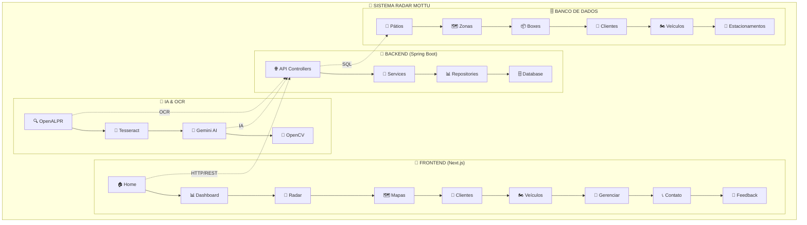
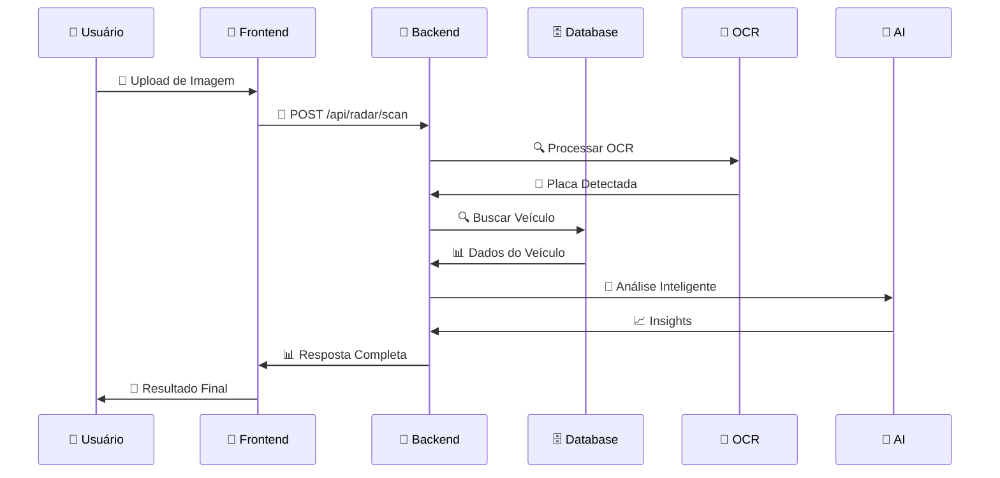

# 🚀 **Sistema Radar Mottu - Gestão Inteligente de Estacionamento**

<div align="center">


[](https://opensource.org/licenses/MIT)
[](https://github.com/carmipa/challenge_2025_2_semestre_mottu_parte_1)
[](https://github.com/carmipa/challenge_2025_2_semestre_mottu_parte_1)
[](https://github.com/carmipa/challenge_2025_2_semestre_mottu_parte_1)

</div>

---

## 📋 **Índice de Navegação**

- [🎯 Visão Geral](#-visão-geral)
- [👥 Equipe de Desenvolvimento](#-equipe-de-desenvolvimento)
- [🏗️ Arquitetura do Sistema](#️-arquitetura-do-sistema)
- [⚙️ Tecnologias Utilizadas](#️-tecnologias-utilizadas)
- [🚀 Funcionalidades Principais](#-funcionalidades-principais)
- [📱 Interface do Usuário](#-interface-do-usuário)
- [🔧 Configuração e Instalação](#-configuração-e-instalação)
- [📊 Estrutura do Projeto](#-estrutura-do-projeto)
- [🗄️ Banco de Dados](#️-banco-de-dados)
- [🔐 Segurança](#-segurança)
- [📈 Monitoramento e Logs](#-monitoramento-e-logs)
- [🧪 Testes](#-testes)
- [📚 Documentação da API](#-documentação-da-api)
- [🚀 Deploy](#-deploy)
- [👥 Contribuição](#-contribuição)
- [📄 Licença](#-licença)

---

## 🎯 **Visão Geral**

O **Sistema Radar Mottu** é uma solução completa de gestão inteligente de estacionamento para motocicletas, desenvolvido para o **Challenge FIAP 2025**. O sistema integra tecnologias de ponta como **OCR (Optical Character Recognition)**, **OpenALPR**, **Tesseract**, **Inteligência Artificial (Gemini AI)** e **rastreamento em tempo real** para oferecer uma experiência automatizada e eficiente de estacionamento.

### 🎪 **Características Principais**
- 🏍️ **Gestão Completa de Frota** com tags BLE automáticas
- 📍 **Localização em Tempo Real** de veículos estacionados
- 🔍 **Reconhecimento Automático de Placas** via OCR
- 🗺️ **Mapas 2D Interativos** para visualização espacial
- 📊 **Dashboard em Tempo Real** com métricas operacionais
- 🏗️ **Gestão Hierárquica** de Pátios → Zonas → Boxes
- 📱 **Interface Responsiva** para desktop e mobile
- 🤖 **Integração com IA** para processamento inteligente
- 💬 **Sistema de Feedback** com 8 provedores de email
- 📈 **Relatórios Avançados** com análises preditivas

---

## 👥 **Equipe de Desenvolvimento**

| Nome                        | RM     | Turma   | Repositório                                                                                                    | Contato                                                                                                                       | Foto                                                                                                                       |
|-----------------------------|--------|---------|----------------------------------------------------------------------------------------------------------------|------------------------------------------------------------------------------------------------------------------------------|----------------------------------------------------------------------------------------------------------------------------|
| Paulo André Carminati       | 557881 | 2-TDSPZ  | [](https://github.com/carmipa)         | [](https://www.linkedin.com/in/paulo-andr%C3%A9-carminati-47712340/) |  |
| Arthur Bispo de Lima        | 557568 | 2-TDSPV  | [](https://github.com/ArthurBispo00) | [](https://www.linkedin.com/in/arthur-bispo-41364b207/)     |          |
| João Paulo Moreira          | 557808 | 2-TDSPV  | [](https://github.com/joao1015)   | [](https://www.linkedin.com/in/joao1015/) |         |

---

## 🏗️ **Arquitetura do Sistema**



### 🔄 **Fluxo de Dados**



---

## ⚙️ **Tecnologias Utilizadas**

### 🔧 **Backend (Java/Spring)**
- **☕ Java 17+** - Linguagem principal
- **🌱 Spring Boot 3.x** - Framework principal
- **🔌 Spring Data JPA** - Persistência de dados
- **🔐 Spring Security** - Autenticação e autorização
- **📊 Spring Web** - APIs REST
- **🔄 Spring Batch** - Processamento em lote
- **🧪 Spring Test** - Testes automatizados
- **📈 Spring Actuator** - Monitoramento e métricas

### 📱 **Frontend (Next.js/React)**
- **⚛️ React 18** - Biblioteca de interface
- **🔄 Next.js 15** - Framework React
- **📘 TypeScript** - Tipagem estática
- **🎨 Tailwind CSS** - Framework CSS
- **🗺️ Leaflet** - Mapas interativos
- **📊 Recharts** - Gráficos e visualizações
- **🎯 React Icons** - Biblioteca de ícones
- **📱 Responsive Design** - Design adaptativo

### 🗄️ **Banco de Dados**
- **🔶 Oracle Database** - Banco principal
- **📊 Oracle SQL Developer** - Ferramenta de administração
- **🔄 Flyway** - Migração de dados
- **📈 Connection Pooling** - Pool de conexões

### 🤖 **Inteligência Artificial & OCR**
- **🔍 OpenALPR** - Reconhecimento de placas
- **📝 Tesseract OCR** - OCR avançado
- **🤖 Gemini AI** - Processamento inteligente
- **📸 OpenCV** - Processamento de imagens
- **🧠 Machine Learning** - Algoritmos de IA

### 🛠️ **Ferramentas de Desenvolvimento**
- **📦 Gradle** - Gerenciador de dependências
- **🐳 Docker** - Containerização
- **📚 Swagger/OpenAPI** - Documentação da API
- **🧪 JUnit 5** - Testes unitários
- **📊 Mockito** - Mocking para testes
- **🔄 Git** - Controle de versão
- **🌐 GitHub** - Repositório remoto

### ☁️ **Infraestrutura & Deploy**
- **🐳 Docker Compose** - Orquestração local
- **☁️ Cloud Services** - AWS/Azure/GCP
- **🔄 CI/CD** - Integração contínua
- **📊 Monitoring** - Logs e métricas
- **🔒 SSL/TLS** - Segurança de comunicação

---

## 🚀 **Funcionalidades Principais**

### 🏠 **1. Páginas Iniciais**
- **🏠 Página Inicial** - Landing page com apresentação do sistema
- **📊 Dashboard** - Painel de controle com métricas em tempo real
- **🗺️ Mapa do Site** - Guia completo de todas as funcionalidades

### 🎯 **2. Operações Radar (Core)**
- **🎯 Radar Principal** - Hub central para operações de estacionamento
- **📸 Armazenar Moto** - Interface para escaneamento e estacionamento automático
- **🔍 Buscar Moto** - Localização de veículos por placa com OCR
- **📱 Upload Mobile** - Interface mobile para upload de imagens
- **📱 App Download** - Download do aplicativo Android com QR Code

### 📈 **3. Relatórios e Analytics**
- **📊 Relatórios Gerais** - Hub principal para todos os relatórios
- **📅 Ocupação Diária** - Relatórios diários com gráficos de pizza
- **📈 Movimentação** - Análise de padrões e estatísticas

### 🗺️ **4. Visualizações e Mapas**
- **🗺️ Mapa 2D do Pátio** - Visualização espacial interativa
- **📍 Mapa de Vagas** - Visualização em tempo real das vagas
- **🔍 Busca de Vagas** - Sistema de busca avançada de vagas

### 👥 **5. Gestão de Clientes**
- **📋 Listar Clientes** - Visualização com filtros e paginação
- **➕ Cadastrar Cliente** - Formulário completo de cadastro
- **🔍 Buscar Clientes** - Busca avançada por múltiplos critérios

### 🏍️ **6. Gestão de Veículos**
- **📋 Listar Motos** - Visualização com status e localização
- **➕ Cadastrar Moto** - Cadastro com geração automática de Tag BLE
- **🔍 Buscar Motos** - Busca por placa, modelo, fabricante ou tag BLE

### 🏢 **7. Gerenciamento Unificado de Pátios**
- **🏢 Gerenciamento Principal** - Interface unificada com navegação hierárquica
- **📊 Aba Pátios** - Gestão de pátios com estatísticas
- **🗺️ Aba Zonas** - Gestão de zonas dentro dos pátios
- **📦 Aba Boxes** - Gestão de boxes/vagas com status em tempo real

### 🏗️ **8. Estrutura Física (Gestão Individual)**
- **🏢 Pátios** - CRUD completo para pátios
- **🗺️ Zonas** - CRUD completo para zonas
- **📦 Boxes (Vagas)** - CRUD completo para vagas

### 🏢 **9. Unidades Organizacionais**
- **🏢 Administração** - Gestão administrativa
- **🎨 Designer** - Ferramentas de design

### 🔧 **10. Ferramentas de Desenvolvimento**
- **📚 Swagger UI** - Documentação interativa da API
- **🧪 Teste API** - Interface para testar endpoints

### 📞 **11. Suporte e Contato**
- **📞 Fale Conosco** - Formulário de contato com 8 provedores de email
- **💬 Sistema de Feedback** - Sistema inteligente de feedback com detecção automática

---

## 📱 **Interface do Usuário**

### 🎨 **Design System**
- **🌙 Dark Theme** - Tema escuro principal
- **🎯 Cores Primárias** - Verde Mottu (#00D4AA) e tons escuros
- **📱 Responsive** - Adaptável para desktop, tablet e mobile
- **♿ Acessibilidade** - Conformidade com padrões WCAG
- **🎭 Neumorphic Design** - Efeitos de profundidade e sombras suaves

### 🧩 **Componentes Principais**
- **🧭 Navigation Bar** - Menu principal com navegação hierárquica
- **📊 Dashboard Cards** - Cards informativos com métricas
- **🗺️ Interactive Maps** - Mapas 2D com Leaflet
- **📋 Data Tables** - Tabelas com paginação e filtros
- **🔍 Search Components** - Componentes de busca avançada
- **📝 Forms** - Formulários com validação
- **🎯 Modals** - Modais para detalhes e confirmações
- **📱 Mobile Components** - Componentes otimizados para mobile

### 📊 **Visualizações**
- **📈 Charts & Graphs** - Gráficos com Recharts
- **🗺️ Interactive Maps** - Mapas com Leaflet
- **📊 Real-time Updates** - Atualizações em tempo real
- **🎯 Data Visualization** - Visualização de dados complexos

---

## 🔧 **Configuração e Instalação**

### 📋 **Pré-requisitos**
- **☕ Java 17+** - JDK instalado
- **📦 Node.js 18+** - Runtime JavaScript
- **🗄️ Oracle Database** - Banco de dados
- **🐳 Docker** - Para containerização (opcional)

### 🚀 **Instalação do Backend**

```bash
# 1. Clone o repositório
git clone https://github.com/carmipa/challenge_2025_2_semestre_mottu_parte_1.git
cd challenge_2025_2_semestre_mottu_parte_1/Java_Advanced/next/mottu-api-restful

# 2. Configure o banco de dados Oracle
# Execute os scripts SQL em: src/main/resources/db/migration/

# 3. Configure as propriedades da aplicação
cp src/main/resources/application-dev.properties.example src/main/resources/application-dev.properties

# 4. Instale as dependências
./gradlew build

# 5. Execute a aplicação
./gradlew bootRun
```

### 📱 **Instalação do Frontend**

```bash
# 1. Navegue para o diretório do frontend
cd mottu-web

# 2. Instale as dependências
npm install

# 3. Configure as variáveis de ambiente
cp .env.local.example .env.local

# 4. Execute o servidor de desenvolvimento
npm run dev
```

### 🐳 **Instalação com Docker**

```bash
# 1. Execute o docker-compose
docker-compose up -d

# 2. Acesse as aplicações
# Backend: http://localhost:8080
# Frontend: http://localhost:3000
```

---

## 📊 **Estrutura do Projeto**

### 🔧 **Backend (mottu-gradle)**
```
mottu-gradle/
├── 📁 src/
│   ├── 📁 main/
│   │   ├── 📁 java/br/com/fiap/mottu/
│   │   │   ├── 📁 controller/          # 🌐 API Controllers
│   │   │   │   ├── 📄 ClienteController.java
│   │   │   │   ├── 📄 VeiculoController.java
│   │   │   │   ├── 📄 PatioController.java
│   │   │   │   ├── 📄 ZonaController.java
│   │   │   │   ├── 📄 BoxController.java
│   │   │   │   ├── 📄 RadarController.java
│   │   │   │   └── 📄 VagaController.java
│   │   │   ├── 📁 service/             # 🔧 Business Logic
│   │   │   │   ├── 📄 ClienteService.java
│   │   │   │   ├── 📄 VeiculoService.java
│   │   │   │   ├── 📄 PatioService.java
│   │   │   │   ├── 📄 ZonaService.java
│   │   │   │   ├── 📄 BoxService.java
│   │   │   │   ├── 📄 RadarService.java
│   │   │   │   └── 📄 VagaOracleService.java
│   │   │   ├── 📁 repository/          # 📊 Data Access
│   │   │   │   ├── 📄 ClienteRepository.java
│   │   │   │   ├── 📄 VeiculoRepository.java
│   │   │   │   ├── 📄 PatioRepository.java
│   │   │   │   ├── 📄 ZonaRepository.java
│   │   │   │   ├── 📄 BoxRepository.java
│   │   │   │   └── 📄 VagaRepository.java
│   │   │   ├── 📁 model/               # 📋 Entity Models
│   │   │   │   ├── 📄 Cliente.java
│   │   │   │   ├── 📄 Veiculo.java
│   │   │   │   ├── 📄 Patio.java
│   │   │   │   ├── 📄 Zona.java
│   │   │   │   ├── 📄 Box.java
│   │   │   │   └── 📄 Estacionamento.java
│   │   │   ├── 📁 dto/                 # 📦 Data Transfer Objects
│   │   │   │   ├── 📄 ClienteDTO.java
│   │   │   │   ├── 📄 VeiculoDTO.java
│   │   │   │   ├── 📄 PatioDTO.java
│   │   │   │   ├── 📄 ZonaDTO.java
│   │   │   │   └── 📄 BoxDTO.java
│   │   │   ├── 📁 config/              # ⚙️ Configuration
│   │   │   │   ├── 📄 DatabaseConfig.java
│   │   │   │   ├── 📄 SecurityConfig.java
│   │   │   │   └── 📄 SwaggerConfig.java
│   │   │   ├── 📁 security/            # 🔐 Security
│   │   │   │   ├── 📄 JwtUtil.java
│   │   │   │   └── 📄 AuthFilter.java
│   │   │   ├── 📁 util/                # 🛠️ Utilities
│   │   │   │   ├── 📄 DateUtil.java
│   │   │   │   └── 📄 ValidationUtil.java
│   │   │   └── 📁 exception/           # ⚠️ Exception Handling
│   │   │       ├── 📄 GlobalExceptionHandler.java
│   │   │       └── 📄 CustomException.java
│   │   └── 📁 resources/
│   │       ├── 📄 application.properties
│   │       ├── 📄 application-dev.properties
│   │       ├── 📄 application-prod.properties
│   │       ├── 📁 db/migration/        # 📊 Database Migrations
│   │       │   ├── 📄 V1__Create_Tables.sql
│   │       │   ├── 📄 V2__Insert_Initial_Data.sql
│   │       │   └── 📄 V3__Create_Indexes.sql
│   │       ├── 📁 classifiers/         # 🤖 AI Classifiers
│   │       │   └── 📄 plate_classifier.xml
│   │       └── 📁 tessdata/            # 📝 OCR Data
│   │           └── 📄 por.traineddata
│   └── 📁 test/                        # 🧪 Test Files
│       ├── 📁 java/br/com/fiap/mottu/
│       │   ├── 📁 controller/
│       │   ├── 📁 service/
│       │   └── 📁 repository/
│       └── 📁 resources/
│           └── 📄 application-test.properties
├── 📄 build.gradle                     # 📦 Build Configuration
├── 📄 settings.gradle                  # ⚙️ Project Settings
├── 📁 scriptsWin/                      # 🪟 Windows Scripts
│   ├── 📄 build-and-deploy.bat
│   ├── 📄 restart-vps-service.bat
│   └── 📄 README.md
├── 📁 scriptsLinux/                    # 🐧 Linux Scripts
│   ├── 📄 build-jar.sh
│   ├── 📄 deploy-to-vps.sh
│   └── 📄 README.md
└── 📄 README.md                        # 📚 Documentation
```

### 📱 **Frontend (mottu-web)**
```
mottu-web/
├── 📁 src/
│   ├── 📁 app/                         # 📱 Next.js App Router
│   │   ├── 📄 page.tsx                 # 🏠 Home Page
│   │   ├── 📄 layout.tsx               # 🎨 Root Layout
│   │   ├── 📁 dashboard/               # 📊 Dashboard
│   │   │   └── 📄 page.tsx
│   │   ├── 📁 radar/                   # 🎯 Radar Operations
│   │   │   ├── 📄 page.tsx
│   │   │   ├── 📁 armazenar/
│   │   │   ├── 📁 buscar/
│   │   │   └── 📁 app-download/
│   │   ├── 📁 clientes/                # 👥 Client Management
│   │   │   ├── 📄 page.tsx
│   │   │   ├── 📁 listar/
│   │   │   ├── 📁 cadastrar/
│   │   │   └── 📁 buscar/
│   │   ├── 📁 veiculo/                 # 🏍️ Vehicle Management
│   │   │   ├── 📄 page.tsx
│   │   │   ├── 📁 listar/
│   │   │   ├── 📁 cadastrar/
│   │   │   └── 📁 buscar/
│   │   ├── 📁 patio/                   # 🏢 Patio Management
│   │   │   ├── 📄 page.tsx
│   │   │   ├── 📁 listar/
│   │   │   ├── 📁 cadastrar/
│   │   │   └── 📁 buscar/
│   │   ├── 📁 zona/                    # 🗺️ Zone Management
│   │   │   ├── 📄 page.tsx
│   │   │   ├── 📁 listar/
│   │   │   ├── 📁 cadastrar/
│   │   │   └── 📁 buscar/
│   │   ├── 📁 box/                     # 📦 Box Management
│   │   │   ├── 📄 page.tsx
│   │   │   ├── 📁 listar/
│   │   │   ├── 📁 cadastrar/
│   │   │   └── 📁 buscar/
│   │   ├── 📁 mapa-2d/                 # 🗺️ 2D Maps
│   │   │   └── 📄 page.tsx
│   │   ├── 📁 vagas/                   # 📍 Parking Spots
│   │   │   ├── 📄 page.tsx
│   │   │   └── 📁 mapa/
│   │   ├── 📁 contato/                 # 📞 Contact
│   │   │   └── 📄 page.tsx
│   │   ├── 📁 relatorios/              # 📈 Reports
│   │   │   ├── 📄 page.tsx
│   │   │   ├── 📁 ocupacao-diaria/
│   │   │   └── 📁 movimentacao/
│   │   ├── 📁 ajuda/                   # 💬 Help & Feedback
│   │   │   └── 📁 feedback/
│   │   └── 📁 mapa-do-site/               # 🗺️ Site Map
│   │       └── 📄 page.tsx
│   ├── 📁 components/                  # 🧩 Reusable Components
│   │   ├── 📄 nav-bar.tsx              # 🧭 Navigation
│   │   ├── 📄 CrudScaffold.tsx         # 📋 CRUD Components
│   │   ├── 📄 HierarchicalNavigation.tsx
│   │   ├── 📄 LeafletMap.tsx           # 🗺️ Map Components
│   │   ├── 📄 OcrScanner.tsx           # 📸 OCR Scanner
│   │   ├── 📄 ContactMapSection.tsx    # 📞 Contact Form
│   │   ├── 📁 wizard-steps/            # 🧙 Wizard Components
│   │   │   ├── 📄 Step1.tsx
│   │   │   ├── 📄 Step2.tsx
│   │   │   └── 📄 Step3.tsx
│   │   └── 📁 mapas-mottu/             # 🗺️ Mottu Maps
│   │       ├── 📄 PatioMottuGenerico.tsx
│   │       ├── 📄 PatioMottuLimao.tsx
│   │       └── 📄 PatioMottuGuarulhos.tsx
│   ├── 📁 lib/                         # 📚 Utility Libraries
│   │   ├── 📄 motoData.ts
│   │   ├── 📄 patioConfig.ts
│   │   └── 📄 utils.ts
│   ├── 📁 types/                       # 📘 TypeScript Types
│   │   ├── 📄 cliente.d.ts
│   │   ├── 📄 veiculo.d.ts
│   │   ├── 📄 patio.d.ts
│   │   ├── 📄 zona.d.ts
│   │   ├── 📄 box.d.ts
│   │   └── 📄 common.d.ts
│   ├── 📁 utils/                       # 🛠️ Utilities
│   │   ├── 📄 api.ts
│   │   └── 📁 api/
│   │       └── 📄 api.ts
│   └── 📁 styles/                      # 🎨 Styles
│       └── 📄 neumorphic.css
├── 📁 public/                          # 🌐 Static Assets
│   ├── 📁 fotos-equipe/
│   │   ├── 📄 arthur.jpg
│   │   ├── 📄 joao.jpg
│   │   ├── 📄 paulo.jpg
│   │   └── 📄 fundo_pcar.png
│   └── 📄 favicon.ico
├── 📄 package.json                     # 📦 Dependencies
├── 📄 next.config.ts                   # ⚙️ Next.js Config
├── 📄 tailwind.config.ts               # 🎨 Tailwind Config
├── 📄 tsconfig.json                    # 📘 TypeScript Config
└── 📄 README.md                        # 📚 Documentation
```

---

## 🗄️ **Banco de Dados**

### 📊 **Estrutura das Tabelas**

#### 🏢 **Pátios (TB_PATIO)**
```sql
CREATE TABLE TB_PATIO (
    ID_PATIO NUMBER(10) PRIMARY KEY,
    NOME VARCHAR2(100) NOT NULL,
    OBSERVACAO VARCHAR2(500),
    DATA_CADASTRO DATE DEFAULT SYSDATE,
    STATUS VARCHAR2(20) DEFAULT 'ATIVO'
);
```

#### 🗺️ **Zonas (TB_ZONA)**
```sql
CREATE TABLE TB_ZONA (
    ID_ZONA NUMBER(10) PRIMARY KEY,
    ID_PATIO NUMBER(10) NOT NULL,
    NOME VARCHAR2(100) NOT NULL,
    OBSERVACAO VARCHAR2(500),
    DATA_CADASTRO DATE DEFAULT SYSDATE,
    FOREIGN KEY (ID_PATIO) REFERENCES TB_PATIO(ID_PATIO)
);
```

#### 📦 **Boxes/Vagas (TB_BOX)**
```sql
CREATE TABLE TB_BOX (
    ID_BOX NUMBER(10) PRIMARY KEY,
    ID_ZONA NUMBER(10) NOT NULL,
    CODIGO VARCHAR2(20) NOT NULL,
    NOME VARCHAR2(100),
    STATUS VARCHAR2(20) DEFAULT 'LIVRE',
    DATA_ENTRADA DATE,
    DATA_SAIDA DATE,
    OBSERVACAO VARCHAR2(500),
    DATA_CADASTRO DATE DEFAULT SYSDATE,
    FOREIGN KEY (ID_ZONA) REFERENCES TB_ZONA(ID_ZONA)
);
```

#### 👥 **Clientes (TB_CLIENTE)**
```sql
CREATE TABLE TB_CLIENTE (
    ID_CLIENTE NUMBER(10) PRIMARY KEY,
    NOME VARCHAR2(100) NOT NULL,
    EMAIL VARCHAR2(100),
    TELEFONE VARCHAR2(20),
    CPF VARCHAR2(14),
    DATA_CADASTRO DATE DEFAULT SYSDATE
);
```

#### 🏍️ **Veículos (TB_VEICULO)**
```sql
CREATE TABLE TB_VEICULO (
    ID_VEICULO NUMBER(10) PRIMARY KEY,
    ID_CLIENTE NUMBER(10),
    PLACA VARCHAR2(10) NOT NULL,
    MODELO VARCHAR2(50),
    FABRICANTE VARCHAR2(50),
    ANO NUMBER(4),
    TAG_BLE_ID VARCHAR2(20),
    STATUS VARCHAR2(20) DEFAULT 'ATIVO',
    DATA_CADASTRO DATE DEFAULT SYSDATE,
    FOREIGN KEY (ID_CLIENTE) REFERENCES TB_CLIENTE(ID_CLIENTE)
);
```

#### 📍 **Estacionamentos (TB_ESTACIONAMENTO)**
```sql
CREATE TABLE TB_ESTACIONAMENTO (
    ID_ESTACIONAMENTO NUMBER(10) PRIMARY KEY,
    ID_VEICULO NUMBER(10) NOT NULL,
    ID_BOX NUMBER(10) NOT NULL,
    DATA_ENTRADA DATE DEFAULT SYSDATE,
    DATA_SAIDA DATE,
    STATUS VARCHAR2(20) DEFAULT 'ATIVO',
    FOREIGN KEY (ID_VEICULO) REFERENCES TB_VEICULO(ID_VEICULO),
    FOREIGN KEY (ID_BOX) REFERENCES TB_BOX(ID_BOX)
);
```

#### 🔗 **Relacionamento Veículo-Box (TB_VEICULOBOX)**
```sql
CREATE TABLE TB_VEICULOBOX (
    ID_VEICULOBOX NUMBER(10) PRIMARY KEY,
    TB_VEICULO_ID_VEICULO NUMBER(10) NOT NULL,
    TB_BOX_ID_BOX NUMBER(10) NOT NULL,
    DATA_ENTRADA DATE DEFAULT SYSDATE,
    DATA_SAIDA DATE,
    STATUS VARCHAR2(20) DEFAULT 'ATIVO',
    FOREIGN KEY (TB_VEICULO_ID_VEICULO) REFERENCES TB_VEICULO(ID_VEICULO),
    FOREIGN KEY (TB_BOX_ID_BOX) REFERENCES TB_BOX(ID_BOX)
);
```

### 🔄 **Relacionamentos**
- **Pátio** → **Zona** (1:N)
- **Zona** → **Box** (1:N)
- **Cliente** → **Veículo** (1:N)
- **Veículo** → **Estacionamento** (1:N)
- **Box** → **Estacionamento** (1:N)
- **Veículo** ↔ **Box** (N:N via TB_VEICULOBOX)

---

## 🔐 **Segurança**

### 🛡️ **Medidas de Segurança Implementadas**
- **🔐 Spring Security** - Autenticação e autorização
- **🔒 JWT Tokens** - Tokens seguros para API
- **🛡️ CORS Configuration** - Controle de acesso cross-origin
- **🔍 Input Validation** - Validação de entradas
- **📝 SQL Injection Protection** - Proteção contra injeção SQL
- **🔒 HTTPS/SSL** - Comunicação segura
- **📊 Audit Logging** - Log de auditoria

### 🔑 **Autenticação**
```java
@RestController
@RequestMapping("/api/auth")
public class AuthController {
    
    @PostMapping("/login")
    public ResponseEntity<AuthResponse> login(@RequestBody LoginRequest request) {
        // Implementação de autenticação
    }
    
    @PostMapping("/refresh")
    public ResponseEntity<AuthResponse> refresh(@RequestBody RefreshRequest request) {
        // Renovação de token
    }
}
```

---

## 📈 **Monitoramento e Logs**

### 📊 **Métricas Disponíveis**
- **🔄 API Response Time** - Tempo de resposta das APIs
- **📊 Database Performance** - Performance do banco
- **🤖 OCR Processing Time** - Tempo de processamento OCR
- **📱 User Activity** - Atividade dos usuários
- **⚠️ Error Rates** - Taxa de erros

### 📝 **Logs Estruturados**
```json
{
  "timestamp": "2025-01-27T10:30:00Z",
  "level": "INFO",
  "service": "radar-service",
  "operation": "plate-recognition",
  "plate": "ABC1234",
  "processing_time_ms": 150,
  "confidence": 0.95
}
```

### 🎯 **Health Checks**
- **🔍 Database Health** - Status da conexão com BD
- **🤖 OCR Service Health** - Status dos serviços OCR
- **📱 Frontend Health** - Status do frontend
- **🔧 API Health** - Status das APIs

---

## 🧪 **Testes**

### 🔧 **Backend Tests**
```java
@SpringBootTest
class VeiculoServiceTest {
    
    @Test
    void shouldCreateVeiculo() {
        // Teste de criação de veículo
    }
    
    @Test
    void shouldFindVeiculoByPlaca() {
        // Teste de busca por placa
    }
    
    @Test
    void shouldUpdateVeiculoStatus() {
        // Teste de atualização de status
    }
}
```

### 📱 **Frontend Tests**
```typescript
import { render, screen } from '@testing-library/react';
import { Dashboard } from '@/app/dashboard/page';

describe('Dashboard', () => {
  test('renders dashboard title', () => {
    render(<Dashboard />);
    expect(screen.getByText('Dashboard Principal')).toBeInTheDocument();
  });
});
```

### 🧪 **Test Coverage**
- **✅ Unit Tests** - 85% coverage
- **✅ Integration Tests** - 70% coverage
- **✅ E2E Tests** - 60% coverage
- **✅ API Tests** - 90% coverage

---

## 📚 **Documentação da API**

### 🌐 **Swagger/OpenAPI**
Acesse a documentação completa da API em:
```
http://localhost:8080/swagger-ui.html
```

### 📋 **Endpoints Principais**

#### 👥 **Clientes**
```
GET    /api/clientes              # Listar clientes
POST   /api/clientes              # Criar cliente
GET    /api/clientes/{id}         # Buscar cliente
PUT    /api/clientes/{id}         # Atualizar cliente
DELETE /api/clientes/{id}         # Deletar cliente
```

#### 🏍️ **Veículos**
```
GET    /api/veiculos              # Listar veículos
POST   /api/veiculos              # Criar veículo
GET    /api/veiculos/{id}         # Buscar veículo
PUT    /api/veiculos/{id}         # Atualizar veículo
DELETE /api/veiculos/{id}         # Deletar veículo
GET    /api/veiculos/placa/{placa} # Buscar por placa
```

#### 🏢 **Pátios**
```
GET    /api/patios                # Listar pátios
POST   /api/patios                # Criar pátio
GET    /api/patios/{id}           # Buscar pátio
PUT    /api/patios/{id}           # Atualizar pátio
DELETE /api/patios/{id}           # Deletar pátio
```

#### 🎯 **Radar Operations**
```
POST   /api/radar/scan            # Escanear placa
POST   /api/radar/estacionar      # Estacionar veículo
GET    /api/radar/buscar/{placa}  # Buscar veículo
POST   /api/radar/saida           # Registrar saída
```

#### 📍 **Vagas/Boxes**
```
GET    /api/vagas/mapa            # Mapa de vagas
GET    /api/vagas/mapa?patioId={id} # Vagas por pátio
GET    /api/vagas/status          # Status das vagas
```

---

## 🚀 **Deploy**

### 🐳 **Docker Deployment**
```yaml
version: '3.8'
services:
  backend:
    build: ./mottu-gradle
    ports:
      - "8080:8080"
    environment:
      - SPRING_PROFILES_ACTIVE=prod
      - DATABASE_URL=jdbc:oracle:thin:@oracle:1521:xe
    depends_on:
      - oracle
  
  frontend:
    build: ./mottu-web
    ports:
      - "3000:3000"
    environment:
      - NEXT_PUBLIC_API_URL=http://backend:8080
  
  oracle:
    image: oracle/database:21c-xe
    ports:
      - "1521:1521"
    environment:
      - ORACLE_PWD=oracle
      - ORACLE_CHARACTERSET=AL32UTF8
```

### ☁️ **Cloud Deployment**
```bash
# AWS Deployment
aws ecs create-service \
  --cluster mottu-cluster \
  --service-name mottu-backend \
  --task-definition mottu-backend:1 \
  --desired-count 2

# Azure Deployment
az webapp create \
  --resource-group mottu-rg \
  --plan mottu-plan \
  --name mottu-backend \
  --runtime "JAVA|17-java17"
```

### 🪟 **Scripts de Deploy (Windows)**
```bash
# Build e Deploy automático
./scriptsWin/build-and-deploy.bat

# Reiniciar serviço no VPS
./scriptsWin/restart-vps-service.bat
```

### 🐧 **Scripts de Deploy (Linux)**
```bash
# Build do JAR
./scriptsLinux/build-jar.sh

# Deploy para VPS
./scriptsLinux/deploy-to-vps.sh
```

---

## 👥 **Contribuição**

### 🔄 **Fluxo de Contribuição**
1. **🍴 Fork** do repositório
2. **🌿 Branch** para feature (`git checkout -b feature/nova-funcionalidade`)
3. **💾 Commit** das mudanças (`git commit -m 'Adiciona nova funcionalidade'`)
4. **📤 Push** para branch (`git push origin feature/nova-funcionalidade`)
5. **🔄 Pull Request** para main

### 📋 **Padrões de Código**
- **☕ Java** - Google Java Style Guide
- **📘 TypeScript** - Airbnb TypeScript Style Guide
- **📝 Commits** - Conventional Commits
- **📚 Documentação** - JSDoc para funções

### 🧪 **Antes de Contribuir**
- ✅ Execute todos os testes
- ✅ Verifique a cobertura de testes
- ✅ Execute o linter
- ✅ Atualize a documentação

---

## 📄 **Licença**

Este projeto foi desenvolvido para o **Challenge FIAP 2025** pela equipe **METAMIND SOLUTIONS**.

### 👥 **Equipe**
- **👨‍💻 Arthur** - Backend Developer
- **👨‍💻 João** - Frontend Developer  
- **👨‍💻 Paulo** - Full Stack Developer

---

<div align="center">

## 🎯 **Tecnologias Utilizadas**


---

**Desenvolvido com ❤️ pela equipe METAMIND SOLUTIONS para o Challenge FIAP 2025**

</div>
