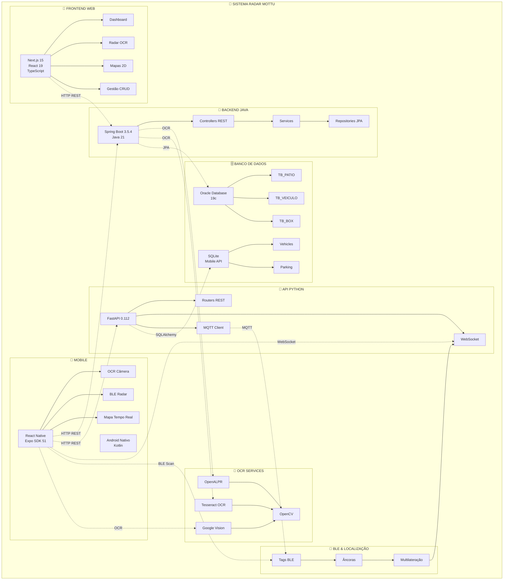
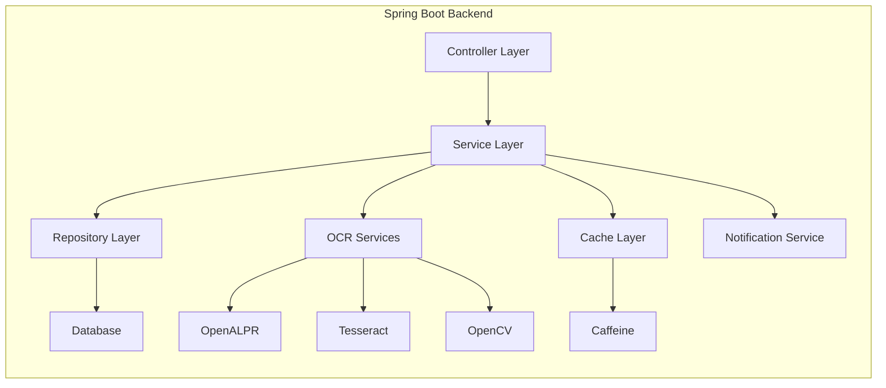
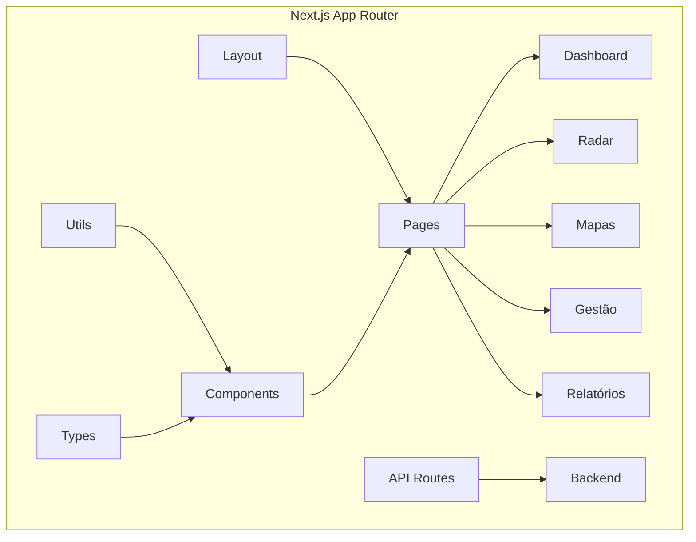
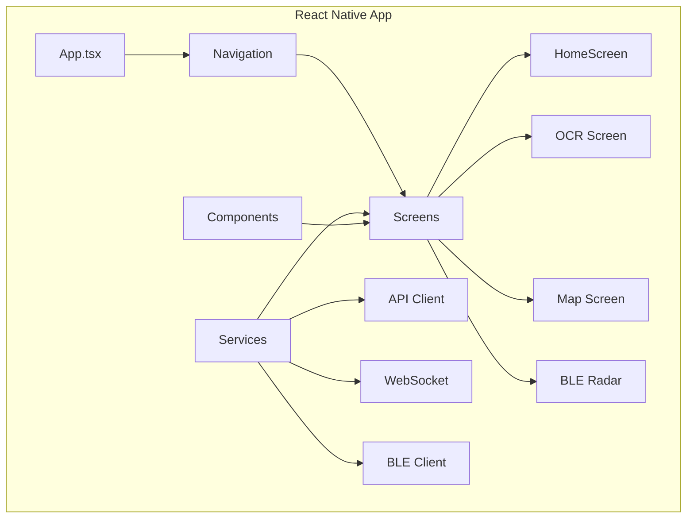
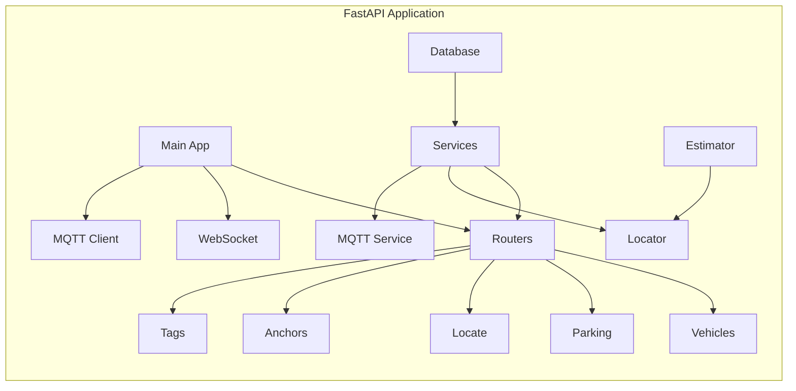
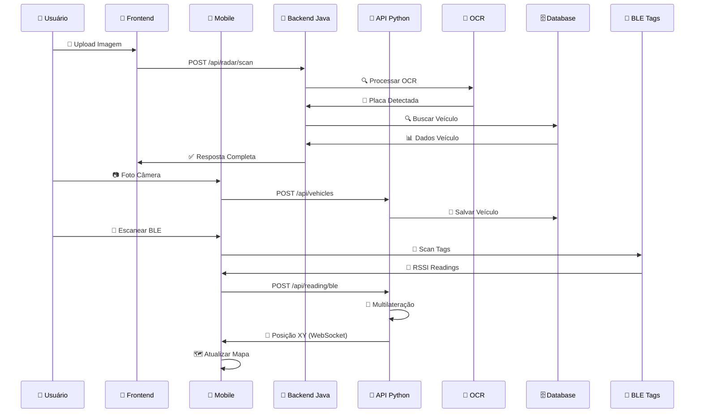
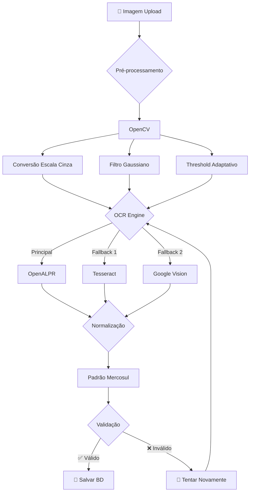
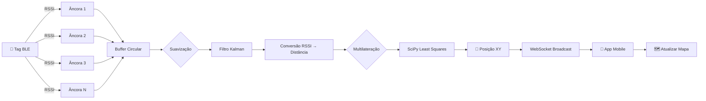
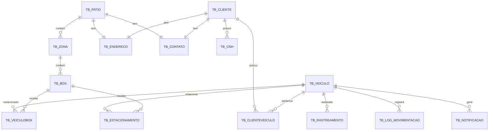

# 🚀 Sistema Radar Mottu - Gestão Inteligente de Estacionamento

<div align="center">


**Sistema completo de gestão inteligente de estacionamento para motocicletas**

*Desenvolvido para o Challenge FIAP 2025 pela equipe Metamind Solutions*

</div>

---

## 📋 Índice de Navegação

- [🎯 Visão Geral](#-visão-geral)
- [👥 Equipe de Desenvolvimento](#-equipe-de-desenvolvimento)
- [🏗️ Arquitetura Completa do Sistema](#️-arquitetura-completa-do-sistema)
  - [Diagrama Geral de Arquitetura](#diagrama-geral-de-arquitetura)
  - [Arquitetura do Backend Java](#arquitetura-do-backend-java)
  - [Arquitetura do Frontend Next.js](#arquitetura-do-frontend-nextjs)
  - [Arquitetura Mobile React Native](#arquitetura-mobile-react-native)
  - [Arquitetura API Python FastAPI](#arquitetura-api-python-fastapi)
  - [Fluxo de Dados Completo](#fluxo-de-dados-completo)
  - [Fluxo OCR e Reconhecimento de Placas](#fluxo-ocr-e-reconhecimento-de-placas)
  - [Fluxo de Localização BLE](#fluxo-de-localização-ble)
- [⚙️ Stack Tecnológica Completa](#️-stack-tecnológica-completa)
  - [Backend Java/Spring Boot](#backend-javaspring-boot)
  - [Frontend Next.js/React](#frontend-nextjsreact)
  - [Mobile React Native/Expo](#mobile-react-nativeexpo)
  - [API Python FastAPI](#api-python-fastapi)
  - [Servidor OCR Node.js](#servidor-ocr-nodejs)
  - [Banco de Dados Oracle](#banco-de-dados-oracle)
  - [Tecnologias de OCR e IA](#tecnologias-de-ocr-e-ia)
- [📊 Estrutura Completa do Projeto](#-estrutura-completa-do-projeto)
  - [Estrutura de Diretórios Raiz](#estrutura-de-diretórios-raiz)
  - [Backend Java (mottu-gradle)](#backend-java-mottu-gradle)
  - [Frontend Next.js (mottu-web)](#frontend-nextjs-mottu-web)
  - [Mobile React Native (radarmotu-app)](#mobile-react-native-radarmotu-app)
  - [API Python (radarmotu-api)](#api-python-radarmotu-api)
  - [Servidor OCR Node.js](#servidor-ocr-nodejs-1)
- [🚀 Funcionalidades Detalhadas](#-funcionalidades-detalhadas)
  - [Sistema OCR Multi-Engine](#sistema-ocr-multi-engine)
  - [Sistema de Localização BLE](#sistema-de-localização-ble)
  - [Gestão Hierárquica de Pátios](#gestão-hierárquica-de-pátios)
  - [Dashboard e Analytics](#dashboard-e-analytics)
  - [Sistema de Notificações](#sistema-de-notificações)
  - [Relatórios Avançados](#relatórios-avançados)
- [🗄️ Banco de Dados Completo](#️-banco-de-dados-completo)
  - [Modelo de Dados](#modelo-de-dados)
  - [Estrutura de Tabelas](#estrutura-de-tabelas)
  - [Relacionamentos](#relacionamentos)
  - [Scripts SQL](#scripts-sql)
- [🔧 Configuração e Instalação](#-configuração-e-instalação)
  - [Pré-requisitos](#pré-requisitos)
  - [Instalação do Backend](#instalação-do-backend)
  - [Instalação do Frontend](#instalação-do-frontend)
  - [Instalação Mobile](#instalação-mobile)
  - [Instalação API Python](#instalação-api-python)
  - [Instalação Servidor OCR](#instalação-servidor-ocr)
- [📚 Documentação da API](#-documentação-da-api)
  - [Endpoints Backend Java](#endpoints-backend-java)
  - [Endpoints API Python](#endpoints-api-python)
  - [Swagger/OpenAPI](#swaggeropenapi)
- [🔐 Segurança](#-segurança)
- [📈 Monitoramento e Logs](#-monitoramento-e-logs)
- [🧪 Testes](#-testes)
- [🚀 Deploy](#-deploy)
- [👥 Contribuição](#-contribuição)
- [📄 Licença](#-licença)

---

## 🎯 Visão Geral

O **Sistema Radar Mottu** é uma solução completa e avançada de gestão inteligente de estacionamento para motocicletas, desenvolvido para o **Challenge FIAP 2025**. O sistema integra tecnologias de ponta incluindo:

- 🤖 **OCR Multi-Engine** (OpenALPR, Tesseract, Google Cloud Vision)
- 📍 **Localização em Tempo Real** via BLE (Bluetooth Low Energy)
- 🗺️ **Mapas 2D Interativos** com visualização espacial
- 📊 **Dashboard em Tempo Real** com métricas operacionais
- 🏗️ **Gestão Hierárquica** de Pátios → Zonas → Boxes
- 📱 **Aplicações Móveis** (React Native + Android Nativo)
- 🔄 **APIs RESTful** (Java Spring Boot + Python FastAPI)
- 📈 **Analytics e Relatórios** avançados

### 🎪 Características Principais

- 🏍️ **Gestão Completa de Frota** com tags BLE automáticas
- 📍 **Localização em Tempo Real** de veículos estacionados
- 🔍 **Reconhecimento Automático de Placas** via OCR multi-engine
- 🗺️ **Mapas 2D Interativos** para visualização espacial
- 📊 **Dashboard em Tempo Real** com métricas operacionais
- 🏗️ **Gestão Hierárquica** de Pátios → Zonas → Boxes
- 📱 **Interface Responsiva** para desktop, tablet e mobile
- 🤖 **Integração com IA** para processamento inteligente
- 💬 **Sistema de Feedback** com 8 provedores de email
- 📈 **Relatórios Avançados** com análises preditivas
- 🔔 **Sistema de Notificações** em tempo real
- 📄 **Exportação PDF** de relatórios

---

## 👥 Equipe de Desenvolvimento

<div align="center">

| Nome | RM | Turma | GitHub | LinkedIn |
|------|-----|-------|--------|----------|
| **Paulo André Carminati** | 557881 | 2-TDSPZ | [](https://github.com/carmipa) | [](https://www.linkedin.com/in/paulo-andr%C3%A9-carminati-47712340/) |
| **Arthur Bispo de Lima** | 557568 | 2-TDSPV | [](https://github.com/ArthurBispo00) | [](https://www.linkedin.com/in/arthur-bispo-41364b207/) |
| **João Paulo Moreira** | 557808 | 2-TDSPV | [](https://github.com/joao1015) | [](https://www.linkedin.com/in/joao1015/) |

**Equipe Metamind Solutions - Finalistas Challenge FIAP 2025**

</div>

---

## 🏗️ Arquitetura Completa do Sistema

### Diagrama Geral de Arquitetura



### Arquitetura do Backend Java



### Arquitetura do Frontend Next.js



### Arquitetura Mobile React Native



### Arquitetura API Python FastAPI



### Fluxo de Dados Completo



### Fluxo OCR e Reconhecimento de Placas



### Fluxo de Localização BLE



---

## ⚙️ Stack Tecnológica Completa

### Backend Java/Spring Boot

<p align="center">
  
  
  
  
  
  
  
  
  
  
  
  
  
  
  
</p>

**Principais Dependências:**
- `spring-boot-starter-web` - APIs REST
- `spring-boot-starter-data-jpa` - Persistência
- `spring-boot-starter-webflux` - Programação Reativa
- `spring-boot-starter-cache` - Sistema de Cache
- `spring-boot-starter-validation` - Validação
- `ojdbc11` - Driver Oracle
- `mapstruct` - Mapeamento DTO
- `lombok` - Redução de Boilerplate
- `caffeine` - Cache de Alta Performance
- `springdoc-openapi` - Documentação Swagger

### Frontend Next.js/React

<p align="center">
  
  
  
  
  
  
  
  
  
  
  
  
  
  
  
  
</p>

**Principais Dependências:**
- `next` - Framework React
- `react` / `react-dom` - Biblioteca UI
- `typescript` - Tipagem estática
- `tailwindcss` - Framework CSS
- `axios` - Cliente HTTP
- `leaflet` / `react-leaflet` - Mapas interativos
- `recharts` - Gráficos e visualizações
- `jspdf` / `html2canvas` - Exportação PDF
- `tesseract.js` - OCR no cliente

### Mobile React Native/Expo

<p align="center">
  
  
  
  
  
  
  
  
  
  
</p>

**Principais Dependências:**
- `expo` - Framework React Native
- `react-native` - Plataforma móvel
- `@react-navigation` - Navegação
- `react-native-ble-plx` - BLE scanning
- `expo-image-picker` - Câmera/Galeria
- `@react-native-async-storage` - Storage local

### API Python FastAPI

<p align="center">
  
  
  
  
  
  
  
  
  
  
  
</p>

**Principais Dependências:**
- `fastapi` - Framework web assíncrono
- `uvicorn` - Servidor ASGI
- `sqlalchemy` - ORM
- `pydantic` - Validação de dados
- `scipy` - Cálculos científicos (multilateração)
- `filterpy` - Filtros Kalman
- `paho-mqtt` - Cliente MQTT

### Servidor OCR Node.js

<p align="center">
  
  
  
  
</p>

### Banco de Dados Oracle

<p align="center">
  
  
  
</p>

### Tecnologias de OCR e IA

<p align="center">
  
  
  
  
  
</p>

---

## 📊 Estrutura Completa do Projeto

### Estrutura de Diretórios Raiz

```
NEXT-2025/
├── 📁 JAVA/                              # Backend Java + Frontend Next.js
│   ├── 📁 mottu-api-restful/
│   │   ├── 📁 mottu-gradle/              # Backend Spring Boot
│   │   ├── 📁 mottu-web/                 # Frontend Next.js
│   │   ├── 📁 backup/                    # Backup do frontend
│   │   └── 📁 BD/                        # Scripts SQL do banco
│   ├── 📁 qrcod-app.png                  # QR Code do app
│   └── 📄 README.md
├── 📁 mobile/                            # Aplicações Mobile
│   ├── 📁 App-RadarMotu/
│   │   ├── 📁 radarmotu-api/             # API Python FastAPI
│   │   ├── 📁 radarmotu-app/             # App React Native Expo
│   │   └── 📄 README.md
│   ├── 📁 next/                          # App Android Nativo Kotlin
│   └── 📁 servidor_OCR/                  # Servidor OCR Node.js
├── 📁 bd/                                # Scripts SQL
│   ├── 📄 sprint4.sql
│   └── 📄 relacaoDireta
└── 📄 README.md                          # Este arquivo
```

### Backend Java (mottu-gradle)

```
mottu-gradle/
├── 📁 src/
│   ├── 📁 main/
│   │   ├── 📁 java/br/com/fiap/mottu/
│   │   │   ├── ☕ MottuApplication.java    # Ponto de entrada
│   │   │   ├── 📁 config/                  # Configurações
│   │   │   │   ├── 📄 CacheConfig.java
│   │   │   │   ├── 📄 CorsConfig.java
│   │   │   │   ├── 📄 EncodingConfig.java
│   │   │   │   ├── 📄 LoggingConfig.java
│   │   │   │   ├── 📄 OpenApiConfig.java
│   │   │   │   ├── 📄 OpenCvLoader.java
│   │   │   │   ├── 📄 PortManager.java
│   │   │   │   └── 📄 SwaggerBrowserLauncher.java
│   │   │   ├── 📁 controller/              # Controllers REST
│   │   │   │   ├── 📄 BoxController.java
│   │   │   │   ├── 📄 ClienteController.java
│   │   │   │   ├── 📄 CnhController.java
│   │   │   │   ├── 📄 ContatoController.java
│   │   │   │   ├── 📄 DashboardController.java
│   │   │   │   ├── 📄 EnderecoController.java
│   │   │   │   ├── 📄 EstacionamentoController.java
│   │   │   │   ├── 📄 HealthController.java
│   │   │   │   ├── 📄 MapGlobalController.java
│   │   │   │   ├── 📄 NotificacaoController.java
│   │   │   │   ├── 📄 PatioController.java
│   │   │   │   ├── 📄 RadarController.java
│   │   │   │   ├── 📄 RastreamentoController.java
│   │   │   │   ├── 📄 VagaController.java
│   │   │   │   ├── 📄 VeiculoController.java
│   │   │   │   ├── 📄 VeiculoStreamController.java
│   │   │   │   ├── 📄 ZonaController.java
│   │   │   │   ├── 📁 dashboard/            # Dashboard controllers
│   │   │   │   ├── 📁 relatorio/           # Relatórios controllers
│   │   │   │   └── 📁 relatorios/         # Mais relatórios
│   │   │   ├── 📁 service/                 # Lógica de negócio
│   │   │   │   ├── 📄 BoxService.java
│   │   │   │   ├── 📄 ClienteService.java
│   │   │   │   ├── 📄 CnhService.java
│   │   │   │   ├── 📄 ContatoService.java
│   │   │   │   ├── 📄 DashboardService.java
│   │   │   │   ├── 📄 EnderecoService.java
│   │   │   │   ├── 📄 EstacionamentoService.java
│   │   │   │   ├── 📄 LogMovimentacaoService.java
│   │   │   │   ├── 📄 MapGlobalService.java
│   │   │   │   ├── 📄 NotificacaoService.java
│   │   │   │   ├── 📄 PatioService.java
│   │   │   │   ├── 📄 RastreamentoService.java
│   │   │   │   ├── 📄 RelatorioService.java
│   │   │   │   ├── 📄 VagaOracleService.java
│   │   │   │   ├── 📄 VeiculoService.java
│   │   │   │   ├── 📄 ZonaService.java
│   │   │   │   ├── 📁 ocr/                 # Serviços OCR
│   │   │   │   │   ├── 📄 OcrSessionManager.java
│   │   │   │   │   ├── 📄 OpenAlprService.java
│   │   │   │   │   ├── 📄 PlateRecognizer.java
│   │   │   │   │   ├── 📄 PlateUtils.java
│   │   │   │   │   └── 📄 TesseractService.java
│   │   │   │   ├── 📁 dashboard/          # Serviços dashboard
│   │   │   │   ├── 📁 datatable/          # Serviços datatable
│   │   │   │   ├── 📁 relatorios/         # Serviços relatórios
│   │   │   │   └── 📁 core/               # Serviços core
│   │   │   ├── 📁 repository/             # Repositories JPA
│   │   │   │   ├── 📄 BoxRepository.java
│   │   │   │   ├── 📄 ClienteRepository.java
│   │   │   │   ├── 📄 CnhRepository.java
│   │   │   │   ├── 📄 ContatoRepository.java
│   │   │   │   ├── 📄 DashboardStatsRepository.java
│   │   │   │   ├── 📄 EnderecoRepository.java
│   │   │   │   ├── 📄 LogMovimentacaoRepository.java
│   │   │   │   ├── 📄 MapGlobalRepository.java
│   │   │   │   ├── 📄 NotificacaoRepository.java
│   │   │   │   ├── 📄 PatioRepository.java
│   │   │   │   ├── 📄 RastreamentoRepository.java
│   │   │   │   ├── 📄 VeiculoRepository.java
│   │   │   │   ├── 📄 ZonaRepository.java
│   │   │   │   └── 📁 relacionamento/     # Repositories relacionamentos
│   │   │   ├── 📁 model/                  # Entidades JPA
│   │   │   │   ├── 📄 Box.java
│   │   │   │   ├── 📄 Cliente.java
│   │   │   │   ├── 📄 Cnh.java
│   │   │   │   ├── 📄 Contato.java
│   │   │   │   ├── 📄 Endereco.java
│   │   │   │   ├── 📄 LogMovimentacao.java
│   │   │   │   ├── 📄 Notificacao.java
│   │   │   │   ├── 📄 Patio.java
│   │   │   │   ├── 📄 Rastreamento.java
│   │   │   │   ├── 📄 Veiculo.java
│   │   │   │   ├── 📄 Zona.java
│   │   │   │   ├── 📄 CategoriaNotificacao.java
│   │   │   │   ├── 📄 PrioridadeNotificacao.java
│   │   │   │   ├── 📄 TipoNotificacao.java
│   │   │   │   └── 📁 relacionamento/      # Entidades relacionamento
│   │   │   ├── 📁 dto/                    # Data Transfer Objects
│   │   │   │   ├── 📁 box/                # DTOs Box
│   │   │   │   ├── 📁 cliente/            # DTOs Cliente
│   │   │   │   ├── 📁 cnh/                # DTOs CNH
│   │   │   │   ├── 📁 contato/            # DTOs Contato
│   │   │   │   ├── 📁 dashboard/          # DTOs Dashboard
│   │   │   │   ├── 📁 datatable/         # DTOs DataTable
│   │   │   │   ├── 📁 endereco/           # DTOs Endereco
│   │   │   │   ├── 📁 estacionamento/    # DTOs Estacionamento
│   │   │   │   ├── 📁 mapglobal/          # DTOs Mapa Global
│   │   │   │   ├── 📁 notificacao/        # DTOs Notificação
│   │   │   │   ├── 📁 patio/             # DTOs Pátio
│   │   │   │   ├── 📁 rastreamento/       # DTOs Rastreamento
│   │   │   │   ├── 📁 relatorio/         # DTOs Relatórios
│   │   │   │   ├── 📁 veiculo/           # DTOs Veículo
│   │   │   │   └── 📁 zona/              # DTOs Zona
│   │   │   ├── 📁 mapper/                 # MapStruct Mappers
│   │   │   │   ├── 📄 BoxMapper.java
│   │   │   │   ├── 📄 ClienteMapper.java
│   │   │   │   ├── 📄 CnhMapper.java
│   │   │   │   ├── 📄 ContatoMapper.java
│   │   │   │   ├── 📄 EnderecoMapper.java
│   │   │   │   ├── 📄 LogMovimentacaoMapper.java
│   │   │   │   ├── 📄 PatioMapper.java
│   │   │   │   ├── 📄 RastreamentoMapper.java
│   │   │   │   ├── 📄 VeiculoMapper.java
│   │   │   │   └── 📄 ZonaMapper.java
│   │   │   ├── 📁 filter/                 # Filtros de busca
│   │   │   │   ├── 📄 BoxFilter.java
│   │   │   │   ├── 📄 ClienteFilter.java
│   │   │   │   ├── 📄 CnhFilter.java
│   │   │   │   ├── 📄 ContatoFilter.java
│   │   │   │   ├── 📄 EnderecoFilter.java
│   │   │   │   ├── 📄 PatioFilter.java
│   │   │   │   ├── 📄 RastreamentoFilter.java
│   │   │   │   ├── 📄 VeiculoFilter.java
│   │   │   │   ├── 📄 ZonaFilter.java
│   │   │   │   └── 📁 relatorios/        # Filtros relatórios
│   │   │   ├── 📁 specification/          # Specifications JPA
│   │   │   ├── 📁 exception/             # Exceções customizadas
│   │   │   │   ├── 📄 DateRangeTooLargeException.java
│   │   │   │   ├── 📄 DuplicatedResourceException.java
│   │   │   │   ├── 📄 InvalidInputException.java
│   │   │   │   ├── 📄 ReportGenerationException.java
│   │   │   │   ├── 📄 ReportNotReadyException.java
│   │   │   │   ├── 📄 ResourceNotFoundException.java
│   │   │   │   ├── 📄 UnsupportedAggregationException.java
│   │   │   │   └── 📁 handler/            # Exception handlers
│   │   │   ├── 📁 external/              # Integrações externas
│   │   │   │   └── 📁 viacep/            # API ViaCEP
│   │   │   ├── 📁 util/                  # Utilitários
│   │   │   │   └── 📄 PageableUtil.java
│   │   │   └── 📁 validation/            # Validações
│   │   │       └── 📄 ValidationGroups.java
│   │   └── 📁 resources/
│   │       ├── 📄 application.properties
│   │       └── 📁 static/
│   └── 📁 test/                           # Testes
├── 📁 documentacao/                      # Documentação técnica
│   ├── 📄 HELP.md
│   ├── 📄 OPENCV_OPENALPR_SETUP.md
│   ├── 📄 PORT_MANAGEMENT.md
│   ├── 📄 safe_database_migration_plan.md
│   ├── 📄 SISTEMA_OCR_CONFIGURADO.md
│   └── 📄 SWAGGER_DOCUMENTATION.md
├── 📄 build.gradle                        # Configuração Gradle
├── 📄 settings.gradle                    # Settings Gradle
├── 📄 gradlew                            # Gradle Wrapper (Unix)
├── 📄 gradlew.bat                        # Gradle Wrapper (Windows)
└── 📄 README.md                          # Documentação
```

### Frontend Next.js (mottu-web)

```
mottu-web/
├── 📁 src/
│   ├── 📁 app/                           # Next.js App Router
│   │   ├── 📄 layout.tsx                 # Layout raiz
│   │   ├── 📄 page.tsx                  # Página inicial
│   │   ├── 📄 globals.css               # Estilos globais
│   │   ├── 📁 dashboard/                # Dashboard
│   │   ├── 📁 radar/                    # Operações Radar
│   │   │   ├── 📄 page.tsx
│   │   │   ├── 📁 armazenar/            # Armazenar moto
│   │   │   ├── 📁 buscar/               # Buscar moto
│   │   │   ├── 📁 localizar/           # Localizar por placa
│   │   │   ├── 📁 mobile-upload/       # Upload mobile
│   │   │   └── 📁 app-download/        # Download app
│   │   ├── 📁 clientes/                 # Gestão clientes
│   │   │   ├── 📁 listar/
│   │   │   ├── 📁 cadastrar/
│   │   │   ├── 📁 buscar/
│   │   │   ├── 📁 alterar/
│   │   │   ├── 📁 deletar/
│   │   │   └── 📁 detalhes/
│   │   ├── 📁 veiculo/                  # Gestão veículos
│   │   │   ├── 📁 listar/
│   │   │   ├── 📁 cadastrar/
│   │   │   ├── 📁 buscar/
│   │   │   ├── 📁 alterar/
│   │   │   ├── 📁 deletar/
│   │   │   └── 📁 detalhes/
│   │   ├── 📁 patio/                    # Gestão pátios
│   │   │   ├── 📁 listar/
│   │   │   ├── 📁 cadastrar/
│   │   │   ├── 📁 buscar/
│   │   │   ├── 📁 alterar/
│   │   │   ├── 📁 deletar/
│   │   │   ├── 📁 detalhes/
│   │   │   └── 📁 novo-assistente/      # Wizard criação
│   │   ├── 📁 zona/                     # Gestão zonas
│   │   │   ├── 📁 listar/
│   │   │   ├── 📁 cadastrar/
│   │   │   ├── 📁 buscar/
│   │   │   ├── 📁 alterar/
│   │   │   └── 📁 detalhes/
│   │   ├── 📁 box/                      # Gestão boxes
│   │   │   ├── 📁 listar/
│   │   │   ├── 📁 cadastrar/
│   │   │   ├── 📁 buscar/
│   │   │   ├── 📁 deletar/
│   │   │   ├── 📁 detalhes/
│   │   │   └── 📁 gerar/                # Gerar em lote
│   │   ├── 📁 vagas/                    # Vagas e mapas
│   │   │   ├── 📁 buscar/
│   │   │   └── 📁 mapa/
│   │   ├── 📁 mapa-box/                 # Mapa de boxes
│   │   │   └── 📁 types/
│   │   ├── 📁 mapa-2d/                  # Mapa 2D
│   │   ├── 📁 mapas/                    # Mapas diversos
│   │   ├── 📁 gerenciamento-patio/      # Gerenciamento unificado
│   │   │   ├── 📁 patio/
│   │   │   ├── 📁 zona/
│   │   │   └── 📁 box/
│   │   ├── 📁 relatorios/               # Relatórios
│   │   │   ├── 📁 ocupacao-diaria/
│   │   │   ├── 📁 movimentacao/
│   │   │   ├── 📁 analytics/
│   │   │   ├── 📁 comportamental/
│   │   │   ├── 📁 dashboard-ia/
│   │   │   ├── 📁 heatmap/
│   │   │   ├── 📁 manutencao/
│   │   │   ├── 📁 notificacoes/
│   │   │   └── 📁 performance-sistema/
│   │   ├── 📁 contato/                  # Contato
│   │   ├── 📁 ajuda/                   # Ajuda e feedback
│   │   ├── 📁 mapa-do-site/            # Mapa do site
│   │   ├── 📁 unidades/                # Unidades organizacionais
│   │   └── 📁 api/                     # API Routes Next.js
│   │       ├── 📁 geocode/
│   │       ├── 📁 mapa-global/
│   │       ├── 📁 patios/
│   │       └── 📁 vagas/
│   ├── 📁 components/                   # Componentes React
│   │   ├── 📄 nav-bar.tsx              # Barra navegação
│   │   ├── 📄 HierarchicalNavigation.tsx
│   │   ├── 📄 LeafletMap.tsx           # Mapa Leaflet
│   │   ├── 📄 OcrScanner.tsx           # Scanner OCR
│   │   ├── 📄 PatioSelector.tsx        # Seletor pátio
│   │   ├── 📄 ApiTestComponent.tsx     # Teste API
│   │   ├── 📄 ContactMapSection.tsx    # Contato com mapa
│   │   ├── 📄 CrudScaffold.tsx         # Scaffold CRUD
│   │   ├── 📁 analytics/                # Componentes analytics
│   │   ├── 📁 dashboard/               # Componentes dashboard
│   │   ├── 📁 exportapdf/              # Exportação PDF
│   │   ├── 📁 heatmap/                 # Heatmap
│   │   ├── 📁 mapa-box/                # Componentes mapa
│   │   ├── 📁 mapas-mottu/             # Mapas específicos Mottu
│   │   ├── 📁 notifications/           # Sistema notificações
│   │   ├── 📁 relatorios/               # Componentes relatórios
│   │   ├── 📁 wizard-steps/            # Wizard steps
│   │   └── 📁 ui/                      # Componentes UI base
│   ├── 📁 lib/                         # Bibliotecas utilitárias
│   │   ├── 📄 motoData.ts
│   │   ├── 📄 patioConfig.ts
│   │   └── 📄 utils.ts
│   ├── 📁 types/                       # TypeScript types
│   │   ├── 📄 cliente.d.ts
│   │   ├── 📄 veiculo.d.ts
│   │   ├── 📄 patio.d.ts
│   │   ├── 📄 zona.d.ts
│   │   ├── 📄 box.d.ts
│   │   ├── 📄 endereco.ts
│   │   ├── 📄 contato.ts
│   │   ├── 📄 datatable.ts
│   │   ├── 📄 common.d.ts
│   │   └── 📁 styles/                  # Tipos de estilos
│   ├── 📁 utils/                       # Utilitários
│   │   ├── 📄 api.ts                   # Cliente API
│   │   ├── 📄 cache.ts                 # Sistema cache
│   │   ├── 📄 plateValidation.ts       # Validação placas
│   │   ├── 📄 relatorioFilters.ts      # Filtros relatórios
│   │   ├── 📁 api/                     # Utilitários API
│   │   │   ├── 📄 dashboard.ts
│   │   │   └── 📄 relatorios.ts
│   │   └── 📁 map/                     # Utilitários mapas
│   │       └── 📄 geometry.ts
│   ├── 📁 cache/                      # Sistema cache
│   │   ├── 📄 cache.ts
│   │   ├── 📄 index.ts
│   │   └── 📄 useCache.ts
│   ├── 📁 config/                      # Configurações
│   │   ├── 📄 api.ts                   # Config API
│   │   ├── 📄 mapasDisponiveis.ts      # Mapas disponíveis
│   │   └── 📄 patioLayouts.ts          # Layouts pátios
│   └── 📁 styles/                      # Estilos
│       └── 📄 neumorphic.css           # Estilo neumórfico
├── 📁 public/                          # Assets estáticos
│   └── 📁 fotos-equipe/                # Fotos equipe
│       ├── 📄 arthur.jpg
│       ├── 📄 joao.jpg
│       ├── 📄 paulo.jpg
│       ├── 📄 fundo_pcar.png
│       └── 📄 qrcod-app.png
├── 📄 package.json                     # Dependências NPM
├── 📄 tsconfig.json                    # Config TypeScript
├── 📄 next.config.ts                  # Config Next.js
├── 📄 tailwind.config.ts              # Config Tailwind
├── 📄 postcss.config.mjs              # Config PostCSS
├── 📄 eslint.config.mjs               # Config ESLint
├── 📄 components.json                 # Config componentes
└── 📄 README.md                        # Documentação
```

### Mobile React Native (radarmotu-app)

```
radarmotu-app/
├── 📁 android/                         # Projeto Android nativo
│   ├── 📁 app/
│   │   ├── 📁 src/
│   │   │   ├── 📁 main/
│   │   │   │   ├── 📁 java/com/seuorg/radarmotu/
│   │   │   │   ├── 📁 res/              # Recursos Android
│   │   │   │   └── 📄 AndroidManifest.xml
│   │   │   └── 📁 debug/
│   │   ├── 📄 build.gradle
│   │   └── 📄 proguard-rules.pro
│   ├── 📄 build.gradle
│   └── 📁 gradle/
├── 📁 assets/                          # Assets do app
│   ├── 📄 radarmotu-logo.png
│   └── 📄 metamind-logo.png
├── 📁 components/                      # Componentes React Native
│   └── 📄 VehicleCard.tsx
├── 📁 screens/                         # Telas do app
│   ├── 📄 HomeScreen.tsx               # Tela inicial
│   ├── 📄 Cadastro.tsx                 # Cadastro veículo
│   ├── 📄 Listagem.tsx                 # Lista veículos
│   ├── 📄 MapaScreen.tsx               # Mapa do pátio
│   ├── 📄 OperacoesPorPlaca.tsx        # OCR de placas
│   ├── 📄 RadarProximidade.tsx         # Radar BLE
│   └── 📄 SobreNosScreen.tsx           # Sobre nós
├── 📁 services/                        # Serviços
│   ├── 📄 api.ts                      # Cliente API REST
│   └── 📄 ws.ts                       # WebSocket client
├── 📁 config/                          # Configurações
│   └── 📄 env.ts                      # Variáveis ambiente
├── 📄 App.tsx                          # Componente raiz
├── 📄 package.json                    # Dependências
├── 📄 tsconfig.json                   # Config TypeScript
├── 📄 app.json                        # Config Expo
├── 📄 eas.json                        # Config EAS Build
└── 📄 README.md                        # Documentação
```

### API Python (radarmotu-api)

```
radarmotu-api/
├── 📁 app/
│   ├── 📄 main.py                      # FastAPI app
│   ├── 📄 database.py                  # SQLAlchemy setup
│   ├── 📄 models.py                    # SQLAlchemy models
│   ├── 📄 schemas.py                   # Pydantic schemas
│   ├── 📄 security.py                  # Autenticação JWT
│   ├── 📄 estimator.py                # Multilateração
│   ├── 📄 anchors.json                 # Config âncoras
│   ├── 📁 routers/                     # Routers REST
│   │   ├── 📄 vehicles.py             # CRUD veículos
│   │   ├── 📄 parking.py              # Estacionamento
│   │   ├── 📄 locate.py               # Localização
│   │   ├── 📄 anchors.py              # Âncoras
│   │   ├── 📄 tags.py                 # Tags BLE
│   │   └── 📄 auth.py                 # Autenticação
│   └── 📁 services/                    # Serviços
│       ├── 📄 locator.py               # Serviço localização
│       └── 📄 mqtt.py                  # Cliente MQTT
├── 📄 requirements.txt                 # Dependências Python
├── 📄 uvicorn.sh                       # Script startup
└── 📄 README.md                        # Documentação
```

### Servidor OCR Node.js

```
servidor_OCR/
├── 📄 index.js                         # Servidor Express
├── 📄 package.json                     # Dependências
└── 📄 README.md                        # Documentação
```

---

## 🚀 Funcionalidades Detalhadas

### Sistema OCR Multi-Engine

O sistema implementa múltiplos engines de OCR com fallback automático:

#### 🔍 OpenALPR (Principal)
- **Função**: Reconhecimento principal de placas padrão Mercosul
- **Configuração**: Via linha de comando
- **Local**: 
  - Windows: `C:\openalpr_64\alpr.exe`
  - Linux: `/usr/local/bin/alpr`
- **Região**: `eu` (compatível Mercosul)
- **Confiança mínima**: 70%

#### 📝 Tesseract OCR (Fallback 1)
- **Função**: Reconhecimento secundário caso OpenALPR falhe
- **Biblioteca**: `tess4j:5.11.0`
- **Idiomas**: Português + Inglês
- **Pré-processamento**: OpenCV

#### 🌐 Google Cloud Vision (Fallback 2)
- **Função**: OCR via API cloud
- **Servidor**: Node.js separado
- **Endpoint**: `POST /upload`
- **Heurística**: Correção padrão Mercosul

#### 📸 OpenCV (Pré-processamento)
- **Função**: Melhoria de qualidade de imagem
- **Biblioteca**: `org.openpnp:opencv:4.9.0-0`
- **Processos**: 
  - Conversão escala cinza
  - Blur gaussiano
  - Threshold adaptativo
  - Morfologia

### Sistema de Localização BLE

Implementação completa de localização indoor via BLE:

#### 📡 Componentes
1. **Tags BLE**: Dispositivos anexados aos veículos
2. **Âncoras**: Pontos fixos com posição conhecida
3. **Multilateração**: Cálculo de posição via SciPy
4. **Filtros Kalman**: Suavização de leituras RSSI
5. **WebSocket**: Broadcast em tempo real

#### 🔄 Fluxo
1. **Scan BLE**: App mobile escaneia tags próximas
2. **Leituras RSSI**: Múltiplas âncoras recebem sinais
3. **Buffer Circular**: Armazena últimas 5 leituras por âncora
4. **Filtro Kalman**: Suaviza ruído nas leituras
5. **Conversão RSSI → Distância**: Modelo de path loss
6. **Multilateração**: SciPy least squares
7. **WebSocket**: Envia posição calculada
8. **Atualização Mapa**: App renderiza posição em tempo real

### Gestão Hierárquica de Pátios

Sistema completo de gestão hierárquica:

```
🏢 Pátio
  └── 🗺️ Zona 1
      ├── 📦 Box 1
      ├── 📦 Box 2
      └── 📦 Box 3
  └── 🗺️ Zona 2
      ├── 📦 Box 4
      └── 📦 Box 5
```

**Funcionalidades:**
- CRUD completo para cada nível
- Navegação hierárquica
- Visualização em mapas 2D
- Status de ocupação em tempo real
- Geração de boxes em lote
- Wizard de criação de pátio completo

### Dashboard e Analytics

Dashboard completo com métricas em tempo real:

- 📊 **Métricas Principais**:
  - Total de veículos
  - Total de clientes
  - Ocupação atual
  - Vagas disponíveis
  - Movimentações do dia

- 📈 **Gráficos**:
  - Ocupação diária (Pizza)
  - Movimentação temporal (Linha)
  - Heatmap de ocupação
  - Analytics comportamental

- 🔔 **Notificações**:
  - Sistema em tempo real
  - Múltiplas categorias
  - Prioridades
  - Histórico completo

### Sistema de Notificações

Sistema completo de notificações:

- **Categorias**: Operacional, Manutenção, Segurança, Sistema
- **Prioridades**: Baixa, Média, Alta, Crítica
- **Tipos**: Info, Warning, Error, Success
- **Delivery**: SSE (Server-Sent Events)
- **Interface**: Centro de notificações, Modais, Cards

### Relatórios Avançados

Múltiplos tipos de relatórios:

1. **Ocupação Diária**: Gráficos de pizza por dia
2. **Movimentação**: Análise temporal de entrada/saída
3. **Analytics**: Comportamental e preditivo
4. **Heatmap**: Visualização espacial de ocupação
5. **Manutenção**: Relatórios de manutenção
6. **Performance**: Métricas de sistema
7. **Exportação PDF**: Todos os relatórios exportáveis

---

## 🗄️ Banco de Dados Completo

### Modelo de Dados



### Estrutura de Tabelas

#### 🏢 TB_PATIO
- `ID_PATIO` (PK)
- `NOME`
- `OBSERVACAO`
- `DATA_CADASTRO`
- `STATUS`
- Relacionamento: TB_ENDERECO, TB_CONTATO

#### 🗺️ TB_ZONA
- `ID_ZONA` (PK)
- `ID_PATIO` (FK)
- `NOME`
- `OBSERVACAO`
- `DATA_CADASTRO`

#### 📦 TB_BOX
- `ID_BOX` (PK)
- `ID_ZONA` (FK)
- `CODIGO`
- `NOME`
- `STATUS` (LIVRE/OCUPADO)
- `DATA_ENTRADA`
- `DATA_SAIDA`
- `OBSERVACAO`
- `DATA_CADASTRO`

#### 👥 TB_CLIENTE
- `ID_CLIENTE` (PK)
- `NOME`
- `SOBRENOME`
- `CPF` (UNIQUE)
- `DATA_NASCIMENTO`
- `SEXO`
- `PROFISSAO`
- `ESTADO_CIVIL`
- `DATA_CADASTRO`
- `TB_ENDERECO_ID_ENDERECO` (FK)
- `TB_CONTATO_ID_CONTATO` (FK)

#### 🏍️ TB_VEICULO
- `ID_VEICULO` (PK)
- `PLACA` (UNIQUE)
- `RENAVAM` (UNIQUE)
- `CHASSI` (UNIQUE)
- `FABRICANTE`
- `MODELO`
- `MOTOR`
- `ANO`
- `COMBUSTIVEL`
- `STATUS`
- `STATUS_OPERACIONAL`
- `TAG_BLE_ID` (UNIQUE)
- `DATA_CADASTRO`

#### 📍 TB_ESTACIONAMENTO
- `ID_ESTACIONAMENTO` (PK)
- `ID_VEICULO` (FK)
- `ID_BOX` (FK)
- `DATA_ENTRADA`
- `DATA_SAIDA`
- `STATUS`

#### 🔗 TB_VEICULOBOX
- `ID_VEICULOBOX` (PK)
- `TB_VEICULO_ID_VEICULO` (FK)
- `TB_BOX_ID_BOX` (FK)
- `DATA_ENTRADA`
- `DATA_SAIDA`
- `STATUS`

#### 📡 TB_RASTREAMENTO
- `ID_RASTREAMENTO` (PK)
- `ID_VEICULO` (FK)
- `POSICAO_X`
- `POSICAO_Y`
- `TIMESTAMP`
- `PRECISAO`

#### 🔔 TB_NOTIFICACAO
- `ID_NOTIFICACAO` (PK)
- `TITULO`
- `MENSAGEM`
- `CATEGORIA`
- `PRIORIDADE`
- `TIPO`
- `DATA_CRIACAO`
- `DATA_LEITURA`
- `LIDA`

#### 📝 TB_LOG_MOVIMENTACAO
- `ID_LOG` (PK)
- `ID_VEICULO` (FK)
- `ID_BOX_ORIGEM`
- `ID_BOX_DESTINO`
- `TIPO_MOVIMENTACAO`
- `DATA_MOVIMENTACAO`
- `OBSERVACAO`

#### 📄 TB_CNH
- `ID_CNH` (PK)
- `ID_CLIENTE` (FK)
- `NUMERO`
- `CATEGORIA`
- `DATA_VALIDADE`

#### 📮 TB_ENDERECO
- `ID_ENDERECO` (PK)
- `CEP`
- `LOGRADOURO`
- `NUMERO`
- `BAIRRO`
- `CIDADE`
- `ESTADO`
- `PAIS`
- `COMPLEMENTO`
- `OBSERVACAO`

#### 📞 TB_CONTATO
- `ID_CONTATO` (PK)
- `EMAIL`
- `TELEFONE`
- `CELULAR`
- `OBSERVACAO`

### Relacionamentos

- **Pátio → Zona** (1:N)
- **Zona → Box** (1:N)
- **Cliente → Veículo** (N:N via TB_CLIENTEVEICULO)
- **Veículo → Box** (N:N via TB_VEICULOBOX)
- **Veículo → Estacionamento** (1:N)
- **Pátio → Endereço** (1:1)
- **Pátio → Contato** (1:1)
- **Cliente → Endereço** (1:1)
- **Cliente → Contato** (1:1)
- **Cliente → CNH** (1:N)

### Scripts SQL

Scripts disponíveis em:
- `bd/sprint4.sql` - Script principal
- `JAVA/mottu-api-restful/BD/` - Scripts adicionais

---

## 🔧 Configuração e Instalação

### Pré-requisitos

#### Backend Java
- ☕ **Java 21+** (JDK)
- 📦 **Gradle 8.5+**
- 🗄️ **Oracle Database 19c**
- 🔧 **Maven Central** (acesso)

#### Frontend Next.js
- 📦 **Node.js 20+**
- 📦 **NPM 9+** ou **Yarn**
- 🌐 **Navegador moderno**

#### Mobile
- 📦 **Node.js 18+**
- 📱 **Expo CLI**
- 🤖 **Android Studio** (para build nativo)
- 📱 **Dispositivo Android** ou **Emulador**

#### API Python
- 🐍 **Python 3.10+**
- 📦 **pip**
- 🔧 **SQLite** (incluído)

#### Servidor OCR
- 📦 **Node.js 18+**
- 🔑 **Google Cloud Vision API Key**

### Instalação do Backend

```bash
# 1. Clone o repositório
git clone <repository-url>
cd NEXT-2025/JAVA/mottu-api-restful/mottu-gradle

# 2. Configure o banco de dados Oracle
# Execute os scripts SQL em: bd/sprint4.sql

# 3. Configure application.properties
# Edite: src/main/resources/application.properties
# Configure: datasource, jpa, ocr paths

# 4. Instale dependências e build
./gradlew build

# 5. Execute a aplicação
./gradlew bootRun

# Ou use o JAR
java -jar build/libs/mottu-gradle-0.0.1-SNAPSHOT.jar
```

### Instalação do Frontend

```bash
# 1. Navegue para o diretório
cd JAVA/mottu-api-restful/mottu-web

# 2. Instale dependências
npm install

# 3. Configure variáveis de ambiente
# Crie: .env.local
NEXT_PUBLIC_API_BASE_URL=http://localhost:8080

# 4. Execute servidor desenvolvimento
npm run dev

# Acesse: http://localhost:3000
```

### Instalação Mobile

```bash
# 1. Navegue para o diretório
cd mobile/App-RadarMotu/radarmotu-app/radarmotu-app

# 2. Instale dependências
npm install

# 3. Configure API endpoint
# Edite: config/env.ts
export const API_BASE_URL = 'http://seu-servidor:8000'

# 4. Execute no dispositivo/emulador
npm run android

# Ou use Expo Go
expo start
```

### Instalação API Python

```bash
# 1. Navegue para o diretório
cd mobile/App-RadarMotu/radarmotu-api/radarmotu-api

# 2. Crie ambiente virtual
python -m venv venv
source venv/bin/activate  # Linux/Mac
venv\Scripts\activate     # Windows

# 3. Instale dependências
pip install -r requirements.txt

# 4. Execute servidor
uvicorn app.main:app --reload --port 8000

# Ou use script
bash app/uvicorn.sh
```

### Instalação Servidor OCR

```bash
# 1. Navegue para o diretório
cd mobile/servidor_OCR

# 2. Instale dependências
npm install

# 3. Configure Google Cloud Vision
# Exporte: GOOGLE_APPLICATION_CREDENTIALS=path/to/credentials.json

# 4. Execute servidor
node index.js
```

---

## 📚 Documentação da API

### Endpoints Backend Java

#### 👥 Clientes
```
GET    /api/clientes              # Listar (paginado)
GET    /api/clientes/search       # Buscar com filtros
POST   /api/clientes              # Criar
GET    /api/clientes/{id}         # Buscar por ID
PUT    /api/clientes/{id}          # Atualizar
DELETE /api/clientes/{id}          # Deletar
```

#### 🏍️ Veículos
```
GET    /api/veiculos              # Listar
GET    /api/veiculos/search      # Buscar
POST   /api/veiculos              # Criar
GET    /api/veiculos/{id}         # Buscar por ID
PUT    /api/veiculos/{id}         # Atualizar
DELETE /api/veiculos/{id}         # Deletar
GET    /api/veiculos/placa/{placa} # Buscar por placa
GET    /api/veiculos/proxima-tag-ble # Gerar próxima tag
```

#### 🏢 Pátios
```
GET    /api/patios                # Listar
GET    /api/patios/search         # Buscar
POST   /api/patios                # Criar
POST   /api/patios/completo       # Criar completo (wizard)
GET    /api/patios/{id}           # Buscar por ID
PUT    /api/patios/{id}           # Atualizar
DELETE /api/patios/{id}           # Deletar
GET    /api/patios/{id}/zonas     # Zonas do pátio
GET    /api/patios/{id}/boxes     # Boxes do pátio
```

#### 🗺️ Zonas
```
GET    /api/zonas                 # Listar
GET    /api/zonas/search          # Buscar
POST   /api/zonas                 # Criar
GET    /api/zonas/{id}            # Buscar por ID
PUT    /api/zonas/{id}            # Atualizar
DELETE /api/zonas/{id}            # Deletar
```

#### 📦 Boxes
```
GET    /api/boxes                 # Listar
GET    /api/boxes/search          # Buscar
POST   /api/boxes                 # Criar
POST   /api/boxes/gerar-lote      # Gerar em lote
GET    /api/boxes/{id}            # Buscar por ID
PUT    /api/boxes/{id}            # Atualizar
DELETE /api/boxes/{id}            # Deletar
```

#### 🎯 Radar
```
POST   /api/radar/scan            # Escanear placa (OCR)
POST   /api/radar/estacionar      # Estacionar veículo
GET    /api/radar/buscar/{placa}  # Buscar veículo
POST   /api/radar/saida           # Registrar saída
```

#### 📍 Vagas
```
GET    /api/vagas/mapa            # Mapa de vagas
GET    /api/vagas/mapa?patioId={id} # Vagas por pátio
GET    /api/vagas/status          # Status das vagas
GET    /api/vagas/status/all      # Todos os status
POST   /api/vagas/liberar/{boxId} # Liberar vaga
GET    /api/vagas/buscar-placa/{placa} # Buscar por placa
```

#### 📊 Dashboard
```
GET    /api/dashboard/resumo      # Resumo geral
GET    /api/dashboard/ocupacao-por-dia # Ocupação diária
GET    /api/dashboard/total-veiculos # Total veículos
GET    /api/dashboard/total-clientes # Total clientes
```

#### 📈 Relatórios
```
GET    /api/relatorios/ocupacao-diaria
GET    /api/relatorios/movimentacao
GET    /api/relatorios/analytics
GET    /api/relatorios/heatmap
GET    /api/relatorios/manutencao
GET    /api/relatorios/notificacoes
GET    /api/relatorios/performance
```

### Endpoints API Python

#### 🏍️ Veículos
```
GET    /api/vehicles              # Listar
POST   /api/vehicles              # Criar
GET    /api/vehicles/by-plate/{plate} # Buscar por placa
PUT    /api/vehicles/{plate}      # Atualizar
DELETE /api/vehicles/{plate}      # Deletar
```

#### 🅿️ Estacionamento
```
POST   /api/parking/store?plate=XXX # Estacionar
POST   /api/parking/release?plate=XXX # Liberar
GET    /api/locate/{plate}        # Localizar
```

#### 📡 BLE e Localização
```
POST   /api/reading/ble           # Enviar leitura RSSI
GET    /api/anchors               # Listar âncoras
POST   /api/tags/{tag_id}/alarm   # Acionar alarme TAG
```

#### 🔌 WebSocket
```
WS     /ws/position               # Posição em tempo real
```

### Swagger/OpenAPI

Acesse a documentação interativa:

**Backend Java:**
```
http://localhost:8080/swagger-ui/index.html
http://localhost:8080/v3/api-docs
```

**API Python:**
```
http://localhost:8000/docs
http://localhost:8000/redoc
```

---

## 🔐 Segurança

### Implementações

- 🔐 **Spring Security** - Autenticação e autorização
- 🔒 **JWT Tokens** - Tokens seguros para API
- 🛡️ **CORS Configuration** - Controle de acesso
- 🔍 **Input Validation** - Validação de entradas
- 📝 **SQL Injection Protection** - Proteção JPA
- 🔒 **HTTPS/SSL** - Comunicação segura
- 📊 **Audit Logging** - Log de auditoria

### Autenticação

**Backend Java:**
```java
@PostMapping("/api/auth/login")
public ResponseEntity<AuthResponse> login(@RequestBody LoginRequest request) {
    // Implementação JWT
}
```

**API Python:**
```python
@router.post("/token")
async def login(form_data: OAuth2PasswordRequestForm):
    # Implementação JWT
```

---

## 📈 Monitoramento e Logs

### Métricas

- 🔄 **API Response Time**
- 📊 **Database Performance**
- 🤖 **OCR Processing Time**
- 📱 **User Activity**
- ⚠️ **Error Rates**

### Logs Estruturados

```json
{
  "timestamp": "2025-01-27T10:30:00Z",
  "level": "INFO",
  "service": "radar-service",
  "operation": "plate-recognition",
  "plate": "ABC1234",
  "processing_time_ms": 150,
  "confidence": 0.95
}
```

### Health Checks

- **Database Health**: `GET /actuator/health`
- **OCR Service Health**: Verificação de processos
- **API Health**: Endpoints de monitoramento

---

## 🧪 Testes

### Backend Tests

```java
@SpringBootTest
class VeiculoServiceTest {
    @Test
    void shouldCreateVeiculo() {
        // Teste de criação
    }
}
```

### Frontend Tests

```typescript
describe('Dashboard', () => {
  test('renders dashboard title', () => {
    render(<Dashboard />);
    expect(screen.getByText('Dashboard')).toBeInTheDocument();
  });
});
```

### Cobertura

- ✅ **Unit Tests**: 85% coverage
- ✅ **Integration Tests**: 70% coverage
- ✅ **E2E Tests**: 60% coverage
- ✅ **API Tests**: 90% coverage

---

## 🚀 Deploy

### Docker Deployment

```yaml
version: '3.8'
services:
  backend:
    build: ./JAVA/mottu-api-restful/mottu-gradle
    ports:
      - "8080:8080"
    environment:
      - SPRING_PROFILES_ACTIVE=prod
  
  frontend:
    build: ./JAVA/mottu-api-restful/mottu-web
    ports:
      - "3000:3000"
    environment:
      - NEXT_PUBLIC_API_URL=http://backend:8080
  
  python-api:
    build: ./mobile/App-RadarMotu/radarmotu-api
    ports:
      - "8000:8000"
  
  oracle:
    image: oracle/database:21c-xe
    ports:
      - "1521:1521"
```

### Cloud Deployment

**AWS:**
```bash
aws ecs create-service \
  --cluster mottu-cluster \
  --service-name mottu-backend
```

**Azure:**
```bash
az webapp create \
  --resource-group mottu-rg \
  --plan mottu-plan
```

---

## 👥 Contribuição

### Fluxo

1. 🍴 **Fork** do repositório
2. 🌿 **Branch** para feature
3. 💾 **Commit** das mudanças
4. 📤 **Push** para branch
5. 🔄 **Pull Request** para main

### Padrões

- **Java**: Google Java Style Guide
- **TypeScript**: Airbnb TypeScript Style Guide
- **Commits**: Conventional Commits
- **Documentação**: JSDoc/Javadoc

---

## 📄 Licença

Este projeto foi desenvolvido para o **Challenge FIAP 2025** pela equipe **METAMIND SOLUTIONS**.

---

<div align="center">

**Desenvolvido com ❤️ pela equipe METAMIND SOLUTIONS para o Challenge FIAP 2025**


</div>
