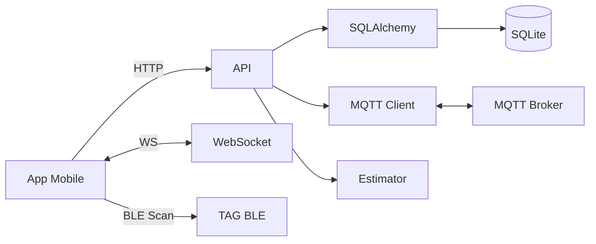
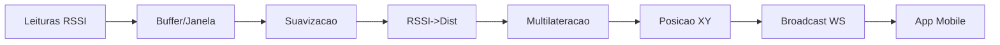
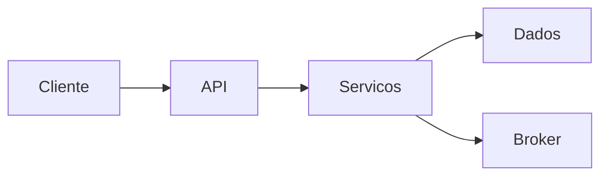
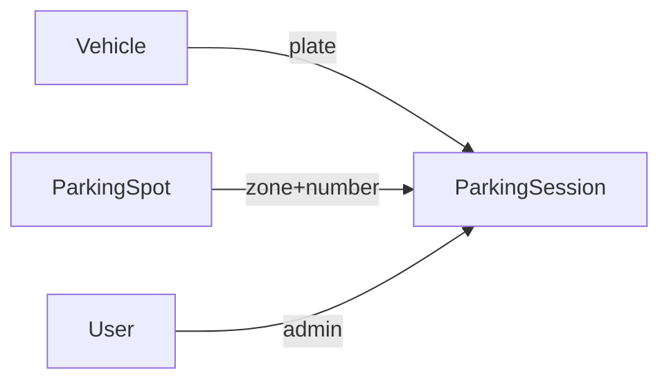

## RadarMotu — Arquitetura, Tecnologias e Guia Completo

Este documento consolida a visão completa do ecossistema RadarMotu (App móvel + API), com diagrama de arquitetura, badges de tecnologia, ícones, índices de navegação e referências cruzadas. Compatível com renderização no GitHub usando Mermaid com `graph LR` e rótulos simples.

### Índice
- [1. Visão Geral 🔭](#visao-geral)
- [2. Arquitetura (Mermaid) 🧩](#arquitetura)
  - [2.1. Diagrama Geral do Sistema](#arq-diagrama-geral)
  - [2.2. Fluxo BLE → Estimativa → WS](#arq-fluxo-ble)
  - [2.3. Camadas Lógicas](#arq-camadas)
- [3. Stacks e Tecnologias (Shields + Ícones) 🧰](#stacks)
  - [3.1. Backend](#stacks)
  - [3.2. Mobile](#stacks)
- [4. Módulos do Projeto 🗂️](#modulos)
- [5. Modelagem de Dados e Persistência 🗃️](#dados)
- [6. Fluxos Principais End-to-End 🔄](#fluxos)
- [7. Segurança 🔐](#seguranca)
- [8. Desempenho e Escalabilidade 🚀](#desempenho)
- [9. Observabilidade e Operação 📈](#observabilidade)
- [10. Ambientes, Build e Deploy 🏗️](#deploy)
- [11. Plano de Testes e Qualidade ✅](#qualidade)
- [12. Roadmap Técnico 🗺️](#roadmap)
- [13. FAQ / Troubleshooting ❓](#faq)
- [14. Glossário 📙](#glossario)
- [15. Links Rápidos 🔗](#links)

---

### Visão Geral

O RadarMotu é composto por:
- **App Mobile (Expo React Native)**: OCR de placas, cadastro e listagem de veículos, mapa em tempo real, radar de proximidade via BLE, acionamento de buzzer/LED na TAG.
- **API (FastAPI/Python)**: CRUD de veículos, gestão de estacionamento, ingestão de leituras BLE, cálculo de posição (multilateração), emissão por WebSocket e publicação via MQTT.

---

### Arquitetura (Mermaid) 🧩

#### 2.1. Diagrama Geral do Sistema

Notas:
- Uso apenas de `graph LR` e rótulos simples para evitar tokens não suportados pelo renderizador do GitHub.
- Se houver problema de renderização, podemos simplificar substituindo agrupamentos por caixas simples (sem `subgraph`).

#### 2.2. Fluxo BLE → Estimativa → WS

#### 2.3. Camadas Lógicas

---

### Stacks e Tecnologias (Shields + Ícones) 🧰

Backend:

Mobile:

---

### Módulos do Projeto 🗂️

- `radarmotu-api/`: API FastAPI, modelos, estimador, MQTT e WS.
- `radarmotu-app/`: App mobile Expo/React Native com telas e serviços.

Referências:
- App: `radarmotu-app/radarmotu-app/README.md`
- API: `radarmotu-api/radarmotu-api/README.md`

---

### Modelagem de Dados e Persistência 🗃️

Notas:
- SQLite local na API; migração futura recomendada para Postgres.
- Índices sugeridos: `vehicles.plate`, `parking_spot(zone, number)`, `parking_session(plate, end_ts null)`.

---

### Fluxos Principais End-to-End 🔄

- **Cadastro/Consulta de Veículo**: App → API (`/api/vehicles` CRUD) → SQLite.
- **Estacionar/Liberação**: App → API (`/api/parking/store|release`) → Atualiza sessão e vaga.
- **Localização**: Âncoras publicam leituras → API agrega e estima posição → push via WebSocket → App renderiza mapa/radar.
- **Alarme TAG**: App → API (`/api/tags/{id}/alarm`) → MQTT Broker → TAG.

---

### Segurança 🔐

- Autenticação: JWT (password grant) com `python-jose` e `passlib[bcrypt]`.
- Autorização: proteger endpoints sensíveis com `Depends(oauth2_scheme)`.
- Segredos e chaves: mover `SECRET_KEY` e credenciais para variáveis de ambiente.
- CORS: restringir origens em produção; HTTPS atrás de proxy/reverse-proxy.
- Mobile: permissões BLE específicas por plataforma; cuidado com logs sensíveis no app.

---

### Desempenho e Escalabilidade 🚀

- WS: consolidar broadcast em intervalos estáveis; limitar payload.
- BLE: suavização e amostragem adaptativa para reduzir ruído.
- API: usar pool do SQLAlchemy; considerar cache (Redis) para âncoras e sessões ativas.
- Estimador: limitar tentativas `least_squares`; fallback para centroid se <3 âncoras válidas.
- Escala: separar workers de agregação/estimativa; mover DB para Postgres; pub/sub com Redis.

---

### Observabilidade e Operação 📈

- Logs estruturados (JSON) com correlação de request-id.
- Métricas: contagem de mensagens WS, latência de estimativa, taxa de erro API.
- Healthchecks: `GET /health` ampliado com checks de DB, MQTT e fila WS.
- Tracing distribuído sugerido (OpenTelemetry) na API.

---

### Ambientes, Build e Deploy 🏗️

- Desenvolvimento local:
  - Backend: `cd radarmotu-api/radarmotu-api && pip install -r requirements.txt && uvicorn app.main:app --reload`.
  - Mobile: `cd radarmotu-app/radarmotu-app && npm install && npm run android`.
- Variáveis:
  - App: `config/env.ts` define `SERVER_HOST`, `RADAR_API_BASE`, `WS_URL`.
- Deploy sugerido:
  - API: container com Uvicorn/Gunicorn; volume para DB (ou Postgres gerenciado).
  - App: EAS Build para Android/iOS; configuração de `usesCleartextTraffic` apenas em dev.

---

### Plano de Testes e Qualidade ✅

- API: testes de unidade para `estimator`, routers e segurança; testes de integração com DB.
- Mobile: testes de navegação e componentes; mocks para serviços e BLE.
- Linters e tipagem: Pydantic v2, mypy opcional; TypeScript estrito.

---

### Roadmap Técnico 🗺️

- Migrar DB para Postgres e adicionar Redis para buffers/pub-sub.
- Implementar reconexão robusta de MQTT e WS backoff exponencial.
- Melhorar calibração BLE e mapeamento de ambiente (âncoras dinâmicas).
- Instrumentar métricas e tracing end-to-end.

---

### FAQ / Troubleshooting ❓

- WS não conecta: verifique IP em `config/env.ts` e firewall/porta 8000.
- BLE sem leituras: checar permissões e hardware; Android 12+ exige `BLUETOOTH_SCAN/CONNECT`.
- OCR de placa falha: garantir permissões de câmera/galeria e tamanho da imagem.

---

### Glossário 📙

- Âncora: ponto fixo no pátio com posição conhecida.
- TAG: dispositivo BLE anexado ao veículo.
- Multilateração: técnica para estimar posição a partir de distâncias.

---

### Links Rápidos 🔗

- Backend: `cd radarmotu-api/radarmotu-api && pip install -r requirements.txt && uvicorn app.main:app --reload`.
- Mobile: `cd radarmotu-app/radarmotu-app && npm install && npm run android`.
- Configure o host da API em `radarmotu-app/radarmotu-app/config/env.ts`.

---

### Estratégias de Qualidade e Observabilidade

- Validação Pydantic v2 e tipagem TS.
- Tratamento de erros e timeouts em `services/api.ts`.
- Sugestões: logs estruturados, métricas e tracing; restrição de CORS e secreto via env.

---

### Links Rápidos

- App (README): `radarmotu-app/radarmotu-app/README.md`
- API (README): `radarmotu-api/radarmotu-api/README.md`

