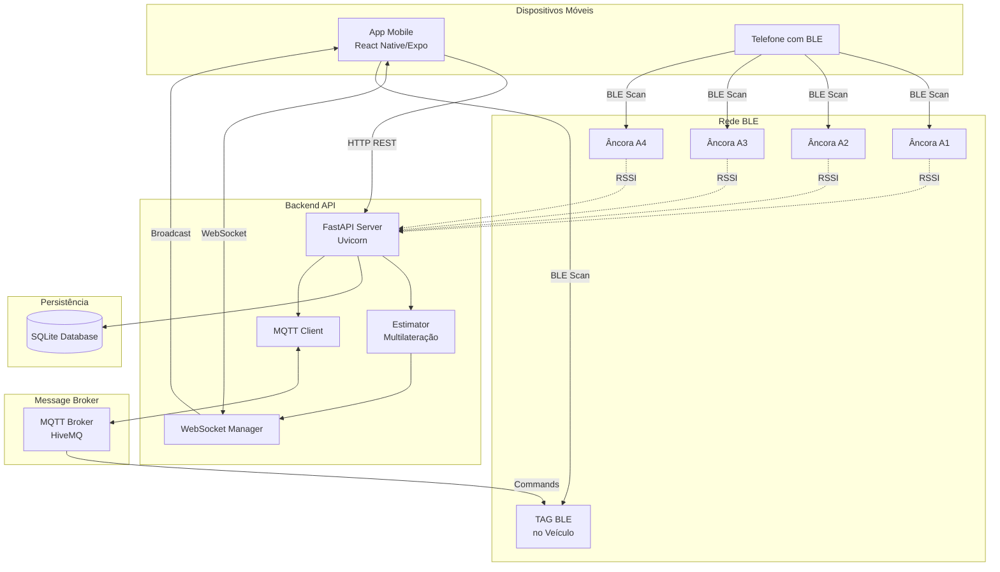
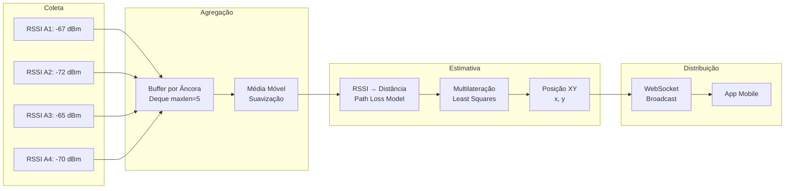
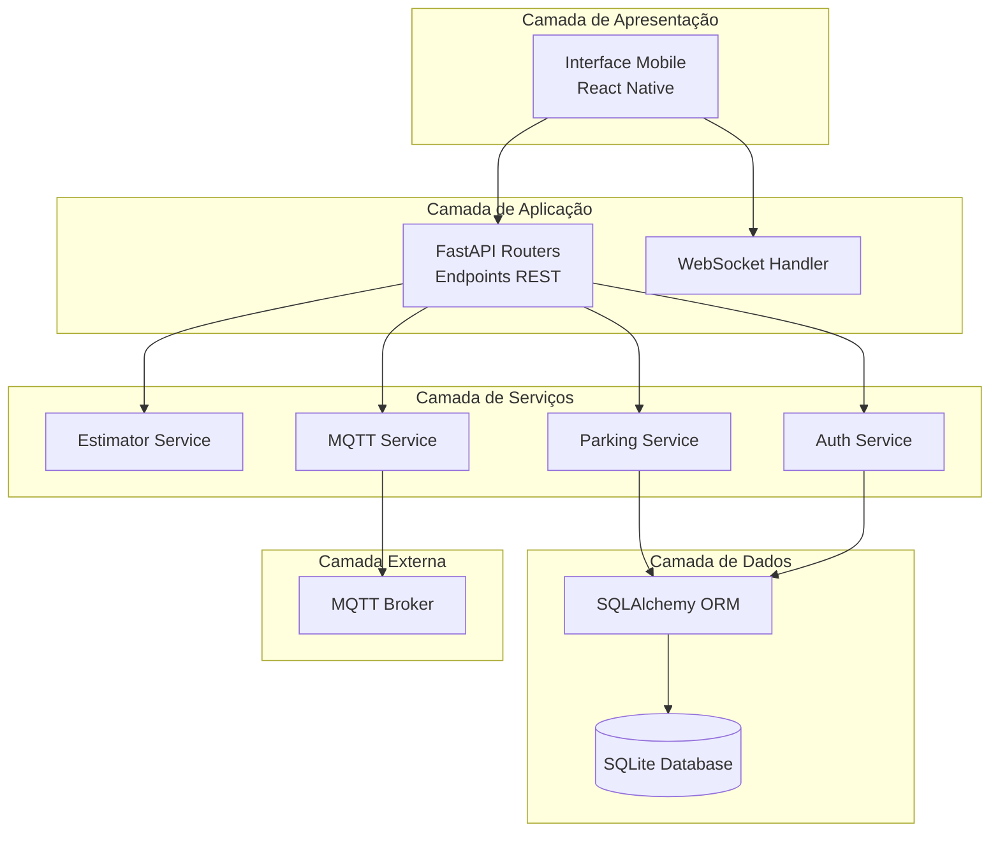
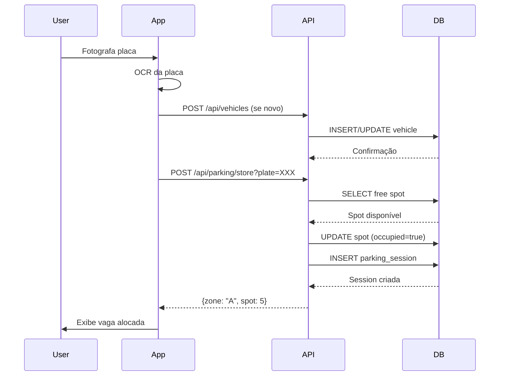
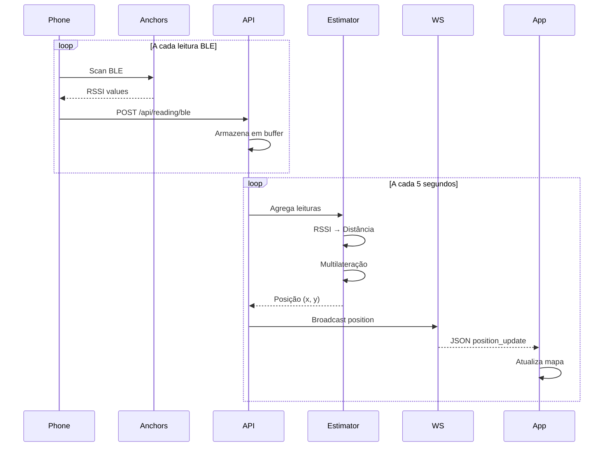
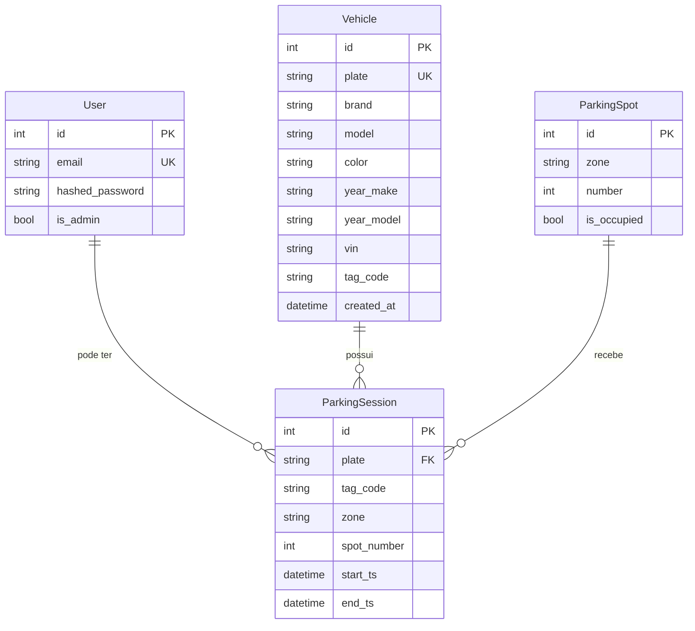

# 🎯 RadarMotu — Sistema de Gestão e Localização de Veículos

<div align="center">


**Sistema completo para gestão de estacionamento e localização em tempo real via BLE**

[](https://www.python.org/)
[](https://fastapi.tiangolo.com/)
[](https://reactnative.dev/)
[](https://expo.dev/)
[](https://www.typescriptlang.org/)
[](https://www.sqlite.org/)
[](https://mqtt.org/)
[](https://developer.mozilla.org/pt-BR/docs/Web/API/WebSocket)

[](LICENSE)
[]()

</div>

---

## 📑 Índice

- [1. Visão Geral](#1-visão-geral)
  - [1.1. O que é o RadarMotu](#11-o-que-é-o-radarmotu)
  - [1.2. Funcionalidades Principais](#12-funcionalidades-principais)
  - [1.3. Arquitetura do Sistema](#13-arquitetura-do-sistema)
- [2. Tecnologias e Stack](#2-tecnologias-e-stack)
  - [2.1. Backend (API)](#21-backend-api)
  - [2.2. Frontend (Mobile App)](#22-frontend-mobile-app)
  - [2.3. Badges Completos](#23-badges-completos)
- [3. Estrutura do Projeto](#3-estrutura-do-projeto)
  - [3.1. Estrutura de Diretórios](#31-estrutura-de-diretórios)
  - [3.2. Backend - API FastAPI](#32-backend---api-fastapi)
  - [3.3. Frontend - App React Native](#33-frontend---app-react-native)
- [4. Arquitetura e Diagramas](#4-arquitetura-e-diagramas)
  - [4.1. Diagrama Geral do Sistema](#41-diagrama-geral-do-sistema)
  - [4.2. Fluxo BLE → Estimativa → WebSocket](#42-fluxo-ble--estimativa--websocket)
  - [4.3. Camadas Lógicas](#43-camadas-lógicas)
  - [4.4. Fluxo de Dados End-to-End](#44-fluxo-de-dados-end-to-end)
  - [4.5. Modelagem de Dados](#45-modelagem-de-dados)
- [5. Módulos e Componentes](#5-módulos-e-componentes)
  - [5.1. Backend - Módulos](#51-backend---módulos)
  - [5.2. Frontend - Telas e Serviços](#52-frontend---telas-e-serviços)
  - [5.3. Componentes Reutilizáveis](#53-componentes-reutilizáveis)
- [6. Funcionalidades Detalhadas](#6-funcionalidades-detalhadas)
  - [6.1. OCR de Placas](#61-ocr-de-placas)
  - [6.2. Cadastro de Veículos](#62-cadastro-de-veículos)
  - [6.3. Gestão de Estacionamento](#63-gestão-de-estacionamento)
  - [6.4. Localização em Tempo Real](#64-localização-em-tempo-real)
  - [6.5. Radar de Proximidade BLE](#65-radar-de-proximidade-ble)
  - [6.6. Mapa do Pátio](#66-mapa-do-pátio)
  - [6.7. Acionamento de TAG via MQTT](#67-acionamento-de-tag-via-mqtt)
- [7. API REST - Endpoints](#7-api-rest---endpoints)
  - [7.1. Autenticação](#71-autenticação)
  - [7.2. Veículos](#72-veículos)
  - [7.3. Estacionamento](#73-estacionamento)
  - [7.4. Localização](#74-localização)
  - [7.5. Âncoras](#75-âncoras)
  - [7.6. TAGs e BLE](#76-tags-e-ble)
  - [7.7. Health Check](#77-health-check)
- [8. WebSocket](#8-websocket)
  - [8.1. Endpoint e Conexão](#81-endpoint-e-conexão)
  - [8.2. Mensagens](#82-mensagens)
  - [8.3. Implementação no App](#83-implementação-no-app)
- [9. MQTT](#9-mqtt)
  - [9.1. Configuração](#91-configuração)
  - [9.2. Tópicos](#92-tópicos)
  - [9.3. Integração](#93-integração)
- [10. Algoritmo de Localização](#10-algoritmo-de-localização)
  - [10.1. RSSI para Distância](#101-rssi-para-distância)
  - [10.2. Multilateração](#102-multilateração)
  - [10.3. Filtros e Suavização](#103-filtros-e-suavização)
- [11. Configuração e Instalação](#11-configuração-e-instalação)
  - [11.1. Pré-requisitos](#111-pré-requisitos)
  - [11.2. Backend - API](#112-backend---api)
  - [11.3. Frontend - App Mobile](#113-frontend---app-mobile)
  - [11.4. Variáveis de Ambiente](#114-variáveis-de-ambiente)
- [12. Execução e Desenvolvimento](#12-execução-e-desenvolvimento)
  - [12.1. Executar API](#121-executar-api)
  - [12.2. Executar App](#122-executar-app)
  - [12.3. Build para Produção](#123-build-para-produção)
- [13. Segurança](#13-segurança)
  - [13.1. Autenticação JWT](#131-autenticação-jwt)
  - [13.2. CORS](#132-cors)
  - [13.3. Permissões Mobile](#133-permissões-mobile)
  - [13.4. Boas Práticas](#134-boas-práticas)
- [14. Desempenho e Escalabilidade](#14-desempenho-e-escalabilidade)
  - [14.1. Otimizações Atuais](#141-otimizações-atuais)
  - [14.2. Melhorias Sugeridas](#142-melhorias-sugeridas)
- [15. Observabilidade e Logs](#15-observabilidade-e-logs)
  - [15.1. Logs Atuais](#151-logs-atuais)
  - [15.2. Métricas e Monitoramento](#152-métricas-e-monitoramento)
- [16. Testes](#16-testes)
  - [16.1. Estratégia de Testes](#161-estratégia-de-testes)
  - [16.2. Testes Recomendados](#162-testes-recomendados)
- [17. Troubleshooting](#17-troubleshooting)
  - [17.1. Problemas Comuns](#171-problemas-comuns)
  - [17.2. FAQ](#172-faq)
- [18. Roadmap](#18-roadmap)
  - [18.1. Melhorias Planejadas](#181-melhorias-planejadas)
  - [18.2. Funcionalidades Futuras](#182-funcionalidades-futuras)
- [19. Contribuição](#19-contribuição)
- [20. Licença e Créditos](#20-licença-e-créditos)

---

## 1. Visão Geral

### 1.1. O que é o RadarMotu

O **RadarMotu** é um sistema completo de gestão de estacionamento e localização de veículos em tempo real utilizando tecnologia **BLE (Bluetooth Low Energy)** para rastreamento de posição através de **multilateração**.

O sistema é composto por:

- **🖥️ Backend (API FastAPI)**: Servidor REST/WebSocket que processa leituras BLE, calcula posições, gerencia estacionamento e comunica-se via MQTT com TAGs.
- **📱 Frontend (App React Native/Expo)**: Aplicativo mobile com OCR de placas, cadastro de veículos, mapa em tempo real, radar de proximidade e gestão de estacionamento.

### 1.2. Funcionalidades Principais

| Funcionalidade | Descrição |
|---------------|-----------|
| 🔍 **OCR de Placas** | Reconhecimento automático de placas de veículos via câmera |
| 📝 **Cadastro de Veículos** | CRUD completo de veículos com informações detalhadas |
| 🅿️ **Gestão de Estacionamento** | Alocação e liberação automática de vagas |
| 📍 **Localização em Tempo Real** | Rastreamento de posição via BLE e multilateração |
| 🗺️ **Mapa do Pátio** | Visualização 2D com âncoras, TAG e telefone |
| 📡 **Radar de Proximidade** | Interface tipo "sonar" para localização por BLE |
| 🔔 **Acionamento de TAG** | Controle remoto de buzzer/LED nas TAGs via MQTT |

### 1.3. Arquitetura do Sistema

```
┌─────────────────┐         ┌──────────────────┐         ┌─────────────┐
│   App Mobile     │────────▶│   API FastAPI    │────────▶│   SQLite    │
│  (React Native)  │  HTTP   │   (Python 3.10+) │         │   Database   │
└─────────────────┘         └──────────────────┘         └─────────────┘
         │                             │
         │ WebSocket                   │ MQTT
         │                             │
         ▼                             ▼
  ┌─────────────┐              ┌──────────────┐
  │  Position   │              │ MQTT Broker  │
  │  Updates    │              │ (HiveMQ)     │
  └─────────────┘              └──────────────┘
         │                             │
         │ BLE Scan                    │
         ▼                             ▼
  ┌─────────────┐              ┌──────────────┐
  │  TAG BLE    │              │   TAG BLE    │
  │  (Vehicle)  │              │   (Commands) │
  └─────────────┘              └──────────────┘
```

---

## 2. Tecnologias e Stack

### 2.1. Backend (API)

| Tecnologia | Versão | Propósito |
|------------|--------|-----------|
| **Python** | 3.10+ | Linguagem principal |
| **FastAPI** | 0.116.1 | Framework web assíncrono |
| **Uvicorn** | 0.35.0 | Servidor ASGI |
| **SQLAlchemy** | 2.0.43 | ORM para banco de dados |
| **SQLite** | 3.x | Banco de dados relacional |
| **Pydantic** | 2.11.7 | Validação e serialização de dados |
| **python-jose** | 3.3.0 | Autenticação JWT |
| **passlib** | 1.7.4 | Hash de senhas (bcrypt) |
| **numpy** | 2.3.2 | Cálculos numéricos |
| **scipy** | 1.16.1 | Otimização (least_squares) |
| **paho-mqtt** | 2.0 | Cliente MQTT |

### 2.2. Frontend (Mobile App)

| Tecnologia | Versão | Propósito |
|------------|--------|-----------|
| **Expo** | SDK 51.0 | Framework para React Native |
| **React Native** | 0.74.5 | Framework mobile |
| **React** | 18.2.0 | Biblioteca UI |
| **TypeScript** | ~5.3 | Tipagem estática |
| **React Navigation** | 7.x | Navegação (Drawer, Stack) |
| **react-native-ble-plx** | 3.5.0 | Integração BLE |
| **react-native-svg** | 15.2.0 | Gráficos vetoriais (mapa/radar) |
| **react-native-permissions** | 5.4.2 | Gerenciamento de permissões |
| **@react-native-async-storage/async-storage** | 1.23.1 | Armazenamento local |

### 2.3. Badges Completos

#### Backend


#### Frontend


---

## 3. Estrutura do Projeto

### 3.1. Estrutura de Diretórios

```
App-RadarMotu/
│
├── 📁 radarmotu-api/                    # Backend - API FastAPI
│   └── 📁 radarmotu-api/
│       ├── 📁 app/
│       │   ├── 📄 __init__.py
│       │   ├── 📄 main.py               # Aplicação FastAPI principal
│       │   ├── 📄 database.py           # Configuração SQLAlchemy
│       │   ├── 📄 models.py             # Modelos ORM (User, Vehicle, ParkingSpot, ParkingSession)
│       │   ├── 📄 schemas.py            # Modelos Pydantic para validação
│       │   ├── 📄 security.py           # JWT e hash de senhas
│       │   ├── 📄 estimator.py          # Algoritmo de multilateração
│       │   ├── 📄 anchors.json          # Coordenadas das âncoras BLE
│       │   ├── 📁 routers/              # Endpoints REST organizados
│       │   │   ├── 📄 auth.py           # Autenticação (/token, /users)
│       │   │   ├── 📄 vehicles.py      # CRUD veículos (/api/vehicles)
│       │   │   ├── 📄 parking.py        # Estacionamento (/api/parking)
│       │   │   ├── 📄 locate.py         # Localização (/api/locate)
│       │   │   ├── 📄 anchors.py        # Âncoras (/api/anchors)
│       │   │   └── 📄 tags.py           # TAGs e MQTT (/api/tags)
│       │   └── 📁 services/
│       │       ├── 📄 mqtt.py           # Cliente MQTT compartilhado
│       │       └── 📄 locator.py       # Serviços de localização
│       ├── 📄 requirements.txt          # Dependências Python
│       ├── 📄 README.md                 # Documentação da API
│       └── 📄 inicializacao.md          # Guia de inicialização
│
├── 📁 radarmotu-app/                    # Frontend - App React Native
│   └── 📁 radarmotu-app/
│       ├── 📁 android/                  # Código nativo Android
│       │   └── 📁 app/
│       │       └── 📁 src/
│       │           └── 📁 main/
│       │               ├── 📁 java/com/seuorg/radarmotu/
│       │               │   ├── 📄 MainActivity.kt
│       │               │   └── 📄 MainApplication.kt
│       │               └── 📁 res/       # Recursos Android
│       ├── 📁 assets/                   # Imagens e recursos
│       │   ├── 📄 radarmotu-logo.png    # Logo RadarMotu
│       │   └── 📄 metamind-logo.png      # Logo Metamind
│       ├── 📁 screens/                  # Telas do aplicativo
│       │   ├── 📄 HomeScreen.tsx         # Tela inicial
│       │   ├── 📄 Cadastro.tsx           # Cadastro de veículos
│       │   ├── 📄 Listagem.tsx           # Lista de veículos
│       │   ├── 📄 OperacoesPorPlaca.tsx  # Operações via OCR
│       │   ├── 📄 PlacaRecognition.tsx   # OCR de placas
│       │   ├── 📄 MapaScreen.tsx         # Mapa do pátio
│       │   ├── 📄 RadarProximidade.tsx   # Radar BLE
│       │   └── 📄 SobreNosScreen.tsx     # Sobre nós
│       ├── 📁 services/                 # Serviços de integração
│       │   ├── 📄 api.ts                # Cliente REST API
│       │   └── 📄 ws.ts                 # WebSocket hook
│       ├── 📁 components/               # Componentes reutilizáveis
│       │   └── 📄 VehicleCard.tsx       # Card de veículo
│       ├── 📁 config/                   # Configurações
│       │   └── 📄 env.ts                # URLs e hosts
│       ├── 📄 App.tsx                   # Navegação principal (Drawer)
│       ├── 📄 package.json               # Dependências NPM
│       ├── 📄 tsconfig.json             # Configuração TypeScript
│       ├── 📄 app.json                  # Configuração Expo
│       └── 📄 README.md                 # Documentação do App
│
└── 📄 README.md                          # Este arquivo
```

### 3.2. Backend - API FastAPI

```
radarmotu-api/radarmotu-api/app/
│
├── 📄 main.py                            # Entry point, WebSocket, agregação BLE
├── 📄 database.py                        # Engine SQLAlchemy, SessionLocal, Base
├── 📄 models.py                          # User, Vehicle, ParkingSpot, ParkingSession
├── 📄 schemas.py                         # Pydantic models (Token, VehicleIn, BleReading, etc.)
├── 📄 security.py                        # JWT create/verify, password hash/verify
├── 📄 estimator.py                       # rssi_to_dist(), multilaterate()
├── 📄 anchors.json                       # {"A1": {"x": 5.0, "y": 5.0}, ...}
│
├── 📁 routers/
│   ├── 📄 auth.py                        # POST /token, POST /users/
│   ├── 📄 vehicles.py                    # CRUD /api/vehicles
│   ├── 📄 parking.py                     # POST /api/parking/store|release
│   ├── 📄 locate.py                      # GET /api/locate/{plate}
│   ├── 📄 anchors.py                     # GET /api/anchors
│   └── 📄 tags.py                        # POST /api/tags/{id}/alarm
│
└── 📁 services/
    ├── 📄 mqtt.py                        # mqtt_client, setup_mqtt()
    └── 📄 locator.py                     # Serviços auxiliares
```

### 3.3. Frontend - App React Native

```
radarmotu-app/radarmotu-app/
│
├── 📄 App.tsx                            # Drawer Navigator, tema escuro
│
├── 📁 screens/
│   ├── 📄 HomeScreen.tsx                 # Atalhos e navegação
│   ├── 📄 Cadastro.tsx                  # Formulário de veículo
│   ├── 📄 Listagem.tsx                  # Lista com AsyncStorage
│   ├── 📄 OperacoesPorPlaca.tsx          # OCR → cadastro → estacionar
│   ├── 📄 PlacaRecognition.tsx           # expo-image-picker + OCR API
│   ├── 📄 MapaScreen.tsx                 # SVG com âncoras, TAG, telefone
│   ├── 📄 RadarProximidade.tsx           # Sonar BLE com haptics
│   └── 📄 SobreNosScreen.tsx             # Informações do projeto
│
├── 📁 services/
│   ├── 📄 api.ts                         # createVehicle, storeByPlate, locateByPlate, etc.
│   └── 📄 ws.ts                          # useTagPositionWS() hook
│
├── 📁 components/
│   └── 📄 VehicleCard.tsx                # Card de exibição de veículo
│
└── 📁 config/
    └── 📄 env.ts                          # SERVER_HOST, RADAR_API_BASE, WS_URL
```

---

## 4. Arquitetura e Diagramas

### 4.1. Diagrama Geral do Sistema



### 4.2. Fluxo BLE → Estimativa → WebSocket



### 4.3. Camadas Lógicas



### 4.4. Fluxo de Dados End-to-End

#### Fluxo de Estacionamento


#### Fluxo de Localização


### 4.5. Modelagem de Dados



#### Entidades Detalhadas

**User**
- `id`: ID único (Integer, Primary Key)
- `email`: Email do usuário (String, Unique, Indexed)
- `hashed_password`: Senha hasheada com bcrypt (String)
- `is_admin`: Flag de administrador (Boolean)

**Vehicle**
- `id`: ID único (Integer, Primary Key)
- `plate`: Placa do veículo (String, Unique, Indexed, Normalizada para maiúsculas)
- `brand`: Marca (String)
- `model`: Modelo (String)
- `color`: Cor (String)
- `year_make`: Ano de fabricação (String)
- `year_model`: Ano do modelo (String)
- `vin`: Chassi (String)
- `tag_code`: Código da TAG BLE (String, Nullable)
- `created_at`: Data de criação (DateTime, Timezone-aware)

**ParkingSpot**
- `id`: ID único (Integer, Primary Key)
- `zone`: Zona do estacionamento (String, Indexed, ex: "A", "B")
- `number`: Número da vaga (Integer, Indexed)
- `is_occupied`: Status de ocupação (Boolean)

**ParkingSession**
- `id`: ID único (Integer, Primary Key)
- `plate`: Placa do veículo (String, Indexed, Foreign Key → Vehicle.plate)
- `tag_code`: Código da TAG (String, Nullable)
- `zone`: Zona alocada (String, Indexed)
- `spot_number`: Número da vaga (Integer)
- `start_ts`: Início da sessão (DateTime, Timezone-aware)
- `end_ts`: Fim da sessão (DateTime, Nullable, Timezone-aware)

---

## 5. Módulos e Componentes

### 5.1. Backend - Módulos

#### `main.py` - Aplicação Principal
- **WebSocket Manager**: Gerencia conexões WebSocket ativas e broadcast de posições
- **BLE Reading Ingestion**: Endpoint `POST /api/reading/ble` para receber leituras RSSI
- **Aggregator Task**: Task assíncrona que agrega leituras a cada 5 segundos e calcula posição
- **MQTT Setup**: Inicialização do cliente MQTT no startup
- **Router Registration**: Registra todos os routers REST

#### `routers/auth.py` - Autenticação
- `POST /token`: Gera JWT token (OAuth2 password grant)
- `POST /users/`: Cria novo usuário (apenas para bootstrap)

#### `routers/vehicles.py` - CRUD Veículos
- `POST /api/vehicles`: Cria ou atualiza veículo (upsert por placa)
- `GET /api/vehicles/by-plate/{plate}`: Busca veículo por placa
- `PUT /api/vehicles/{plate}`: Atualiza campos do veículo
- `DELETE /api/vehicles/{plate}`: Remove veículo

#### `routers/parking.py` - Estacionamento
- `POST /api/parking/store?plate=XXX`: Aloca vaga e cria sessão
- `POST /api/parking/release?plate=XXX`: Libera vaga e encerra sessão
- `ensure_spots()`: Cria 30 vagas na zona A se não existirem

#### `routers/locate.py` - Localização
- `GET /api/locate/{plate}`: Retorna zona e vaga da sessão ativa

#### `routers/anchors.py` - Âncoras
- `GET /api/anchors`: Retorna coordenadas das âncoras (JSON)

#### `routers/tags.py` - TAGs e MQTT
- `POST /api/tags/{tag_id}/alarm`: Publica comando `TOGGLE_BUZZER` via MQTT

#### `estimator.py` - Algoritmo de Localização
- `rssi_to_dist(rssi: float) -> float`: Converte RSSI em distância (path loss model)
- `multilaterate(anchors: dict, readings: list) -> dict`: Calcula posição via least squares

**Fórmula Path Loss:**
```
distância = 10^((TX_POWER - RSSI) / (10 * N_PATH))
```
- `TX_POWER = -61.0 dBm` (potência de transmissão a 1 metro)
- `N_PATH = 2.5` (expoente do path loss)

**Multilateração:**
- Utiliza `scipy.optimize.least_squares` com método Levenberg-Marquardt
- Requer mínimo de 3 âncoras com leituras válidas
- Retorna coordenadas `{x, y}` em metros

#### `services/mqtt.py` - Cliente MQTT
- Cliente único compartilhado (`mqtt_client`)
- Conecta ao broker HiveMQ (`broker.hivemq.com:1883`)
- Loop em background thread

### 5.2. Frontend - Telas e Serviços

#### Telas

**HomeScreen.tsx**
- Tela inicial com atalhos para funcionalidades principais
- Navegação para OCR, cadastro e lista

**Cadastro.tsx**
- Formulário completo de cadastro de veículo
- Campos: placa, marca, modelo, cor, ano fabricação, ano modelo, chassi, TAG
- Opção de estacionar após cadastro

**Listagem.tsx**
- Lista de veículos cadastrados (AsyncStorage local)
- Integração com API para busca

**OperacoesPorPlaca.tsx**
- Fluxo completo: OCR → cadastro → estacionar
- Busca por placa via OCR
- Ações: estacionar, localizar, liberar, acionar TAG

**PlacaRecognition.tsx**
- Integração com API de OCR (externa)
- `expo-image-picker` para captura/galeria
- Exibição da placa reconhecida

**MapaScreen.tsx**
- Visualização 2D do pátio usando `react-native-svg`
- Renderiza: âncoras, posição da TAG, posição do telefone
- Transformação afim para ajuste de escala
- Banners de alcance das âncoras

**RadarProximidade.tsx**
- Interface tipo "sonar" circular
- Scan BLE em tempo real da TAG
- Suavização de RSSI (média móvel)
- Conversão RSSI → distância
- Estimativa de direção angular
- Haptics (vibração) quando próximo
- Calibração manual (@1m)

**SobreNosScreen.tsx**
- Informações do projeto e equipe
- Link para Metamind

#### Serviços

**services/api.ts**
- Cliente REST centralizado
- Funções:
  - `createVehicle()`: Cria/atualiza veículo
  - `getVehicleByPlate()`: Busca por placa
  - `updateVehicle()`: Atualiza veículo
  - `deleteVehicle()`: Remove veículo
  - `storeByPlate()`: Estaciona veículo
  - `releaseByPlate()`: Libera vaga
  - `locateByPlate()`: Localiza veículo
  - `alarmTag()`: Aciona buzzer TAG
  - `getTagByPlate()`: Busca TAG do veículo
  - `ping()`: Health check
- Tratamento de erros com `okOrThrow()` e parsing robusto

**services/ws.ts**
- Hook `useTagPositionWS(targetPlate?)`
- Conecta ao WebSocket `/ws/position`
- Parse de mensagens JSON
- Estado de posição (`{x, y, id, zone, spot}`)

### 5.3. Componentes Reutilizáveis

**components/VehicleCard.tsx**
- Card de exibição de veículo
- Estilo escuro consistente
- Exibe: placa, modelo, marca, cor, ano, chassi, TAG

---

## 6. Funcionalidades Detalhadas

### 6.1. OCR de Placas

**Fluxo:**
1. Usuário abre tela de OCR (`PlacaRecognition.tsx`)
2. Escolhe: câmera ou galeria (`expo-image-picker`)
3. Envia imagem para API de OCR externa
4. Recebe placa reconhecida
5. Preenche automaticamente no formulário

**Configuração:**
- API de OCR externa (configurar URL em `PlacaRecognition.tsx`)
- Permissões: câmera e acesso a galeria

### 6.2. Cadastro de Veículos

**Campos:**
- **Placa**: Texto normalizado para maiúsculas, único
- **Marca**: Texto livre
- **Modelo**: Texto livre
- **Cor**: Texto livre
- **Ano Fabricação**: String (formato livre)
- **Ano Modelo**: String (formato livre)
- **Chassi (VIN)**: String
- **TAG Code**: Código da TAG BLE (opcional)

**Validações:**
- Placa obrigatória
- Placa normalizada no backend (`_norm_plate()`)
- Upsert: se placa existe, atualiza; senão, cria

### 6.3. Gestão de Estacionamento

**Alocação (`POST /api/parking/store`):**
1. Verifica se veículo existe
2. Verifica se já tem sessão ativa (retorna existente)
3. Busca primeira vaga livre (zone, number ASC)
4. Marca vaga como ocupada
5. Cria `ParkingSession` com `end_ts = NULL`
6. Retorna `{zone, spot, sessionId}`

**Liberação (`POST /api/parking/release`):**
1. Busca sessão ativa por placa (`end_ts IS NULL`)
2. Libera vaga (`is_occupied = False`)
3. Atualiza sessão (`end_ts = datetime.utcnow()`)
4. Retorna confirmação

**Inicialização:**
- Ao iniciar, cria 30 vagas na zona "A" se não existirem

### 6.4. Localização em Tempo Real

**Coleta:**
- App escaneia TAG BLE e obtém RSSI
- Envia para API: `POST /api/reading/ble` com `{tagId, anchorId, rssi}`

**Agregação (Backend):**
- Buffer circular por âncora (`deque(maxlen=5)`)
- Agregação a cada 5 segundos
- Calcula média móvel de RSSI

**Estimativa:**
1. Converte RSSI → distância (path loss model)
2. Executa multilateração com `scipy.optimize.least_squares`
3. Requer mínimo de 3 âncoras com 5 leituras

**Distribuição:**
- WebSocket broadcast para todos os clientes conectados
- Mensagem: `{type: "position_update", payload: {id, kind, pos: {x, y}}}`

**Cooldown:**
- Após calcular posição, entra em cooldown de 5 segundos
- Limpa buffer de leituras

### 6.5. Radar de Proximidade BLE

**Interface:**
- Display circular tipo "sonar"
- Varredura angular animada
- Indicador de direção e distância
- Cores por proximidade (verde = próximo, vermelho = distante)

**Funcionalidades:**
- Scan contínuo da TAG pelo nome (`TAGxx`)
- Suavização de RSSI (média móvel de N amostras)
- Conversão RSSI → metros
- Estimativa de ângulo baseada em âncoras conhecidas
- Haptics quando distância < 5 metros

**Calibração:**
- Botão "Calibrar @1m"
- Coleta amostras por ~3 segundos
- Ajusta `TX_POWER` com base no RSSI médio

### 6.6. Mapa do Pátio

**Elementos:**
- **Âncoras**: Pontos fixos com coordenadas conhecidas
- **TAG**: Posição estimada do veículo (via WebSocket)
- **Telefone**: Posição do dispositivo (opcional, via GPS/estimativa)
- **Banners**: Indicadores de alcance de cada âncora

**Renderização:**
- SVG (`react-native-svg`) para gráficos vetoriais
- Transformação afim para ajuste de escala e rotação
- Zoom e pan (futuro)

**Coordenadas:**
- Sistema cartesiano em metros
- Origem (0, 0) no canto inferior esquerdo
- Âncoras definidas em `anchors.json`

### 6.7. Acionamento de TAG via MQTT

**Fluxo:**
1. App chama `POST /api/tags/{tag_id}/alarm`
2. API publica no tópico MQTT: `radarmottu/tags/{tag_id}/command`
3. Mensagem: `"TOGGLE_BUZZER"`
4. TAG BLE escuta tópico e aciona buzzer/LED

**MQTT Broker:**
- HiveMQ público (`broker.hivemq.com:1883`)
- Tópico: `radarmottu/tags/{tag_id}/command`
- QoS: 0 (fire and forget)

---

## 7. API REST - Endpoints

### 7.1. Autenticação

#### `POST /token`
Gera token JWT para autenticação.

**Request Body (form-data):**
```json
{
  "username": "user@example.com",
  "password": "senha123"
}
```

**Response:**
```json
{
  "access_token": "eyJhbGciOiJIUzI1NiIsInR5cCI6IkpXVCJ9...",
  "token_type": "bearer"
}
```

#### `POST /users/`
Cria novo usuário (apenas para bootstrap).

**Request Body:**
```json
{
  "email": "user@example.com",
  "password": "senha123",
  "is_admin": false
}
```

### 7.2. Veículos

#### `POST /api/vehicles`
Cria ou atualiza veículo (upsert por placa).

**Request Body:**
```json
{
  "plate": "ABC1234",
  "brand": "Toyota",
  "model": "Corolla",
  "color": "Branco",
  "year_make": "2023",
  "year_model": "2024",
  "vin": "1234567890ABCDEF",
  "tag_code": "TAG01"
}
```

**Response:**
```json
{
  "id": 1,
  "plate": "ABC1234",
  "brand": "Toyota",
  "model": "Corolla",
  "color": "Branco",
  "year_make": "2023",
  "year_model": "2024",
  "vin": "1234567890ABCDEF",
  "tag_code": "TAG01"
}
```

#### `GET /api/vehicles/by-plate/{plate}`
Busca veículo por placa.

**Response:** Mesmo formato do POST.

#### `PUT /api/vehicles/{plate}`
Atualiza campos do veículo (parcial).

**Request Body:**
```json
{
  "color": "Preto",
  "tag_code": "TAG02"
}
```

#### `DELETE /api/vehicles/{plate}`
Remove veículo.

**Response:**
```json
{
  "status": "deleted"
}
```

### 7.3. Estacionamento

#### `POST /api/parking/store?plate=ABC1234`
Aloca vaga para o veículo.

**Response:**
```json
{
  "zone": "A",
  "spot": 5,
  "sessionId": 123
}
```

#### `POST /api/parking/release?plate=ABC1234`
Libera vaga do veículo.

**Response:**
```json
{
  "status": "released",
  "zone": "A",
  "spot": 5
}
```

### 7.4. Localização

#### `GET /api/locate/{plate}`
Retorna zona e vaga da sessão ativa.

**Response:**
```json
{
  "zone": "A",
  "spot": 5
}
```

**Erro 404:** Sessão não encontrada.

### 7.5. Âncoras

#### `GET /api/anchors`
Retorna coordenadas das âncoras BLE.

**Response:**
```json
{
  "A1": {"x": 5.0, "y": 5.0},
  "A2": {"x": 14.59, "y": 5.0},
  "A3": {"x": 14.59, "y": -4.59},
  "A4": {"x": 5.0, "y": -4.59}
}
```

### 7.6. TAGs e BLE

#### `POST /api/reading/ble`
Recebe leitura RSSI de uma âncora.

**Request Body:**
```json
{
  "tagId": "TAG01",
  "anchorId": "A1",
  "rssi": -67
}
```

**Response:**
```json
{
  "status": "ok"
}
```

#### `POST /api/tags/{tag_id}/alarm`
Aciona buzzer/LED da TAG via MQTT.

**Response:**
```json
{
  "status": "comando toggle enviado",
  "tag_id": "TAG01"
}
```

### 7.7. Health Check

#### `GET /health`
Verifica status da API.

**Response:**
```json
{
  "status": "ok",
  "uptime_s": 3600.5,
  "db_ok": true,
  "ws_clients": 2,
  "anchors_count": 4
}
```

---

## 8. WebSocket

### 8.1. Endpoint e Conexão

**URL:** `ws://{SERVER_HOST}:8000/ws/position`

**Conexão:**
```typescript
const ws = new WebSocket('ws://10.30.142.15:8000/ws/position');
```

### 8.2. Mensagens

#### Mensagem Inicial (Setup)
Enviada automaticamente ao conectar.

```json
{
  "type": "initial_setup",
  "payload": {
    "initial_pos": {"x": 9.795, "y": 0.205},
    "anchors": {
      "A1": {"x": 5.0, "y": 5.0},
      "A2": {"x": 14.59, "y": 5.0},
      "A3": {"x": 14.59, "y": -4.59},
      "A4": {"x": 5.0, "y": -4.59}
    }
  }
}
```

#### Mensagem de Atualização de Posição
Enviada periodicamente quando há nova posição calculada.

```json
{
  "type": "position_update",
  "payload": {
    "id": "TAG01",
    "kind": "tag",
    "pos": {"x": 10.5, "y": 2.3}
  }
}
```

### 8.3. Implementação no App

```typescript
// services/ws.ts
export function useTagPositionWS(targetPlate?: string) {
  const [pos, setPos] = useState<{x:number;y:number;id?:string}|null>(null);

  useEffect(() => {
    const ws = new WebSocket(WS_URL);
    
    ws.onmessage = (e) => {
      const data = JSON.parse(e.data);
      if (data.type === 'position_update') {
        setPos(data.payload.pos);
      }
    };
    
    return () => ws.close();
  }, [targetPlate]);

  return pos;
}
```

---

## 9. MQTT

### 9.1. Configuração

**Broker:** `broker.hivemq.com:1883`
**Cliente:** `paho-mqtt` (Python)

**Conexão:**
```python
mqtt_client = mqtt.Client(mqtt.CallbackAPIVersion.VERSION1)
mqtt_client.connect(MQTT_SERVER, MQTT_PORT, 60)
mqtt_client.loop_start()
```

### 9.2. Tópicos

#### Comandos para TAG
**Tópico:** `radarmottu/tags/{tag_id}/command`
**Mensagem:** `"TOGGLE_BUZZER"`

**Exemplo:**
```python
topic = "radarmottu/tags/TAG01/command"
mqtt_client.publish(topic, "TOGGLE_BUZZER")
```

### 9.3. Integração

O cliente MQTT é inicializado no startup da API (`main.py`):
```python
@app.on_event("startup")
async def on_startup():
    setup_mqtt()  # Conecta ao broker
    asyncio.create_task(aggregator_and_calculator_task())
    # ...
```

---

## 10. Algoritmo de Localização

### 10.1. RSSI para Distância

**Fórmula Path Loss Model:**
```
distância (m) = 10^((TX_POWER - RSSI) / (10 * N_PATH))
```

**Parâmetros:**
- `TX_POWER = -61.0 dBm` (potência de transmissão a 1 metro)
- `N_PATH = 2.5` (expoente do path loss, ambiente indoor)

**Implementação:**
```python
def rssi_to_dist(rssi: float) -> float:
    return 10 ** ((TX_POWER - rssi) / (10 * N_PATH))
```

**Tabela de Referência:**

| RSSI (dBm) | Distância (m) |
|------------|---------------|
| -50 | ~0.40 |
| -60 | ~1.00 |
| -70 | ~2.51 |
| -80 | ~6.31 |
| -90 | ~15.85 |
| -100 | ~39.81 |

### 10.2. Multilateração

**Algoritmo:** Non-linear Least Squares (Levenberg-Marquardt)

**Entrada:**
- Coordenadas das âncoras: `{A1: {x: 5.0, y: 5.0}, ...}`
- Leituras RSSI: `[{anchorId: "A1", rssi: -67}, ...]`

**Processo:**
1. Converte RSSI → distância para cada âncora
2. Define função residual (erro entre distância medida e calculada)
3. Minimiza residuals com `scipy.optimize.least_squares`
4. Retorna coordenadas `{x, y}`

**Implementação:**
```python
def multilaterate(anchors: dict, readings: list[dict]) -> dict:
    known_readings = [r for r in readings if r["anchorId"] in anchors]
    if len(known_readings) < 3:
        return {}  # Mínimo 3 âncoras

    points = np.array([list(anchors[r["anchorId"]].values()) for r in known_readings])
    distances = np.array([rssi_to_dist(r["rssi"]) for r in known_readings])
    initial_guess = np.mean(points, axis=0)  # Centroide das âncoras

    def residuals(xy):
        return np.linalg.norm(points - xy, axis=1) - distances

    res = least_squares(residuals, initial_guess, method="lm")
    return {"x": float(res.x[0]), "y": float(res.x[1])}
```

**Precisão:**
- Erro típico: 1-3 metros em ambiente ideal
- Depende de: número de âncoras, qualidade do sinal, obstáculos

### 10.3. Filtros e Suavização

**Buffer Circular:**
- Armazena últimas 5 leituras por âncora
- Usa `collections.deque(maxlen=5)`

**Agregação:**
- Média aritmética das leituras no buffer
- Reduz ruído e outliers

**Cooldown:**
- Após calcular posição, pausa de 5 segundos
- Evita cálculos redundantes
- Limpa buffer após broadcast

---

## 11. Configuração e Instalação

### 11.1. Pré-requisitos

#### Backend
- Python 3.10 ou superior
- pip (gerenciador de pacotes Python)
- Ambiente virtual (recomendado)

#### Frontend
- Node.js 18+ (LTS recomendado)
- npm ou yarn
- Expo CLI (`npm install -g expo-cli`)
- Android Studio (para desenvolvimento Android)
- Dispositivo físico ou emulador Android/iOS

### 11.2. Backend - API

#### Instalação

```bash
# Navegar para diretório da API
cd radarmotu-api/radarmotu-api

# Criar ambiente virtual (recomendado)
python -m venv .venv

# Ativar ambiente virtual
# Windows:
.venv\Scripts\activate
# Linux/Mac:
source .venv/bin/activate

# Instalar dependências
pip install -r app/requirements.txt
```

#### Banco de Dados
O SQLite é criado automaticamente na primeira execução em `radarmotu.db`.

#### Configuração
- Editar `app/anchors.json` para ajustar coordenadas das âncoras
- Configurar `SECRET_KEY` em `app/security.py` (variável de ambiente recomendada)

### 11.3. Frontend - App Mobile

#### Instalação

```bash
# Navegar para diretório do app
cd radarmotu-app/radarmotu-app

# Instalar dependências
npm install
```

#### Configuração de Ambiente

Editar `config/env.ts`:

```typescript
export const SERVER_HOST = "10.30.142.15"; // IP da máquina do backend
export const RADAR_API_BASE = `http://${SERVER_HOST}:8000`;
export const WS_URL = `ws://${SERVER_HOST}:8000/ws/position`;
```

**Importante:** `SERVER_HOST` deve ser o IP local da máquina na mesma rede do dispositivo móvel.

### 11.4. Variáveis de Ambiente

#### Backend (Recomendado)

Criar arquivo `.env`:
```
SECRET_KEY=your_secret_key_here
DATABASE_URL=sqlite:///./radarmotu.db
MQTT_BROKER=broker.hivemq.com
MQTT_PORT=1883
```

Carregar com `python-dotenv`:
```python
from dotenv import load_dotenv
load_dotenv()
```

#### Frontend
Variáveis configuradas em `config/env.ts` (ver seção anterior).

---

## 12. Execução e Desenvolvimento

### 12.1. Executar API

#### Modo Desenvolvimento (com reload)

```bash
cd radarmotu-api/radarmotu-api

# Ativar ambiente virtual
.venv\Scripts\activate  # Windows
# ou
source .venv/bin/activate  # Linux/Mac

# Executar com uvicorn
python -m uvicorn app.main:app --reload --host 0.0.0.0 --port 8000
```

**Ou usando script:**
```bash
# Windows
.\.venv\Scripts\python.exe -m uvicorn app.main:app --reload --host 0.0.0.0 --port 8000
```

#### Modo Produção

```bash
uvicorn app.main:app --host 0.0.0.0 --port 8000 --workers 4
```

#### Acesso
- API: http://localhost:8000
- Documentação Swagger: http://localhost:8000/docs
- Documentação ReDoc: http://localhost:8000/redoc

### 12.2. Executar App

#### Desenvolvimento

```bash
cd radarmotu-app/radarmotu-app

# Iniciar Metro Bundler
npm start

# Ou executar diretamente no Android
npm run android

# Ou executar no iOS (requer macOS)
npm run ios
```

#### Configuração de Rede
- Certifique-se de que o dispositivo móvel está na mesma rede Wi-Fi do backend
- Configure o IP correto em `config/env.ts`
- Backend deve estar acessível na porta 8000

### 12.3. Build para Produção

#### Android

```bash
# Build com EAS (Expo Application Services)
npx eas build --platform android --profile production

# Ou build local
cd android
./gradlew assembleRelease
```

#### iOS

```bash
npx eas build --platform ios --profile production
```

---

## 13. Segurança

### 13.1. Autenticação JWT

**Algoritmo:** HS256
**Expiração:** 7 dias (configurável em `security.py`)
**Payload:**
```json
{
  "sub": "user@example.com",
  "is_admin": false,
  "exp": 1234567890
}
```

**Uso:**
```python
from fastapi.security import Depends, OAuth2PasswordBearer
from .security import oauth2_scheme

@router.get("/protected")
def protected_route(token: str = Depends(oauth2_scheme)):
    # Verifica token JWT
    pass
```

**Nota:** Atualmente, alguns endpoints não exigem autenticação. Recomenda-se proteger endpoints sensíveis em produção.

### 13.2. CORS

**Configuração Atual (Desenvolvimento):**
```python
app.add_middleware(
    CORSMiddleware,
    allow_origins=["*"],  # ⚠️ Liberar tudo em dev
    allow_credentials=True,
    allow_methods=["*"],
    allow_headers=["*"],
)
```

**Produção:**
```python
allow_origins=[
    "https://yourdomain.com",
    "exp://your-app.expo.dev"
]
```

### 13.3. Permissões Mobile

#### Android
- `ACCESS_FINE_LOCATION`: Necessário para BLE scan (Android < 12)
- `BLUETOOTH_SCAN`: Android 12+ (runtime permission)
- `BLUETOOTH_CONNECT`: Android 12+ (runtime permission)

#### iOS
- `NSBluetoothAlwaysUsageDescription`: Solicita permissão BLE

**Configuração:** `app.json` e `AndroidManifest.xml`

### 13.4. Boas Práticas

- [ ] Mover `SECRET_KEY` para variável de ambiente
- [ ] Restringir CORS em produção
- [ ] Habilitar HTTPS em produção (proxy reverso com nginx)
- [ ] Proteger endpoints sensíveis com `Depends(oauth2_scheme)`
- [ ] Rate limiting para endpoints públicos
- [ ] Validação rigorosa de inputs
- [ ] Sanitização de dados de usuário
- [ ] Logs sem informações sensíveis

---

## 14. Desempenho e Escalabilidade

### 14.1. Otimizações Atuais

- **Buffer Circular:** Limita memória de leituras BLE
- **Agregação Assíncrona:** Task em background evita bloqueio
- **Cooldown:** Evita cálculos redundantes
- **WebSocket Broadcast:** Eficiente para múltiplos clientes
- **Índices de Banco:** Campos frequentes indexados (plate, zone, number)

### 14.2. Melhorias Sugeridas

#### Backend
- [ ] **Redis:** Cache para âncoras e sessões ativas
- [ ] **PostgreSQL:** Substituir SQLite para produção
- [ ] **Workers:** Separar workers de agregação/estimativa
- [ ] **Pub/Sub Redis:** Para distribuição de posições entre instâncias
- [ ] **Connection Pooling:** SQLAlchemy com pool configurado
- [ ] **Compressão:** WebSocket com compressão

#### Frontend
- [ ] **Memoização:** React.memo para componentes pesados
- [ ] **Debounce:** Para inputs de busca
- [ ] **Lazy Loading:** Telas carregadas sob demanda
- [ ] **Image Caching:** Cache de imagens OCR
- [ ] **Background Tasks:** Processamento BLE em background thread

#### Infraestrutura
- [ ] **Load Balancer:** Nginx/Apache para múltiplas instâncias
- [ ] **Docker:** Containerização para deploy
- [ ] **Kubernetes:** Orquestração (futuro)

---

## 15. Observabilidade e Logs

### 15.1. Logs Atuais

**Backend:**
- Print statements para debug
- Logs de conexão MQTT
- Logs de agregação BLE

**Melhorias Sugeridas:**
```python
import logging

logger = logging.getLogger(__name__)
logger.info("Posição calculada", extra={"tag_id": tag_id, "pos": pos})
```

### 15.2. Métricas e Monitoramento

**Métricas Recomendadas:**
- Contagem de mensagens WebSocket
- Latência de estimativa (RSSI → posição)
- Taxa de erro da API
- Tempo de resposta de endpoints
- Número de conexões ativas
- Uso de memória/CPU

**Ferramentas:**
- Prometheus + Grafana
- Sentry para erros
- ELK Stack para logs

---

## 16. Testes

### 16.1. Estratégia de Testes

#### Backend
- **Testes Unitários:** `estimator.py`, `security.py`
- **Testes de Integração:** Routers com banco de dados
- **Testes de API:** Requests para endpoints REST
- **Testes WebSocket:** Conexão e mensagens

#### Frontend
- **Testes de Componentes:** React Native Testing Library
- **Testes de Navegação:** Mock de rotas
- **Testes de Serviços:** Mock de API e WebSocket
- **Testes E2E:** Detox ou Appium

### 16.2. Testes Recomendados

**Exemplo (Backend):**
```python
# tests/test_estimator.py
def test_rssi_to_dist():
    assert rssi_to_dist(-61) == pytest.approx(1.0, abs=0.1)

def test_multilaterate():
    anchors = {"A1": {"x": 0, "y": 0}, "A2": {"x": 10, "y": 0}}
    readings = [{"anchorId": "A1", "rssi": -61}, {"anchorId": "A2", "rssi": -61}]
    pos = multilaterate(anchors, readings)
    assert "x" in pos and "y" in pos
```

---

## 17. Troubleshooting

### 17.1. Problemas Comuns

#### Backend

**Erro: "Module not found"**
```bash
# Solução: Instalar dependências
pip install -r app/requirements.txt
```

**Erro: "Port 8000 already in use"**
```bash
# Solução: Usar outra porta ou matar processo
# Windows:
netstat -ano | findstr :8000
taskkill /PID <PID> /F
# Linux:
lsof -ti:8000 | xargs kill -9
```

**WebSocket não conecta**
- Verificar firewall
- Verificar IP em `config/env.ts`
- Verificar se backend está rodando

**MQTT não conecta**
- Verificar conexão de internet
- Verificar se broker HiveMQ está acessível
- Verificar logs de conexão

#### Frontend

**Erro: "Network request failed"**
- Verificar `SERVER_HOST` em `config/env.ts`
- Verificar se backend está rodando
- Verificar se dispositivo está na mesma rede

**BLE não escaneia**
- Verificar permissões (Android 12+: `BLUETOOTH_SCAN`)
- Verificar se Bluetooth está habilitado
- Testar em dispositivo físico (emulador não suporta BLE)

**WebSocket não recebe mensagens**
- Verificar URL em `config/env.ts`
- Verificar logs do backend
- Verificar conexão de rede

**OCR não funciona**
- Verificar URL da API de OCR
- Verificar permissões de câmera/galeria
- Verificar formato da imagem

### 17.2. FAQ

**P: Quantas âncoras são necessárias?**
R: Mínimo de 3 âncoras para multilateração. Recomendado: 4+ para maior precisão.

**P: Qual a precisão do sistema?**
R: Típico de 1-3 metros em ambiente ideal. Depende de obstáculos, qualidade do sinal e calibração.

**P: Posso usar outro broker MQTT?**
R: Sim, altere `MQTT_SERVER` e `MQTT_PORT` em `services/mqtt.py`.

**P: O app funciona offline?**
R: Não completamente. Requer conexão com backend para API e WebSocket. Dados locais podem ser salvos em AsyncStorage.

**P: Como adicionar mais vagas?**
R: Edite `routers/parking.py` na função `ensure_spots()` ou insira manualmente no banco.

---

## 18. Roadmap

### 18.1. Melhorias Planejadas

- [ ] Migrar para PostgreSQL
- [ ] Implementar Redis para cache
- [ ] Adicionar autenticação em todos os endpoints
- [ ] Implementar rate limiting
- [ ] Adicionar testes automatizados
- [ ] Melhorar calibração BLE
- [ ] Suporte para múltiplas TAGs simultâneas
- [ ] Dashboard web de monitoramento
- [ ] Notificações push
- [ ] Histórico de localizações

### 18.2. Funcionalidades Futuras

- [ ] Suporte para múltiplas zonas de estacionamento
- [ ] Reserva de vagas
- [ ] Integração com sistemas de pagamento
- [ ] Relatórios e analytics
- [ ] Modo offline com sincronização
- [ ] Suporte para iOS nativo
- [ ] Integração com sistemas de segurança
- [ ] Machine Learning para melhorar precisão

---

## 19. Contribuição

Contribuições são bem-vindas! Por favor:

1. Faça fork do projeto
2. Crie uma branch para sua feature (`git checkout -b feature/AmazingFeature`)
3. Commit suas mudanças (`git commit -m 'Add some AmazingFeature'`)
4. Push para a branch (`git push origin feature/AmazingFeature`)
5. Abra um Pull Request

---

## 20. Licença e Créditos

### Licença
Este projeto é de natureza acadêmica/educacional. Ajuste a licença conforme necessidade da organização.

### Créditos

<div align="center">

**Desenvolvido por Metamind Solution**


**Equipe FIAP — RadarMotu 2025**

Tecnologias:
- 🐍 Python · ⚡ FastAPI · 🔷 Uvicorn
- 🧱 SQLAlchemy · 💽 SQLite · 📡 MQTT
- 🔴 WebSocket · 🧮 SciPy/NumPy
- ⚛️ React Native · 📱 Expo
- 📡 BLE · 🗺️ SVG · 🎨 TypeScript

</div>

---

<div align="center">

**[⬆ Voltar ao topo](#-radarmotu--sistema-de-gestão-e-localização-de-veículos)**

</div>


