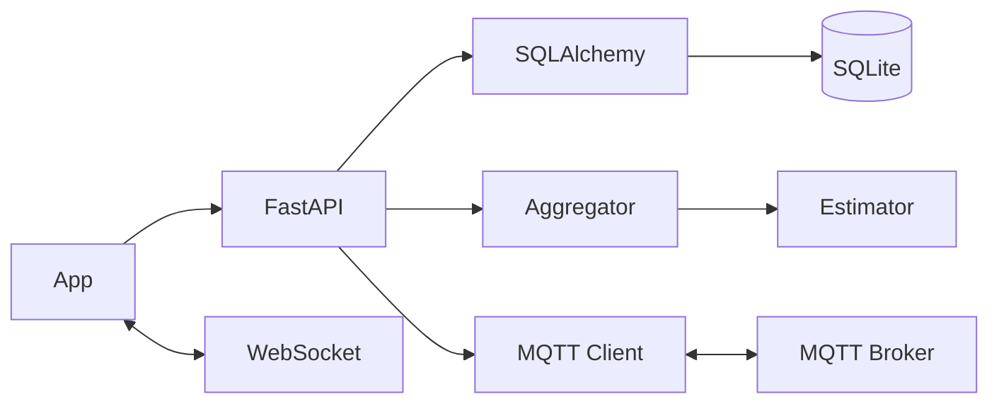
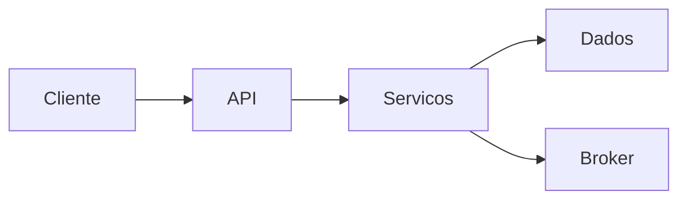

## RadarMottu API — Documentação Técnica Completa

Bem-vindo à documentação da API do projeto RadarMottu. Este README foi elaborado para ser abrangente: inclui visão geral da tecnologia, arquitetura, fluxos, endpoints, badges, instruções de execução, índices de navegação e referências.

### Índice
- [Visão Geral](#visão-geral)
- [Stack Tecnológico](#stack-tecnológico)
- [Arquitetura (Mermaid)](#arquitetura-mermaid)
- [Diagrama da Stack por Camadas](#diagrama-da-stack-por-camadas)
- [Fluxos Principais](#fluxos-principais)
- [Modelagem de Dados](#modelagem-de-dados)
- [Endpoints Principais](#endpoints-principais)
- [WebSocket](#websocket)
- [MQTT](#mqtt)
- [Configuração e Execução](#configuração-e-execução)
- [Variáveis e Arquivos Importantes](#variáveis-e-arquivos-importantes)
- [Boas Práticas e Observações](#boas-práticas-e-observações)
- [Licença](#licença)

### Navegação Rápida
- 🔝 [Topo](#radarmottu-api-—-documentação-técnica-completa)
- 🚀 [Executar](#configuração-e-execução)
- 🔌 [API](#endpoints-principais)
- 🔔 [MQTT](#mqtt) · 🔴 [WebSocket](#websocket)
- 🧭 [Arquitetura](#arquitetura-mermaid) · 🧱 [Stack em Camadas](#diagrama-da-stack-por-camadas)

### Badges e Ícones de Tecnologia


- 🐍 Python · ⚡ FastAPI · 🔷 Uvicorn · 🧱 SQLAlchemy · 💽 SQLite · 📡 MQTT · 🔴 WebSocket · 🧮 SciPy/numpy · 🛡️ JWT/Passlib · 🧰 Pydantic v2

---

## Visão Geral

A RadarMottu API oferece serviços para cadastro de veículos, gestão de vagas/estacionamento e localização de TAGs via leituras BLE. O sistema integra:
- HTTP/REST (FastAPI)
- WebSocket para broadcast de posição calculada
- MQTT para acionar buzzer nas TAGs
- SQLite/SQLAlchemy para persistência
- Algoritmo de multilateração (SciPy) para estimar posição a partir de RSSI

## Stack Tecnológico

- Linguagem: Python 3.10+
- Framework Web: FastAPI + Starlette
- ASGI Server: Uvicorn
- ORM: SQLAlchemy 2.x (SQLite)
- Validação de dados: Pydantic v2
- Segurança/JWT: python-jose, passlib[bcrypt]
- Tempo real: WebSocket nativo do FastAPI
- Mensageria IoT: paho-mqtt (MQTT broker público de exemplo: `broker.hivemq.com`)
- Cálculo de posição: numpy + SciPy (least_squares)

Dependências mapeadas em `requirements.txt`.

## Arquitetura (Mermaid)



[🔝 Voltar ao topo](#radarmottu-api-—-documentação-técnica-completa)

## Diagrama da Stack por Camadas



[🔝 Voltar ao topo](#radarmottu-api-—-documentação-técnica-completa)

## Fluxos Principais

- Ingestão de leituras BLE: `POST /api/reading/ble` recebe RSSIs por âncora e armazena em buffer circular. Um job assíncrono agrega a cada 5s, calcula posição quando há ≥3 âncoras com 5 leituras e emite via WebSocket.
- Localização: Clientes conectam em `/ws/position` para receber `position_update`. Endpoints `GET /api/locate/{plate}` retornam zona/vaga com base em sessão ativa.
- Estacionamento: `POST /api/parking/store` aloca vaga livre e cria sessão; `POST /api/parking/release` libera.
- Veículos: CRUD simplificado em `/api/vehicles`.
- Alarme TAG: `POST /api/tags/{tag_id}/alarm` publica `TOGGLE_BUZZER` no MQTT.
- Autenticação: `POST /token` gera JWT (senha com bcrypt). Observação: alguns endpoints ainda não exigem `Depends(oauth2_scheme)`.

## Modelagem de Dados

Entidades em `app/models.py`:
- `User(id, email, hashed_password, is_admin)`
- `Vehicle(id, plate, brand, model, color, year_make, year_model, vin, tag_code, created_at)`
- `ParkingSpot(id, zone, number, is_occupied)`
- `ParkingSession(id, plate, tag_code, zone, spot_number, start_ts, end_ts)`

Âncoras estáticas em `app/anchors.json` com coordenadas cartesianas.

## Endpoints Principais

Base: por padrão, o app registra routers no startup. Alguns endpoints úteis:

- `POST /token` — OAuth2 password (corpo: `username`, `password`). Retorna `access_token` e `token_type`.
- `POST /users/` — Cria usuário (email/senha). Apenas para bootstrap.
- `POST /api/vehicles` — Cria/atualiza veículo. Campos: `plate, brand, model, color, year_make, year_model, vin, tag_code`.
- `GET /api/vehicles/by-plate/{plate}` — Busca por placa.
- `PUT /api/vehicles/{plate}` — Atualiza campos.
- `DELETE /api/vehicles/{plate}` — Remove veículo.
- `POST /api/parking/store?plate=AAA1234` — Aloca vaga e cria sessão.
- `POST /api/parking/release?plate=AAA1234` — Encerra sessão e libera vaga.
- `GET /api/locate/{plate}` — Retorna `zone` e `spot` da sessão ativa.
- `GET /api/anchors` — Retorna mapa de âncoras.
- `POST /api/reading/ble` — Ingestão de RSSI por âncora.
- `POST /api/tags/{tag_id}/alarm` — Publica comando via MQTT.
- `GET /health` — Sinal de vida, uptime, clientes WS, status do DB e contagem de âncoras.

Observação: A documentação interativa fica em `/docs` (Swagger UI) e `/redoc`.

## WebSocket
- Endpoint: `/ws/position`
- Mensagens iniciais: `initial_setup` com âncoras e posição inicial
- Mensagens de atualização: `position_update` com `{ id, kind, pos: {x, y} }`

## MQTT
- Broker exemplo: `broker.hivemq.com:1883`
- Tópico de comando TAG: `radarmottu/tags/{tag_id}/command`
- Mensagem de alarme: `TOGGLE_BUZZER`
- Cliente centralizado em `app/services/mqtt.py` (ou inicializado em `app/main.py`)

## Configuração e Execução

Pré-requisitos:
- Python 3.10+
- Ambiente virtual recomendado

Instalação:
```bash
pip install -r requirements.txt
```

Execução (desenvolvimento):
```bash
python -m uvicorn app.main:app --reload --host 0.0.0.0 --port 8000
```

Banco de dados:
- SQLite em `radarmotu.db` (criado automaticamente por `models.Base.metadata.create_all`)

## Variáveis e Arquivos Importantes

- `app/main.py`: inicialização, CORS, endpoints BLE/health/WS, inclusão de routers, task assíncrona de agregação.
- `app/routers/*`: módulos REST (`vehicles`, `parking`, `locate`, `anchors`, `auth`, `tags`).
- `app/models.py`: modelos SQLAlchemy.
- `app/schemas.py`: modelos Pydantic v2.
- `app/security.py`: JWT e bcrypt; `OAuth2PasswordBearer(tokenUrl="token")`.
- `app/database.py`: engine/session/metadata (SQLite).
- `app/estimator.py`: RSSI->distância e multilateração (least squares).
- `app/services/mqtt.py`: cliente MQTT compartilhado.
- `app/anchors.json`: coordenadas das âncoras.

## Boas Práticas e Observações

- Segurança: mover `SECRET_KEY` para variável de ambiente e ativar `Depends(oauth2_scheme)` onde exigido.
- CORS: restringir `allow_origins` em produção.
- Robustez: validar payloads de leitura BLE e proteger contra spam; tratar reconexão MQTT.
- Escalabilidade: considerar Redis para buffers e pub/sub; Postgres para DB; workers para agregação.
- Observabilidade: adicionar logs estruturados, métricas e tracing.

## Licença

Projeto acadêmico/educacional. Ajuste a licença conforme necessidade da organização.


