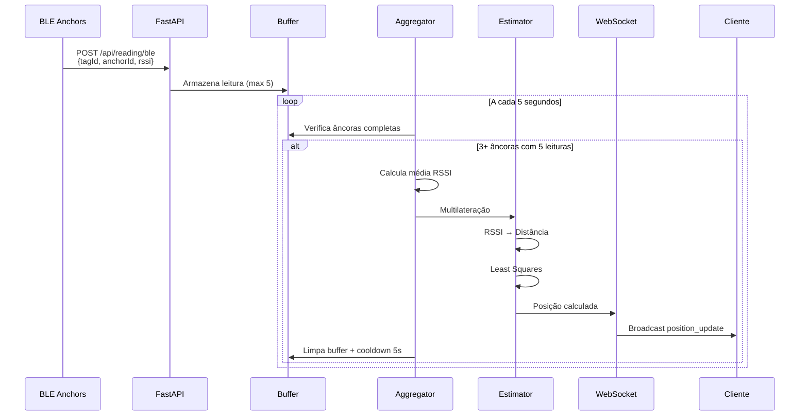
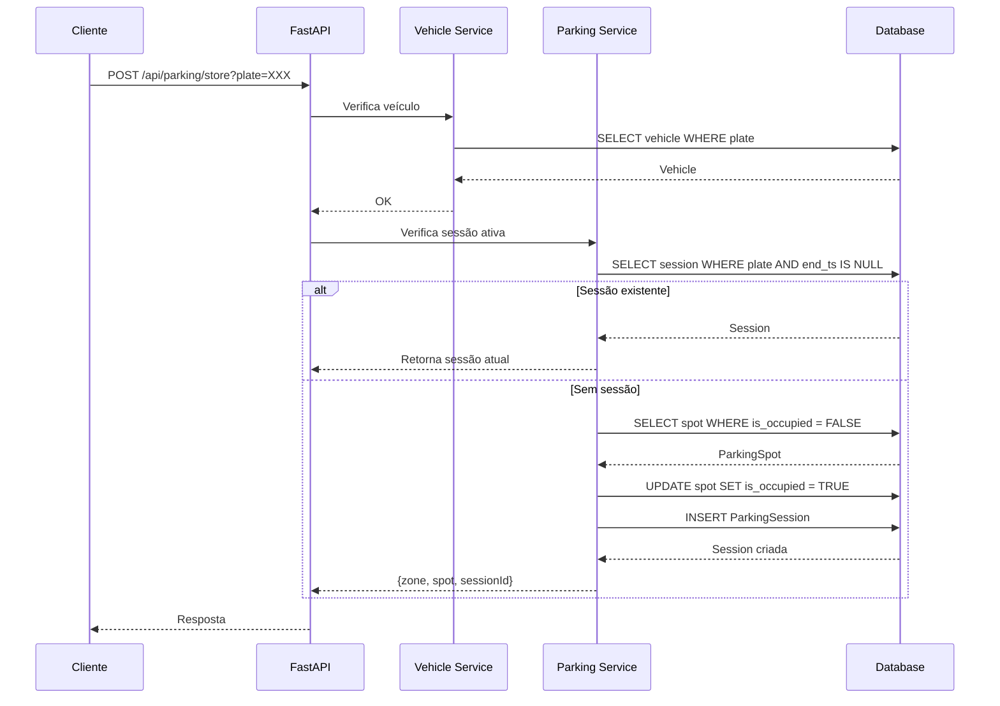
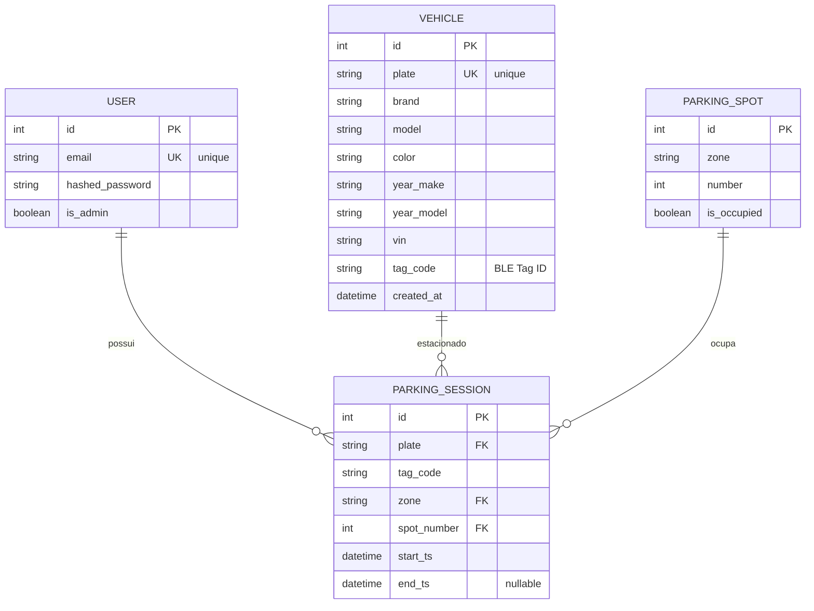

<div align="center">

# 🚗 RadarMotu API

### Sistema de Localização e Gerenciamento de Estacionamento Inteligente

[](https://www.python.org/)
[](https://fastapi.tiangolo.com/)
[](https://www.uvicorn.org/)
[](https://www.sqlalchemy.org/)
[](https://www.sqlite.org/)
[](https://pydantic.dev/)
[](https://scipy.org/)
[](https://numpy.org/)
[](https://pypi.org/project/paho-mqtt/)
[](https://developer.mozilla.org/en-US/docs/Web/API/WebSocket)
[](https://jwt.io/)
[](https://passlib.readthedocs.io/)
[](LICENSE)

**Sistema completo para gerenciamento de estacionamento com localização em tempo real de veículos através de tecnologia BLE (Bluetooth Low Energy) e algoritmos de multilateração.**

</div>

---

## 📑 Índice de Navegação

### 📚 Documentação Geral
- [🎯 Visão Geral](#-visão-geral)
- [⚡ Características Principais](#-características-principais)
- [🛠️ Stack Tecnológico](#️-stack-tecnológico)
- [📁 Estrutura do Projeto](#-estrutura-do-projeto)

### 🏗️ Arquitetura
- [🏛️ Arquitetura do Sistema](#️-arquitetura-do-sistema)
- [📊 Diagramas de Arquitetura](#-diagramas-de-arquitetura)
- [🔄 Fluxos de Dados](#-fluxos-de-dados)
- [📈 Modelo de Dados](#-modelo-de-dados)

### 🔧 Desenvolvimento
- [🚀 Instalação e Configuração](#-instalação-e-configuração)
- [▶️ Execução](#️-execução)
- [🧪 Testes e Validação](#-testes-e-validação)

### 📡 API e Endpoints
- [🔌 API REST](#-api-rest)
- [🔐 Autenticação](#-autenticação)
- [🚗 Gerenciamento de Veículos](#-gerenciamento-de-veículos)
- [🅿️ Gerenciamento de Estacionamento](#️-gerenciamento-de-estacionamento)
- [📍 Localização](#-localização)
- [🏷️ Gerenciamento de TAGs](#️-gerenciamento-de-tags)
- [📊 Health Check](#-health-check)

### 🌐 Protocolos em Tempo Real
- [🔴 WebSocket](#-websocket)
- [📡 MQTT](#-mqtt)

### 🧮 Algoritmos e Cálculos
- [📍 Sistema de Localização](#-sistema-de-localização)
- [📐 Multilateração](#-multilateração)
- [📶 Conversão RSSI para Distância](#-conversão-rssi-para-distância)

### 📝 Detalhamento Técnico
- [📂 Arquivos e Componentes](#-arquivos-e-componentes)
- [🔍 Exemplos de Uso](#-exemplos-de-uso)
- [⚠️ Boas Práticas](#-boas-práticas)
- [🚧 Melhorias Futuras](#-melhorias-futuras)

---

## 🎯 Visão Geral

A **RadarMotu API** é uma solução completa e moderna para gerenciamento inteligente de estacionamentos, oferecendo localização em tempo real de veículos através de tecnologia **BLE (Bluetooth Low Energy)** e algoritmos avançados de **multilateração**.

O sistema foi desenvolvido para fornecer:

- 📍 **Localização em Tempo Real**: Utiliza múltiplas âncoras BLE para calcular a posição precisa de TAGs instaladas nos veículos através de algoritmos de multilateração
- 🅿️ **Gerenciamento Inteligente de Vagas**: Sistema completo de alocação, ocupação e liberação de vagas de estacionamento
- 🚗 **Cadastro de Veículos**: CRUD completo para gerenciamento de veículos com informações detalhadas
- 🔔 **Sistema de Alarmes**: Acionamento remoto de buzzers nas TAGs via protocolo MQTT
- 🔐 **Autenticação Segura**: Sistema de autenticação baseado em JWT com OAuth2
- 📊 **Monitoramento em Tempo Real**: WebSocket para transmissão de atualizações de posição instantâneas

---

## ⚡ Características Principais

### 🌟 Funcionalidades Principais

- ✅ **API REST Completa** com FastAPI e documentação automática (Swagger/ReDoc)
- ✅ **Localização por Multilateração** usando RSSI de múltiplas âncoras BLE
- ✅ **WebSocket** para atualizações em tempo real de posições
- ✅ **MQTT** para controle remoto de TAGs (buzzers)
- ✅ **Sistema de Autenticação** JWT com OAuth2
- ✅ **Banco de Dados SQLite** com ORM SQLAlchemy 2.x
- ✅ **Validação de Dados** com Pydantic v2
- ✅ **CORS Configurado** para integração com aplicações front-end
- ✅ **Health Check** para monitoramento do sistema

---

## 🛠️ Stack Tecnológico

### 🐍 Linguagem e Framework

| Tecnologia | Versão | Descrição | Badge |
|------------|--------|-----------|-------|
| **Python** | 3.10+ | Linguagem de programação principal |  |
| **FastAPI** | 0.112.2 | Framework web moderno e rápido |  |
| **Uvicorn** | 0.30.6 | Servidor ASGI de alta performance |  |

### 🗄️ Banco de Dados e ORM

| Tecnologia | Versão | Descrição | Badge |
|------------|--------|-----------|-------|
| **SQLite** | 3.45 | Banco de dados relacional embutido |  |
| **SQLAlchemy** | 2.0.34 | ORM (Object-Relational Mapping) |  |

### 📦 Validação e Serialização

| Tecnologia | Versão | Descrição | Badge |
|------------|--------|-----------|-------|
| **Pydantic** | 2.9.1 | Validação de dados e serialização |  |

### 🔐 Segurança e Autenticação

| Tecnologia | Versão | Descrição | Badge |
|------------|--------|-----------|-------|
| **python-jose** | 3.3.0 | Implementação de JWT (JSON Web Tokens) |  |
| **passlib** | 1.7.4 | Hashing de senhas com bcrypt |  |

### 🔴 Protocolos em Tempo Real

| Tecnologia | Versão | Descrição | Badge |
|------------|--------|-----------|-------|
| **WebSocket** | Nativo | Comunicação bidirecional em tempo real |  |
| **paho-mqtt** | 2.1.0 | Cliente MQTT para IoT |  |

### 🧮 Computação Científica

| Tecnologia | Versão | Descrição | Badge |
|------------|--------|-----------|-------|
| **NumPy** | 1.26.4 | Computação numérica e arrays multidimensionais |  |
| **SciPy** | 1.11.4 | Algoritmos científicos e otimização |  |
| **filterpy** | 1.4.5 | Filtros Kalman e processamento de sinal |  |

### 📋 Dependências Adicionais

| Tecnologia | Versão | Descrição |
|------------|--------|-----------|
| **python-multipart** | 0.0.9 | Suporte para upload de arquivos multipart/form-data |

---

## 📁 Estrutura do Projeto

```
radarmotu-api/
│
├── 📂 radarmotu-api/
│   │
│   ├── 📂 app/                          # Aplicação principal
│   │   │
│   │   ├── 📄 __init__.py               # Inicialização do pacote
│   │   ├── 📄 main.py                   # Ponto de entrada da aplicação
│   │   ├── 📄 models.py                 # Modelos SQLAlchemy (ORM)
│   │   ├── 📄 schemas.py                # Schemas Pydantic (validação)
│   │   ├── 📄 database.py               # Configuração do banco de dados
│   │   ├── 📄 security.py               # Segurança (JWT, bcrypt)
│   │   ├── 📄 estimator.py              # Algoritmos de localização
│   │   ├── 📄 anchors.json              # Coordenadas das âncoras BLE
│   │   ├── 📄 requirements.txt           # Dependências do app
│   │   ├── 📄 uvicorn.sh                # Script de inicialização
│   │   │
│   │   ├── 📂 routers/                  # Módulos de rotas REST
│   │   │   ├── 📄 vehicles.py           # Rotas de veículos
│   │   │   ├── 📄 parking.py            # Rotas de estacionamento
│   │   │   ├── 📄 locate.py             # Rotas de localização
│   │   │   ├── 📄 anchors.py            # Rotas de âncoras
│   │   │   ├── 📄 auth.py               # Rotas de autenticação
│   │   │   └── 📄 tags.py               # Rotas de TAGs
│   │   │
│   │   └── 📂 services/                 # Serviços auxiliares
│   │       ├── 📄 locator.py            # Serviço de localização
│   │       └── 📄 mqtt.py                # Cliente MQTT
│   │
│   ├── 📄 radarmotu.db                  # Banco de dados SQLite (gerado)
│   ├── 📄 requirements.txt               # Dependências principais
│   ├── 📄 README.md                      # Documentação (este arquivo)
│   └── 📄 inicializacao.md               # Guia de inicialização
│
└── 📄 .gitignore                         # Arquivos ignorados pelo Git
```

### 📝 Descrição dos Diretórios

#### `/app` - Aplicação Principal
- **`main.py`**: Configuração do FastAPI, middlewares, WebSocket, tarefas assíncronas
- **`models.py`**: Modelos de banco de dados (User, Vehicle, ParkingSpot, ParkingSession)
- **`schemas.py`**: Schemas Pydantic para validação de requisições/respostas
- **`database.py`**: Engine SQLAlchemy, sessões e base declarativa
- **`security.py`**: Funções de autenticação JWT e hash de senhas
- **`estimator.py`**: Algoritmos de conversão RSSI→distância e multilateração

#### `/app/routers` - Endpoints REST
- **`vehicles.py`**: CRUD completo de veículos
- **`parking.py`**: Alocação e liberação de vagas
- **`locate.py`**: Consulta de localização por placa
- **`anchors.py`**: Consulta de configuração de âncoras
- **`auth.py`**: Login e criação de usuários
- **`tags.py`**: Controle de TAGs via MQTT

#### `/app/services` - Serviços Auxiliares
- **`mqtt.py`**: Cliente MQTT centralizado
- **`locator.py`**: Serviços futuros de mapeamento de zonas/vagas

---

## 🏛️ Arquitetura do Sistema

### 🎨 Visão Geral da Arquitetura

```mermaid
graph TB
    subgraph "Cliente / Frontend"
        APP[📱 Aplicação Mobile/Web]
    end
    
    subgraph "API Layer"
        FASTAPI[⚡ FastAPI Server]
        WS[🔴 WebSocket Manager]
        REST[📡 REST Endpoints]
    end
    
    subgraph "Business Logic"
        AGG[Aggregator Task]
        EST[📐 Estimator Service]
        LOC[📍 Locator Service]
    end
    
    subgraph "Data Layer"
        ORM[🧱 SQLAlchemy ORM]
        DB[(💽 SQLite Database)]
        CACHE[📦 In-Memory Cache]
    end
    
    subgraph "External Services"
        MQTT_CLIENT[📡 MQTT Client]
        MQTT_BROKER[🌐 MQTT Broker<br/>broker.hivemq.com]
        ANCHORS[🏷️ BLE Anchors<br/>A1, A2, A3, A4]
    end
    
    APP -->|HTTP/REST| REST
    APP <-->|WebSocket| WS
    REST --> FASTAPI
    WS --> FASTAPI
    FASTAPI --> AGG
    AGG --> EST
    EST --> LOC
    FASTAPI --> ORM
    ORM --> DB
    FASTAPI --> CACHE
    FASTAPI --> MQTT_CLIENT
    MQTT_CLIENT <--> MQTT_BROKER
    ANCHORS -->|RSSI Readings| FASTAPI
    MQTT_BROKER -->|Commands| ANCHORS
    
    style FASTAPI fill:#009688
    style WS fill:#00B2A9
    style DB fill:#003B57
    style MQTT_BROKER fill:#660099
```



### 📊 Arquitetura em Camadas

```mermaid
graph TD
    subgraph "Camada 1: Apresentação"
        L1A[📱 Cliente Web]
        L1B[📱 Cliente Mobile]
        L1C[🔌 WebSocket Client]
    end
    
    subgraph "Camada 2: API Gateway"
        L2A[⚡ FastAPI Application]
        L2B[🔴 WebSocket Endpoint]
        L2C[📡 REST Endpoints]
        L2D[🛡️ CORS Middleware]
    end
    
    subgraph "Camada 3: Lógica de Negócio"
        L3A[🚗 Vehicle Service]
        L3B[🅿️ Parking Service]
        L3C[📍 Location Service]
        L3D[🏷️ Tag Service]
        L3E[🔐 Auth Service]
        L3F[📊 Aggregator Task]
        L3G[📐 Estimator Engine]
    end
    
    subgraph "Camada 4: Persistência"
        L4A[🧱 SQLAlchemy ORM]
        L4B[💽 SQLite Database]
        L4C[📦 In-Memory Buffer]
    end
    
    subgraph "Camada 5: Protocolos Externos"
        L5A[📡 MQTT Client]
        L5B[🌐 MQTT Broker]
    end
    
    L1A --> L2A
    L1B --> L2A
    L1C --> L2B
    L2A --> L3A
    L2A --> L3B
    L2A --> L3C
    L2A --> L3D
    L2A --> L3E
    L2B --> L3F
    L3F --> L3G
    L3A --> L4A
    L3B --> L4A
    L3C --> L4A
    L3F --> L4C
    L3D --> L5A
    L5A --> L5B
    
    style L2A fill:#009688
    style L4B fill:#003B57
    style L5B fill:#660099
```



### 🔄 Fluxo de Dados de Localização



### 🔄 Fluxo de Estacionamento



---

## 📈 Modelo de Dados

### 🗄️ Diagrama Entidade-Relacionamento



### 📋 Detalhamento das Entidades

#### 👤 User (Usuário)
```python
{
    "id": int,              # Chave primária
    "email": str,           # Email único (username)
    "hashed_password": str,  # Senha com hash bcrypt
    "is_admin": bool        # Flag de administrador
}
```

#### 🚗 Vehicle (Veículo)
```python
{
    "id": int,              # Chave primária
    "plate": str,           # Placa (única, normalizada: uppercase)
    "brand": str,           # Marca (ex: "Toyota")
    "model": str,           # Modelo (ex: "Corolla")
    "color": str,           # Cor (ex: "Branco")
    "year_make": str,       # Ano de fabricação
    "year_model": str,      # Ano do modelo
    "vin": str,            # VIN (Vehicle Identification Number)
    "tag_code": str,       # Código da TAG BLE associada
    "created_at": datetime # Data de criação
}
```

#### 🅿️ ParkingSpot (Vaga de Estacionamento)
```python
{
    "id": int,              # Chave primária
    "zone": str,           # Zona (ex: "A", "B", "C")
    "number": int,         # Número da vaga na zona
    "is_occupied": bool    # Status de ocupação
}
```

#### 📋 ParkingSession (Sessão de Estacionamento)
```python
{
    "id": int,              # Chave primária
    "plate": str,           # Placa do veículo
    "tag_code": str,       # Código da TAG
    "zone": str,           # Zona onde está estacionado
    "spot_number": int,    # Número da vaga
    "start_ts": datetime,  # Início da sessão
    "end_ts": datetime     # Fim da sessão (null se ativa)
}
```

---

## 🚀 Instalação e Configuração

### 📋 Pré-requisitos

- **Python 3.10+** instalado
- **pip** (gerenciador de pacotes Python)
- **Git** (opcional, para clonar o repositório)

### 💻 Instalação Passo a Passo

#### 1️⃣ Clonar o Repositório (ou baixar)

```bash
git clone <repository-url>
cd radarmotu-api/radarmotu-api
```

#### 2️⃣ Criar Ambiente Virtual (Recomendado)

```bash
# Windows
python -m venv .venv
.venv\Scripts\activate

# Linux/Mac
python3 -m venv .venv
source .venv/bin/activate
```

#### 3️⃣ Instalar Dependências

```bash
# Instalar a partir do requirements.txt principal
pip install -r requirements.txt

# OU instalar do requirements.txt dentro de app/
pip install -r app/requirements.txt
```

#### 4️⃣ Verificar Instalação

```bash
python --version  # Deve mostrar 3.10+
pip list          # Lista todas as dependências instaladas
```

---

## ▶️ Execução

### 🎬 Iniciar o Servidor

#### Modo Desenvolvimento (com reload automático)

```bash
python -m uvicorn app.main:app --reload --host 0.0.0.0 --port 8000
```

#### Modo Produção

```bash
python -m uvicorn app.main:app --host 0.0.0.0 --port 8000 --workers 4
```

#### Usando Ambiente Virtual (Windows)

```bash
.\.venv\Scripts\python.exe -m uvicorn app.main:app --reload --host 0.0.0.0 --port 8000
```

### 🌐 Acessar a Aplicação

Após iniciar o servidor, a aplicação estará disponível em:

- **API Base**: `http://localhost:8000`
- **Documentação Swagger**: `http://localhost:8000/docs`
- **Documentação ReDoc**: `http://localhost:8000/redoc`
- **Health Check**: `http://localhost:8000/health`

### 🔧 Variáveis de Ambiente (Opcional)

Criar arquivo `.env` na raiz do projeto:

```env
# Segurança
SECRET_KEY=your-secret-key-change-this-in-production
ALGORITHM=HS256
ACCESS_TOKEN_EXPIRE_MINUTES=10080

# Banco de Dados
DATABASE_URL=sqlite:///./radarmotu.db

# MQTT
MQTT_SERVER=broker.hivemq.com
MQTT_PORT=1883

# CORS
ALLOWED_ORIGINS=http://localhost:3000,http://localhost:8080
```

---

## 🔌 API REST

### 📍 Base URL

Todas as requisições devem ser feitas para:
```
http://localhost:8000
```

### 📚 Documentação Interativa

- **Swagger UI**: `http://localhost:8000/docs`
- **ReDoc**: `http://localhost:8000/redoc`

---

## 🔐 Autenticação

### 🔑 Obter Token de Acesso

**Endpoint**: `POST /token`

**Content-Type**: `application/x-www-form-urlencoded`

**Body**:
```
username=user@example.com&password=senha123
```

**Resposta**:
```json
{
    "access_token": "eyJhbGciOiJIUzI1NiIsInR5cCI6IkpXVCJ9...",
    "token_type": "bearer"
}
```

**Exemplo cURL**:
```bash
curl -X POST "http://localhost:8000/token" \
  -H "Content-Type: application/x-www-form-urlencoded" \
  -d "username=user@example.com&password=senha123"
```

### 👤 Criar Usuário

**Endpoint**: `POST /users/`

**Body** (JSON):
```json
{
    "email": "user@example.com",
    "password": "senha123",
    "is_admin": false
}
```

**Resposta**:
```json
{
    "id": 1,
    "email": "user@example.com"
}
```

### 🔒 Usar Token em Requisições

Adicionar o header:
```
Authorization: Bearer <access_token>
```

---

## 🚗 Gerenciamento de Veículos

### ➕ Criar/Atualizar Veículo

**Endpoint**: `POST /api/vehicles`

**Body** (JSON):
```json
{
    "plate": "ABC1234",
    "brand": "Toyota",
    "model": "Corolla",
    "color": "Branco",
    "year_make": "2023",
    "year_model": "2024",
    "vin": "1HGBH41JXMN109186",
    "tag_code": "TAG001"
}
```

**Resposta**:
```json
{
    "id": 1,
    "plate": "ABC1234",
    "brand": "Toyota",
    "model": "Corolla",
    "color": "Branco",
    "year_make": "2023",
    "year_model": "2024",
    "vin": "1HGBH41JXMN109186",
    "tag_code": "TAG001"
}
```

### 🔍 Buscar por Placa

**Endpoint**: `GET /api/vehicles/by-plate/{plate}`

**Exemplo**: `GET /api/vehicles/by-plate/ABC1234`

**Resposta**: (mesmo formato do POST)

### ✏️ Atualizar Veículo

**Endpoint**: `PUT /api/vehicles/{plate}`

**Body** (JSON - campos opcionais):
```json
{
    "brand": "Honda",
    "model": "Civic",
    "color": "Preto"
}
```

### 🗑️ Deletar Veículo

**Endpoint**: `DELETE /api/vehicles/{plate}`

**Resposta**:
```json
{
    "status": "deleted"
}
```

---

## 🅿️ Gerenciamento de Estacionamento

### 🚗 Alocar Vaga (Estacionar)

**Endpoint**: `POST /api/parking/store?plate=ABC1234`

**Resposta**:
```json
{
    "zone": "A",
    "spot": 1,
    "sessionId": 1
}
```

**Comportamento**:
- Verifica se o veículo está cadastrado
- Se já tem sessão ativa, retorna a existente
- Busca primeira vaga livre
- Marca vaga como ocupada
- Cria sessão de estacionamento

### 🚪 Liberar Vaga (Sair)

**Endpoint**: `POST /api/parking/release?plate=ABC1234`

**Resposta**:
```json
{
    "status": "released",
    "zone": "A",
    "spot": 1
}
```

**Comportamento**:
- Encontra sessão ativa do veículo
- Marca vaga como livre
- Define `end_ts` da sessão

---

## 📍 Localização

### 🔍 Consultar Localização por Placa

**Endpoint**: `GET /api/locate/{plate}`

**Exemplo**: `GET /api/locate/ABC1234`

**Resposta**:
```json
{
    "zone": "A",
    "spot": 1
}
```

**Observação**: Retorna a localização com base na sessão de estacionamento ativa.

---

## 🏷️ Gerenciamento de TAGs

### 🚨 Acionar Alarme da TAG

**Endpoint**: `POST /api/tags/{tag_id}/alarm`

**Exemplo**: `POST /api/tags/TAG001/alarm`

**Resposta**:
```json
{
    "status": "comando toggle enviado",
    "tag_id": "TAG001"
}
```

**Comportamento**:
- Publica comando `TOGGLE_BUZZER` no tópico MQTT: `radarmottu/tags/{tag_id}/command`
- A TAG deve estar subscrita neste tópico para receber o comando

---

## 📊 Health Check

### ❤️ Status do Sistema

**Endpoint**: `GET /health`

**Resposta**:
```json
{
    "status": "ok",
    "uptime_s": 3600.5,
    "db_ok": true,
    "ws_clients": 2,
    "anchors_count": 4
}
```

**Campos**:
- `status`: "ok" ou "degraded"
- `uptime_s`: Tempo de execução em segundos
- `db_ok`: Status da conexão com o banco
- `ws_clients`: Número de clientes WebSocket conectados
- `anchors_count`: Número de âncoras configuradas

---

## 🔴 WebSocket

### 🔌 Endpoint

```
ws://localhost:8000/ws/position
```

### 📨 Mensagens Enviadas pelo Servidor

#### 1. Mensagem Inicial (Setup)

Enviada automaticamente quando o cliente conecta:

```json
{
    "type": "initial_setup",
    "payload": {
        "initial_pos": {
            "x": 9.795,
            "y": 0.205
        },
        "anchors": {
            "A1": { "x": 5.00, "y": 5.00 },
            "A2": { "x": 14.59, "y": 5.00 },
            "A3": { "x": 14.59, "y": -4.59 },
            "A4": { "x": 5.00, "y": -4.59 }
        }
    }
}
```

#### 2. Atualização de Posição

Enviada quando uma nova posição é calculada:

```json
{
    "type": "position_update",
    "payload": {
        "id": "TAG01",
        "kind": "tag",
        "pos": {
            "x": 10.5,
            "y": 2.3
        }
    }
}
```

### 💻 Exemplo de Cliente JavaScript

```javascript
const ws = new WebSocket('ws://localhost:8000/ws/position');

ws.onopen = () => {
    console.log('Conectado ao WebSocket');
};

ws.onmessage = (event) => {
    const data = JSON.parse(event.data);
    
    if (data.type === 'initial_setup') {
        console.log('Setup inicial:', data.payload);
        // Renderizar mapa com âncoras
    } else if (data.type === 'position_update') {
        console.log('Nova posição:', data.payload.pos);
        // Atualizar posição da TAG no mapa
    }
};

ws.onerror = (error) => {
    console.error('Erro WebSocket:', error);
};

ws.onclose = () => {
    console.log('Desconectado do WebSocket');
};
```

---

## 📡 MQTT

### 🌐 Configuração do Broker

O sistema está configurado para usar o broker público **HiveMQ**:
- **Servidor**: `broker.hivemq.com`
- **Porta**: `1883`

### 📤 Publicação de Comandos

Quando um comando de alarme é enviado via API (`POST /api/tags/{tag_id}/alarm`), o sistema publica no tópico:

```
radarmottu/tags/{tag_id}/command
```

**Mensagem**:
```
TOGGLE_BUZZER
```

### 📥 Subscrição (TAG)

As TAGs devem estar subscritas no tópico para receber comandos:

```
radarmottu/tags/{tag_id}/command
```

### 🔧 Configuração Personalizada

Para usar um broker diferente, edite `app/services/mqtt.py` ou `app/main.py`:

```python
MQTT_SERVER = "seu-broker.com"
MQTT_PORT = 1883
```

---

## 📍 Sistema de Localização

### 🧮 Algoritmo de Multilateração

O sistema utiliza **multilateração não-linear** para calcular a posição de TAGs baseado em leituras RSSI de múltiplas âncoras BLE.

### 📐 Processo de Cálculo

#### 1️⃣ Conversão RSSI → Distância

Utiliza o modelo de propagação logarítmica:

```
d = 10^((TX_POWER - RSSI) / (10 * N_PATH))
```

Onde:
- `TX_POWER = -61.0 dBm` (potência de transmissão de referência)
- `N_PATH = 2.5` (expoente de perda de caminho)
- `RSSI`: Recebido do sensor (em dBm)

#### 2️⃣ Multilateração por Least Squares

Utiliza o algoritmo **Levenberg-Marquardt** (método `lm` do SciPy) para resolver o sistema não-linear de equações:

```
minimize: Σ ||d_i - sqrt((x - x_i)² + (y - y_i)²)||²
```

Onde:
- `d_i`: Distância calculada a partir do RSSI da âncora `i`
- `(x_i, y_i)`: Coordenadas conhecidas da âncora `i`
- `(x, y)`: Posição da TAG (a ser calculada)

### 🎯 Requisitos para Cálculo

- Mínimo de **3 âncoras** com leituras válidas
- Cada âncora deve ter **5 leituras RSSI** armazenadas
- O sistema agrega as leituras calculando a **média RSSI** por âncora

### ⏱️ Ciclo de Agregação

- **Intervalo**: A cada 5 segundos
- **Condição**: Verifica se há ≥3 âncoras completas (5 leituras cada)
- **Cooldown**: 5 segundos após cada cálculo
- **Buffer**: Máximo de 5 leituras por âncora (FIFO - First In, First Out)

---

## 📐 Multilateração

### 🔬 Detalhamento do Algoritmo

O algoritmo implementado em `app/estimator.py`:

```python
def multilaterate(anchors: dict, readings: list[dict]) -> dict:
    """
    Calcula a posição (x, y) usando multilateração não-linear.
    
    Args:
        anchors: Dicionário com coordenadas das âncoras
                 Ex: {"A1": {"x": 5.0, "y": 5.0}, ...}
        readings: Lista de leituras agregadas
                  Ex: [{"anchorId": "A1", "rssi": -67}, ...]
    
    Returns:
        {"x": float, "y": float} ou {} se não houver leituras suficientes
    """
```

### 📊 Exemplo de Cálculo

**Entrada**:
```json
{
    "anchors": {
        "A1": {"x": 5.0, "y": 5.0},
        "A2": {"x": 14.59, "y": 5.0},
        "A3": {"x": 14.59, "y": -4.59}
    },
    "readings": [
        {"anchorId": "A1", "rssi": -67},
        {"anchorId": "A2", "rssi": -72},
        {"anchorId": "A3", "rssi": -75}
    ]
}
```

**Processamento**:
1. Converte RSSI → Distância:
   - A1: -67 dBm → ~2.5m
   - A2: -72 dBm → ~4.0m
   - A3: -75 dBm → ~5.0m

2. Resolve sistema não-linear:
   - Inicial: (9.8, 0.2) - centro das âncoras
   - Resultado: (x, y) que minimiza os resíduos

**Saída**:
```json
{
    "x": 10.5,
    "y": 2.3
}
```

---

## 📶 Conversão RSSI para Distância

### 📐 Fórmula

```python
def rssi_to_dist(rssi: float) -> float:
    """
    Converte RSSI (dBm) para distância (metros).
    
    Fórmula: d = 10^((TX_POWER - RSSI) / (10 * N_PATH))
    
    Parâmetros:
        TX_POWER = -61.0 dBm  (potência de referência a 1m)
        N_PATH = 2.5          (expoente de perda de caminho)
    """
    return 10 ** ((TX_POWER - rssi) / (10 * N_PATH))
```

### 📊 Tabela de Referência

| RSSI (dBm) | Distância Aproximada (m) |
|------------|-------------------------|
| -50        | ~1.0                    |
| -60        | ~1.6                    |
| -70        | ~2.5                    |
| -80        | ~4.0                    |
| -90        | ~6.3                    |
| -100       | ~10.0                   |

**Observação**: Valores podem variar conforme o ambiente (obstáculos, interferência, etc.).

---

## 📂 Arquivos e Componentes

### 📄 `app/main.py`

**Responsabilidades**:
- Inicialização da aplicação FastAPI
- Configuração de CORS
- Endpoints principais: `/api/reading/ble`, `/health`, `/ws/position`
- Gerenciamento de conexões WebSocket
- Tarefa assíncrona de agregação e cálculo
- Setup do cliente MQTT
- Inclusão de routers modulares

**Destaques**:
- `ConnectionManager`: Gerencia conexões WebSocket
- `aggregator_and_calculator_task()`: Task assíncrona que roda a cada 5s
- Buffer circular: `readings_history` com `deque(maxlen=5)`
- Cooldown de 5s após cada cálculo

### 📄 `app/models.py`

**Modelos SQLAlchemy**:
- `User`: Usuários do sistema
- `Vehicle`: Veículos cadastrados
- `ParkingSpot`: Vagas de estacionamento
- `ParkingSession`: Sessões de estacionamento

**Características**:
- Uso de `declarative_base()` do SQLAlchemy 2.x
- Índices em campos frequentes (plate, email, zone)
- Timestamps automáticos (`func.now()`)

### 📄 `app/schemas.py`

**Schemas Pydantic v2**:
- `Token`: Resposta de autenticação
- `UserCreate`: Criação de usuário
- `BleReading`: Leitura BLE recebida
- `VehicleIn/VehicleOut`: Entrada/saída de veículos
- `SpotOverview`: Visão geral de vagas
- `AnchorOut`: Dados de âncoras

**Validação**:
- Validação automática de tipos
- Serialização/deserialização JSON

### 📄 `app/database.py`

**Configuração**:
- `DATABASE_URL`: `sqlite:///./radarmotu.db`
- Engine SQLAlchemy com `check_same_thread=False`
- `SessionLocal`: Factory de sessões
- `Base`: Base declarativa para modelos

### 📄 `app/security.py`

**Funcionalidades**:
- `verify_password()`: Verifica senha com bcrypt
- `get_password_hash()`: Gera hash bcrypt
- `create_access_token()`: Gera JWT
- `oauth2_scheme`: Esquema OAuth2 para FastAPI

**Configuração**:
- `SECRET_KEY`: Chave secreta (deve estar em .env em produção)
- `ALGORITHM`: HS256
- `ACCESS_TOKEN_EXPIRE_MINUTES`: 10080 (7 dias)

### 📄 `app/estimator.py`

**Funções**:
- `rssi_to_dist()`: Converte RSSI → distância
- `multilaterate()`: Calcula posição usando least squares

**Bibliotecas**:
- `numpy`: Arrays e cálculos vetoriais
- `scipy.optimize.least_squares`: Otimização não-linear

### 📄 `app/routers/vehicles.py`

**Endpoints**:
- `POST /api/vehicles`: Criar/atualizar veículo
- `GET /api/vehicles/by-plate/{plate}`: Buscar por placa
- `PUT /api/vehicles/{plate}`: Atualizar veículo
- `DELETE /api/vehicles/{plate}`: Deletar veículo

**Funcionalidades**:
- Normalização de placa (uppercase, trim)
- Validação de placa obrigatória
- Upsert: cria se não existe, atualiza se existe

### 📄 `app/routers/parking.py`

**Endpoints**:
- `POST /api/parking/store`: Alocar vaga
- `POST /api/parking/release`: Liberar vaga

**Funcionalidades**:
- Criação automática de 30 vagas na zona "A" se não existirem
- Verificação de sessão ativa antes de criar nova
- Busca da primeira vaga livre (ordem: zona → número)
- Atualização de status de ocupação

### 📄 `app/routers/locate.py`

**Endpoints**:
- `GET /api/locate/{plate}`: Consultar localização

**Funcionalidades**:
- Busca sessão ativa (end_ts IS NULL)
- Retorna zona e número da vaga

### 📄 `app/routers/anchors.py`

**Endpoints**:
- `GET /api/anchors`: Listar âncoras configuradas

**Funcionalidades**:
- Lê arquivo `anchors.json`
- Retorna coordenadas de todas as âncoras

### 📄 `app/routers/auth.py`

**Endpoints**:
- `POST /token`: Login (OAuth2)
- `POST /users/`: Criar usuário

**Funcionalidades**:
- Autenticação OAuth2 password flow
- Geração de JWT com expiração
- Hash de senha com bcrypt

### 📄 `app/routers/tags.py`

**Endpoints**:
- `POST /api/tags/{tag_id}/alarm`: Acionar buzzer

**Funcionalidades**:
- Publica comando MQTT
- Tópico: `radarmottu/tags/{tag_id}/command`
- Mensagem: `TOGGLE_BUZZER`

### 📄 `app/services/mqtt.py`

**Responsabilidades**:
- Cliente MQTT centralizado
- Setup de conexão com broker
- Callbacks de conexão

### 📄 `app/services/locator.py`

**Funcionalidades** (Futuras):
- `snap_to_zone()`: Mapeia coordenada (x,y) para zona
- `snap_to_spot()`: Mapeia coordenada (x,y) para vaga específica

**Status**: Stubs preparados para implementação futura com polígonos.

### 📄 `app/anchors.json`

**Estrutura**:
```json
{
    "A1": { "x": 5.00, "y": 5.00 },
    "A2": { "x": 14.59, "y": 5.00 },
    "A3": { "x": 14.59, "y": -4.59 },
    "A4": { "x": 5.00, "y": -4.59 }
}
```

**Coordenadas Cartesianas**:
- Sistema de coordenadas 2D
- Unidade em metros (assumido)
- 4 âncoras configuradas formando um retângulo

---

## 🔍 Exemplos de Uso

### 📱 Exemplo Completo: Estacionar Veículo

#### 1. Criar Usuário (se necessário)

```bash
curl -X POST "http://localhost:8000/users/" \
  -H "Content-Type: application/json" \
  -d '{
    "email": "user@example.com",
    "password": "senha123",
    "is_admin": false
  }'
```

#### 2. Autenticar

```bash
curl -X POST "http://localhost:8000/token" \
  -H "Content-Type: application/x-www-form-urlencoded" \
  -d "username=user@example.com&password=senha123"
```

**Resposta**:
```json
{
    "access_token": "eyJhbGciOiJIUzI1NiIsInR5cCI6IkpXVCJ9...",
    "token_type": "bearer"
}
```

#### 3. Cadastrar Veículo

```bash
curl -X POST "http://localhost:8000/api/vehicles" \
  -H "Content-Type: application/json" \
  -H "Authorization: Bearer <access_token>" \
  -d '{
    "plate": "ABC1234",
    "brand": "Toyota",
    "model": "Corolla",
    "color": "Branco",
    "year_make": "2023",
    "year_model": "2024",
    "vin": "1HGBH41JXMN109186",
    "tag_code": "TAG001"
  }'
```

#### 4. Estacionar

```bash
curl -X POST "http://localhost:8000/api/parking/store?plate=ABC1234" \
  -H "Authorization: Bearer <access_token>"
```

**Resposta**:
```json
{
    "zone": "A",
    "spot": 1,
    "sessionId": 1
}
```

#### 5. Consultar Localização

```bash
curl -X GET "http://localhost:8000/api/locate/ABC1234" \
  -H "Authorization: Bearer <access_token>"
```

**Resposta**:
```json
{
    "zone": "A",
    "spot": 1
}
```

#### 6. Liberar Vaga

```bash
curl -X POST "http://localhost:8000/api/parking/release?plate=ABC1234" \
  -H "Authorization: Bearer <access_token>"
```

### 📡 Exemplo: Enviar Leitura BLE

```bash
curl -X POST "http://localhost:8000/api/reading/ble" \
  -H "Content-Type: application/json" \
  -d '{
    "tagId": "TAG001",
    "anchorId": "A1",
    "rssi": -67
  }'
```

**Observação**: O sistema agrega leituras a cada 5 segundos. Envie leituras para múltiplas âncoras para calcular a posição.

### 🔔 Exemplo: Acionar Alarme da TAG

```bash
curl -X POST "http://localhost:8000/api/tags/TAG001/alarm" \
  -H "Authorization: Bearer <access_token>"
```

---

## ⚠️ Boas Práticas

### 🔐 Segurança

1. **Secrets em Variáveis de Ambiente**
   ```python
   # ❌ Ruim
   SECRET_KEY = "hardcoded_secret"
   
   # ✅ Bom
   import os
   SECRET_KEY = os.getenv("SECRET_KEY")
   ```

2. **CORS Restritivo em Produção**
   ```python
   # ❌ Dev
   allow_origins=["*"]
   
   # ✅ Produção
   allow_origins=["https://seu-dominio.com"]
   ```

3. **Autenticação Obrigatória**
   - Adicionar `Depends(oauth2_scheme)` em endpoints sensíveis
   - Validar permissões de administrador onde necessário

### 🗄️ Banco de Dados

1. **Transações**
   - Use `db.commit()` após operações de escrita
   - Use `try/except` com `db.rollback()` em caso de erro

2. **Índices**
   - Já configurados nos modelos principais
   - Adicionar índices para queries frequentes

### 🔄 Performance

1. **Buffer Circular**
   - Já implementado com `deque(maxlen=5)`
   - Evita crescimento infinito de memória

2. **Cooldown**
   - Sistema já implementa cooldown de 5s após cálculo
   - Evita cálculos desnecessários

### 📝 Logging

```python
import logging

logger = logging.getLogger(__name__)

# Em vez de print()
logger.info("Posição calculada: %s", position)
logger.error("Erro ao calcular posição: %s", error)
```

### 🧪 Testes

```python
# Exemplo de teste com pytest
from fastapi.testclient import TestClient
from app.main import app

client = TestClient(app)

def test_create_vehicle():
    response = client.post("/api/vehicles", json={
        "plate": "TEST123",
        "brand": "Test",
        "model": "Model"
    })
    assert response.status_code == 200
```

---

## 🚧 Melhorias Futuras

### 🔮 Funcionalidades Planejadas

1. **Filtros Kalman**
   - Implementar filtro Kalman para suavizar movimentação
   - Biblioteca `filterpy` já está nas dependências

2. **Mapeamento de Zonas/Vagas**
   - Implementar `snap_to_zone()` e `snap_to_spot()`
   - Usar polígonos para delimitar zonas
   - Mapeamento automático de coordenadas (x,y) para vagas

3. **Múltiplas TAGs Simultâneas**
   - Suporte para rastreamento de múltiplas TAGs
   - Buffer separado por tagId

4. **Histórico de Posições**
   - Armazenar histórico de posições calculadas
   - Endpoint para consultar trajetória

5. **Dashboard e Métricas**
   - Endpoint de estatísticas
   - Taxa de ocupação de vagas
   - Tempo médio de permanência

### 🏗️ Arquitetura

1. **Redis**
   - Cache de sessões
   - Pub/Sub para WebSocket distribuído

2. **PostgreSQL**
   - Migração de SQLite para PostgreSQL
   - Melhor performance em produção

3. **Workers Assíncronos**
   - Celery para tarefas pesadas
   - Fila de processamento de leituras BLE

4. **Observabilidade**
   - Logs estruturados (JSON)
   - Métricas com Prometheus
   - Tracing com OpenTelemetry

### 🔐 Segurança

1. **Rate Limiting**
   - Implementar rate limiting nos endpoints
   - Proteção contra spam de leituras BLE

2. **Validação Robusta**
   - Validação de coordenadas de âncoras
   - Sanitização de inputs

3. **HTTPS/WSS**
   - Certificados SSL/TLS
   - WebSocket seguro (WSS)

---

## 📞 Suporte e Contribuição

### 🐛 Reportar Bugs

Abra uma issue no repositório descrevendo:
- Versão do Python
- Passos para reproduzir
- Comportamento esperado vs. atual
- Logs relevantes

### 💡 Sugerir Melhorias

Sugestões são bem-vindas! Abra uma issue com:
- Descrição detalhada da funcionalidade
- Casos de uso
- Benefícios esperados

### 🤝 Contribuir

1. Fork o repositório
2. Crie uma branch (`git checkout -b feature/nova-funcionalidade`)
3. Commit suas mudanças (`git commit -m 'Adiciona nova funcionalidade'`)
4. Push para a branch (`git push origin feature/nova-funcionalidade`)
5. Abra um Pull Request

---

## 📄 Licença

Este projeto é acadêmico/educacional. Ajuste a licença conforme necessidade da organização.

---

## 🙏 Agradecimentos

- **FastAPI** pela excelente documentação e performance
- **SQLAlchemy** pelo ORM poderoso e flexível
- **SciPy/NumPy** pelas ferramentas de computação científica
- **HiveMQ** pelo broker MQTT público para testes

---

<div align="center">

**Desenvolvido com ❤️ para gerenciamento inteligente de estacionamentos**

[🔝 Voltar ao topo](#-radarmotu-api)

</div>
