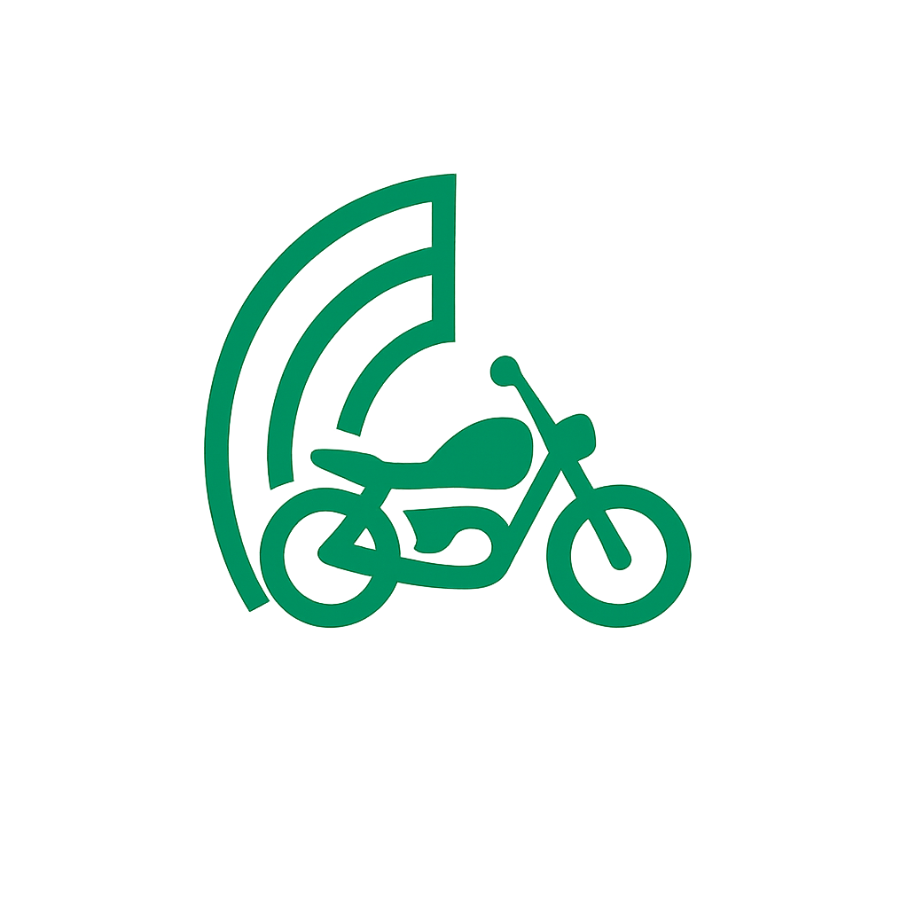
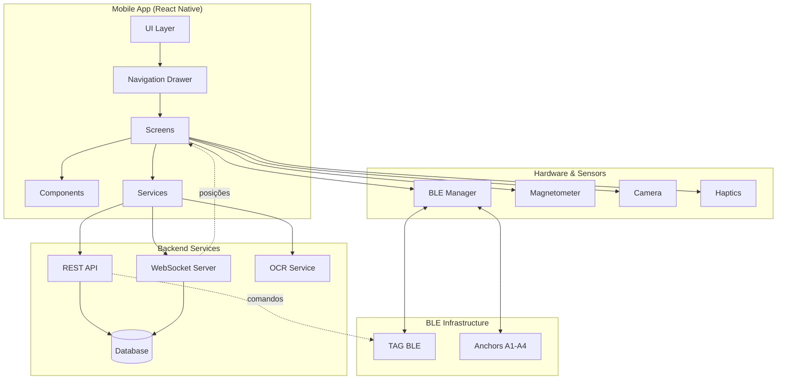
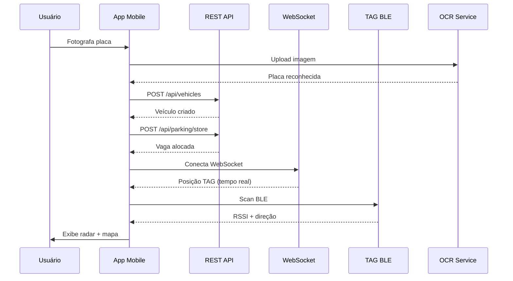
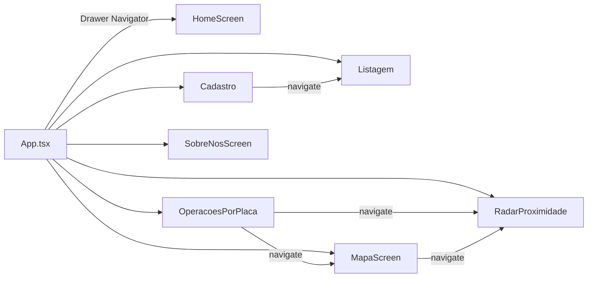
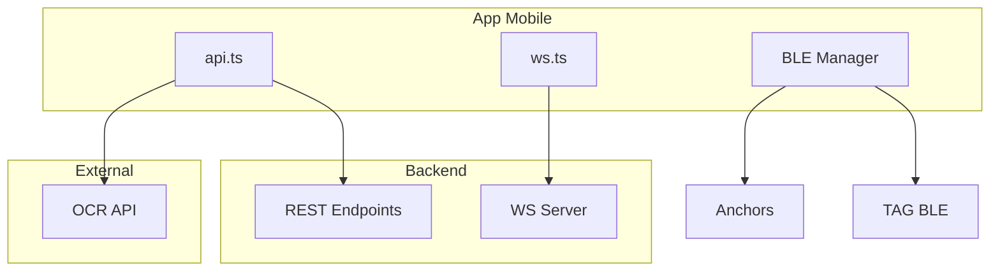

<p align="center">
  
</p>

<h1 align="center">📱 RadarMotu App — Mobile Application</h1>

<p align="center">
  <strong>Aplicação móvel do ecossistema RadarMotu para gerenciamento inteligente de estacionamento de motos</strong><br>
  <em>OCR de placas • Localização BLE • Mapa em tempo real • Radar de proximidade</em>
</p>

<p align="center">
  <a href="#-tecnologias-e-ferramentas">
    
  </a>
  <a href="#-tecnologias-e-ferramentas">
    
  </a>
  <a href="#-tecnologias-e-ferramentas">
    
  </a>
  <a href="#-tecnologias-e-ferramentas">
    
  </a>
  <a href="#-licença">
    
  </a>
  <a href="#-equipe-e-créditos">
    
  </a>
</p>

---

## 📋 Índice de Navegação

- [📱 Sobre o Projeto](#-sobre-o-projeto)
- [✨ Funcionalidades Principais](#-funcionalidades-principais)
- [🛠️ Tecnologias e Ferramentas](#️-tecnologias-e-ferramentas)
- [🏗️ Arquitetura do Sistema](#️-arquitetura-do-sistema)
- [📂 Estrutura de Pastas](#-estrutura-de-pastas)
- [🖼️ Telas e Componentes](#️-telas-e-componentes)
- [🔌 APIs e Integrações](#-apis-e-integrações)
- [🔧 Configuração e Instalação](#-configuração-e-instalação)
- [🚀 Execução e Build](#-execução-e-build)
- [📱 Permissões e Hardware](#-permissões-e-hardware)
- [🧪 Testes e Qualidade](#-testes-e-qualidade)
- [📝 Convenções de Código](#-convenções-de-código)
- [🤝 Contribuindo](#-contribuindo)
- [📄 Licença](#-licença)
- [👥 Equipe e Créditos](#-equipe-e-créditos)

---

## 📱 Sobre o Projeto

O **RadarMotu App** é uma aplicação móvel desenvolvida com **Expo** e **React Native** que faz parte do ecossistema **RadarMotu**, um sistema completo de gerenciamento de estacionamento para motocicletas. O aplicativo oferece uma solução integrada para controle de veículos, alocação de vagas, localização em tempo real e busca de motos através de tecnologias avançadas como **OCR (Reconhecimento Óptico de Caracteres)**, **BLE (Bluetooth Low Energy)** e **WebSocket**.

### 🎯 Objetivo Principal

O RadarMotu App foi desenvolvido para facilitar o gerenciamento de estacionamento de motos, permitindo:
- **Cadastro rápido** de veículos através de OCR de placas
- **Alocação automática** de vagas no pátio
- **Localização em tempo real** via TAG BLE
- **Radar de proximidade** (sonar) para busca precisa
- **Visualização em mapa 2D** com âncoras de referência

### 🌟 Características Especiais

- ✅ **OCR Inteligente**: Reconhecimento automático de placas através de câmera ou galeria
- ✅ **BLE Avançado**: Localização precisa usando Bluetooth Low Energy
- ✅ **Tempo Real**: Comunicação bidirecional via WebSocket
- ✅ **Radar Sonar**: Sistema de busca visual com indicação de direção e distância
- ✅ **Interface Moderna**: Design dark mode com UX otimizada
- ✅ **Offline First**: Armazenamento local com sincronização com servidor

---

## ✨ Funcionalidades Principais

### 🔍 1. Reconhecimento de Placas (OCR)

O aplicativo integra um sistema de **OCR (Optical Character Recognition)** que permite:

- 📸 **Captura via câmera** ou seleção da galeria
- 🤖 **Reconhecimento automático** de placas em formato antigo (ABC-1234) ou Mercosul (ABC1D23)
- ✅ **Validação de formato** com feedback visual
- 🔄 **Integração direta** com formulários de cadastro

**Tecnologia**: API externa de OCR configurada em `PlacaRecognition.tsx`

### 🚗 2. Cadastro e Gerenciamento de Veículos

Sistema completo de CRUD para veículos:

- ➕ **Criar** novos veículos
- 📝 **Atualizar** informações existentes
- 🗑️ **Remover** veículos
- 📋 **Listar** todos os veículos cadastrados
- 💾 **Armazenamento local** com sincronização com servidor
- 🔗 **Vinculação de TAG BLE** a veículos

**Campos do veículo**:
- Placa (formatada automaticamente)
- Marca
- Modelo
- Cor
- Ano de fabricação
- Ano do modelo
- Chassi (VIN)
- Código da TAG BLE

### 🅿️ 3. Sistema de Estacionamento

Gerenciamento inteligente de vagas:

- 🎯 **Alocar vaga**: Aloca automaticamente uma vaga/zona para o veículo
- 🚪 **Liberar vaga**: Libera a vaga quando o veículo é retirado
- 📍 **Localizar veículo**: Busca a localização atual (zona, vaga, coordenadas)
- 🔔 **Notificações**: Feedback visual de sucesso/erro

**Integração**: Comunicação com backend via REST API (`/api/parking/store`, `/api/parking/release`)

### 🗺️ 4. Mapa do Pátio em Tempo Real

Visualização 2D interativa do pátio:

- 📍 **Âncoras de referência**: Pontos fixos (A1, A2, A3, A4) que delimitam a área
- 🏷️ **Posição da TAG**: Posição em tempo real da TAG BLE do veículo
- 📱 **Posição do telefone**: Localização estimada do dispositivo
- 🔄 **Atualização em tempo real** via WebSocket
- 📏 **Transformação afim**: Normalização automática de coordenadas
- 🎯 **Banners de status**: Indicadores visuais de proximidade e localização
- 🔊 **Comando de buzzer**: Acionamento remoto de LED/Buzzer da TAG

**Features avançadas**:
- Detecção de entrada/saída da área via BLE (quando não há posição via WebSocket)
- Cálculo de distância telefone-TAG via BLE
- Orientação usando bússola (magnetômetro)
- Radar de guia para entrada na área

### 📡 5. Radar de Proximidade (Sonar)

Sistema tipo sonar para busca precisa de veículos:

- 🎯 **Varredura circular**: Animação de 360° indicando direção
- 📏 **Distância em tempo real**: Cálculo baseado em RSSI do BLE
- 🧭 **Direção estimada**: Cálculo de bearing usando bússola e filtro estatístico
- 📊 **Confiança da direção**: Indicador de precisão do cálculo
- 🔄 **Suavização de RSSI**: Filtros estatísticos (mediana, MAD, EMA)
- 🔊 **Feedback háptico**: Vibração quando próximo (< 2m)
- 🎨 **Cores dinâmicas**: Anéis mudam de cor conforme proximidade
- ⚙️ **Calibração**: Ajuste de TX_POWER em tempo real (@1m)

**Parâmetros técnicos**:
- Distância máxima: 8 metros (configurável)
- Velocidade de varredura: 120°/s
- Intervalo de atualização: ~120ms
- Filtros: Mediana, MAD (Median Absolute Deviation), EMA (Exponential Moving Average)

### 📱 6. Operações por Placa

Tela centralizada para operações rápidas:

- 🔍 **OCR rápido**: Escaneamento direto
- 💾 **Armazenar**: Alocar vaga em um passo
- 🗺️ **Buscar no mapa**: Navegar para visualização
- 📡 **Abrir radar**: Acesso direto ao sonar
- 🚪 **Liberar**: Desalocar vaga rapidamente

---

## 🛠️ Tecnologias e Ferramentas

### 📦 Core Technologies

<table>
  <tr>
    <td align="center">
      
      <br><strong>Expo SDK 51</strong>
    </td>
    <td align="center">
      
      <br><strong>React Native</strong>
    </td>
    <td align="center">
      
      <br><strong>TypeScript</strong>
    </td>
  </tr>
</table>

### 🎨 UI & Navigation

- **React Navigation 7**
  - `@react-navigation/native` ^7.1.17
  - `@react-navigation/drawer` ^7.5.8
  - `@react-navigation/native-stack` ^7.3.26
  - `@react-navigation/bottom-tabs` ^7.4.7
- **React Native Gesture Handler** ~2.16.1
- **React Native Reanimated** ~3.10.1
- **React Native Screens** 3.31.1
- **React Native Safe Area Context** 4.10.5
- **React Native SVG** 15.2.0

### 📡 Connectivity & Sensors

- **React Native BLE PLX** ^3.5.0
  - Bluetooth Low Energy para localização
- **WebSocket (nativo)**
  - Comunicação em tempo real com backend
- **Expo Sensors** ~13.0.9
  - Magnetômetro para bússola
- **Expo Haptics** ~13.0.1
  - Feedback tátil
- **Expo Keep Awake** ~13.0.2
  - Mantém tela ativa no radar

### 📸 Media & Storage

- **Expo Image Picker** ~15.1.0
  - Captura de imagens para OCR
- **AsyncStorage** 1.23.1
  - Armazenamento local persistente

### 🔐 Permissions

- **React Native Permissions** ^5.4.2
  - Gerenciamento de permissões nativas

### 🛠️ Development Tools

- **TypeScript** ~5.3.3
- **Expo CLI** (via npx)
- **Metro Bundler** (configurado via `metro.config.js`)
- **EAS Build** (Expo Application Services)

### 📱 Platform Support

- ✅ **Android** (minSdkVersion 23+)
  - Configuração nativa completa em `android/`
  - Gradle build system
  - Kotlin support
- ✅ **iOS** (suportado via Expo)
  - Configuração via `app.json`
  - Xcode project gerado

### 🌐 Backend Integration

- **REST API**: Comunicação HTTP/HTTPS
- **WebSocket**: Comunicação em tempo real
- **FormData**: Upload de imagens para OCR

---

## 🏗️ Arquitetura do Sistema

### 📐 Diagrama de Arquitetura de Alto Nível



### 🔄 Fluxo de Dados Principal



### 🗺️ Arquitetura de Navegação



### 📡 Arquitetura de Comunicação



---

## 📂 Estrutura de Pastas

```
radarmotu-app/
├── 📁 android/                          # Configuração Android nativa
│   ├── 📁 app/
│   │   ├── 📁 src/
│   │   │   ├── 📁 main/
│   │   │   │   ├── 📁 java/com/seuorg/radarmotu/
│   │   │   │   │   ├── MainActivity.kt
│   │   │   │   │   └── MainApplication.kt
│   │   │   │   ├── 📁 res/              # Recursos Android
│   │   │   │   │   ├── 📁 drawable/     # Splash screen
│   │   │   │   │   ├── 📁 mipmap-*/     # Ícones do app
│   │   │   │   │   └── 📁 values/       # Cores, strings, styles
│   │   │   │   └── AndroidManifest.xml
│   │   │   └── 📁 debug/
│   │   ├── build.gradle                  # Config Gradle do app
│   │   └── debug.keystore                # Keystore debug
│   ├── 📁 gradle/
│   │   └── 📁 wrapper/
│   ├── build.gradle                      # Gradle root
│   ├── settings.gradle
│   └── gradle.properties
│
├── 📁 assets/                            # Recursos estáticos
│   ├── 📸 radarmotu-logo.png
│   └── 📸 metamind-logo.png
│
├── 📁 components/                        # Componentes reutilizáveis
│   └── VehicleCard.tsx                   # Card de exibição de veículo
│
├── 📁 config/                            # Configurações
│   └── env.ts                            # Variáveis de ambiente (host, URLs)
│
├── 📁 screens/                           # Telas do aplicativo
│   ├── HomeScreen.tsx                    # Tela inicial
│   ├── Cadastro.tsx                      # Cadastro de veículos
│   ├── Listagem.tsx                      # Lista de veículos
│   ├── OperacoesPorPlaca.tsx             # Operações centralizadas
│   ├── PlacaRecognition.tsx              # Componente OCR
│   ├── MapaScreen.tsx                    # Mapa do pátio
│   ├── RadarProximidade.tsx              # Radar sonar
│   └── SobreNosScreen.tsx                # Sobre o app
│
├── 📁 services/                           # Serviços de integração
│   ├── api.ts                            # Cliente REST API
│   └── ws.ts                             # Hook WebSocket
│
├── 📄 App.tsx                            # Componente raiz + navegação
├── 📄 app.json                           # Configuração Expo
├── 📄 eas.json                           # Config EAS Build
├── 📄 metro.config.js                    # Config Metro Bundler
├── 📄 package.json                       # Dependências
├── 📄 tsconfig.json                      # Config TypeScript
└── 📄 README.md                          # Este arquivo
```

### 📋 Descrição Detalhada das Pastas

#### `android/`
Configuração completa do projeto Android nativo, incluindo:
- **Manifest**: Permissões, activities, configurações
- **Gradle**: Sistema de build, dependências nativas
- **Kotlin**: Código nativo (MainActivity, MainApplication)
- **Resources**: Ícones, splash screen, cores, strings

#### `assets/`
Recursos estáticos do aplicativo:
- **Logos**: Branding do RadarMotu e Metamind
- Formatos suportados: PNG, JPG, SVG

#### `components/`
Componentes React reutilizáveis:
- **VehicleCard**: Exibe informações de veículo de forma consistente

#### `config/`
Configurações centralizadas:
- **env.ts**: Host do servidor, URLs da API, WebSocket endpoint

#### `screens/`
Telas principais do aplicativo (7 telas):
- **HomeScreen**: Ponto de entrada com atalhos
- **Cadastro**: Formulário completo de veículo
- **Listagem**: Visualização em lista com AsyncStorage
- **OperacoesPorPlaca**: Hub de operações rápidas
- **PlacaRecognition**: Integração OCR
- **MapaScreen**: Visualização 2D com WebSocket
- **RadarProximidade**: Sonar BLE com feedback háptico
- **SobreNosScreen**: Informações do projeto

#### `services/`
Camada de integração com backend:
- **api.ts**: Funções para todos os endpoints REST
- **ws.ts**: Hook React para WebSocket em tempo real

---

## 🖼️ Telas e Componentes

### 🏠 HomeScreen

**Localização**: `screens/HomeScreen.tsx`

**Função**: Tela inicial do aplicativo com atalhos para funcionalidades principais.

**Recursos**:
- ✅ Botões de navegação rápida
- ✅ Design moderno com footer
- ✅ Integração com drawer navigation

**Navegação**:
- → `OperacoesPorPlaca`
- → `ListarVeiculos`

### ✍️ Cadastro

**Localização**: `screens/Cadastro.tsx`

**Função**: Cadastro e edição de veículos com validação completa.

**Recursos**:
- ✅ Formulário completo (8 campos)
- ✅ Validação de placa (formato antigo/Mercosul)
- ✅ Integração OCR inline
- ✅ Sincronização local + servidor
- ✅ Opção "Salvar & Armazenar" (cria veículo + aloca vaga)

**Campos**:
- Placa (com OCR)
- Marca
- Modelo
- Cor
- Ano Fabricação
- Ano Modelo
- Chassi
- TAG BLE

**Validações**:
- Placa: Regex `^[A-Z]{3}[0-9][A-Z0-9][0-9]{2}$`
- Anos: 4 dígitos
- Campos obrigatórios

### 📋 Listagem

**Localização**: `screens/Listagem.tsx`

**Função**: Exibição de todos os veículos cadastrados localmente.

**Recursos**:
- ✅ FlatList otimizada
- ✅ Cards informativos
- ✅ Empty state
- ✅ Botão de cadastro rápido
- ✅ Atualização automática ao focar

**Fonte de dados**: `AsyncStorage.getItem('@lista_veiculos')`

### 🔤 Operações por Placa

**Localização**: `screens/OperacoesPorPlaca.tsx`

**Função**: Hub centralizado para operações rápidas com uma placa.

**Recursos**:
- ✅ OCR integrado
- ✅ 4 ações principais:
  - 💾 Armazenar (alocar vaga)
  - 🗺️ Buscar no mapa
  - 📡 Abrir radar
  - 🚪 Liberar vaga
- ✅ Feedback visual de estado

**Fluxo típico**:
1. Escanear placa (OCR)
2. Selecionar ação
3. Navegar para tela específica ou executar ação

### 🔍 PlacaRecognition (OCR)

**Localização**: `screens/PlacaRecognition.tsx`

**Função**: Componente de reconhecimento de placas via OCR.

**Recursos**:
- ✅ Câmera ou galeria
- ✅ Upload para API externa
- ✅ Preview da imagem
- ✅ Loading state
- ✅ Error handling

**API OCR**: `http://191.238.222.198:3000/upload`

**Formato de requisição**:
```typescript
FormData {
  image: { uri, name, type }
}
```

**Resposta esperada**:
```json
{
  "placa": "ABC1234"
}
```

### 🗺️ MapaScreen

**Localização**: `screens/MapaScreen.tsx`

**Função**: Visualização 2D do pátio com posições em tempo real.

**Recursos**:
- ✅ **Âncoras**: Pontos de referência (A1, A2, A3, A4)
- ✅ **TAG**: Posição em tempo real (vermelho)
- ✅ **Telefone**: Posição estimada (verde)
- ✅ **WebSocket**: Atualização contínua
- ✅ **Transformação afim**: Normalização automática
- ✅ **BLE fallback**: Detecção de entrada/saída quando sem WebSocket
- ✅ **Distância telefone-TAG**: Cálculo via BLE
- ✅ **Bússola**: Orientação usando magnetômetro
- ✅ **Banner de status**: Indicadores visuais
- ✅ **Radar de guia**: Mini-sonar para entrada na área
- ✅ **Comando de buzzer**: Acionamento remoto da TAG

**Algoritmos**:
- **Scale computation**: Cálculo de escala baseado em âncoras
- **Affine transformation**: Ajuste automático de coordenadas
- **Bounding box**: Detecção de dentro/fora da área
- **Point-to-rect distance**: Distância até área mais próxima

**Estados**:
- Carregando
- Conectado
- Desconectado
- Dentro da área
- Fora da área

### 📡 RadarProximidade

**Localização**: `screens/RadarProximidade.tsx`

**Função**: Sistema tipo sonar para busca precisa de veículos via BLE.

**Recursos**:
- ✅ **Varredura animada**: 360° com velocidade 120°/s
- ✅ **Distância em tempo real**: Baseada em RSSI
- ✅ **Direção estimada**: Bearing usando bússola + filtro estatístico
- ✅ **Confiança**: Indicador de precisão (0-100%)
- ✅ **Suavização RSSI**: Múltiplos filtros (mediana, MAD, EMA)
- ✅ **Feedback háptico**: Vibração quando < 2m
- ✅ **Cores dinâmicas**: Anéis mudam conforme proximidade
- ✅ **Calibração**: Ajuste de TX_POWER @1m
- ✅ **Silenciar vibração**: Botão para desativar
- ✅ **Comando buzzer**: Acionamento remoto da TAG

**Parâmetros técnicos**:
- **Tamanho do radar**: 320x320px
- **Distância máxima**: 8 metros
- **Anéis**: 2m, 4m, 6m, 8m
- **Atualização**: ~120ms
- **Window size**: 25 amostras para mediana
- **EMA alpha**: 0.25

**Algoritmos**:
- **RSSI to meters**: Função baseada em tabela (interpolação linear)
- **Bearing estimation**: Weighted average usando heading + RSSI
- **Confidence**: Magnitude do vetor resultante
- **Sweep animation**: RequestAnimationFrame com delta time

### ℹ️ SobreNosScreen

**Localização**: `screens/SobreNosScreen.tsx`

**Função**: Tela informativa sobre o projeto.

**Recursos**:
- ✅ Descrição do ecossistema
- ✅ Link externo (opcional)
- ✅ Design minimalista

### 🧩 VehicleCard

**Localização**: `components/VehicleCard.tsx`

**Função**: Componente reutilizável para exibir informações de veículo.

**Campos exibidos**:
- Placa (destaque)
- Modelo
- Marca
- Cor
- Ano (fabricação/modelo)
- Chassi
- TAG

**Estilo**: Card escuro com bordas arredondadas

---

## 🔌 APIs e Integrações

### 🌐 REST API Endpoints

Base URL configurável em `config/env.ts`:
```typescript
export const RADAR_API_BASE = `http://${SERVER_HOST}:8000`;
```

#### 📋 Veículos

| Método | Endpoint | Descrição | Parâmetros |
|--------|----------|-----------|------------|
| `POST` | `/api/vehicles` | Criar veículo | Body: `{ plate, brand, model, color, year_make, year_model, vin, tag_code? }` |
| `GET` | `/api/vehicles/by-plate/{plate}` | Buscar por placa | Path: `plate` |
| `PUT` | `/api/vehicles/{plate}` | Atualizar veículo | Path: `plate`, Body: campos parciais |
| `DELETE` | `/api/vehicles/{plate}` | Remover veículo | Path: `plate` |

#### 🅿️ Estacionamento

| Método | Endpoint | Descrição | Parâmetros |
|--------|----------|-----------|------------|
| `POST` | `/api/parking/store?plate={plate}` | Alocar vaga | Query: `plate` |
| `POST` | `/api/parking/release?plate={plate}` | Liberar vaga | Query: `plate` |
| `GET` | `/api/locate/{plate}` | Localizar veículo | Path: `plate` |

**Resposta de `store`**:
```json
{
  "zone": "A",
  "spot": "12",
  "sessionId": "uuid"
}
```

**Resposta de `locate`**:
```json
{
  "zone": "A",
  "spot": "12",
  "position": { "x": 5.2, "y": 3.1 }
}
```

#### 🏷️ TAGs

| Método | Endpoint | Descrição | Parâmetros |
|--------|----------|-----------|------------|
| `POST` | `/api/tags/{tag}/alarm` | Acionar buzzer/LED | Path: `tag` |

#### 📍 Âncoras

| Método | Endpoint | Descrição |
|--------|----------|-----------|
| `GET` | `/api/anchors` | Obter âncoras |
| `GET` | `/anchors.json` | Fallback (arquivo estático) |

**Resposta**:
```json
{
  "A1": { "x": 0, "y": 0 },
  "A2": { "x": 10, "y": 0 },
  "A3": { "x": 10, "y": 8 },
  "A4": { "x": 0, "y": 8 }
}
```

#### 🏥 Health Check

| Método | Endpoint | Descrição |
|--------|----------|-----------|
| `GET` | `/health` | Ping do backend |

### 🔌 WebSocket

**URL**: Configurável em `config/env.ts`
```typescript
export const WS_URL = `ws://${SERVER_HOST}:8000/ws/position`;
```

#### 📨 Mensagens Recebidas

**Tipo: `initial_setup`**
```json
{
  "type": "initial_setup",
  "payload": {
    "anchors": { "A1": { "x": 0, "y": 0 }, ... },
    "initial_pos": { "x": 5.2, "y": 3.1 },
    "phone_pos": { "x": 4.8, "y": 3.0 }
  }
}
```

**Tipo: `position_update`** (implícito)
```json
{
  "id": "TAG01",
  "kind": "plate",
  "pos": { "x": 5.2, "y": 3.1 },
  "position": { "x": 5.2, "y": 3.1 },
  "zone": "A",
  "spot": "12",
  "phone_pos": { "x": 4.8, "y": 3.0 },
  "anchors": { ... }
}
```

#### 🔄 Reconexão Automática

- ✅ Tentativas com backoff exponencial
- ✅ Delay inicial: 500ms
- ✅ Máximo: 5000ms
- ✅ Reset após conexão bem-sucedida

### 🤖 OCR API Externa

**URL**: `http://191.238.222.198:3000/upload`

**Método**: `POST`

**Content-Type**: `multipart/form-data`

**Body**:
```typescript
FormData {
  image: {
    uri: string,      // URI local da imagem
    name: string,     // Nome do arquivo
    type: string      // MIME type (image/jpeg, image/png)
  }
}
```

**Resposta de sucesso**:
```json
{
  "placa": "ABC1234"
}
```

**Resposta de erro**:
```json
{
  "error": "Mensagem de erro",
  "message": "Alternativa de mensagem"
}
```

---

## 🔧 Configuração e Instalação

### 📋 Pré-requisitos

#### 💻 Desenvolvimento

- **Node.js** >= 18 (LTS recomendado)
- **npm** ou **yarn**
- **Expo CLI** (instalado via npx)
- **Git**

#### 📱 Android

- **Android Studio**
- **Android SDK** (API 23+)
- **Android Emulator** ou dispositivo físico
- **JDK 11+**

#### 🍎 iOS (opcional)

- **macOS**
- **Xcode** (última versão)
- **CocoaPods**
- **iOS Simulator** ou dispositivo físico

### 🚀 Instalação Passo a Passo

#### 1️⃣ Clonar o Repositório

```bash
git clone <url-do-repositorio>
cd radarmotu-app
```

#### 2️⃣ Instalar Dependências

```bash
npm install
# ou
yarn install
```

#### 3️⃣ Configurar Ambiente

Edite `config/env.ts`:

```typescript
export const SERVER_HOST = "10.30.142.15"; // ← Seu IP local
export const RADAR_API_BASE = `http://${SERVER_HOST}:8000`;
export const WS_URL = `ws://${SERVER_HOST}:8000/ws/position`;
```

**Importante**: 
- O IP deve ser acessível na mesma rede do dispositivo
- Para desenvolvimento, use o IP da máquina onde o backend está rodando
- Certifique-se de que o firewall permite conexões na porta 8000

#### 4️⃣ Configurar Permissões

As permissões já estão configuradas em `app.json`, mas verifique:

**Android** (`app.json`):
```json
{
  "android": {
    "permissions": [
      "android.permission.ACCESS_FINE_LOCATION",
      "android.permission.BLUETOOTH",
      "android.permission.BLUETOOTH_ADMIN",
      "android.permission.BLUETOOTH_CONNECT",
      "android.permission.BLUETOOTH_SCAN"
    ]
  }
}
```

**iOS** (`app.json`):
```json
{
  "ios": {
    "infoPlist": {
      "NSBluetoothAlwaysUsageDescription": "O Radar usa Bluetooth para localizar sua TAG próxima."
    }
  }
}
```

#### 5️⃣ Verificar Backend

Certifique-se de que o backend está rodando:
- ✅ REST API na porta 8000
- ✅ WebSocket Server ativo
- ✅ CORS configurado para permitir requisições do app
- ✅ HTTP cleartext habilitado (para desenvolvimento)

---

## 🚀 Execução e Build

### 🏃 Executar em Desenvolvimento

#### 📱 Android

```bash
npm run android
# ou
npx expo run:android
```

Isso irá:
1. Compilar o código TypeScript
2. Iniciar o Metro Bundler
3. Compilar o app nativo (se necessário)
4. Instalar no dispositivo/emulador
5. Iniciar o app

#### 🍎 iOS

```bash
npm run ios
# ou
npx expo run:ios
```

**Requisitos**:
- macOS obrigatório
- Xcode instalado
- CocoaPods configurado

### 🏗️ Build para Produção

#### 📦 EAS Build (Recomendado)

**Pré-requisito**: Conta Expo/EAS

```bash
# Android
npx eas build --platform android --profile production

# iOS
npx eas build --platform ios --profile production

# Ambos
npx eas build --platform all --profile production
```

**Perfis disponíveis** (em `eas.json`):
- `development`: Development client
- `preview`: Internal distribution
- `production`: Production build

#### 🔨 Build Local (Android)

```bash
cd android
./gradlew assembleRelease
```

APK gerado em: `android/app/build/outputs/apk/release/app-release.apk`

**Importante**: Para produção, gere seu próprio keystore:

```bash
keytool -genkeypair -v -storetype PKCS12 -keystore my-release-key.keystore -alias my-key-alias -keyalg RSA -keysize 2048 -validity 10000
```

Configure em `android/app/build.gradle`.

### 📱 Testar Build

```bash
# Android
adb install -r android/app/build/outputs/apk/release/app-release.apk

# iOS (via Xcode)
# Abrir projeto em Xcode e executar
```

---

## 📱 Permissões e Hardware

### 🔐 Permissões Necessárias

#### 📍 Localização

**Android**:
- `ACCESS_FINE_LOCATION` (para BLE em Android < 12)
- Necessária para escaneamento BLE

**iOS**:
- `NSLocationWhenInUseUsageDescription` (se aplicável)

#### 📡 Bluetooth

**Android**:
- `BLUETOOTH`
- `BLUETOOTH_ADMIN`
- `BLUETOOTH_SCAN` (Android 12+)
- `BLUETOOTH_CONNECT` (Android 12+)

**iOS**:
- `NSBluetoothAlwaysUsageDescription`
- Configurado em `app.json`

#### 📸 Câmera e Mídia

**Android**:
- Permissão solicitada em runtime via `expo-image-picker`

**iOS**:
- `NSCameraUsageDescription`
- `NSPhotoLibraryUsageDescription`
- Configurados automaticamente pelo Expo

### 🔧 Hardware Requerido

#### ✅ Obrigatório

- **Bluetooth 4.0+** (para BLE)
- **Magnetômetro** (para bússola no radar)
- **Câmera** (para OCR)
- **Vibração** (para feedback háptico)

#### ⚠️ Recomendado

- **GPS** (para localização precisa, se aplicável)
- **Acelerômetro/Giroscópio** (para melhor orientação)

### 🧪 Testes em Dispositivo Físico

**Importante**: Algumas funcionalidades **não funcionam** no emulador:

- ❌ BLE (Bluetooth)
- ❌ Magnetômetro (bússola)
- ❌ Vibração/háptica
- ✅ Câmera (parcial)
- ✅ Rede/WebSocket

**Recomendação**: Use dispositivo físico para testes completos.

---

## 🧪 Testes e Qualidade

### ✅ Checklist de Funcionalidades

#### 🔍 OCR
- [ ] Captura via câmera
- [ ] Seleção da galeria
- [ ] Reconhecimento de placas antigas (ABC-1234)
- [ ] Reconhecimento de placas Mercosul (ABC1D23)
- [ ] Validação de formato
- [ ] Tratamento de erros

#### 🚗 Cadastro
- [ ] Criação de veículo
- [ ] Atualização de veículo
- [ ] Validação de campos
- [ ] Sincronização local + servidor
- [ ] Opção "Salvar & Armazenar"
- [ ] Integração OCR

#### 🅿️ Estacionamento
- [ ] Alocar vaga
- [ ] Liberar vaga
- [ ] Localizar veículo
- [ ] Feedback de sucesso/erro

#### 🗺️ Mapa
- [ ] Carregamento de âncoras
- [ ] Posição TAG em tempo real
- [ ] Posição telefone
- [ ] WebSocket funcionando
- [ ] Transformação afim
- [ ] BLE fallback
- [ ] Comando de buzzer

#### 📡 Radar
- [ ] Escaneamento BLE
- [ ] Cálculo de distância
- [ ] Estimativa de direção
- [ ] Varredura animada
- [ ] Feedback háptico
- [ ] Calibração
- [ ] Silenciar vibração

### 🐛 Tratamento de Erros

O aplicativo implementa tratamento robusto de erros:

- ✅ **Network errors**: Mensagens claras ao usuário
- ✅ **BLE errors**: Feedback de permissões negadas
- ✅ **OCR errors**: Fallback para entrada manual
- ✅ **WebSocket**: Reconexão automática
- ✅ **Validation errors**: Mensagens específicas por campo

### 📊 Performance

**Otimizações implementadas**:
- ✅ **FlatList**: Para listas longas
- ✅ **Memoização**: `useMemo`, `useCallback`
- ✅ **Debouncing**: Em inputs críticos
- ✅ **Lazy loading**: Telas carregadas sob demanda
- ✅ **RequestAnimationFrame**: Para animações suaves

---

## 📝 Convenções de Código

### 📐 Estrutura de Arquivos

- **Componentes**: PascalCase (`VehicleCard.tsx`)
- **Serviços**: camelCase (`api.ts`, `ws.ts`)
- **Telas**: PascalCase (`HomeScreen.tsx`)
- **Config**: camelCase (`env.ts`)

### 💻 Estilo de Código

#### TypeScript

```typescript
// Tipos explícitos
interface Vehicle {
  placa: string;
  marca: string;
  modelo: string;
}

// Funções com tipos
async function createVehicle(v: Vehicle): Promise<Vehicle> {
  // ...
}
```

#### React

```typescript
// Hooks em ordem
function Component() {
  // 1. State
  const [value, setValue] = useState<string>('');
  
  // 2. Refs
  const ref = useRef<Type>();
  
  // 3. Effects
  useEffect(() => {
    // ...
  }, [deps]);
  
  // 4. Handlers
  const handleClick = () => {
    // ...
  };
  
  // 5. Render
  return <View>...</View>;
}
```

#### Cores e Estilos

```typescript
// Constantes de cor no topo
const radarMotuGreen = '#22DD44';
const darkBackground = '#1A1D21';

// Styles no final
const styles = StyleSheet.create({
  container: { flex: 1, backgroundColor: darkBackground }
});
```

### 🎨 Nomenclatura

- **Componentes**: PascalCase
- **Funções**: camelCase
- **Constantes**: UPPER_SNAKE_CASE ou camelCase (conforme contexto)
- **Hooks**: camelCase com prefixo `use`
- **Tipos/Interfaces**: PascalCase

### 📦 Imports

Ordem sugerida:
1. React/React Native
2. Bibliotecas externas
3. Componentes locais
4. Serviços
5. Utilitários
6. Tipos

---

## 🤝 Contribuindo

### 🔀 Workflow

1. **Fork** o repositório
2. **Crie** uma branch (`git checkout -b feature/nova-funcionalidade`)
3. **Commit** suas mudanças (`git commit -m 'Adiciona nova funcionalidade'`)
4. **Push** para a branch (`git push origin feature/nova-funcionalidade`)
5. **Abra** um Pull Request

### 📝 Commit Messages

Formato sugerido:
```
tipo(escopo): descrição curta

Descrição detalhada (opcional)

- Item 1
- Item 2
```

**Tipos**:
- `feat`: Nova funcionalidade
- `fix`: Correção de bug
- `docs`: Documentação
- `style`: Formatação
- `refactor`: Refatoração
- `test`: Testes
- `chore`: Tarefas de manutenção

### ✅ Checklist antes de PR

- [ ] Código segue convenções
- [ ] TypeScript sem erros
- [ ] Testado em dispositivo físico (se aplicável)
- [ ] Documentação atualizada
- [ ] Sem console.logs desnecessários
- [ ] Tratamento de erros implementado

---

## 📄 Licença

Este projeto está sob a licença **MIT**. Veja o arquivo `LICENSE` para mais detalhes.

---

## 👥 Equipe e Créditos

### 🏢 Organizações

- **FIAP** - Faculdade de Informática e Administração Paulista
- **Metamind Solution** - Desenvolvimento

### 👨‍💻 Tecnologias Utilizadas

- **Expo** - Framework React Native
- **React Native** - Framework mobile
- **React Navigation** - Navegação
- **React Native BLE PLX** - Bluetooth Low Energy
- **React Native SVG** - Gráficos vetoriais
- **AsyncStorage** - Armazenamento local
- **Expo Sensors** - Sensores do dispositivo
- **Expo Haptics** - Feedback tátil

### 📚 Referências

- [Expo Documentation](https://docs.expo.dev/)
- [React Native Documentation](https://reactnative.dev/)
- [React Navigation](https://reactnavigation.org/)
- [React Native BLE PLX](https://github.com/dotintent/react-native-ble-plx)

### 🙏 Agradecimentos

Agradecemos a toda a equipe envolvida no desenvolvimento do ecossistema RadarMotu.

---

## 📞 Suporte

Para dúvidas, sugestões ou problemas:

- 📧 Email: [contato@metamind.com.br](mailto:contato@metamind.com.br)
- 🌐 Website: [Metamind Solution](https://example.com)
- 📱 App: RadarMotu Mobile

---

<p align="center">
  
</p>

<p align="center">
  <strong>Desenvolvido com ❤️ pela equipe Metamind Solution</strong><br>
  <em>© 2025 - Todos os direitos reservados</em>
</p>

---

## 📊 Estatísticas do Projeto

- 📁 **Arquivos TypeScript**: ~12
- 🎨 **Telas**: 7
- 🧩 **Componentes**: 1
- 🔌 **Serviços**: 2
- 📦 **Dependências**: ~30
- 📱 **Plataformas**: Android, iOS
- 🔧 **Tecnologias**: 10+

---

## 🎯 Roadmap Futuro

### 🚀 Funcionalidades Planejadas

- [ ] Autenticação de usuários
- [ ] Histórico de operações
- [ ] Notificações push
- [ ] Modo offline completo
- [ ] Suporte a múltiplos pátios
- [ ] Dashboard de estatísticas
- [ ] Exportação de relatórios
- [ ] Integração com câmeras de segurança
- [ ] IA para otimização de vagas

### 🔧 Melhorias Técnicas

- [ ] Testes unitários (Jest)
- [ ] Testes E2E (Detox)
- [ ] CI/CD completo
- [ ] Code coverage
- [ ] Documentação de API
- [ ] Internacionalização (i18n)
- [ ] Acessibilidade (a11y)
- [ ] Performance monitoring

---

## 📖 Glossário

- **BLE**: Bluetooth Low Energy
- **OCR**: Optical Character Recognition (Reconhecimento Óptico de Caracteres)
- **RSSI**: Received Signal Strength Indicator
- **TAG**: Dispositivo BLE acoplado ao veículo
- **Âncora**: Ponto de referência fixo no pátio (A1, A2, A3, A4)
- **Transformação Afim**: Normalização matemática de coordenadas
- **Bearing**: Direção angular (0-360°)
- **EMA**: Exponential Moving Average
- **MAD**: Median Absolute Deviation
- **WebSocket**: Protocolo de comunicação em tempo real
- **REST API**: Arquitetura de API HTTP

---

<p align="center">
  <strong>⭐ Se este projeto foi útil, considere dar uma estrela!</strong>
</p>
