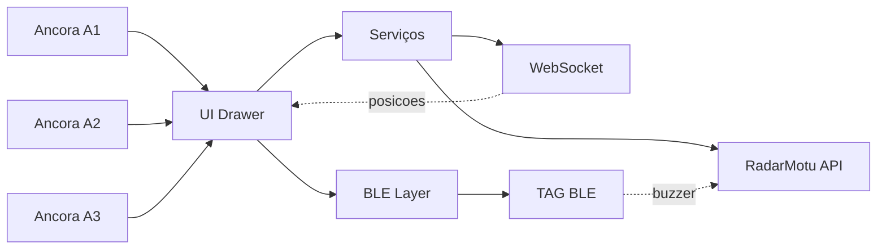

# RadarMotu App — Mobile (Expo React Native)

> App móvel do ecossistema RadarMotu para cadastro de veículos, OCR de placas, alocação de vagas, mapa em tempo real e radar de proximidade via BLE.

## Índice
- [Visão Geral](#visão-geral)
- [Tecnologias e Stack](#tecnologias-e-stack)
- [Arquitetura](#arquitetura)
  - [Diagrama de Alto Nível](#diagrama-de-alto-nível)
  - [Fluxos Principais](#fluxos-principais)
- [Telas e Navegação](#telas-e-navegação)
- [APIs, WebSocket e BLE](#apis-websocket-e-ble)
  - [Endpoints Consumidos](#endpoints-consumidos)
  - [Mensageria WebSocket](#mensageria-websocket)
  - [Permissões e Calibração BLE](#permissões-e-calibração-ble)
- [Configuração de Ambiente](#configuração-de-ambiente)
- [Execução e Build](#execução-e-build)
- [Qualidade e Convenções](#qualidade-e-convenções)
- [Créditos](#créditos)

## Visão Geral
O aplicativo móvel RadarMotu foi construído com Expo/React Native e integra:
- 🔎 OCR de placas para identificar veículos rapidamente.
- 🅿️ Alocação/liberação de vagas no pátio.
- 🗺️ Mapa em tempo real da TAG BLE e do telefone, com âncoras de referência.
- 📡 Radar de proximidade ("sonar") por BLE com direção estimada e feedback tátil.

Principais diretórios:
- `App.tsx`: navegação Drawer e tema.
- `screens/`: telas principais (`HomeScreen`, `Cadastro`, `Listagem`, `OperacoesPorPlaca`, `MapaScreen`, `RadarProximidade`, `SobreNosScreen`).
- `services/`: integração com API REST (`api.ts`) e WebSocket/hook (`ws.ts`).
- `config/env.ts`: configuração de host/URLs.

## Tecnologias e Stack

Badges:

- 
- 
- 
- 
- 
- 

Dependências centrais:
- Expo 51 (`expo`, `expo-build-properties`, `expo-haptics`, `expo-keep-awake`, `expo-sensors`, `expo-image-picker`).
- React Native 0.74.5, React 18.
- React Navigation (drawer, native-stack).
- `react-native-ble-plx` para BLE.
- `react-native-permissions` para permissões.
- `react-native-svg` para desenhos do radar/mapa.
- `@react-native-async-storage/async-storage` para cache local.

Plataformas:
- Android (config nativa presente em `android/`), iOS suportado pelo Expo (config via `app.json`).

## Arquitetura

### Diagrama de Alto Nível


### Fluxos Principais
- 🖼️ OCR de placa: usuário seleciona/fotografa; app chama API OCR dedicada (configurada em `PlacaRecognition.tsx`) e preenche placa.
- 🅿️ Alocação/Liberação: `services/api.ts` chama `/api/parking/store` e `/api/parking/release`.
- 🗺️ Localização/Mapa: `MapaScreen.tsx` consome WS (`/ws/position`) para posições e âncoras, aplica ajuste afim e projeta no mapa.
- 📡 Radar BLE: `RadarProximidade.tsx` escaneia TAG pelo nome (`TAGxx`), suaviza RSSI, converte em metros, estima direção e vibra próximo.

## Telas e Navegação
- 🏠 `HomeScreen`: atalho para OCR e lista.
- 🔤 `OperacoesPorPlaca`: OCR, armazenar, buscar no mapa, radar e liberar.
- ✍️ `Cadastro`: criar/atualizar veículo e opcionalmente armazenar vaga.
- 📋 `Listagem`: leitura local via `AsyncStorage`.
- 🗺️ `MapaScreen`: mapa 2D com âncoras, TAG, telefone e banners de alcance.
- 📡 `RadarProximidade`: sonar circular com varredura, direção, distância e haptics.
- ℹ️ `SobreNosScreen`: info e link externo.

Navegação: Drawer em `App.tsx` com tema escuro e títulos customizados.

## APIs, WebSocket e BLE

### Endpoints Consumidos
- `POST /api/vehicles` — criar veículo.
- `GET /api/vehicles/by-plate/{plate}` — buscar veículo.
- `PUT /api/vehicles/{plate}` — atualizar veículo.
- `DELETE /api/vehicles/{plate}` — remover veículo.
- `POST /api/parking/store?plate={plate}` — armazenar veículo (zona/vaga).
- `POST /api/parking/release?plate={plate}` — liberar vaga.
- `GET /api/locate/{plate}` — localizar veículo (zona/vaga/pos).
- `POST /api/tags/{tag}/alarm` — acionar buzzer/LED da TAG.
- `GET /health` — ping do backend.

Base URL e WS são definidos em `config/env.ts`:
```ts
export const SERVER_HOST = "10.30.142.15";
export const RADAR_API_BASE = `http://${SERVER_HOST}:8000`;
export const WS_URL = `ws://${SERVER_HOST}:8000/ws/position`;
```

### Mensageria WebSocket
- Conecta em `WS_URL`.
- Mensagem inicial opcional `type: initial_setup` com `anchors`, `initial_pos` (TAG) e `phone_pos` (celular).
- Atualizações seguintes podem conter `{ id, pos|position, phone_pos, anchors }`.

### Permissões e Calibração BLE
- Android:
  - Android 12+: `BLUETOOTH_SCAN`, `BLUETOOTH_CONNECT`.
  - <12: `ACCESS_FINE_LOCATION`.
- iOS: `NSBluetoothAlwaysUsageDescription` em `app.json`.
- Calibração: em `RadarProximidade`, botão "Calibrar @1m" ajusta `TX_POWER` com amostra de ~3s.

## Configuração de Ambiente
1) Requisitos
- Node LTS (>= 18)
- Expo CLI (via `npx expo`)
- Android SDK / Xcode conforme plataforma

2) Variáveis/Hosts
- Edite `config/env.ts` e aponte `SERVER_HOST` para o IP da máquina do backend na mesma rede do dispositivo.
- Certifique-se de que o backend aceite HTTP (cleartext) em desenvolvimento. Em `app.json` já está `usesCleartextTraffic=true`.

3) Permissões/Device
- Testes BLE devem ser feitos em dispositivo físico com Bluetooth ativo.

## Execução e Build
- Instalação:
```bash
npm install
```

- Executar no Android (via development build Expo):
```bash
npm run android
```

- iOS (necessita macOS/Xcode):
```bash
npm run ios
```

- EAS Build (exige conta Expo/EAS):
```bash
npx eas build --platform android --profile development
```

## Qualidade e Convenções
- TypeScript com `extends: expo/tsconfig.base`.
- Estilo escuro consistente; componentes com estilos locais.
- Sem dependência global de estado: telas mantêm seu próprio estado e chamam serviços.
- Tratamento de erros de rede com `okOrThrow()` e parsing robusto JSON/texto.

## Créditos
- Equipe FIAP/Metamind — RadarMotu.
- Tecnologias: Expo/React Native, BLE-PLX, React Navigation, SVG, EAS.
