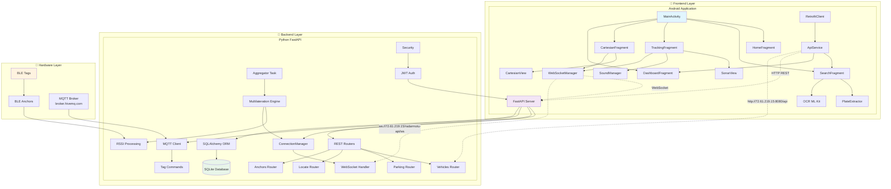
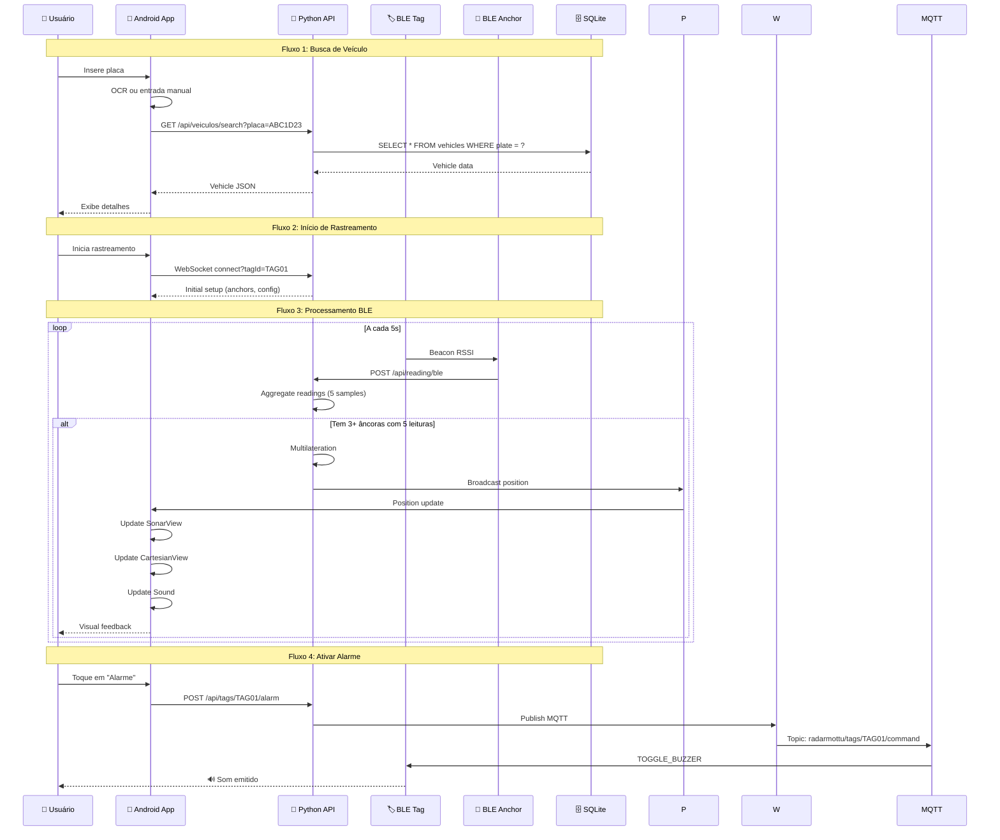
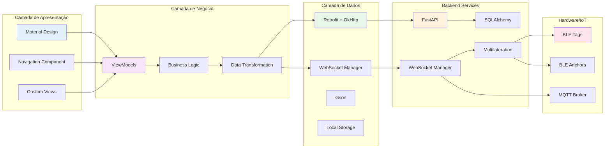
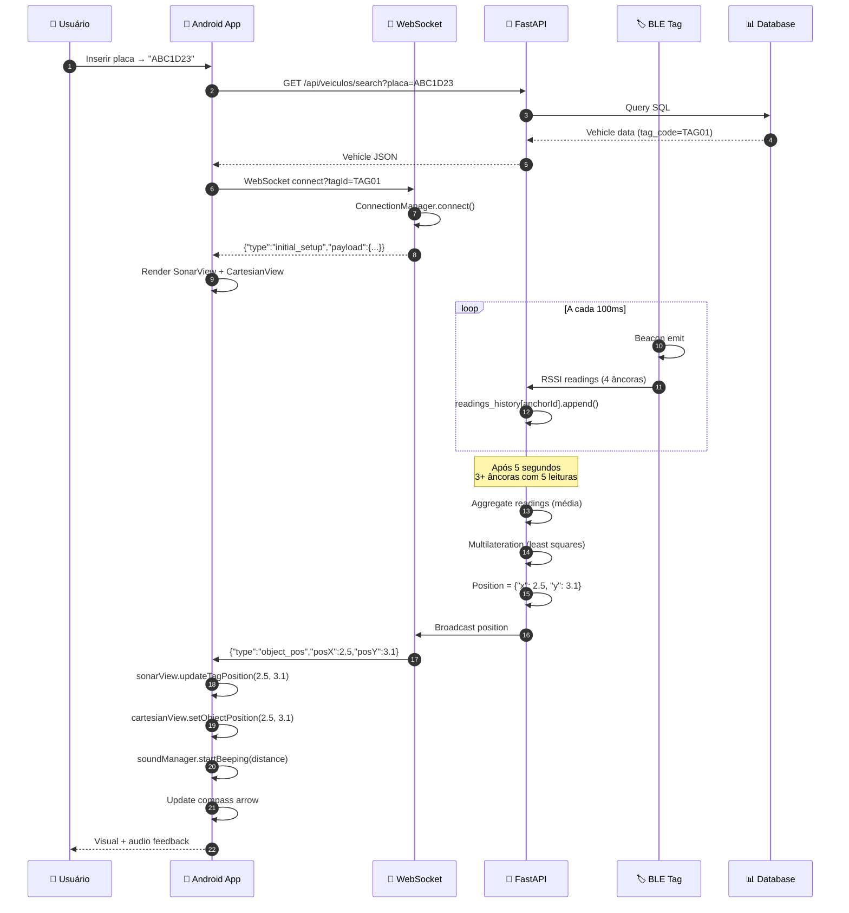
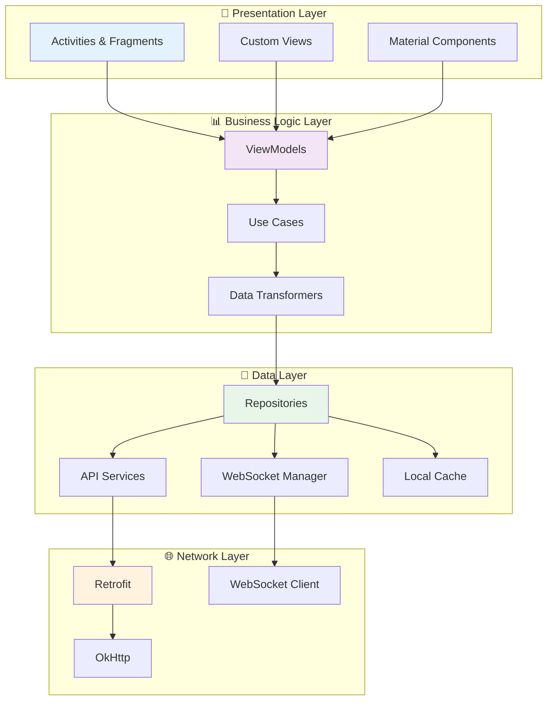
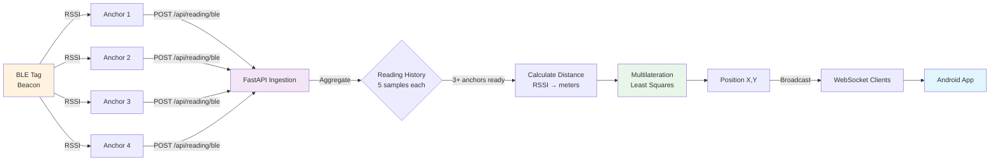
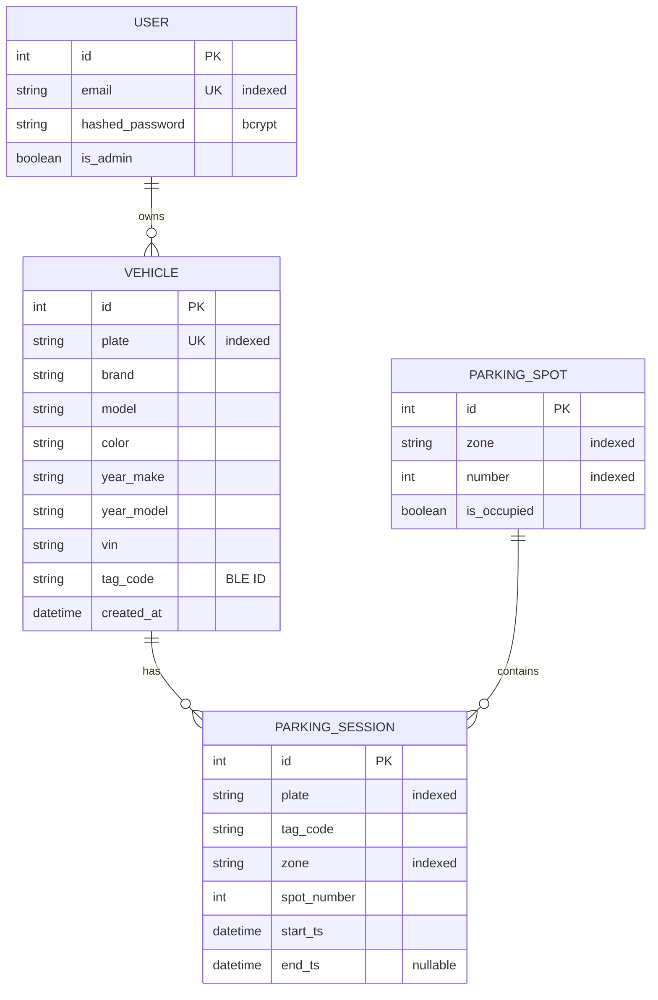

# 📱 RadarMottu - Sistema Inteligente de Rastreamento de Veículos

<div align="center">


**Sistema completo de rastreamento e localização de veículos em tempo real utilizando Bluetooth Low Energy (BLE) e multilateração**

[](LICENSE)
[](https://github.com)
[](https://developer.android.com)
[](https://www.python.org)
[](https://github.com)
[](https://github.com)

</div>

---

## 📋 Índice de Navegação

- [📱 RadarMottu - Sistema Inteligente de Rastreamento de Veículos](#-radarmottu---sistema-inteligente-de-rastreamento-de-veículos)
  - [📋 Índice de Navegação](#-índice-de-navegação)
  - [🎯 Visão Geral](#-visão-geral)
  - [🌟 Características Principais](#-características-principais)
  - [🏗️ Arquitetura do Sistema](#️-arquitetura-do-sistema)
    - [📊 Diagrama de Arquitetura Geral](#-diagrama-de-arquitetura-geral)
    - [🔄 Fluxo de Dados](#-fluxo-de-dados)
    - [🔗 Integração de Componentes](#-integração-de-componentes)
  - [📱 Aplicativo Android](#-aplicativo-android)
    - [🔧 Stack Tecnológico](#-stack-tecnológico)
    - [📁 Estrutura do Projeto](#-estrutura-do-projeto)
    - [🎨 Interface do Usuário](#-interface-do-usuário)
    - [🔍 Funcionalidades Principais](#-funcionalidades-principais)
      - [📡 Rastreamento em Tempo Real (Sonar)](#-rastreamento-em-tempo-real-sonar)
      - [📊 Visualização Cartesiana](#-visualização-cartesiana)
      - [🔊 Sistema de Feedback Sonoro](#-sistema-de-feedback-sonoro)
      - [📸 Reconhecimento de Placas (OCR)](#-reconhecimento-de-placas-ocr)
      - [📍 Sistema de Localização GPS](#-sistema-de-localização-gps)
      - [🧭 Bússola e Orientação](#-bússola-e-orientação)
    - [🗂️ Modelos de Dados](#️-modelos-de-dados)
    - [🌐 Camada de Rede](#-camada-de-rede)
  - [🐍 Backend Python (FastAPI)](#-backend-python-fastapi)
    - [🚀 Stack Tecnológico Backend](#-stack-tecnológico-backend)
    - [📡 Endpoints da API](#-endpoints-da-api)
    - [🔌 WebSocket Server](#-websocket-server)
    - [📡 MQTT Integration](#-mqtt-integration)
    - [🎯 Algoritmo de Multilateração](#-algoritmo-de-multilateração)
    - [🗄️ Banco de Dados](#️-banco-de-dados)
    - [🔐 Autenticação e Segurança](#-autenticação-e-segurança)
  - [🔌 Integração Android ↔ API](#-integração-android--api)
    - [🌐 Comunicação HTTP/REST](#-comunicação-httprest)
    - [📡 Comunicação WebSocket](#-comunicação-websocket)
    - [🔄 Fluxo Completo de Rastreamento](#-fluxo-completo-de-rastreamento)
  - [💻 Screenshots e Demonstração](#-screenshots-e-demonstração)
  - [⚙️ Configuração e Instalação](#️-configuração-e-instalação)
    - [📋 Pré-requisitos](#-pré-requisitos)
    - [🔧 Configuração do Ambiente Android](#-configuração-do-ambiente-android)
    - [🐍 Configuração do Backend Python](#-configuração-do-backend-python)
    - [📱 Build e Deploy](#-build-e-deploy)
  - [🚀 Como Usar](#-como-usar)
    - [📱 Primeiro Uso](#-primeiro-uso)
    - [🔍 Buscar Veículo](#-buscar-veículo)
    - [📡 Rastrear em Tempo Real](#-rastrear-em-tempo-real)
    - [📊 Visualização Cartesiana](#-visualização-cartesiana-1)
  - [🧪 Testes](#-testes)
  - [📊 Diagramas Avançados](#-diagramas-avançados)
    - [🏗️ Arquitetura em Camadas](#️-arquitetura-em-camadas)
    - [🔄 Fluxo de Rastreamento BLE](#-fluxo-de-rastreamento-ble)
    - [🗄️ Modelo de Dados Relacional](#️-modelo-de-dados-relacional)
  - [🚀 Roadmap](#-roadmap)
    - [📅 Versão 2.0 (Q2 2025)](#-versão-20-q2-2025)
    - [📅 Versão 2.1 (Q3 2025)](#-versão-21-q3-2025)
    - [📅 Versão 3.0 (Q4 2025)](#-versão-30-q4-2025)
  - [🤝 Contribuindo](#-contribuindo)
    - [👥 Equipe de Desenvolvimento](#-equipe-de-desenvolvimento)
    - [📝 Guidelines de Contribuição](#-guidelines-de-contribuição)
  - [📄 Licença](#-licença)
  - [📞 Contato](#-contato)

---

## 🎯 Visão Geral

O **RadarMottu** é um sistema completo e inovador de rastreamento e localização de veículos desenvolvido para resolver desafios reais de gestão de patios e estoques de veículos. O sistema combina tecnologias de ponta para oferecer uma experiência única de localização em tempo real com precisão submétrica.

### 🎯 Problema Resolvido

Em pátios de empresas como a Mottu, localizar uma moto específica entre centenas ou milhares pode ser extremamente demorado e custoso. O RadarMottu resolve este problema através de:

- **🏷️ Tags BLE de Baixo Custo**: Cada veículo recebe uma tag Bluetooth Low Energy
- **📡 Sistema de Âncoras**: Múltiplos receptores fixos posicionados estrategicamente
- **🧮 Multilateração Inteligente**: Algoritmos matemáticos calculam posição precisa baseada em RSSI
- **📱 App Mobile Nativo**: Interface intuitiva para busca e rastreamento

---

## 🌟 Características Principais

### ✨ Funcionalidades Exclusivas

| Característica | Descrição | Tecnologia |
|---------------|-----------|------------|
| **🎯 Rastreamento em Tempo Real** | Localização precisa via BLE multilateration | RSSI → Distance → Position |
| **📊 Dual Visualization** | Sonar (radar-style) e Cartesian (grade 2D) | Custom Views + Canvas |
| **🔊 Feedback Sonoro** | Bip varia com proximidade do alvo | SoundPool + Dynamic Pitch |
| **📸 OCR de Placas** | Reconhecimento automático via câmera/galeria | ML Kit Text Recognition |
| **🧭 Bússola Integrada** | Seta direcional baseada em orientação do dispositivo | Accelerometer + Magnetometer |
| **📍 GPS Integration** | Localização do dispositivo em tempo real | Google Play Services |
| **🔔 WebSocket Real-time** | Atualizações instantâneas sem polling | OkHttp WebSocket |
| **🔊 Ativação Remota de Alarmes** | Comando via MQTT para tags | Pub/Sub Messaging |

### 🎨 Design e UX

- **Material Design 3** com tema dark otimizado
- **Navegação Bottom Navigation + Drawer**
- **Animações fluidas** em todas as transições
- **Feedback visual instantâneo** para todas as ações
- **Acessibilidade completa** (TalkBack, etc.)

---

## 🏗️ Arquitetura do Sistema

### 📊 Diagrama de Arquitetura Geral



### 🔄 Fluxo de Dados



### 🔗 Integração de Componentes



---

## 📱 Aplicativo Android

### 🔧 Stack Tecnológico

| Tecnologia | Versão | Propósito | Documentação |
|------------|--------|-----------|--------------|
| **Java** | 17 | Linguagem principal | [Java 17](https://docs.oracle.com/en/java/javase/17/) |
| **Android SDK** | 36 (Android 15) | Plataforma base | [Android Docs](https://developer.android.com) |
| **AndroidX** | 1.13.1 | Bibliotecas de suporte modernas | [AndroidX](https://developer.android.com/jetpack/androidx) |
| **Material Design** | 1.10.0 | Design system Google | [Material 3](https://m3.material.io/) |
| **Retrofit** | 2.11.0 | Cliente HTTP REST | [Retrofit](https://square.github.io/retrofit/) |
| **OkHttp** | 4.12.0 | Cliente HTTP + WebSocket | [OkHttp](https://square.github.io/okhttp/) |
| **Gson** | 2.10.1 | Serialização JSON | [Gson](https://github.com/google/gson) |
| **Navigation** | 2.6.0 | Navegação entre telas | [Navigation](https://developer.android.com/guide/navigation) |
| **Lifecycle** | 2.6.1 | Gestão de ciclo de vida | [Lifecycle](https://developer.android.com/topic/libraries/architecture/lifecycle) |
| **Google Play Services** | 21.3.0 | Localização GPS | [Location Services](https://developers.google.com/android/reference/com/google/android/gms/location/package-summary) |
| **ML Kit** | 19.0.0 | Reconhecimento de texto | [ML Kit](https://developers.google.com/ml-kit) |

### 📁 Estrutura do Projeto

```
app/src/main/java/br/com/radarmottu/
├── 📱 MainActivity.java                      # Activity principal com Bottom Navigation
│
├── 🗂️ model/                                # Modelos de dados (POJOs)
│   ├── Anchor.java                           # Modelo de âncora BLE
│   ├── AnchorPosition.java                   # Posição de âncora
│   ├── ParkingSpot.java                      # Modelo de vaga de estacionamento
│   ├── Position.java                         # Modelo de posição calculada
│   ├── PositionPayload.java                  # Payload de atualização de posição
│   ├── TagBleResponse.java                   # Resposta da API para tags
│   ├── Token.java                            # Modelo de autenticação JWT
│   ├── Vehicle.java                          # Modelo completo de veículo
│   ├── VehicleResponse.java                  # Wrapper de resposta da API
│   └── WebSocketMessage.java                 # Modelo de mensagem WebSocket
│
├── 🌐 network/                              # Camada de rede
│   ├── ApiService.java                       # Interface Retrofit REST
│   ├── PythonApiService.java                 # Interface alternativa
│   ├── RetrofitClient.java                   # Cliente Retrofit singleton
│   ├── RetrofitClients.java                  # Cliente alternativo
│   └── WebSocketManager.java                 # Gerenciador WebSocket
│
├── 🔧 util/                                 # Utilitários
│   └── PlateMaskWatcher.java                 # Formatação de máscara de placa
│
└── 🎨 ui/                                   # Interface do usuário
    ├── 🏠 home/
    │   ├── HomeFragment.java                 # Tela inicial (About)
    │   └── HomeViewModel.java                # ViewModel da home
    │
    ├── 🔍 search/
    │   ├── RegisterVehicleFragment.java      # Cadastro de veículo
    │   ├── RegisterVehicleViewModel.java     # ViewModel de cadastro
    │   ├── SearchFragment.java               # Tela de busca com OCR
    │   ├── VehicleAdapter.java               # Adapter RecyclerView
    │   └── VehicleDetailFragment.java        # Detalhes do veículo
    │
    ├── 📡 tracking/
    │   └── TrackingFragment.java             # Fragment de rastreamento Sonar
    │
    ├── 📊 cartesian/
    │   └── CartesianFragment.java            # Fragment de visualização 2D
    │
    ├── 📈 dashboard/
    │   ├── DashboardFragment.java            # Dashboard estatísticas
    │   └── DashboardViewModel.java           # ViewModel do dashboard
    │
    ├── 🔔 notifications/
    │   ├── NotificationsFragment.java        # Notificações do sistema
    │   └── NotificationsViewModel.java       # ViewModel de notificações
    │
    ├── 📍 about/
    │   ├── AboutFragment.java                # Sobre o projeto
    │   └── MapFragment.java                  # Mapa de âncoras
    │
    └── 🎨 common/                            # Componentes visuais customizados
        ├── CartesianView.java                # Visualização cartesiana custom
        ├── PlateExtractor.java               # Extrator de placa via regex
        ├── SonarView.java                    # Visualização radar/sonar custom
        └── SoundManager.java                 # Gerenciador de feedback sonoro
```

### 🎨 Interface do Usuário

#### 🧩 Navegação Principal

O aplicativo utiliza **Bottom Navigation** com 5 seções principais:

| Ícone | Nome | Descrição |
|-------|------|-----------|
| 🏠 | **Home** | Tela inicial com informações do projeto e logo da equipe |
| 🔍 | **Buscar** | Busca de veículos com OCR automático de placas |
| 📡 | **Sonar** | Visualização tipo radar com feedback sonoro |
| 📊 | **Radar 2D** | Visualização cartesiana com grade de coordenadas |
| 📍 | **Sobre** | Informações da equipe e links para repositórios |

### 🔍 Funcionalidades Principais

#### 📡 Rastreamento em Tempo Real (Sonar)

A `SonarView` implementa uma visualização **radar-style** completamente custom:

```java
public class SonarView extends View {
    // Círculos concêntricos representando distâncias
    // Linha de varredura animada (360° em 3s)
    // Gradiente de luz emitido
    // Crosshair central (linhas + e -)
    // Posicionamento preciso do alvo
    // Raio configurável (10m padrão)
}
```

**Características técnicas:**

- **Canvas Drawing**: Renderização custom com `onDraw()`
- **Animation**: `ValueAnimator` com `LinearInterpolator`
- **Color Scheme**: Verde primário (#0C8B4E) em fundo escuro (#363636)
- **Tag Positioning**: Conversão métrica → pixels com clamping na borda

#### 📊 Visualização Cartesiana

A `CartesianView` oferece visualização **grade retangular** 2D:

```java
public class CartesianView extends View {
    // Grade retangular (50px = 1m)
    // Eixos X/Y centralizados
    // Scanner animado da esquerda para direita
    // Âncoras BLE plotadas
    // Posicionamento preciso do veículo
    // Labels para cada âncora
}
```

**Características técnicas:**

- **Coordinate System**: Sistema cartesiano com origem no centro
- **Grid System**: Grade automática com escala configurável
- **Anchor Visualization**: Círculos ciano para âncoras
- **Scanner Effect**: Gradiente animado simula escaneamento

#### 🔊 Sistema de Feedback Sonoro

O `SoundManager` gera **bips sonoros** baseados na distância:

```java
// Configuração de pitch e delay baseada na distância
- < 1.5m: 200ms delay, pitch 1.8 (bip rápido e agudo)
- > 10m: 1500ms delay, pitch 0.8 (bip lento e grave)
- Interpolação linear entre os valores
```

**Implementação:**

- **SoundPool**: Baixa latência para sons curtos
- **Dynamic Pitch**: Variação 0.8f - 1.8f
- **Dynamic Delay**: Variação 200ms - 1500ms
- **AudioStream**: Managed background com cleanup

#### 📸 Reconhecimento de Placas (OCR)

Utiliza **ML Kit Text Recognition** para extrair placas automaticamente:

```java
// Fluxo OCR:
1. Usuário tira foto ou escolhe da galeria
2. ML Kit processa a imagem
3. PlateExtractor aplica regex (LLLNLNN)
4. Correção automática de caracteres (O→0, 0→O, etc.)
5. Resultado formatado e validado
```

**Regex Pattern:**

```java
Pattern.compile("^[A-Z]{3}\\d[A-Z]\\d{2}$"); // Padrão Mercosul
```

#### 📍 Sistema de Localização GPS

Integração com **Google Play Services Location**:

```java
FusedLocationProviderClient + LocationCallback
- Prioridade: PRIORITY_HIGH_ACCURACY
- Intervalo: 5s
- MinInterval: 2s
- Permissões: FINE_LOCATION + BACKGROUND_LOCATION
```

#### 🧭 Bússola e Orientação

**Sistema de direcionamento** baseado em sensores:

```java
// Sensores utilizados:
- Accelerometer: Orientação do dispositivo
- Magnetometer: Direção magnética

// Cálculo:
- RotationMatrix → OrientationAngles
- Azimuth (phone heading)
- Target angle (azimuth para o alvo)
- Rotation ajustada (compensação)
```

---

## 🐍 Backend Python (FastAPI)

### 🚀 Stack Tecnológico Backend

| Tecnologia | Versão | Propósito |
|------------|--------|-----------|
| **Python** | 3.11+ | Linguagem principal |
| **FastAPI** | Latest | Framework web moderno |
| **SQLAlchemy** | Latest | ORM para banco de dados |
| **SQLite** | 3.x | Banco de dados embutido |
| **Pydantic** | Latest | Validação de dados |
| **NumPy** | Latest | Cálculos matemáticos |
| **SciPy** | Latest | Otimização (least_squares) |
| **Uvicorn** | Latest | ASGI server |
| **paho-mqtt** | Latest | Cliente MQTT |
| **python-jose** | Latest | JWT tokens |
| **passlib** | Latest | Hash de senhas |

### 📡 Endpoints da API

#### 🚗 Gestão de Veículos

```http
GET    /api/veiculos/search?placa=ABC1D23    # Buscar veículos
POST   /api/veiculos                         # Criar/atualizar veículo
GET    /api/veiculos/by-plate/{placa}        # Obter por placa
PUT    /api/veiculos/{placa}                 # Atualizar veículo
DELETE /api/veiculos/{placa}                 # Deletar veículo
GET    /api/veiculos/existe-placa/{placa}    # Validar placa
GET    /api/veiculos/existe-chassi/{chassi}  # Validar chassi
GET    /api/veiculos/existe-renavam/{renavam} # Validar RENAVAM
GET    /api/veiculos/proxima-tag-ble         # Obter próxima tag disponível
```

#### 🅿️ Gestão de Estacionamento

```http
POST /api/parking/store?plate=ABC1D23       # Alocar vaga
POST /api/parking/release?plate=ABC1D23     # Liberar vaga
GET  /api/locate/{placa}                     # Localizar veículo
```

#### 🔍 Monitoramento e Controle

```http
GET  /health                                 # Status do sistema
POST /api/reading/ble                        # Ingest RSSI readings
POST /api/tags/{tag_id}/alarm                # Ativar alarme da tag
GET  /api/anchors                            # Listar âncoras
```

#### 🔐 Autenticação

```http
POST /token                                  # Login JWT
POST /users/                                 # Criar usuário
```

### 🔌 WebSocket Server

```python
@app.websocket("/ws/position")
async def websocket_endpoint(websocket: WebSocket):
    await manager.connect(websocket)
    # Envia setup inicial (anchors, position)
    # Broadcast de atualizações de posição
    while True:
        await asyncio.sleep(1)
```

**ConnectionManager:**

```python
class ConnectionManager:
    - active_connections: list[WebSocket]
    - connect(ws): Accept + send initial setup
    - disconnect(ws): Remove da lista
    - broadcast(msg): Envia para todos conectados
```

### 📡 MQTT Integration

**Broker:** `broker.hivemq.com:1883` (HiveMQ Cloud)

```python
# Tópico de comando:
radarmottu/tags/{tag_id}/command

# Mensagens:
- "TOGGLE_BUZZER": Ativa/desativa buzzer da tag
```

### 🎯 Algoritmo de Multilateração

```python
def multilaterate(anchors: dict, readings: list[dict]) -> dict:
    """
    Calcula posição (x, y) usando multilateração via least squares.
    
    Parâmetros:
    - anchors: {anchor_id: {"x": float, "y": float}}
    - readings: [{"anchorId": str, "rssi": int}]
    
    Retorno:
    - {"x": float, "y": float}
    """
    # 1. RSSI → Distance via modelo path-loss
    # 2. Triangulation com 3+ âncoras
    # 3. Least squares optimization
    # 4. Retorna posição estimada
```

**Modelo Path-Loss:**

```python
TX_POWER = -61.0    # dBm a 1 metro
N_PATH = 2.5        # Path loss exponent

def rssi_to_dist(rssi: float) -> float:
    return 10 ** ((TX_POWER - rssi) / (10 * N_PATH))
```

**Agregação de Leituras:**

```python
readings_history = defaultdict(lambda: deque(maxlen=5))

# Processamento:
1. Ingestion de leituras RSSI
2. Agregação por âncora (5 amostras)
3. Média móvel simples
4. Multilateration quando 3+ âncoras prontas
5. Broadcast para clientes WebSocket
6. Cooldown de 5s
```

### 🗄️ Banco de Dados

**Modelos SQLAlchemy:**

```python
class User(Base):
    id: int (PK)
    email: str (unique, indexed)
    hashed_password: str
    is_admin: bool

class Vehicle(Base):
    id: int (PK)
    plate: str (unique, indexed)
    brand: str
    model: str
    color: str
    year_make: str
    year_model: str
    vin: str
    tag_code: str
    created_at: datetime

class ParkingSpot(Base):
    id: int (PK)
    zone: str (indexed)
    number: int (indexed)
    is_occupied: bool

class ParkingSession(Base):
    id: int (PK)
    plate: str (indexed)
    tag_code: str
    zone: str (indexed)
    spot_number: int
    start_ts: datetime
    end_ts: datetime (nullable)
```

### 🔐 Autenticação e Segurança

**JWT Implementation:**

```python
SECRET_KEY = "radarmottu_secret_key_change_this"
ALGORITHM = "HS256"
ACCESS_TOKEN_EXPIRE_MINUTES = 60 * 24 * 7  # 1 semana
```

**Password Hashing:**

```python
pwd_context = CryptContext(schemes=["bcrypt"], deprecated="auto")
```

**CORS Configuration:**

```python
allow_origins=["*"]  # Ajustar para prod
allow_credentials=True
allow_methods=["*"]
allow_headers=["*"]
```

---

## 🔌 Integração Android ↔ API

### 🌐 Comunicação HTTP/REST

**Base URL:** `http://72.61.219.15:8080/`

```java
RetrofitClient.java:
- Singleton pattern
- OkHttpClient com logging interceptor
- Gson converter factory
- Base URL configurável

ApiService.java:
- Interface Retrofit
- Endpoints mapeados
- Callbacks assíncronos
- Error handling
```

### 📡 Comunicação WebSocket

**WebSocket URL:** `ws://72.61.219.15/radarmotu-api/ws`

```java
WebSocketManager.java:
- Connection management
- Auto-reconnect logic
- Message parsing (JSON → WebSocketMessage)
- Callback interface para listeners
- Ping interval: 15s
```

### 🔄 Fluxo Completo de Rastreamento



---

## ⚙️ Configuração e Instalação

### 📋 Pré-requisitos

#### Android Development

- **Android Studio** 2023.1.1 ou superior
- **Android SDK** 34+ (Android 14)
- **JDK 17** (Java Development Kit)
- **Gradle** 8.13.0
- **Device/Emulator** com Android 7.0+ (API 24)

#### Python Backend

- **Python** 3.11 ou superior
- **pip** (gerenciador de pacotes)
- **virtualenv** (recomendado)

### 🔧 Configuração do Ambiente Android

```bash
# 1. Clone o repositório
git clone https://github.com/carmipa/challenge_2025_2_semestre_mottu_parte_1.git
cd challenge_2025_2_semestre_mottu_parte_1/Mobile_Application_Development

# 2. Abra no Android Studio
# File → Open → selecione a pasta raiz do projeto

# 3. Sincronize Gradle
# Build → Sync Project with Gradle Files

# 4. (Opcional) Configurar emulador
# Tools → AVD Manager → Create Virtual Device
```

**Configurar Base URL (se necessário):**

```java
// app/src/main/java/br/com/radarmottu/network/RetrofitClient.java
private static final String BASE_URL = "http://SEU_IP:8080/";

// app/src/main/java/br/com/radarmottu/network/WebSocketManager.java
private static final String WEBSOCKET_URL_BASE = "ws://SEU_IP/radarmotu-api/ws";
```

### 🐍 Configuração do Backend Python

```bash
# 1. Navegar para pasta do backend
cd path/to/radarmottu-api

# 2. Criar ambiente virtual
python3 -m venv venv
source venv/bin/activate  # Linux/Mac
# ou
venv\Scripts\activate     # Windows

# 3. Instalar dependências
pip install -r requirements.txt

# 4. Executar migrações (se houver)
# SQLAlchemy cria automaticamente no primeiro run

# 5. Configurar arquivo anchors.json
# Colocar coordenadas das âncoras BLE

# 6. Iniciar servidor
uvicorn app.main:app --host 0.0.0.0 --port 8000 --reload
```

**requirements.txt:**

```txt
fastapi==0.104.1
uvicorn[standard]==0.24.0
sqlalchemy==2.0.23
pydantic==2.5.0
numpy==1.24.3
scipy==1.11.4
paho-mqtt==1.6.1
python-jose[cryptography]==3.3.0
passlib[bcrypt]==1.7.4
python-multipart==0.0.6
```

### 📱 Build e Deploy

#### Debug Build

```bash
./gradlew assembleDebug
# APK em: app/build/outputs/apk/debug/app-debug.apk
```

#### Release Build

```bash
./gradlew assembleRelease
# APK em: app/build/outputs/apk/release/app-release.apk
```

#### Install Direto

```bash
./gradlew installDebug
```

---

## 🚀 Como Usar

### 📱 Primeiro Uso

1. **Instalar o APK** no dispositivo Android
2. **Conceder permissões:**
   - Localização (GPS)
   - Câmera
   - Armazenamento
3. **Abrir o aplicativo**
4. **Conectar à API:** Verificar se o backend está rodando

### 🔍 Buscar Veículo

1. **Opção 1 - OCR:**
   - Toque no ícone de câmera no campo de busca
   - Escolha "Tirar foto" ou "Escolher da galeria"
   - O app detecta automaticamente a placa

2. **Opção 2 - Digitação:**
   - Digite a placa no formato Mercosul (ABC1D23)
   - A busca é realizada automaticamente

### 📡 Rastrear em Tempo Real

1. Na tela **Sonar**, digite a placa do veículo
2. Aguarde a conexão WebSocket estabelecer
3. Visualize a posição no radar circular
4. Use o botão de som para feedback sonoro
5. Observe a seta direcional (bússola)

### 📊 Visualização Cartesiana

1. Na tela **Radar 2D**
2. Visualize a grade de coordenadas
3. Observe as âncoras plotadas
4. Monitora posição precisa em metros
5. Scanner animado indica atividade

---

## 🧪 Testes

### Android Tests

```bash
# Unit tests
./gradlew test

# Instrumented tests
./gradlew connectedAndroidTest

# Coverage report
./gradlew jacocoTestReport
```

### API Tests

```bash
# Instalar pytest
pip install pytest pytest-asyncio httpx

# Executar testes
pytest tests/

# Com coverage
pytest --cov=app tests/
```

---

## 📊 Diagramas Avançados

### 🏗️ Arquitetura em Camadas



### 🔄 Fluxo de Rastreamento BLE



### 🗄️ Modelo de Dados Relacional



---

## 🚀 Roadmap

### 📅 Versão 2.0 (Q2 2025)

- [ ] **🌍 Multi-language Support** (Português/Inglês/Español)
- [ ] **📴 Offline Mode** com cache local SQLite
- [ ] **🔔 Push Notifications** via Firebase Cloud Messaging
- [ ] **📊 Advanced Analytics** com gráficos de histórico
- [ ] **👥 User Management** completo (roles, permissions)
- [ ] **🖼️ Photo Storage** para veículos
- [ ] **📝 Activity Log** de eventos

### 📅 Versão 2.1 (Q3 2025)

- [ ] **🤖 Machine Learning** para predição de trajetórias
- [ ] **🔮 Kalman Filter** para suavização de posições
- [ ] **📡 IoT Integration** com sensores adicionais (temperatura, movimento)
- [ ] **☁️ Cloud Deployment** na AWS/Azure
- [ ] **📱 iOS App** desenvolvido em React Native ou Swift
- [ ] **🗺️ Map Integration** (Google Maps overlay)

### 📅 Versão 3.0 (Q4 2025)

- [ ] **👥 Real-time Collaboration** entre usuários
- [ ] **🔒 Biometric Security** (fingerprint, face unlock)
- [ ] **🚦 API Gateway** com rate limiting e throttling
- [ ] **🏗️ Microservices Architecture** (containerização)
- [ ] **📈 AI-powered Insights** para gestão preditiva
- [ ] **🌐 Web Dashboard** React/Vue.js

---

## 🤝 Contribuindo

### 👥 Equipe de Desenvolvimento

<div align="center">

| **Desenvolvedor** | **GitHub** | **Função** |
|-------------------|------------|------------|
| **Paulo Carvalho** | [@carmipa](https://github.com/carmipa) | Tech Lead / Android Dev |
| **Arthur Bispo** | [@ArthurBispo00](https://github.com/ArthurBispo00) | Backend Dev / DevOps |
| **João Vitor** | [@joao1015](https://github.com/joao1015) | Mobile Dev / UI/UX |

</div>

### 📝 Guidelines de Contribuição

#### 🔧 Como Contribuir

1. **Fork** o projeto
2. **Crie** uma branch para sua feature (`git checkout -b feature/AmazingFeature`)
3. **Commit** suas mudanças (`git commit -m 'Add some AmazingFeature'`)
4. **Push** para a branch (`git push origin feature/AmazingFeature`)
5. **Abra** um Pull Request

#### 📋 Padrões de Código

**Java (Android):**

```java
// Package naming
package br.com.radarmottu;

// Class naming: PascalCase
public class VehicleRepository { }

// Method naming: camelCase
public void fetchVehicleData() { }

// Constants: UPPER_SNAKE_CASE
private static final String API_BASE_URL = "http://...";

// 4 spaces indentation
// Braces on new line for classes, same line for methods
```

**Python (Backend):**

```python
# Module naming: snake_case
def calculate_position(): pass

# Class naming: PascalCase
class VehicleRepository: pass

# Function naming: snake_case
def multilaterate_ble(): pass

# Constants: UPPER_SNAKE_CASE
DATABASE_URL = "sqlite:///./db.sqlite"

# 4 spaces indentation
# PEP 8 compliance
```

#### 🧪 Testes Obrigatórios

- **Cobertura mínima:** 70%
- **Unit tests** para lógica de negócio
- **Integration tests** para APIs
- **UI tests** para fluxos críticos

#### 📝 Commit Messages

Seguir padrão **Conventional Commits**:

```
feat: adicionar reconhecimento de placa via OCR
fix: corrigir crash ao reconectar WebSocket
docs: atualizar README com informações de deployment
refactor: simplificar cálculo de multilateração
test: adicionar testes para PlateExtractor
chore: atualizar dependências do Gradle
```

---

## 📄 Licença

Este projeto está licenciado sob a **Licença MIT** - veja o arquivo [LICENSE](LICENSE) para detalhes.

```
MIT License

Copyright (c) 2025 RadarMottu Team / Meta Mind Solution

Permission is hereby granted, free of charge, to any person obtaining a copy
of this software and associated documentation files (the "Software"), to deal
in the Software without restriction, including without limitation the rights
to use, copy, modify, merge, publish, distribute, sublicense, and/or sell
copies of the Software, and to permit persons to whom the Software is
furnished to do so, subject to the following conditions:

The above copyright notice and this permission notice shall be included in all
copies or substantial portions of the Software.

THE SOFTWARE IS PROVIDED "AS IS", WITHOUT WARRANTY OF ANY KIND, EXPRESS OR
IMPLIED, INCLUDING BUT NOT LIMITED TO THE WARRANTIES OF MERCHANTABILITY,
FITNESS FOR A PARTICULAR PURPOSE AND NONINFRINGEMENT. IN NO EVENT SHALL THE
AUTHORS OR COPYRIGHT HOLDERS BE LIABLE FOR ANY CLAIM, DAMAGES OR OTHER
LIABILITY, WHETHER IN AN ACTION OF CONTRACT, TORT OR OTHERWISE, ARISING FROM,
OUT OF OR IN CONNECTION WITH THE SOFTWARE OR THE USE OR OTHER DEALINGS IN THE
SOFTWARE.
```

---

## 📞 Contato

<div align="center">

**Meta Mind Solution**

[](https://github.com/carmipa/challenge_2025_2_semestre_mottu_parte_1)
[](https://linkedin.com)
[](mailto:contact@metamind.com)

**FIAP - Challenge 2025 - Mobile Application Development**

🎓 **2º Semestre - 2025**


</div>

---

<div align="center">

**Desenvolvido com ❤️ pela equipe Meta Mind Solution**

_Utilizando as mais modernas tecnologias de IoT, Mobile e Backend_

⭐ **Se este projeto foi útil para você, dê uma estrela!** ⭐

</div>
