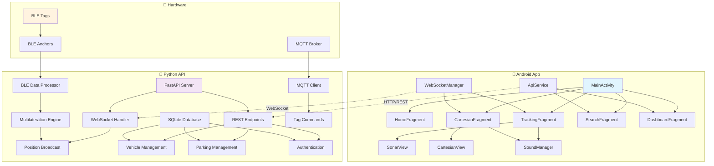
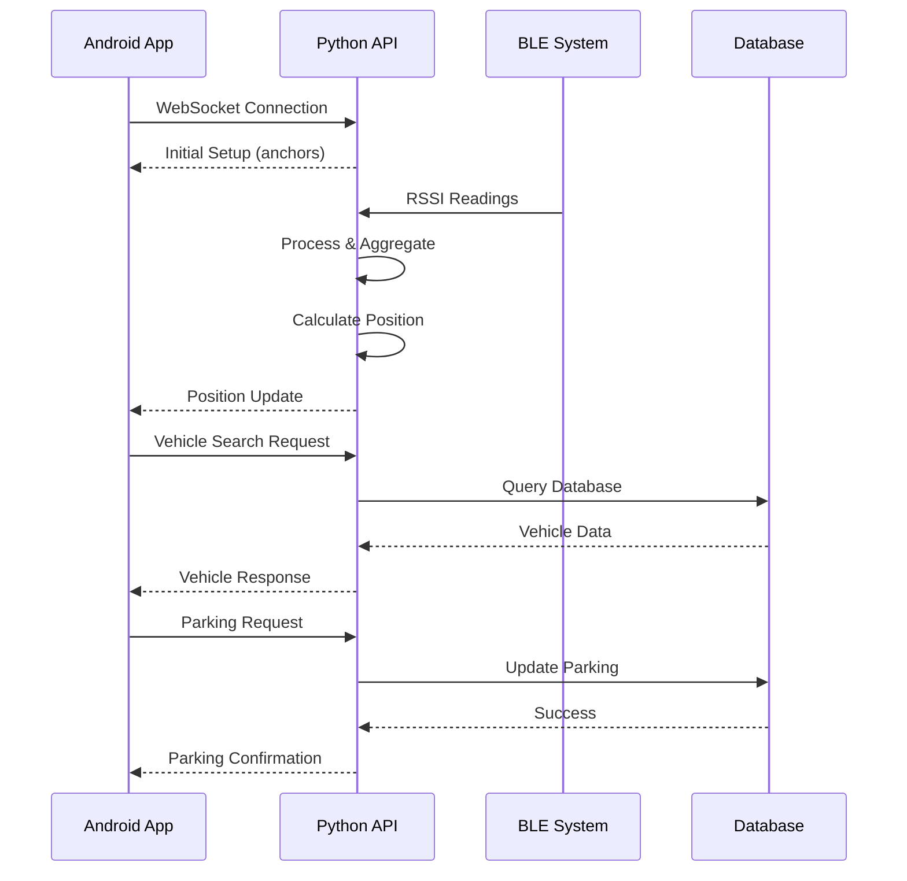
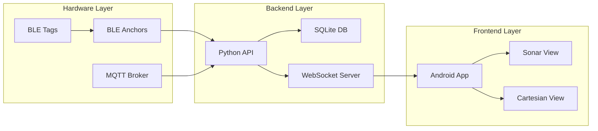
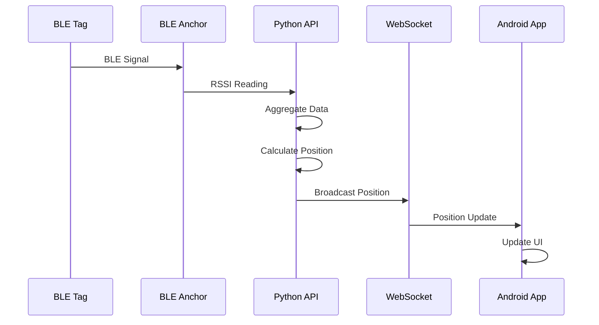
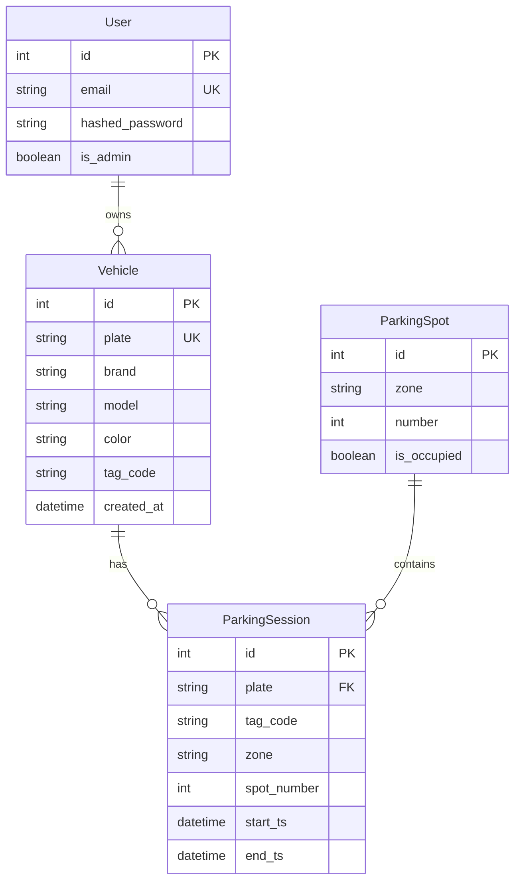

# 📱 RadarMottu - Sistema de Rastreamento de Veículos

<div align="center">


**Sistema inteligente de rastreamento e localização de veículos em tempo real**

[](LICENSE)
[](https://github.com/radarmottu/radarmottu-android)
[](http://10.0.2.2:8000/health)

</div>

---

## 📋 Índice

- [📱 RadarMottu - Sistema de Rastreamento de Veículos](#-radarmottu---sistema-de-rastreamento-de-veículos)
  - [📋 Índice](#-índice)
  - [🎯 Visão Geral](#-visão-geral)
    - [🌟 Características Principais](#-características-principais)
  - [🏗️ Arquitetura do Sistema](#️-arquitetura-do-sistema)
  - [📱 Aplicativo Android](#-aplicativo-android)
    - [🔧 Tecnologias Utilizadas](#-tecnologias-utilizadas)
    - [📁 Estrutura do Projeto](#-estrutura-do-projeto)
    - [🎨 Interface do Usuário](#-interface-do-usuário)
    - [🔍 Funcionalidades Principais](#-funcionalidades-principais)
      - [📡 Rastreamento em Tempo Real](#-rastreamento-em-tempo-real)
      - [🔊 Sistema de Feedback Sonoro](#-sistema-de-feedback-sonoro)
    - [📊 Componentes de Visualização](#-componentes-de-visualização)
      - [🎯 SonarView](#-sonarview)
      - [📊 CartesianView](#-cartesianview)
    - [🔊 Sistema de Som](#-sistema-de-som)
    - [📍 Sistema de Localização](#-sistema-de-localização)
  - [🐍 API Python (Backend)](#-api-python-backend)
    - [🚀 Tecnologias do Backend](#-tecnologias-do-backend)
    - [📡 Sistema de Comunicação](#-sistema-de-comunicação)
      - [WebSocket Server](#websocket-server)
      - [MQTT Integration](#mqtt-integration)
    - [🎯 Algoritmo de Localização](#-algoritmo-de-localização)
      - [Multilateração BLE](#multilateração-ble)
      - [Processamento de Dados BLE](#processamento-de-dados-ble)
    - [🗄️ Banco de Dados](#️-banco-de-dados)
      - [Modelos de Dados](#modelos-de-dados)
    - [📊 Endpoints da API](#-endpoints-da-api)
      - [🔐 Autenticação](#-autenticação)
      - [🚗 Gestão de Veículos](#-gestão-de-veículos)
      - [🅿️ Gestão de Estacionamento](#️-gestão-de-estacionamento)
      - [📡 Sistema de Rastreamento](#-sistema-de-rastreamento)
      - [🔍 Monitoramento](#-monitoramento)
  - [🔌 Integração Android ↔ API](#-integração-android--api)
    - [🌐 Comunicação HTTP/REST](#-comunicação-httprest)
    - [📡 Comunicação WebSocket](#-comunicação-websocket)
    - [🔄 Fluxo de Dados](#-fluxo-de-dados)
  - [📱 Funcionalidades do App](#-funcionalidades-do-app)
    - [🏠 Tela Inicial (Home)](#-tela-inicial-home)
    - [🔍 Busca de Veículos](#-busca-de-veículos)
    - [📡 Rastreamento em Tempo Real](#-rastreamento-em-tempo-real-1)
    - [📊 Visualização Cartesiana](#-visualização-cartesiana)
    - [📈 Dashboard](#-dashboard)
    - [🔔 Notificações](#-notificações)
  - [⚙️ Configuração e Instalação](#️-configuração-e-instalação)
    - [📋 Pré-requisitos](#-pré-requisitos)
      - [Para o Aplicativo Android:](#para-o-aplicativo-android)
      - [Para a API Python:](#para-a-api-python)
    - [🔧 Configuração do Ambiente](#-configuração-do-ambiente)
      - [1. Clone o Repositório](#1-clone-o-repositório)
      - [2. Configuração da API Python](#2-configuração-da-api-python)
      - [3. Configuração do Android Studio](#3-configuração-do-android-studio)
    - [📱 Build do Aplicativo Android](#-build-do-aplicativo-android)
      - [Debug Build](#debug-build)
      - [Release Build](#release-build)
      - [Install no Device](#install-no-device)
    - [🐍 Execução da API Python](#-execução-da-api-python)
      - [Desenvolvimento](#desenvolvimento)
      - [Produção](#produção)
      - [Verificar Status](#verificar-status)
  - [🎮 Como Usar](#-como-usar)
    - [📱 Primeiro Uso](#-primeiro-uso)
    - [🔍 Buscar Veículo](#-buscar-veículo)
    - [📡 Rastrear em Tempo Real](#-rastrear-em-tempo-real)
    - [📊 Visualização Cartesiana](#-visualização-cartesiana-1)
  - [🔧 Desenvolvimento](#-desenvolvimento)
    - [📝 Padrões de Código](#-padrões-de-código)
      - [Java (Android)](#java-android)
      - [Python (API)](#python-api)
    - [🧪 Testes](#-testes)
      - [Android Tests](#android-tests)
      - [API Tests](#api-tests)
    - [📦 Dependências](#-dependências)
      - [Android (build.gradle.kts)](#android-buildgradlekts)
      - [Python (requirements.txt)](#python-requirementstxt)
  - [📊 Diagramas](#-diagramas)
    - [🏗️ Arquitetura Geral](#️-arquitetura-geral)
    - [🔄 Fluxo de Rastreamento](#-fluxo-de-rastreamento)
    - [🗄️ Modelo de Dados](#️-modelo-de-dados)
  - [🚀 Roadmap](#-roadmap)
    - [📅 Versão 2.0 (Q2 2025)](#-versão-20-q2-2025)
    - [📅 Versão 2.1 (Q3 2025)](#-versão-21-q3-2025)
    - [📅 Versão 3.0 (Q4 2025)](#-versão-30-q4-2025)
  - [🤝 Contribuição](#-contribuição)
    - [🔧 Como Contribuir](#-como-contribuir)
    - [📋 Guidelines](#-guidelines)
    - [🐛 Reportar Bugs](#-reportar-bugs)
  - [📄 Licença](#-licença)

---

## 🎯 Visão Geral

O **RadarMottu** é um sistema completo de rastreamento e localização de veículos que combina tecnologias de ponta para oferecer uma experiência de localização em tempo real. O sistema utiliza **Bluetooth Low Energy (BLE)** para comunicação com tags de rastreamento, **WebSockets** para transmissão de dados em tempo real, e **algoritmos de multilateração** para cálculo preciso de posições.

### 🌟 Características Principais

- 📱 **Aplicativo Android nativo** desenvolvido em Java puro
- 🐍 **API REST** construída em Python com FastAPI
- 📡 **Comunicação em tempo real** via WebSockets
- 🎯 **Localização precisa** usando multilateração BLE
- 🔊 **Feedback sonoro** baseado na distância do alvo
- 📊 **Visualizações interativas** (Sonar e Cartesian)
- 🗄️ **Banco de dados** SQLite para persistência
- 🔐 **Sistema de autenticação** JWT

---

## 🏗️ Arquitetura do Sistema



---

## 📱 Aplicativo Android

### 🔧 Tecnologias Utilizadas

| Tecnologia | Versão | Propósito |
|------------|--------|-----------|
| **Android SDK** | 36 | Plataforma base |
| **Java** | 17 | Linguagem de programação |
| **AndroidX** | 1.13.1 | Bibliotecas de suporte |
| **Material Design** | 1.10.0 | Design system |
| **Retrofit** | 2.9.0 | Cliente HTTP |
| **OkHttp** | 4.9.3 | Cliente WebSocket |
| **Gson** | 2.9.0 | Serialização JSON |
| **Google Play Services** | 21.3.0 | Localização GPS |
| **Navigation Component** | 2.6.0 | Navegação entre telas |

### 📁 Estrutura do Projeto

```
app/src/main/java/br/com/radarmottu/
├── 📱 MainActivity.java                 # Activity principal
├── 📦 model/                           # Modelos de dados
│   ├── Vehicle.java                    # Modelo do veículo
│   ├── Position.java                   # Modelo de posição
│   ├── ParkingSpot.java               # Modelo de vaga
│   ├── Token.java                      # Modelo de autenticação
│   ├── WebSocketMessage.java          # Modelo de mensagem WebSocket
│   └── PositionPayload.java           # Payload de posição
├── 🌐 network/                        # Camada de rede
│   ├── ApiService.java                # Interface da API REST
│   ├── RetrofitClient.java            # Cliente Retrofit
│   └── WebSocketManager.java          # Gerenciador WebSocket
└── 🎨 ui/                             # Interface do usuário
    ├── 🏠 home/
    │   ├── HomeFragment.java          # Tela inicial
    │   └── HomeViewModel.java         # ViewModel da home
    ├── 🔍 search/
    │   └── SearchFragment.java        # Tela de busca
    ├── 📡 tracking/
    │   └── TrackingFragment.java      # Tela de rastreamento (Sonar)
    ├── 📊 cartesian/
    │   └── CartesianFragment.java     # Tela cartesiana
    ├── 📈 dashboard/
    │   ├── DashboardFragment.java     # Dashboard
    │   └── DashboardViewModel.java    # ViewModel do dashboard
    ├── 🔔 notifications/
    │   ├── NotificationsFragment.java # Notificações
    │   └── NotificationsViewModel.java # ViewModel de notificações
    └── 🎨 common/
        ├── SonarView.java             # Visualização tipo radar
        ├── CartesianView.java         # Visualização cartesiana
        └── SoundManager.java          # Gerenciador de som
```

### 🎨 Interface do Usuário

O aplicativo utiliza **Material Design** com navegação por **Bottom Navigation**:

- 🏠 **Home**: Tela inicial com informações do projeto
- 🔍 **Search**: Busca e gerenciamento de veículos
- 📡 **Tracking**: Rastreamento em tempo real (visualização Sonar)
- 📊 **Cartesian**: Visualização cartesiana do rastreamento
- 📈 **Dashboard**: Estatísticas e informações gerais
- 🔔 **Notifications**: Notificações do sistema

### 🔍 Funcionalidades Principais

#### 📡 Rastreamento em Tempo Real
- **WebSocket Connection**: Conexão persistente com a API
- **Position Updates**: Atualizações de posição em tempo real
- **Dual Visualization**: Sonar e Cartesian views
- **Sensor Integration**: Acelerômetro e magnetômetro para orientação
- **GPS Integration**: Localização do dispositivo

#### 🔊 Sistema de Feedback Sonoro
- **Distance-based Beeping**: Som baseado na distância do alvo
- **Configurable Sound**: Controle on/off do som
- **Dynamic Frequency**: Frequência varia com a proximidade

### 📊 Componentes de Visualização

#### 🎯 SonarView
```java
// Visualização tipo radar com:
- Círculos concêntricos
- Linha de varredura animada
- Gradiente de luz
- Posicionamento do alvo
- Raio configurável (10m)
```

#### 📊 CartesianView
```java
// Visualização cartesiana com:
- Grade retangular
- Eixos X/Y
- Scanner animado
- Posicionamento preciso
- Escala em metros
```

### 🔊 Sistema de Som

```java
public class SoundManager {
    // Configurações de som baseadas na distância:
    // - < 1.5m: 200ms delay, pitch 1.8f
    // - > 10m: 1500ms delay, pitch 0.8f
    // - Interpolação linear entre os valores
}
```

### 📍 Sistema de Localização

- **GPS Integration**: Localização precisa do dispositivo
- **Permission Handling**: Gerenciamento de permissões
- **Real-time Updates**: Atualizações de localização em tempo real
- **Coordinate Display**: Exibição de latitude/longitude

---

## 🐍 API Python (Backend)

### 🚀 Tecnologias do Backend

| Tecnologia | Versão | Propósito |
|------------|--------|-----------|
| **Python** | 3.11+ | Linguagem principal |
| **FastAPI** | Latest | Framework web |
| **SQLAlchemy** | Latest | ORM |
| **SQLite** | Built-in | Banco de dados |
| **WebSockets** | Built-in | Comunicação tempo real |
| **MQTT** | paho-mqtt | Comunicação com tags |
| **NumPy** | Latest | Cálculos matemáticos |
| **SciPy** | Latest | Algoritmos de otimização |

### 📡 Sistema de Comunicação

#### WebSocket Server
```python
@app.websocket("/ws/position")
async def websocket_endpoint(websocket: WebSocket):
    await manager.connect(websocket)
    # Envia configurações iniciais (âncoras, posição)
    # Broadcast de atualizações de posição
```

#### MQTT Integration
```python
MQTT_SERVER = "broker.hivemq.com"
MQTT_PORT = 1883
# Comunicação com tags BLE via MQTT
```

### 🎯 Algoritmo de Localização

#### Multilateração BLE
```python
def multilaterate(anchors: dict, readings: list[dict]) -> dict:
    # Algoritmo de multilateração usando:
    # - RSSI to Distance conversion
    # - Least squares optimization
    # - Triangulation with 3+ anchors
    return {"x": float(res.x[0]), "y": float(res.x[1])}
```

#### Processamento de Dados BLE
```python
# Agregação de leituras RSSI
readings_history = defaultdict(lambda: deque(maxlen=5))

# Condições para cálculo:
# - Mínimo 3 âncoras
# - 5 leituras por âncora
# - Cooldown entre cálculos
```

### 🗄️ Banco de Dados

#### Modelos de Dados
```python
# Tabelas principais:
- users: Usuários do sistema
- vehicles: Cadastro de veículos
- parking_spots: Vagas de estacionamento
- parking_sessions: Sessões de estacionamento
```

### 📊 Endpoints da API

#### 🔐 Autenticação
```
POST /token                    # Login
POST /users/                   # Criar usuário
```

#### 🚗 Gestão de Veículos
```
GET  /api/vehicles/by-plate/{plate}    # Buscar veículo
POST /api/vehicles                     # Criar/atualizar veículo
PUT  /api/vehicles/{plate}             # Atualizar veículo
DELETE /api/vehicles/{plate}           # Deletar veículo
```

#### 🅿️ Gestão de Estacionamento
```
POST /api/parking/store               # Estacionar veículo
POST /api/parking/release             # Liberar vaga
GET  /api/locate/{plate}              # Localizar veículo
```

#### 📡 Sistema de Rastreamento
```
POST /api/reading/ble                 # Receber leitura BLE
POST /api/tags/{tag_id}/alarm         # Ativar alarme da tag
GET  /api/anchors                     # Listar âncoras
```

#### 🔍 Monitoramento
```
GET  /health                          # Status da API
WS   /ws/position                     # WebSocket de posição
```

---

## 🔌 Integração Android ↔ API

### 🌐 Comunicação HTTP/REST

```java
// RetrofitClient.java
private static final String BASE_URL = "http://10.0.2.2:8000/";

// ApiService.java
@GET("api/vehicles/by-plate/{plate}")
Call<Vehicle> getVehicleByPlate(@Path("plate") String plate);

@POST("api/parking/store")
Call<ParkingSpot> storeVehicle(@Query("plate") String plate);
```

### 📡 Comunicação WebSocket

```java
// WebSocketManager.java
private static final String WEBSOCKET_URL = "ws://10.0.2.2:8000/ws/position";

// Interface para callbacks
public interface PositionListener {
    void onPositionUpdate(Position position);
    void onConnectionStatusChanged(String status);
}
```

### 🔄 Fluxo de Dados



---

## 📱 Funcionalidades do App

### 🏠 Tela Inicial (Home)
- **Projeto Information**: Informações sobre o RadarMottu
- **Repository Link**: Link para o repositório do projeto
- **Quick Access**: Acesso rápido às funcionalidades principais

### 🔍 Busca de Veículos
- **Plate Search**: Busca por placa do veículo
- **Vehicle Details**: Exibição de detalhes completos
- **Parking Management**: Gestão de estacionamento
- **Real-time Status**: Status em tempo real

### 📡 Rastreamento em Tempo Real
- **Sonar Visualization**: Visualização tipo radar
- **Real-time Updates**: Atualizações via WebSocket
- **Distance Display**: Exibição da distância
- **Direction Arrow**: Seta direcional
- **Sound Feedback**: Feedback sonoro configurável
- **GPS Integration**: Localização do dispositivo

### 📊 Visualização Cartesiana
- **Grid System**: Sistema de grade
- **Coordinate Display**: Exibição de coordenadas
- **Scanner Animation**: Animação de scanner
- **Precise Positioning**: Posicionamento preciso

### 📈 Dashboard
- **Statistics**: Estatísticas do sistema
- **Vehicle Overview**: Visão geral dos veículos
- **Parking Status**: Status do estacionamento
- **System Health**: Saúde do sistema

### 🔔 Notificações
- **System Alerts**: Alertas do sistema
- **Position Updates**: Notificações de posição
- **Parking Reminders**: Lembretes de estacionamento

---

## ⚙️ Configuração e Instalação

### 📋 Pré-requisitos

#### Para o Aplicativo Android:
- **Android Studio** 2023.1.1 ou superior
- **Android SDK** 34 (Android 14)
- **Java Development Kit** 17
- **Gradle** 8.13.0
- **Device/Emulator** com Android 7.0+ (API 24)

#### Para a API Python:
- **Python** 3.11 ou superior
- **pip** (gerenciador de pacotes)
- **SQLite** 3 (incluído no Python)

### 🔧 Configuração do Ambiente

#### 1. Clone o Repositório
```bash
git clone https://github.com/radarmottu/radarmottu-android.git
cd radarmottu-android
```

#### 2. Configuração da API Python
```bash
# Instalar dependências Python
pip install fastapi uvicorn sqlalchemy numpy scipy paho-mqtt python-jose[cryptography] passlib[bcrypt]

# Executar a API
cd api/
uvicorn main:app --reload --host 0.0.0.0 --port 8000
```

#### 3. Configuração do Android Studio
```bash
# Abrir o projeto no Android Studio
# Sincronizar com Gradle Files
# Configurar SDK e build tools
```

### 📱 Build do Aplicativo Android

#### Debug Build
```bash
./gradlew assembleDebug
```

#### Release Build
```bash
./gradlew assembleRelease
```

#### Install no Device
```bash
./gradlew installDebug
```

### 🐍 Execução da API Python

#### Desenvolvimento
```bash
uvicorn main:app --reload --host 0.0.0.0 --port 8000
```

#### Produção
```bash
uvicorn main:app --host 0.0.0.0 --port 8000 --workers 4
```

#### Verificar Status
```bash
curl http://localhost:8000/health
```

---

## 🎮 Como Usar

### 📱 Primeiro Uso

1. **Instalar o App**: Instale o APK no dispositivo Android
2. **Configurar Permissões**: Conceda permissões de localização
3. **Conectar à API**: Verifique se a API Python está rodando
4. **Testar Conexão**: Acesse a tela de rastreamento

### 🔍 Buscar Veículo

1. **Acesse a aba "Search"**
2. **Digite a placa do veículo**
3. **Visualize os detalhes**
4. **Gerencie o estacionamento**

### 📡 Rastrear em Tempo Real

1. **Acesse a aba "Tracking"**
2. **Aguarde a conexão WebSocket**
3. **Visualize a posição no Sonar**
4. **Use o feedback sonoro se necessário**

### 📊 Visualização Cartesiana

1. **Acesse a aba "Cartesian"**
2. **Visualize a grade coordenada**
3. **Monitore a posição precisa**
4. **Observe a animação do scanner**

---

## 🔧 Desenvolvimento

### 📝 Padrões de Código

#### Java (Android)
- **Package Naming**: `br.com.radarmottu`
- **Class Naming**: PascalCase
- **Method Naming**: camelCase
- **Constants**: UPPER_SNAKE_CASE

#### Python (API)
- **Module Naming**: snake_case
- **Class Naming**: PascalCase
- **Function Naming**: snake_case
- **Constants**: UPPER_SNAKE_CASE

### 🧪 Testes

#### Android Tests
```bash
./gradlew test
./gradlew connectedAndroidTest
```

#### API Tests
```bash
pytest tests/
```

### 📦 Dependências

#### Android (build.gradle.kts)
```kotlin
dependencies {
    implementation("androidx.appcompat:appcompat:1.6.1")
    implementation("com.google.android.material:material:1.10.0")
    implementation("androidx.constraintlayout:constraintlayout:2.1.4")
    implementation("com.squareup.retrofit2:retrofit:2.9.0")
    implementation("com.squareup.retrofit2:converter-gson:2.9.0")
    implementation("com.google.android.gms:play-services-location:21.3.0")
}
```

#### Python (requirements.txt)
```txt
fastapi==0.104.1
uvicorn==0.24.0
sqlalchemy==2.0.23
numpy==1.24.3
scipy==1.11.4
paho-mqtt==1.6.1
python-jose[cryptography]==3.3.0
passlib[bcrypt]==1.7.4
```

---

## 📊 Diagramas

### 🏗️ Arquitetura Geral



### 🔄 Fluxo de Rastreamento



### 🗄️ Modelo de Dados



---

## 🚀 Roadmap

### 📅 Versão 2.0 (Q2 2025)
- [ ] **Multi-language Support** (Português/Inglês)
- [ ] **Offline Mode** com cache local
- [ ] **Push Notifications** via FCM
- [ ] **Advanced Analytics** e relatórios
- [ ] **User Management** completo

### 📅 Versão 2.1 (Q3 2025)
- [ ] **Machine Learning** para predição de posições
- [ ] **IoT Integration** com sensores adicionais
- [ ] **Cloud Deployment** na AWS/Azure
- [ ] **Mobile App** para iOS (React Native)

### 📅 Versão 3.0 (Q4 2025)
- [ ] **Real-time Collaboration** entre usuários
- [ ] **Advanced Security** com biometria
- [ ] **API Gateway** com rate limiting
- [ ] **Microservices Architecture**

---

## 🤝 Contribuição

### 🔧 Como Contribuir

1. **Fork** o projeto
2. **Crie** uma branch para sua feature (`git checkout -b feature/AmazingFeature`)
3. **Commit** suas mudanças (`git commit -m 'Add some AmazingFeature'`)
4. **Push** para a branch (`git push origin feature/AmazingFeature`)
5. **Abra** um Pull Request

### 📋 Guidelines

- **Código Limpo**: Siga os padrões estabelecidos
- **Testes**: Adicione testes para novas funcionalidades
- **Documentação**: Atualize a documentação quando necessário
- **Commits**: Use mensagens descritivas

### 🐛 Reportar Bugs

Use o sistema de [Issues](https://github.com/radarmottu/radarmottu-android/issues) para reportar bugs:

- **Título**: Descrição concisa do problema
- **Descrição**: Passos para reproduzir
- **Ambiente**: Versão do Android, API, etc.
- **Logs**: Logs relevantes se disponíveis

---

## 📄 Licença

Este projeto está licenciado sob a **Licença MIT** - veja o arquivo [LICENSE](LICENSE) para detalhes.

```
MIT License

Copyright (c) 2025 RadarMottu Team

Permission is hereby granted, free of charge, to any person obtaining a copy
of this software and associated documentation files (the "Software"), to deal
in the Software without restriction, including without limitation the rights
to use, copy, modify, merge, publish, distribute, sublicense, and/or sell
copies of the Software, and to permit persons to whom the Software is
furnished to do so, subject to the following conditions:

The above copyright notice and this permission notice shall be included in all
copies or substantial portions of the Software.

THE SOFTWARE IS PROVIDED "AS IS", WITHOUT WARRANTY OF ANY KIND, EXPRESS OR
IMPLIED, INCLUDING BUT NOT LIMITED TO THE WARRANTIES OF MERCHANTABILITY,
FITNESS FOR A PARTICULAR PURPOSE AND NONINFRINGEMENT. IN NO EVENT SHALL THE
AUTHORS OR COPYRIGHT HOLDERS BE LIABLE FOR ANY CLAIM, DAMAGES OR OTHER
LIABILITY, WHETHER IN AN ACTION OF CONTRACT, TORT OR OTHERWISE, ARISING FROM,
OUT OF OR IN CONNECTION WITH THE SOFTWARE OR THE USE OR OTHER DEALINGS IN THE
SOFTWARE.
```

---

<div align="center">

**Desenvolvido com ❤️ pela equipe RadarMottu**

[](https://github.com/radarmottu)
[](https://linkedin.com/company/radarmottu)
[](mailto:contact@radarmottu.com)

**FIAP - Challenge 2025 - Mobile Application Development**

</div>
