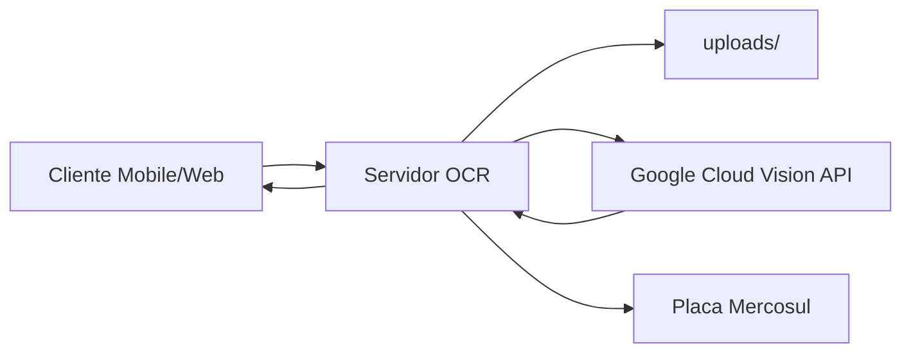
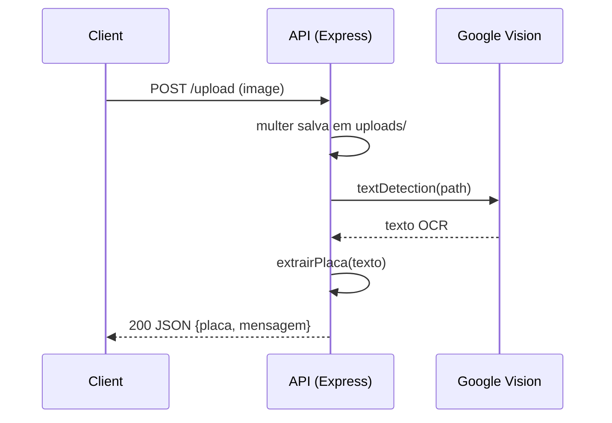

## 🖥️ Servidor OCR de Placas Veiculares — Radar Mottu

Identificação automática de placas veiculares no padrão Mercosul a partir de imagens, usando Google Cloud Vision (OCR), com API HTTP em Node.js/Express e upload via `multer`. Este serviço é parte do ecossistema do app mobile do desafio FIAP/Mottu.

### Badges


---

## Índice

- [Visão Geral](#visão-geral)
- [Arquitetura](#arquitetura)
- [Tecnologias](#tecnologias)
- [Instalação e Configuração](#instalação-e-configuração)
- [Como Executar](#como-executar)
- [API](#api)
- [Lógica de Extração da Placa](#lógica-de-extração-da-placa)
- [Exemplos de Uso](#exemplos-de-uso)
- [Boas Práticas, Segurança e Privacidade](#boas-práticas-segurança-e-privacidade)
- [Observabilidade e Diagnóstico](#observabilidade-e-diagnóstico)
- [Escalabilidade e Performance](#escalabilidade-e-performance)
- [Estrutura do Projeto](#estrutura-do-projeto)
- [Roadmap de Evolução](#roadmap-de-evolução)
- [Créditos](#créditos)

---

## Visão Geral

O serviço expõe um endpoint `POST /upload` que recebe uma imagem (`multipart/form-data` no campo `image`), executa OCR via Google Cloud Vision, e aplica uma heurística para localizar e corrigir possíveis erros de OCR a fim de obter uma placa no padrão Mercosul (formato LLLNLNN, como `ABC1D23`).

---

## Arquitetura

### Diagrama (alto nível)



### Sequência de requisição



> Observação: se os diagramas não renderizarem no seu visualizador Markdown local, visualize o README no GitHub (que suporta Mermaid nativamente) ou habilite uma extensão Mermaid no seu editor.

---

## Tecnologias

- Node.js (CommonJS) + Express 4
- Multer (upload `multipart/form-data` em disco)
- Google Cloud Vision (`@google-cloud/vision`)
- CORS habilitado
- `dotenv` para variáveis de ambiente

Requisitos de runtime: dependências do Vision exigem Node.js >= 18.

---

## Instalação e Configuração

1. Pré‑requisitos
   - Node.js 18+ e npm
   - Projeto no Google Cloud com a Vision API habilitada
   - Conta de Serviço (Service Account) com chave JSON

2. Variáveis de ambiente
   - Defina `GOOGLE_APPLICATION_CREDENTIALS` apontando para o arquivo JSON da chave:
     - PowerShell (Windows):
       ```powershell
       $env:GOOGLE_APPLICATION_CREDENTIALS = "D:\\caminho\\chave.json"
       ```
     - bash (Linux/macOS):
       ```bash
       export GOOGLE_APPLICATION_CREDENTIALS="/caminho/chave.json"
       ```
   - Opcional: `.env` (o código carrega com `dotenv`), útil para futuras configurações como porta.

3. Instalação
   ```bash
   npm install
   ```

---

## Como Executar

- Via npm script:
  ```bash
  npm start
  ```
- Diretamente com Node:
  ```bash
  node index.js
  ```

Por padrão o serviço escuta na porta 3000 (conforme `index.js`).

---

## API

### POST `/upload`

- Content-Type: `multipart/form-data`
- Campo do arquivo: `image`

Exemplo de resposta (sucesso):
```json
{
  "placa": "ABC1D23",
  "mensagem": "Placa identificada com sucesso."
}
```

Erros comuns:
- 400 se nenhum arquivo for enviado
- 500 para falhas na integração com Google Vision

---

## Lógica de Extração da Placa

No `index.js`, a função `extrairPlaca`:

- Normaliza o texto OCR: remove espaços e quebras de linha; converte para maiúsculas.
- Desliza uma janela de 7 caracteres por todo o texto.
- Para cada candidato, aplica correções posição‑sensíveis para o padrão Mercosul (LLLNLNN), lidando com confusões típicas de OCR:
  - Números que parecem letras: `0→O`, `1→I`, `8→B`, `5→S`, `2→Z`
  - Letras que parecem números: `O→0`, `I→1`, `B→8`, `S→5`, `Z→2`, `G→0`
- Valida com regex `^[A-Z]{3}[0-9][A-Z][0-9]{2}$` após possíveis correções.

Benefícios:
- Resiliente a textos ruidosos e fragmentados.
- Não depende da placa estar isolada no OCR.

Limitações conhecidas:
- Focado no padrão Mercosul; outros formatos não são suportados.
- Correções heurísticas podem gerar falsos positivos em cenários extremos.

---

## Exemplos de Uso

### cURL
```bash
curl -X POST http://localhost:3000/upload \
  -F "image=@/caminho/para/imagem.jpg"
```

### PowerShell
```powershell
Invoke-WebRequest -Uri "http://localhost:3000/upload" -Method Post \
  -Form @{ image = Get-Item "D:\\imagens\\placa.jpg" }
```

### JavaScript (fetch)
```js
const form = new FormData();
form.append('image', fileInput.files[0]);

const res = await fetch('http://localhost:3000/upload', {
  method: 'POST',
  body: form
});
const data = await res.json();
```

---

## Boas Práticas, Segurança e Privacidade

- Não committe chaves/credenciais; use `GOOGLE_APPLICATION_CREDENTIALS` fora do repositório.
- Restringir CORS para domínios confiáveis em produção.
- Sanitizar e rotacionar a pasta `uploads/` periodicamente; considerar storage efêmero.
- Limitar tamanho/tipo de arquivo via `multer` (ex.: apenas imagens, até X MB).
- Observar LGPD: imagens podem conter dados pessoais; defina política de retenção e consentimento.

---

## Observabilidade e Diagnóstico

- Logs existentes: upload recebido, texto OCR, tentativas/correções e erros.
- Sugestões:
  - Padronizar logs (JSON) e níveis (info/warn/error).
  - Adicionar métricas (tempo de OCR, taxa de acerto, tamanho médio de imagem).
  - Healthcheck `GET /health` (não implementado neste repo).

---

## Escalabilidade e Performance

- Escalonar horizontalmente com instâncias stateless; usar storage compartilhado (S3/GCS) para uploads.
- Habilitar cache e compressão quando aplicável.
- Otimizar imagens no cliente (resolução/qualidade) antes do upload.
- Circuit breaker/retry para a Vision API em cenários resilientes.

---

## Estrutura do Projeto

```text
servidor_OCR/
  ├─ index.js            # API Express, upload e integração com Vision
  ├─ package.json        # Metadados e scripts
  ├─ package-lock.json   # Lockfile de dependências
  └─ README.md           # Este documento
```

---

## Roadmap de Evolução

- Suporte a variável `PORT` e configuração externa robusta.
- Validações de arquivo no `multer` (tipo/tamanho) e limpeza assíncrona.
- Endpoint `GET /health` e `GET /version`.
- Testes automatizados (unitários e de integração) com mocks da Vision API.
- Observabilidade (OpenTelemetry) e tracing distribuído.
- Containerização (Docker) e IaC para infraestrutura.

---

## Créditos

Desenvolvido por: [Arthur Bispo de Lima](https://github.com/ArthurBispo00) e [João Paulo Moreira dos Santos](https://github.com/joao1015)

Mantido para o desafio FIAP 2025 — Mottu (Mobile Application Development).
